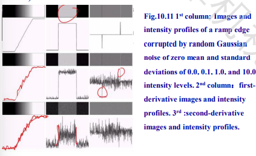

<head>
    
    
</head>

# 计算机视觉

计算机视觉（Computer vision）是一门研究如何使机器“看”的科学，更进一步的说，就是指用摄影机和计算机代替人眼对目标进行识别、跟踪和测量等机器视觉，并进一步做图像处理，用计算机处理成为更适合人眼观察或传送给仪器检测的图像[1]。

作为一门科学学科，计算机视觉研究相关的理论和技术，试图创建能够从图像或者多维数据中获取“信息”的人工智能系统。这里所指的信息指香农定义的，可以用来帮助做一个“决定”的信息。因为感知可以看作是从感官信号中提取信息，所以计算机视觉也可以看作是研究如何使人工系统从图像或多维数据中“感知”的科学。

## 1-A. 介绍

### 什么是数字图像

一个数字图像可以被定义为一个二维函数 $f(x,y)$ 在这里 $x$ 和 $y$是平面坐标，而 $f$ 在某个特定 $(x,y)$ 上点的取值称作这个点的 **灰度** 或 **强度** 。当 $x$ 和 $y$ 都是有限的、离散的数的时候，我们就可以将图像称作数字图像。

像素是数字图像的基本元素。

数字图像：离散样本 $f[x,y]$ 表⽰连续图像 $f(x,y)$。
⼆维数组 $f[x,y]$ 的每个值称为⼀个像素（也就是“图⽚的元素”）

数字图像处理是指利⽤计算机对数字图像进⾏处理。

数字图像处理领域及相关领域：

- 低级处理 (图像处理)：它的输出和输⼊都是图像，⽐如给图像降噪；
- 中级处理 (图像分析)：它的输⼊是图像，输出是属性，⽐如图像分割；
- 高级处理（计算机视觉）：“理解”⼀组已识别的物体，表现出与视觉相关的认知功能；

### 一些图像处理的领域

- 图像采集和显示：正确的光圈和色彩平衡，从投影重建图像，颜⾊映射、伽玛校正、半⾊调
- 图像增强：提高图像质量（⼀个主观性的过程）、 安检时的⾊彩增强
- 图像还原：还原退化的图像，得到原来的场景
- 图像压缩：为了减少存储图像所需的存储空间，或节省传输带宽
- 从图像中提取信息：扫描条形码、字符识别、深度估计
- 图像分割：将图像划分为其组成部分或对象
- 表示和描述：表示指的是将数据转换成计算机可读的类型；描述是指特征选择。
- 识别和分析：根据对象的特征为对象打标签

### 一些图像处理的应用

- 空间领域：航空航天、天体观测、气象观测、卫星探测、遥感图像
- 国防：目标跟踪与识别
- 工业领域：视频监控、机器视觉监测
- 生物医学：医学图像（X 光、CT、磁共振）
- 刑事：指纹识别、虹膜识别
- 多媒体领域：视频会议、数字娱乐（⼴告、影视）

## 1-B 图像基础

### 灰度值

数字图像通常被量化为 $256$ 个灰度级。

心理量是刺激量的对数函数。

感知亮度不是强度的简单函数：视觉系统倾向于在不同强度区域的边界周围 **下冲** 或 **过冲** 。即：光强是阶梯状上升的，但在阶梯处，阶梯的左侧（低亮度一侧）往往人眼感知较弱，高亮度一侧的边界往往让人感觉较亮。

### 图像格式模型

一个简单的图形格式模型是：

$$f(x,y) = i(x,y) \ r(x,y)$$

其中 $i(x,y)$ 和 $r(x,y)$ 指的是入射分量和反射分量。其中 $0 < i(x,y) < \infty, \ 0<r(x,y)<1$

### 图像采样和量化

表示数字图像的方式：矩阵表示和坐标表示。

由于处理、存储和采样硬件方面的考虑，灰度等级通常是 2 的整数次方： $L = 2^k$ 。通常，我们假设这些灰度等级是均匀分布的，且是整数，在区间 $[0,L-1]$ 内。

所以，存储一张图片所需的 **比特位** 是：

$$b = M \times N \times k$$

### 空间分辨率与灰度分辨率

这两个是不同的概念：

空间分辨率：图像中最小的可辨别别细节

灰度分辨率：灰度级的最小可辨别的变化

也就是说，对于一个 $L$ 级灰度的，大小为 $M\times N$ 的图像，我们通常认为它的空间分辨率就是 $M\times N$ ，灰度分辨率是 $L$ 。

### 图像采样和量化

为了保证不产生混叠，需要遵循奈奎斯特采样定理：**采样率必须大于被测信号最高频率分量的两倍。**

**插值** 是⼀种基本方法，⼴泛⽤于缩放、缩⼩、旋转和几何校正等任务，可以使用已知数据来估计其他未知位置的像素值。以下是最近邻和双线性插值。

插值方法：

让 $(x,y)$ 作为新图像的坐标， $v(x,y)$ 作为未知位置的灰度值，那么 $v(x,y)$ 可以这样计算：

- 双线性： $v(x,y) = ax+by+cxy+d$
- 双三次插值：
- $$v(x,y) = \sum_{i=0}^{3}\sum_{i=0}^{3} a_{ij} x^ix^j$$

### 线性和非线性运算

如果 $H$ 是一个计算函数， $f$ 和 $g$ 是两个图像， $a,b$ 是两个常数，如果有

$$H(af+bg) = aH(f)+bH(g)$$

那么我们称 $H$ 是一个线性函数。否则就是非线性的。下面的图片相加就是线性的：

相似的还有图像的交，积，差等。

**图像匹配**：

假设我们可以⽤双线性模型来描述两幅图像之间的变换关系：

$$x=c_1v+c_2w+c_3vw+c_4$$
$$y = c_5v+c_6w+c_7vw+c_8$$

$(v,w),(x,y)$ 是原始和转换后的图像坐标，那么我们只需要 4 个点就可以求出 $c_1,...,c_8$ 这些变量之间的关系。

### 色彩

RGB 颜色空间：

HSV 色彩空间：

显然，亮度所包含的信息更多，所以如果要在亮度和颜色之间选一个，选择抛弃颜色是比较好的选择。

最后，还有一个颜色空间：YCbCr 颜色空间，它便于计算，用于数字电视的压缩会很方便。

## 2-A 图像增强/滤波

三种滤波的角度：

- 空域：对于频域的滤波是一种在数字组成的网格上的操作。它可以对图像作平滑、锐化等。
- 频域：对频域的滤波是一种对图像频域的调节，如去噪、采样、压缩
- 图像金字塔：尺度空间的表示可以对图像做由粗略到精细的一系列工作。

### 背景

空域图像增强 是直接对图像像素进⾏操作的过程。这个过程可以如下描述：

$$g(x,y) = T[f(x,y)]$$

这里 $f(x,y)$ 是输入的图像， $g(x,y)$ 是经过处理后的图像， $T$ 是在函数 $f$ 上的操作符，它操作 $(x,y)$ 这个点周围的一些点，即对邻域进行运算。

对于一个卷积掩膜， $T$ 的操作覆盖了一片 $N\times N$ 的区域。如：

### 一些基础的灰度转换

#### 颜色翻转

#### 对数转换

对数转换的一般形式是：
$$s = clog(1+r)$$

这里 $c$ 是一个常量，同时我们约定了 $r>0$ 。

对数变换实现了图像灰度扩展和压缩的功能。可以从对数曲线看出，它扩展低灰度值而压缩高灰度值。从图中我们可以很直观的看出，由于对数本身上凸的性质，它可以把低灰度（较暗）部分的亮度提高，即图像越来越亮。

#### 幂次变换

幂次转换的一般形式是：
$$s=cr^\gamma$$

这里 $c$ 和 $\gamma$ 是正数。

**例子：伽马校正**

如果我们需要精确的在计算机屏幕上显示图像，则伽玛校正就显得非常重要。没有正确校正的图像看起来要么被漂白了，要么可能太暗了。伽马校正不仅改变敏感度，也改变红绿蓝三种颜色的 **比例** 。

**例子：对比度调节**

**分段线性转换函数：用于对比度拉伸**
也就是通过一个分段线性转换函数，让某一区间的对比度增强

**分段线性转换函数：用于灰度切分**

**分段线性转换函数：用于比特平面切分**

比特图像分层便是将灰度图像的像素位数进行分别读取，一幅 8 比特图像可考虑为由 8 个 1 比特平面组成，其中平面 1 包含图像中所有像素的最低阶比特，而平面 8 包含图像中所有像素的最高阶比特。

如图可见，低比特位存储主要形状，更高比特位存储细节信息。

### 直方图处理

直方图是甚么？灰度图像在灰度范围 $[0,L-1]$ 的直方图是一个离散函数：
$$h(r_k) = n_k$$

这里 $r_k$ 是第 $k$ 层的灰度等级， $n_k$ 是一共有多少个具有这个灰度等级的像素数。

标准化后的直方图如下：

$$P(r_k) = \frac{n_k}{MN}$$

实际上，数字图像的直方图表示了灰度等级 $r_k$ 在途中出现的概率。

#### 直方图均衡化

有没有一种办法让低对比度的灰度图像转化成高对比度？你好，有的。

考虑⼀下连续函数，让变量表示要增强的图像的灰度级。那么直方图均衡化通过以下函数实现：

$$s = T(r), \ 0\leq r \leq L-1$$

这里 $s$ 是增强后的灰度级。
式中，T(r) 应当满足以下两个条件：

- 在 $0 ≤ r ≤ 1$ 内，$T(r)$ 为单调递增函数；（此条件保证了均衡化后图像的灰度级从黑到白的次序不变）
- 在 $0 ≤ r ≤ 1$ 内有 $0 ≤ T(r) ≤ 1$。（此条件保证了均衡化后图像的像素灰度值在允许的范围内）

让我们看一下如下的转换函数 $T(r)$ ：这是一个累积分布函数（CDF）

$$s = T(r) = (L-1) \int_{r}^{0} p_r(w)dw$$

这里 $w$ 是一个用于积分的无意义变量。我们发现，这个函数刚好满足我们上面提的两条要求。

直方图均衡化的规则：

让 $p_s(s)$ 和 $p_s(s)$ 作为关于 $r$ 和 $s$ 的 **概率密度函数** ，经过概率密度转换的函数可以如下表示：

$$p_s(s) = p_r(r) \left|\frac{dr}{ds}\right|$$

令 $r$ 和 $s$ 是 $[0,L-1]$ 区间内的随机变量，假设在这里，那两个函数表示如下的图像：

我们分析以下概率分布： $s$ 的函数是 $p_s(s) = p_r(r) \left|\frac{dr}{ds}\right|$ 那么我们有：

$$
\frac{ds}{dr} = \frac{dT(r)}{dr} = (L-1)\frac{d}{dr}\left[\int_{0}^{r}p_r(w)dw\right]  \\
 = (L-1)p_r(r)
$$

$$s = T(r) = (L-1)\int_{0}^{r}p_r(w)dw$$

$$
p_s(s) = p_r(r)|\frac{dr}{ds}| = p_r(r)\left|\frac{1}{(L-1)p_r(r)}\right| \\
 = \frac{1}{L-1}
$$

对于离散的值， $p_r(r_k) = \frac{n_k}{MN}$ ， $p_r(r_k)$ 和 $r_k$ 组成的图标就是直方图。离散的直方图均衡化转换是：

$$
s_k = T(r_k) = (L-1)\sum_{j=0}^{k} p_r(r_j) = \frac{L-1}{MN}\sum_{j=0}^{k} n_j \\
k = 0,1,2,...,L-1
$$

这有一个例子：一个 8 级灰度的图像，大小是 $64\times 64$ ，灰度值的概率魔都如下表 3.1 所示。我们将这个图像进行灰度直方图均衡化，有：

然后我们将计算出的值取整：

插一嘴：直方图均衡化适用于所有的图像增强。

#### 局部直方图均衡化

**我们可以使用直方图统计量进行图像的增强。** 一张图像的平均值：

$$
m = \sum_{i=0}^{L-1} r_ip(r_i) = \frac{1}{MN}\sum_{x=0}^{M-1}\sum_{y=0}^{n-1}f(x,y) \\
= \sum_{i=0}^{L-1}r_i\frac{1}{MN} count(f(x,y) == r_i)
$$

这里， $r_i$ 是灰度等级， $p(r_i)$ 是灰度值 $r_i$ 出现的概率。

同理，这是图像的方差：

$$\sigma ^2 = \sum_{i=0}^{L-1} (r_i-m)^2p(r_i) = \frac{1}{MN} \sum_{x=0}^{M-1}\sum_{y=0}^{N-1} [f(x,y)-m]^2$$

这里的两个变量同上。

同样的，对于子图像：
$$m_{s_{xy}} = \sum_{i=0}^{L-1}r_ip_{s_{xy}}(r_i)$$
$$\sigma _{s_{xy}}^2 = \sum_{i=0}^{L-1} (r_i-m_{s_{xy}})^2p_{s_{xy}}(r_i)$$

这里 $S_{xy}$ 表示中心在 $(x,y)$ 的子图像。

### 使用逻辑运算/数学运算来做图像增强

算术运算：加减乘除。这一节只讨论加减
逻辑运算：与或非 -- 除了逻辑运算 **非** ，其他的运算都是在两个或更多的图像上 **逐像素** 地进行操作。

### 空间滤波基础

空间滤波直接在图像的像素上执行。

空间滤波也可以称作**掩膜**、**卷积核** 、**模板** 等。

一个空间滤波由以下两部分组成：

- 一个邻域（一般是一个矩形区域）
- 一个定义好的算法，这个算法在这块邻域上执行。

两种空间滤波：

- 线性空间滤波：对图像像素进行的操作是线性的。
- 非线性空间滤波：同理。

#### 线性空间滤波

最终值是滤波器系数与滤波器掩膜所包围的区域中的那些图像像素的乘积之和。

对于一个 $m\times n$ 的掩膜，我们假设 $m=2a+1$ ， $n=2b+1$ ， 总的来说，如果我们要对一个 $M\times N$ 的图像进行滤波，滤波器的大小是 $m\times n$ ,那么公式如下：

$$g(x,y) = \sum_{s=-a}^{a}\sum_{t=-b}^{b} w(s,t)f(x+s,y+t)$$

#### 非线性空间滤波

⾮线性空间滤波的响应不能通过线空间滤波的公式得到，例如中值滤波。下一节会介绍。

### 一些典型的滤波器

盒式滤波/均值滤波：

锐化滤波：

边缘检测滤波：

### 平滑空间滤波

平滑空间滤波器的关键⽤途是模糊和降噪。这个滤波器的结果就只是简单的取掩膜内像素的平均值。也就是盒式滤波/带权盒式滤波：

#### 次序统计滤波

次序统计滤波是一种非线性的筛选。它的输出是基于对过滤器包围的图像区域中包含的
像素进行排序，然后⽤排序结果确定的值替换中心像素的值。

最著名的例子就是 **中值滤波** 。

中值滤波用该像素邻域中强度值的中值替换该像素的值。

中值滤波器在存在脉冲噪声时特别有效，脉冲噪声也称为椒盐噪声，因为它的外观是叠加在图像上的白点和黑点。

### 锐化空间滤波

锐化的主要⽬的是突出图像中的精细细节或增强模糊的细节。
空间锐化主要是通过空间微分来完成的。

**一些基础知识：**

⼀维函数 $f(x)$ 的⼀阶导数的基本定义是差值：

$$\frac{\partial f}{\partial x} = f(x+1)-f(x)$$

同样的，二阶导也可以这样定义：

$$\frac{\partial^2 f}{\partial x^2} = f(x+1)+f(x)-2f(x)$$

一阶导的性质：

- 常数的一阶导是 0
- 有阶跃或强度变化的时候是非 0
- 斜坡的导数是非 0

二阶导的性质：

- 常数的二阶导是 0
- 有阶跃或斜坡斜率变化的时候是非 0
- 有恒定斜率的斜坡的导数是 0

一二阶导数的结论：

- 一阶导数会在图像中产生**较厚的边缘**
- 二阶导数对对细线、孤立点等精细细节的响应更强
- ⼀阶导数通常具有更强的 **对灰阶阶跃的响应**
- 二阶导数在灰度阶跃变化时产生两次响应
- 对于图像灰度值的相似变化，⼆阶导数对线的响应比对阶跃的响应强，对点的响应比对线的相应强

#### 使用二阶导做图像增强：拉普拉斯算子

对于一个双变量函数，拉普拉斯算子定义为：

$$\nabla ^2f = \frac{\partial^2 f}{\partial x^2}+\frac{\partial^2 f}{\partial y^2}$$

对于离散的值，

$$
\nabla ^2f = \frac{\partial^2 f}{\partial x^2}+\frac{\partial^2 f}{\partial y^2}  \\
 = f(x+1,y)+f(x-1,y) +f(x,y+1)+f(y-1)-4f(x,y)
$$

也就是，如下图的掩膜：

#### 反锐化掩膜

反锐化掩膜是从原始图像中减去图像的锐化图像，也就是（平滑）的过程。
包括以下步骤：

- 对图像做模糊
- 从原始图像中减去模糊后的图像（所得差异称为掩膜）
- Mask 乘以一个正系数 k 加到原图上，输出。

反锐化掩膜和增强滤波：增强滤波（High-boost filtering）就是上述的 $k>1$ 的情况。

#### 使用一阶导来进行图像增强

我们将梯度定义为在某点的偏导组成的向量：

$$\nabla f = \left[g_x \ \ g_y\right]^T = [\frac{\partial f}{\partial x} \ \ \frac{\partial f}{\partial y}]^T$$

在实际使用时，梯度的大小通常用绝对值代替，而不是根号下平方求和：

$$M(x,y) = mag(\nabla f) = |g_x|+|g_y|$$

所以计算梯度大小的公式就是：

$$M(x,y) = |f(x+1,y) - f(x,y)| + |f(x,y+1)-f(x,y)|$$

罗伯茨算子：
Roberts 算子是一种最简单的算子，利用局部差分算子寻找边缘的算子。采用对角线相邻两像素之差近似梯度幅值检测边缘。检测垂直边缘的效果比斜向边缘要好，定位精度高，对噪声比较敏感，无法抑制噪声的影响。Roberts 边缘算子是一个 2x2 的模板，采用的是对角方向相邻的两个像素之差。从图像处理的实际效果来看，边缘定位较准，对噪声敏感。

Sobel 算子：
Sobel 算子根据像素点上下、左右邻点灰度加权差，在边缘处达到极值这一现象检测边缘。对噪声具有平滑作用，提供较为精确的边缘方向信息，边缘定位精度不够高。当对精度要求不是很高时，是一种较为常用的边缘检测方法。

## 3-A 边缘检测和切分

### 点、线检测

#### 点检测

- 使用空间滤波器计算每个像素位置的⼀阶和⼆阶导数
- 在像素中心点的掩膜结果是：

$$R = w_1z_1 + w_2z_2+ \cdots +w_9z_9$$

#### 线检测

线检测的掩膜：

#### 边缘模型

边缘就是一系列在图像灰度变化的边缘的点。

噪声的一、二阶导数：

如上图，图像在灰度变化的区域被高斯噪声污染了。这个高斯噪声是均值为 0，标准差分别为 0，0.1，1，10 强度等级。第二列是图像的一阶导，第二列是二阶导。

在图像 $f(x, y)$ 的位置 $(x, y)$ 处寻找边缘强度和⽅向的首选工具是梯度。

$$\nabla f \equiv grad(f) \equiv [g_x \ \ g_y]^T = [\frac{\partial f}{\partial x} \ \ \frac{\partial f}{\partial y}]^T$$
$$M(x,y) = mag(\nabla f) = \sqrt{g_x^2+g_y^2}$$
$$a(x,y ) = \arctan ([g_x \ \ g_y]^T)$$

对于离散数据的梯度运算是：

一维：

二维：

效果图：

### 边缘检测

目标：识别图像中的视觉变化（不连续性）。我们可以看到，语义信息（图片的信息）被编码在边缘中。 那么是什么东西造成了边缘的产生？

边缘是由多种因素造成的。如：表面法线不连续性、深度不连续、表面颜色不连续、照明不连续等。对边缘进行识别可以用于 **识别物体** 、**帮助还原几何体和视角** 。

边缘是图片像素 **强度函数** 快速变化的地方。如下图，显示了强度函数和它的一阶导：

我们将这张图加入一些高斯噪声，它的一阶导图像就会变成这样：

更极端的情况像这样，这时通过一阶导已经无法判断哪里是边缘。

噪声的影响：

- 差分滤波对噪声反应强烈
- 噪声导致图片像素与像素之间的值相差很大
- 基本上噪声越多，滤波器产生的反应就越强。

我们怎么解决这个问题？为了寻找边界，可以看看卷积方法，如下图，将 $f$ 和 $g$ 卷积：

卷积操作是可微的。这就给我们省去了一些时间。下图是二维高斯滤波的一阶导情况：

平滑和局部细节提取是一对 _反义词_ ，也就是说，平滑导数去除了噪声，但是会使边缘模糊。在降低噪声的同时也导致了边缘强度的损失。

我们有一种更高级的操作：将 2D 高斯滤波和拉普拉斯算子结合，就能得到 LoG，也就是高斯-拉普拉斯算子。
拉普拉斯算子是一个单纯的二阶导数算子，是一个标量，具有线性、位移不变性，其传函在频域空间的原点为 0。所有经过拉普拉斯算子滤波的图像具有零平均灰度。但是该算子的缺点是 **对噪声具有无法接受的敏感性** ，因此在实际应用中，一般先要对图像进行平滑滤波，再用拉氏算子进行图像的边缘检测。这就是 LoG 算子的产生的背景（最后的梯度表达式为 高斯函数和原图像卷积，再去二阶微分算子）。

$$ G(x,y) = e^{\frac{x^2+y^2}{2\sigma ^2}}$$

$$\nabla ^2G(x,y) = \left[\frac{x^2+y^2-2\sigma ^2}{\sigma ^4}\right]e^{-\frac{x^2+y^2}{2\sigma ^2}}$$

从图像可以清楚地看出：可以通过检测滤波结果的**零交叉**（Zero crossings）获得图像或物体的边缘。

尽管该算法存在以上不足，但对未来图像特征研究起到了积极作用。尤其对图像先进行高斯滤波（噪声平滑）再进行图像梯度计算的思想的引入，被后来性能优良的 Canny 边缘检测算法(Canny edge detector )所采用。同时，这种思想也被后来很多的图像特征检测技术所采纳，如 Harris 角点，尺度不变特征变换（SIFT）等。

除此之外，还有短响应希尔伯特变换。

#### 怎样算是一个好的边缘检测器？

- 当我们只看边缘时，会丢失信息吗？
- 边界能否完全表示图像的信息？

好的边缘检测器的标准：

- 良好的检测：最佳的检测器应该找到所有 **真正的边缘**、忽略由于噪声产生的边缘。
- 良好的局部细节：
  - 检测到的边缘必须尽可能接近真实边缘
  - 检测器必须只为每个真实边缘点返回 1 个点。

边缘检测的线索：颜色、强度或质地在边界上的差异；连续性和封闭性；高级知识

其他的还有：pB 边缘检测器

**关于边缘检测的现状：**

- 局部边缘检测效果很好
- 来自照明和纹理边缘的“误报”（取决于我们的应用程序）。
- 考虑较长轮廓的⼀些⽅法
- 使用现代方法，真正从数据中“学到”东西
- 机器对于高级别知识和物体的利用并不好

#### 边缘检测进阶

边缘检测以识别图像中的视觉变化；高斯导数和卷积的线性组合；什么是边缘，上面又是一个好的边缘？——引出 **Canny 边缘检测器** 。

Canny 边缘检测是一种非常流行的边缘检测算法。它是一个多阶段的算法，即由多个步骤构成。

1. 图像降噪：因为噪声就是灰度变化很大的地方，所以容易被识别为伪边缘。那么我们就通过高斯模糊进行滤波。通常应用 x，y 两个方向的滤波。

2. 计算图像梯度：这一步只能得到可能的边缘,因为灰度变化的地方可能是边缘，也可能不是边缘
3. 非极大值抑制：通常灰度变化的地方都比较集中，将局部范围内的梯度方向上，灰度变化最大的保留下来，其它的不保留，这样可以剔除掉一大部分的点。将有多个像素宽的边缘变成一个单像素宽的边缘。即“胖边缘”变成“瘦边缘”。在图上我们看到，如果梯度方向的前后两个点都比这个点小，那么这个点就是极大值。图上的 p 和 r 可以通过 **插值** 得到。

4. 阈值筛选：双阈值筛选。通过非极大值抑制后，仍然有很多的可能边缘点，进一步的设置一个双阈值，即低阈值（low），高阈值（high）。灰度变化大于 high 的，设置为强边缘像素，低于 low 的，剔除。在 low 和 high 之间的设置为弱边缘。进一步判断，如果其领域内有强边缘像素，保留，如果没有，剔除。

最后，高斯滤波的标准差可以影响到 canny 边缘检测的效果，标准差越大，边缘越少，越精简。

### 基于区域的分割

#### 区域生长算法
