<head>
<script>
MathJax = {
  tex: {
    inlineMath: [['$', '$'], ['\\(', '\\)']],
    displayMath: [["$$", "$$"], ["\\[", "\\]"]],
  },
  svg: {
    fontCache: 'global'
  }
};
</script>
<script type="text/javascript" id="MathJax-script" async
  src="https://cdn.bootcdn.net/ajax/libs/mathjax/3.2.0/es5/tex-chtml.js">
</script>
</head>

- [第四章 光线追踪](#第四章-光线追踪)
  - [4.1 基础光线追踪算法](#41-基础光线追踪算法)
  - [4.2 视角](#42-视角)
  - [4.3 计算观察光线](#43-计算观察光线)
    - [4.3.1 正交视图](#431-正交视图)
    - [4.3.2 透视视图](#432-透视视图)
  - [4.4 光线和物体的相交](#44-光线和物体的相交)
    - [4.4.1 光线和球体的相交](#441-光线和球体的相交)
    - [4.4.2 光线与三角形的相交](#442-光线与三角形的相交)
    - [4.4.3 射线与多边形相交](#443-射线与多边形相交)
    - [4.4.4 与一组对象相交](#444-与一组对象相交)
  - [4.5 着色（Shading）](#45-着色shading)
    - [4.5.1 兰伯特光照模型](#451-兰伯特光照模型)
    - [4.5.2 Blinn-Phong 着色模型](#452-blinn-phong-着色模型)
    - [4.5.3 环境光](#453-环境光)
    - [4.5.4 多点光源](#454-多点光源)
  - [4.6 简单的光线追踪程序](#46-简单的光线追踪程序)
    - [4.6.1 光线追踪程序的面向对象设计](#461-光线追踪程序的面向对象设计)
  - [4.7 阴影](#47-阴影)
  - [4.8 理想的镜面反射](#48-理想的镜面反射)
  - [4.9 历史上的光追](#49-历史上的光追)
  - [常见问题](#常见问题)
- [第五章 线性代数](#第五章-线性代数)
  - [5.1 行列式](#51-行列式)
  - [5.2 矩阵](#52-矩阵)
    - [5.2.1 矩阵算术](#521-矩阵算术)
    - [5.2.2 矩阵的运算操作](#522-矩阵的运算操作)
    - [5.2.3 矩阵形式的向量运算](#523-矩阵形式的向量运算)
    - [5.2.4 特殊类型的矩阵](#524-特殊类型的矩阵)
  - [5.3 使用行列式和矩阵进行运算](#53-使用行列式和矩阵进行运算)
    - [5.3.1 计算逆矩阵](#531-计算逆矩阵)
    - [5.3.2 线性方程组](#532-线性方程组)
  - [5.4 特征值与矩阵的对角化](#54-特征值与矩阵的对角化)
    - [5.4.1 奇异值分解](#541-奇异值分解)
  - [常见问题](#常见问题-1)
- [第六章 变换矩阵](#第六章-变换矩阵)
  - [6.1 二维线性变换](#61-二维线性变换)
    - [6.1.1 缩放](#611-缩放)
    - [6.1.2 切变](#612-切变)
    - [6.1.3 旋转](#613-旋转)
    - [6.1.4 反射（镜像）](#614-反射镜像)
    - [6.1.5 变换的组合和分解](#615-变换的组合和分解)
    - [6.1.6 变换的分解](#616-变换的分解)
      - [对称特征值分解](#对称特征值分解)
      - [奇异值分解](#奇异值分解)
      - [旋转矩阵的 Paeth 分解](#旋转矩阵的-paeth-分解)
  - [6.2 三维线性变换](#62-三维线性变换)
    - [6.2.1 任意三维旋转](#621-任意三维旋转)
    - [6.2.2 变换法向量](#622-变换法向量)
  - [6.3 平移和仿射变换](#63-平移和仿射变换)
    - [重要例子](#重要例子)
  - [6.4 变换矩阵的逆](#64-变换矩阵的逆)
  - [6.5 坐标转换](#65-坐标转换)
  - [常见问题](#常见问题-2)

# 第四章 光线追踪

***渲染*三维物体时计算机图形学的基本任务之一。渲染指的是：指定一个由多个几何体组成的场景或模型，从一个特定的观察角度看，产生的二维图像的生成过程。几个世纪以来，建筑师和工程师通过画图纸来分享他们的设计，设计图纸的理念和渲染是相同的。**

**从根本上来说，渲染 是将一个或一组对象作为输入，输出一组像素阵列的过程。不管咋样，渲染总在考虑每一个对象会对每个输出像素造成什么样的影响。我们可以将它归类成两种：在*对象顺序渲染*中，每个对象都会被依次考虑，然后为每一个被对象影响后生成的像素进行计算。你可以与循环嵌套的差异作为类比：在*图像顺序渲染*中，“每个像素”构成的循环在外部，而在对象顺序渲染中，“每个对象”的循环在外部。**

> 我们在本书中默认需要渲染的输出是光栅图像而不是矢量图。若是矢量图，那么输出就不会包含像素这个概念了。

**图像顺序渲染和对象顺序渲染的方法可以产生完全相同的图像，但是他们不同的特点让他们适合不同种类的计算任务，也具有不同的性能特征。在讨论玩这两种方法之后，我们会在第 8 章展开说说这些方法在应用上的优势所在。但是从一般性而言，图像顺序渲染更简单，更灵活，但通常（但不绝对）这种渲染方式生成图像需要更多的处理步骤。**

> 在光线追踪中，图像顺序渲染更容易生成阴影和反射，而在对象顺序渲染就比较困难了。

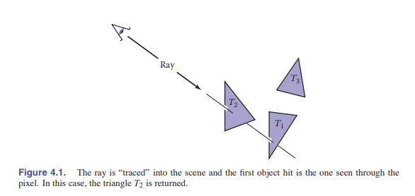

**光线追踪是一种用于渲染三维场景的图像顺序渲染算法。我们会先考虑它，因为我们可以在无需学习开发任何用于对象顺序渲染的数学机制的前提下，让光线追踪器工作。**

## 4.1 基础光线追踪算法

光线追踪器的原理是每次计算一个像素，对于每一个像素，主要任务是找到图像中该像素看到的对象。每个像素“**看**”的方向不同，而且每个像素所看到的任何物体都需要和**_观察光线_**相交。（观察光线是一束从**观察点**发出的、沿着像素的观察方向发出的线）我们需要的那个对象是离相机最近的、与观察光线相交的对象，因为它会挡住后面对象的视图。当找到这个对象之后，我们会使用 **着色计算** 来通过交点、表面法线和其他信息（取决于所需的渲染类型）算出该像素的颜色。如图 4.1 所示，其中光线和两个三角形相交，但是只有第一个三角形$T_2$符合要求，所以只有$T_2$被着色。

一个基础的光线追踪器由以下三部分组成：

1. **光线生成**， 它通过相机几何体计算每个像素观察光线的原点和方向。
2. **光线相交**， 它能找到与观察光线相交的最近的对象。
3. **着色**， 它能通过光线的相交结果计算像素的颜色。

基本的光线追踪的程序结构为：

```java
for each pixel do
  // TODO：compute viewing ray
  //    find first object hit by ray and its surface normal n
  //    set pixel color to value computed from hit point,light,and n
```

本章介绍了光线生成，光线相交和着色的基本方法，他们对于实现一个简单的光线追踪器示例已经足够了。如果你想要实现一个完全可以使用的系统，则需要学习第 12 章的更高效计算光线相交的知识，以及第 10 章的更高级的着色方法，第 13 章的额外的渲染方法，它们能向你展示一个光线追踪器的真正能力。

## 4.2 视角

在还没出现电脑的几百年前，艺术家们就已经在研究如何在二维的画作上表现三维物体了。同样的，照片也是二维画面表示三维场景的一个例子。尽管由很多非传统的图像制作方法，从立体派绘画，到鱼眼镜头，再到外围照相机，这些艺术、摄影、包括现在的计算机图形学，都是用的一个基本手段，称为 **线性透视** ，也就是将三维的对象投影到二维的平面（_图像平面_）上，让场景中的直线变成图像里的直线。

最简单的投影叫做 **_平行投影_** 。在平行投影中，三维的点通过让他们沿 *投影方向*移动，直到这些物体撞到平面，从而将三维的点映射到二维。生成的视图由投影的方向和平面朝向有关。如果平面方向是和视图方向垂直，那么称为 **_正交投影_** ，否则，称为 _斜视投影_ 。

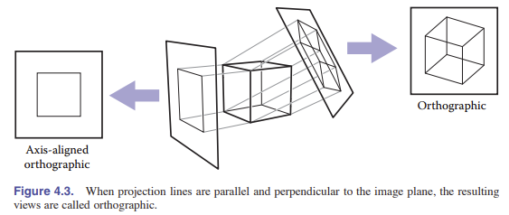

平行投影经常用于机械和建筑设计图中，因为它们能让原来的平行线继续平行，并保留平行于图像平面的那些物体的大小和形状。

平行投影的优点也是它的局限性所在。在我们日常生活中（尤其是照片），物体越远看上去越小。两条向远处延伸的平行线看上去也不是平行的。这是因为我们的眼睛/相机不是从单个的角度来接收光线的，而是通过一个固定的**视点**来收集光线。在文艺复兴时期的艺术家就已经知道了这一点，并通过 **_透视投影_** 来创作符合视觉的画作。我们不沿平行线投影，而是沿着一条穿过视点的线进行投影，这样远距离的对象看上去就很自然的变小了。透视视图由视点及成像平面的选择不同而不同，和投影方向无关。但有一点类似平行投影，就是透视投影也分倾斜和非倾斜透视投影，它们的区别在于图像中心点的投影方向不同。

你可能听说过画家口中的“三点透视”，那是一个用来构造视图的方法体系。但关于透视的一个有趣事实是，如果我们遵循透视下的所有数学规则，那么透视图直接就能画好，即所有物体直接投影到眼睛，并在眼睛前的视图上形成图像这样的规则会自然形成。

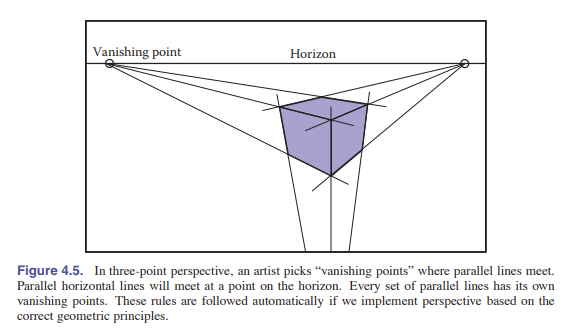

## 4.3 计算观察光线

上一节我们说到，光线生成的最基本工具就是使用**视点**（亦作平行视图的观察方向）和**图像平面**。相机几何体的细节实现可以使用很多方法，在本节我们就会讲述一种基于标准正交基的方法，该方法支持计算法线、倾斜平行视图和正交视图。

为了生成光线，我们首先需要对光线进行一种数学表示。一条光线，其实就是一个起始点和一个传播方向。而 _回忆第二章知识_ ，我们可以知道 **三维参数化直线** 尤其适合表示这个。见 2.5.7 节，三维参数化直线，从起始点（眼睛）$\rm \textbf{e}$ 到图像平面上的点 $\rm \textbf{s}$ 的直线方程这样表示：

$${\rm \textbf{p}}(t)-{\rm \textbf{e}} + t(\rm \textbf{s}-\rm \textbf{e})$$

这个公式的解释是：我们从 $\rm \textbf{e}$ 点开始，沿着 $\rm \textbf{s}-\rm \textbf{e}$ 的方向前进一个分数 t 的距离来到达点 $\rm \textbf{p}$ 。所以对于一个给定的 ${t}$ ，我们可以确定点 $\rm \textbf{p}$ 。点 $\rm \textbf{e}$ 是光线的起始点， $\rm \textbf{s}-\rm \textbf{e}$ 是光线的方向。

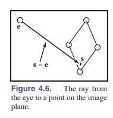

注意， $\rm \textbf{p}(0) =  \rm \textbf{e}$ , $\rm \textbf{p}(1)=\rm \textbf{s}$ 。更一般地，如果 $0 < t_1 < t_2$ ，那么 $\rm \textbf{p}_1$ 比 $\rm \textbf{p}_2$ 更接近视点。同理，如果 $t<0$ ，那么 $\rm \textbf{p}(t)$ 在视点的后面。这种方法可以让我们方便快捷的找到在视点前且最近的对象。

为了计算一束视角光线，我们需要知道 $\rm \textbf{e}$ （起始点）的位置和 $\rm \textbf{s}$ （图像点）。可能寻找图像上的点 $\rm \textbf{s}$ 略有困难，但当我们选择了合适的坐标系，寻找 $\rm \textbf{s}$ 就变得比较简单直接了。

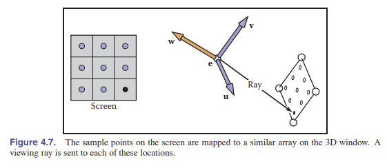

我们所有的光线生成方法都是从一个叫做 **_相机帧_** 的标准正交坐标系开始的。 在这个坐标系中，我们用 $\rm \textbf{e}$ 表示视点（观察点），然后用 $\rm \textbf{u}$ 、 $\rm \textbf{v}$ 、 $\rm \textbf{w}$ 表示三个基向量。从相机的视图来看, $\rm \textbf{u}$ 指向相机朝向的右边， $\rm \textbf{v}$ 指向相机的上方， $\rm \textbf{w}$ 指向后方（视角方向的反方向）。由此可见， $\rm \{ \textbf{u,v,w}\}$ 是一个右手系。构造相机帧的最简单方法是**从**视点（也就是 $\rm \textbf{e}$）、视图方向（也就是 $\rm \textbf{-w}$）以及向上的向量（用于构造另外两个正交基）**开始**， 使用 2.4.7 节中构造正交基的过程构造坐标系。

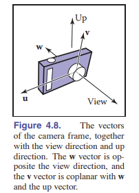

> 由于 $\rm \textbf{v}$ 和 $\rm \textbf{w}$ 必须垂直（见第二章的校正正交），所以向上的向量和和 $\rm \textbf{v}$ 通常不相同。但是将向上的向量在场景中设置为相机的“上方”有助于我们定向相机的视角。

### 4.3.1 正交视图

对于正交视图，所有的光线都指向一个方向： $\rm \textbf{-w}$ 。虽然平行视图本身没有视点，但我们仍然可以使用相机帧的原点来定义光线开始的平面，以便对象能出现在相机的后面。

> 正交视图的观察光线在无限远开始，这样设定听起来似乎很合理 —— 但是如果这样设定，你就无法生成房屋内部的观察视角。

光线从被 $\rm \textbf{e}$ 以及向量 $\rm \textbf{u}$ 、 $\rm \textbf{v}$ 定义的平面发射。剩下我们需要得到的就是图像应该在平面的*什么位置*。我们通过四个值来定义图像尺寸，用于图像的四条边： $l$ ， $r$ 是图像的左右边缘的位置（也就是从 $\rm \textbf{e}$ 点向 $\rm \textbf{u}$ 轴方向进行测量）；同理， $b$ ， $t$ 是图像的上下边缘的位置（也就是 $\rm \textbf{e}$ 点向 $\rm \textbf{v}$ 轴方向进行测量）。一般来说， $l < 0 < r$ ， $b < 0 < t$ 。也就是 **上/右为正**，见图 4.9。

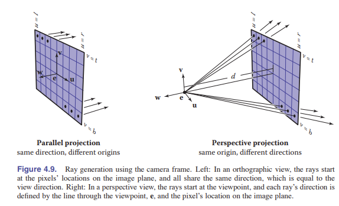

在 3.2 节中我们讨论过图像中的像素坐标。为了将 $n_x \times n_y$ 像素的图像塞到大小为 $(r-l)\times(t-b)$ 的矩形中，像素在水平方向上的间隔是 $\frac{(r-l)}{n_x}$ ，垂直方向的间隔是 $\frac{(t-b)}{n_y}$ ，而且边缘周围会有半个像素的空间，以便于像素网格在图像矩形里居中。这意味着光栅图像位置 $(i,j)$ 的像素是：

$$u=l+\frac{(r-l)(i+0.5)}{n_x}$$

$$v=b+\frac{(t-b)(j+0.5)}{n_y}$$

这个坐标 $(u,v)$ 表示的是相对于原点 $\rm \textbf{e}$ 和基向量 $\rm \textbf{u}$、 $\rm \textbf{v}$ 的坐标值。

> 很多坐标系统会让 $l=-r$ , $b=-t$ ，这样宽度和高度都能刚好足够。

在正交视图中，我们可以简单的使用像素的图像平面位置作为光线的发射点，而且我们也知道光线的发射方向就是视图方向。所以生成光线的步骤是：

```c++
compute u and v using(4.1)
ray.direction = -W
ray.orign = e +u*U+v*V
```

进行斜向的平行投影也很简单：只需要将上述的图像平面的法向量 $\rm \textbf{w}$ 和视角方向 $\rm \textbf{d}$ 分开指定，其他的步骤和上述完全相同（即用 $\rm \textbf{d}$ 代替 $\rm \textbf{-w}$ ），当然， $\rm \textbf{u}$ 和 $\rm \textbf{v}$ 的构造仍然使用 $\rm \textbf{w}$ 向量。

### 4.3.2 透视视图

对于透视视图，所有的光线都有一个相同的发射点，也就是视点。每个像素朝着的方向都不一样。同时，图像平面也不再位于 $\rm \textbf{e}$ 处，而是在 $\rm \textbf{e}$ 前面的一段距离 $d$ 的地方。这段距离 $d$ 就是**图像平面距离**，一般也叫做**焦距**。每条光线的方向都由视点和图像平面上像素的位置共同决定。示例图在图 4.9，所得程序如下所示，和正交投影程序类似：

```c++
compute u and v using(4.1)
ray.direction = -d*W+u*U+v*V
ray.orign = e
```

和平行投影一样，可以通过指定图像平面法线与投影方向不同，以及将 $d\rm \textbf{w}$ 替换为 $d\rm \textbf{d}$ 来实现斜透视视图。

## 4.4 光线和物体的相交

当我们生成了一条光线： ${\rm \textbf{e}}+t \rm \textbf{d}$ 后，我们下一步就需要找到在 $t>0$ 条件下第一个和视线相交的物体。在现实操作中，则是实现一个更一般的问题：找到 $t$ 在 $[t_0,t_1]$ 区间内的、光线和表面第一次相交的点。最基础的光线相交的情况是 $t_0 = 0$ , $t_1 = +\infty$。我们需要解决球面和三角形情况下的这个问题。下一节中会讲到多个不同的物体。

### 4.4.1 光线和球体的相交

给定一条射线： ${\rm \textbf{p}}(t) = {\rm \textbf{e}}+t\rm \textbf{d}$ ，以及一个隐式曲面 $f(\rm \textbf{p}) = 0$ （详见 2.5.3 节），我们需要知道他们在什么地方会相交。在相交时会满足下面的方程，所以我们能从中解出 $t$ 。即：

$$f({\rm \textbf{p}}(t)) = 0 \ \ {\rm or }\ \ f({\rm \textbf{e}}+t{\rm \textbf{d}}) = 0.$$

圆心为 ${\rm\textbf{c}} = (x_c,y_c,z_c)$ ，半径为 $R$ 的球体的隐式方程可以如下表示：

$$(x-x_c)^2+(y-y_c)^2+(z-z_c)^2 -R^2 = 0$$

转化为向量表示法即是:

$$({\rm \textbf{p}}-{\rm \textbf{c}})\cdot({\rm \textbf{p}}-{\rm \textbf{c}})-R^2 = 0$$

任何满足这个方程的点都在球面上。如果我们将光线方程 ${\rm \textbf{p}}(t)=f({\rm \textbf{e}}+t{\rm \textbf{d}})$ 代入这个等式，就能得到一个代表着球面交点的关于 $t$ 的参数方程：

$$({\rm \textbf{e}}+t{\rm \textbf{d}}-{\rm \textbf{c}})\cdot({\rm \textbf{e}}+t{\rm \textbf{d}}-{\rm \textbf{c}})-R^2 = 0$$

整理，得：

$$({\rm \textbf{d}}\cdot{\rm \textbf{d}})t^2+2{\rm \textbf{d}}({\rm \textbf{e}}-{\rm \textbf{c}})t+({\rm \textbf{e}}-{\rm \textbf{c}})\cdot({\rm \textbf{e}}-{\rm \textbf{c}})-R^2 = 0$$

这时，除了 $t$ 之外的所有参数均已知，所以这是一个经典的一元二次方程：
$$At^2+Bt+C = 0$$

小学生都学过怎么解这个方程。而判别式 $B^2-4AC$ 的正负意义在于判断是否有交点。假设有交点，那么求解得：

$$t = \frac{-{\rm \textbf{d}}\cdot({\rm \textbf{e}}-{\rm \textbf{c}})\pm \sqrt{({\rm \textbf{d}}({\rm \textbf{e}}-{\rm \textbf{c}}))^2-({\rm \textbf{d}}\cdot{\rm \textbf{d}})(({\rm \textbf{e}}-{\rm \textbf{c}})\cdot({\rm \textbf{e}}-{\rm \textbf{c}})-R^2})}{({\rm \textbf{d}}\cdot {\rm \textbf{d}})}$$

在实际的实现中，你首先应该检查判别式，然后再计算其他项。如果球体只是用于包裹更复杂的物体，当做边界使用，那么我们只需要判断是否和球体有相交，也就是只检查判别式就够了。

我们在 2.5.4 节讨论过，在任意点 ${\rm \textbf{p}}$ 的法向量可以通过梯度 ${\rm \textbf{n}} = 2({\rm \textbf{p}}-{\rm \textbf{c}})$ 得出，而单位向量就是 $\rm \frac{\textbf{p}-\textbf{c}}{R}$ 。

### 4.4.2 光线与三角形的相交

计算光线和三角形的相交有好多种算法。我们会介绍使用 **重心坐标** 的使用参数化平面的形式。因为他除了三角形的顶点之外，不需要为其他东西进行长期存储。（Synder&Barr, 1987）

为了让参数化表面和光线相交，我们联立了以下方程组：

$$
\begin{equation}
\left.
\begin{array}{c}
    x_{e}+tx_{d}=f(u,v) \\
    y_{e}+tx_{d}=g(u,v) \\
    y_{e}+ty_{d}=h(u,v) \\
     \nonumber
\end{array}\
\right .
\end{equation} \ \ {\rm{or,}} \ \ \ \ {\rm \textbf{e}}+t{\rm \textbf{d}} = {\rm \textbf{f}}(u,v)
$$

在这里，我们有三个未知数（ $t$ , $u$ 和 $v$ ），有三个方程，使用我们能得到它们的数值解。如果我们幸运的话，我们还可以得到它们的*解析解*。

> 译者注：可以这样来理解数值解和解析解的区别，解析解是一个求解公式，它适用于所有这类方程的求解，而数值解是某个特定方程的具体的解。

在这个例子中，参数表面是平面，那么参数方程就可以写成我们在 2.7.2 节讨论过的这种写法。如果三角形的顶点分别是 ${\rm \textbf{a}}$ ， ${\rm \textbf{b}}$ ， ${\rm \textbf{c}}$ ，那么交点方程在某些 $t$ , $\beta$, $\gamma$ 的情况下就会成立：

$${\rm \textbf{e}}+t{\rm \textbf{d}} = {\rm \textbf{a}}+\beta({\rm \textbf{b}}-{\rm \textbf{a}})+\gamma({\rm \textbf{c}}-{\rm \textbf{a}})$$

如图 4.10 所示，交点 ${\rm \textbf{p}}$ 位于 ${\rm \textbf{e}}+t{\rm \textbf{d}}$ 处。同时从 2.7.2 节内容我们可以得知，仅当 $\beta>0$, $\gamma>0$ , $\gamma+\beta<1$ 时，光线和三角形的内部有交点。否则的话，光线实际上是和三角形的外部平面相交，也就是不与三角形相交。如果上面的方程无解，说明要么三角形退化成平行线，要么光线和三角形所在平面平行。

为了求解上面方程中的未知数 $t$, $\beta$, $\gamma$，我们将其从向量形式展开成三个坐标的三个方程：

$$x_e+tx_d = x_a+\beta (x_b-x_a)+\gamma(x_c-x_a),$$

$$y_e+ty_d = y_a+\beta (y_b-y_a)+\gamma(y_c-y_a),$$

$$z_e+tz_d = z_a+\beta (z_b-z_a)+\gamma(z_c-z_a),$$

也就可以写成下面的矩阵：

$$
\left[\begin{matrix}
  x_a-x_b & x_a-x_c & x_d \\
  y_a-y_b & y_a-y_c & y_d \\
  z_a-z_b & z_a-z_c & z_d
\end{matrix} \right]\left[\begin{matrix}
  \beta \\
  \gamma \\
  t
\end{matrix} \right] = \left[\begin{matrix}
  x_a-x_e \\
  y_a-y_e \\
  z_a-z_e
\end{matrix} \right]
$$

最快的求解方法是使用*克拉默法则*。这样我们能得到结果：

$$
\beta = \frac{\left\vert\begin{matrix}
  x_a-x_e & x_a-x_c & x_d \\
  y_a-y_e & y_a-y_c & y_d \\
  z_a-z_e & z_a-z_c & z_d
\end{matrix} \right\vert}{\vert \rm\textbf{A} \vert}
$$

$$
\gamma = \frac{\left\vert\begin{matrix}
  x_a-x_b & x_a-x_e & x_d \\
  y_a-y_b & y_a-y_e & y_d \\
  z_a-z_b & z_a-z_e & z_d
\end{matrix} \right\vert}{\vert \rm\textbf{A} \vert}
$$

$$
t = \frac{\left\vert\begin{matrix}
  x_a-x_b & x_a-x_c & x_a-x_e \\
  y_a-y_b & y_a-y_c & y_a-y_e \\
  z_a-z_b & z_a-z_c & z_a-z_e
\end{matrix} \right\vert}{\vert \rm\textbf{A} \vert}
$$

我们需要线性解的光线与三角形相交的算法需要在一些时候进行提前结束。因此，函数伪代码如下：

```c++
boolean raytri(ray r, vector3 a, vector3 b, vector3 c,interval[t0,t1])
compute t
if (t < t0)or(t > t1) then
  return false
compute γ
if (γ < 0) or (γ > 1) then
  return false
compute β
if (β < 0) or (β > 1 − γ) then
  return false
return true
```

### 4.4.3 射线与多边形相交

我们给定一个平面多边形，它有 $m$ 个顶点，是 $\rm\textbf{p}_1,\cdots\textbf{p}_m$ ，以及表面法向量 $\rm\textbf{n}$ 。我们首先将计算光线 ${\rm\textbf{e}}+t{\rm\textbf{d}}$ 和多边形的交点，通过隐式方程求解：

$$({\rm\textbf{p}}-{\rm\textbf{p}}_1) \cdot{\rm\textbf{n}} = 0$$

我们代入 ${\rm\textbf{p}} = {\rm\textbf{e}}+t{\rm\textbf{d}}$ ，然后化简解出 $t$ ，得：

$$t =\rm \frac{(\textbf{p}_1-\textbf{e})\cdot\textbf{n}}{\textbf{d}\cdot\textbf{n}}$$

这样我们就也能把 ${\rm\textbf{p}}$ 求出来。如果 ${\rm\textbf{p}}$ 点在多边形内部，那么光线就能与之相交，反之，光线不相交。

对于判断光线的交点是否在多边形的内部的这个问题，我们可以通过将点和多边形的顶点投影到 xy 平面来进行判断。最简单的方法是任意取一条从 ${\rm\textbf{p}}$ 点发射的射线，然后计算这条射线和多边形的边相交了几次。如果是基数词，说明在多边形的内部，反之在外部。（参考：Sutherland, Sproull, & Schumacker, 1974; Glassner, 1989）因为进入的光线必须离开，从而创建一对交点。为了简便，我们可以设定二维射线是沿着 x 轴方向传播的：

$$
\left[\begin{matrix}
  x \\
  y \\
\end{matrix} \right] = \left[\begin{matrix}
  x_p \\
  y_p \\
\end{matrix} \right]+s\left[\begin{matrix}
  1 \\
  0 \\
\end{matrix} \right]
$$

对于 $s \in(0,\infty)$ 计算这条射线与边（边的表示方法为 $(x_1,y_1,x_2,y_2)$ ）的交点是很直接简单的。

但是，对于在 xy 平面中投影是一条直线的多边形，这个方法就不适用了。为了解决这个问题，我们可以从 xy, yz,zx 平面中选择最合适的平面。如果我们的点在计算机中支持索引操作（如： ${\rm\textbf{p}}(0)=x_p$ ），那么选择平面的操作可以用以下的伪代码表示：

```c++
if(abs(zn)>abs(xn)) and (abs(zn)>abs(yn)) then{
  index0 = 0;
  index1 = 1;
}
else if(abs(yn)>abs(xn)) then{
  index0 = 0;
  index1 = 2;
}
else{
  index0 = 1;
  index1 = 2;
}
```

这样，所有的计算就可以通过 ${\rm\textbf{p}}(index0)$ 而不是 $x_p$ 实现，以此类推。

除上述方法，实践中我们经常使用另外一种多边形方法：使用几个三角形替换多边形。

### 4.4.4 与一组对象相交

当然，大多数有趣的场景都由不止一个对象组成。当光线和场景相交时，我们必须找出离相机最近的交点。一个简单实现是把这一组对象看成是一个新对象。要使光线和这组对象相交，只需要简单的将光线和组内的对象相交，然后返回最小的 $t$ 值。下面的伪代码判断了在区间 $t \in [t_0,t_1]$ 中的相交：

```c
hit = false
for each object o in the group{
  if(o is hit at ray parameter t and t is in[t0,t1]){
    hit = true;
    hitobject = o;
    t1 = t;
  }
}
return t
```

## 4.5 着色（Shading）

当像素的 _可见表面_ 已知后，我们可以通过计算着色模型来计算像素值。实现方法取决于应用程序——使用的方法从简单的*启发式算法*到精细的数值计算都是可以的。在这一节，我们会描述两种建立着色模型的基本方法。更高级的方法将在第 10 章提及。

在图形学领域，着色一般指对某个物体施加某种 **材质** 。

> 译者注：_可见表面_ 指上一节推断出来的能被相机“看到”的表面。

> 加注： _计算机科学的两大基础目标，就是发现可证明其执行效率良好且可得最佳解或次佳解的算法。而启发式算法则试图一次提供一个目标。 例如它常能发现很不错的解，但也没办法证明它不会得到较坏的解；它通常可在合理时间解出答案，但也没办法知道它是否每次都可以这样的速度求解。_ 启发式算法通过 **优化** 得出可以接受误差、花费代价较少的最优解。现阶段，启发式算法以仿自然体算法为主，主要有蚁群算法、模拟退火法、神经网络等。

大多数的着色模型，不管用啥方式，都是在设计如何捕捉光的反射的过程。即表面被光源照射，反射部分光回到相机中。简单的着色模型是根据点光源的照明度来定义的。在光的反射中，重要的变量有：光的方向 ${\rm\textbf{l}}$ ，它是一个 **指向光源** 的单位向量；视图方向 ${\rm\textbf{v}}$ ，他是一个 **指向相机** 的单位向量；表面法向量 ${\rm\textbf{n}}$ ，它是一个在垂直于该发生反射的点所在平面的单位向量。其他的表面属性，如颜色、光泽度之类，取决于特定的着色模型。

> shading 和 shadow 不是一个东西。在我们考虑着色时，我们不考虑其他物体挡住光的情形。

### 4.5.1 兰伯特光照模型

最简单的着色模型是基于 18 世纪兰伯特（Lambert）的观察：落在表面上的光能取决于光的照射角度。直接朝向光源的表面会获得最大的光照强度，而与灯光方向相切或背向灯光的表面不会受到照明。在这两者之间的情况下，照明度和法线与光源之间的夹角 $\theta$ 成正比。兰伯特光照模型的公式（**兰伯特余弦定律**）如下：
$$L = k_dImax(0,  {\rm\textbf{n}}\cdot{\rm\textbf{l}} )$$
其中 $L$ 是像素颜色， $k_d$ 是**漫反射系数**（也称表面颜色）， $I$ 是光源的强度。因为 ${\rm\textbf{n}}$ 和 ${\rm\textbf{l}}$ 是单位向量，所以 ${\rm\textbf{n}}\cdot {\rm\textbf{l}}$ 可以直接用来简洁的表示 $\cos \theta$。这个方程（以及本节的其他着色方程）分别使用于三个颜色通道。所以像素值的红色分量是红色漫反射分量、红色光照强度、以及向量点乘积的组合结果。蓝色和绿色通道亦然。

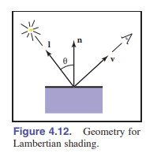

需要注意的是，光强一般来说和距离成反比。也就是：

$$I' = \frac{I}{r^2}$$

> 译者注：**反射系数** 指光（入射光）投向物体时，其表面反射光的强度与入射光的强度之比值（有多少入射光能够被反射出去，其值介于 0~1 之间），受入射光的投射角度、强度、波长、物体表面材料的性质以及反射光的测量角度等因素影响。一般来讲，黑色的反射系数较小，为 0.03，白色的反射系数较大，为 0.8。

> 注：实际上，光照强度是和距离平方成反比的，但这样处理既复杂又不划算，不如一个简单的渲染器来的好。

向量 ${\rm\textbf{l}}$ 通过光源位置与光线-表面交点的两个点相减得到。别忘了 ${\rm\textbf{v}}$ 、 ${\rm\textbf{l}}$ 、 ${\rm\textbf{n}}$ 都必须是单位向量。没有单位化这些向量产生的着色错误非常常见。

> 当出现问题时，将光源设定为中性光，每个颜色通道分量相同是一个好办法。

### 4.5.2 Blinn-Phong 着色模型

> 读作 _布林-冯着色模型_。

兰伯特光照模型 _与视图无关_ ：表面的颜色和你从哪个方向看没有关系。在真实情况下，很多曲面有一些光泽度，它提供了高光（也叫镜面反射），高光会随着视角的变化而产生移动。兰伯特着色不会产生任何高光，所以它的外观是粗糙无光泽的。很多着色模型会向兰伯特着色中添加一种 _高光反射组件_ ；兰伯特着色组件作为 _漫反射组件_ 而存在。

一种简单且广泛应用的高光着色模型由 Phong(Phong, 1975)提出，之后由 Blinn(J.F.Blinn,1976)进行了改进，变成了我们现在使用的模型。该模型的主要思想是：当光照到物体发生镜面反射，反射光恰好就是 _视图光线_ 时，光强最大（也就是 ${\rm\textbf{v}}$ 和 ${\rm\textbf{l}}$ 恰好对称，发生镜面反射）。当反射光和视图光线夹角慢慢变大，反射光慢慢减少。

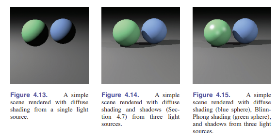

我们可以通过比较半程向量 ${\rm\textbf{h}}$ 和表面法向量来判断视图光线是否趋近于反射光（见图 4.16）。如果它们相近，那么高光组件应显示明亮的视觉效果；反之应该暗淡。我们可以通过 ${\rm\textbf{h}}$ 和 ${\rm\textbf{n}}$ 的点乘积判断（别忘了它们都是单位向量，若它们在同一条线上。说明它们的点乘积最大，也就是 1），我们可以通过对该结果进行乘方，来控制光面的大小。乘方 $p$ 应大于 1， $p$ 也被称作是 **Phong 指数** 。半程向量很好算，因为 ${\rm\textbf{v}}$ 和 ${\rm\textbf{l}}$ 都是单位向量，所以只需要将两个向量相加，然后进行标准化就可以得到半程向量 ${\rm\textbf{h}}$ 了。

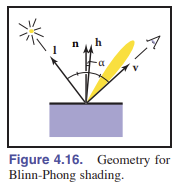

> **半程向量 h**是通过对向量 l 和向量 v 取平均然后归一化得到的一个新向量。这样可以简化计算。

综上所述，Blinn-Phong 光照模型如下所示：

$$\rm{\textbf{h}}=\frac{\textbf{v}+\textbf{l}}{ \parallel\textbf{v} + \textbf{l} \parallel}$$

$$L = k_dImax(0,{\rm\textbf{n}}\cdot{\rm\textbf{l}})+k_sImax(0,{\rm\textbf{n}}\cdot{\rm\textbf{h}})^p$$

其中， $k_s$ 指的是 **高光反射系数** ，或者说是表面高光颜色。和前面的光照模型一致， $I$ 其实是 $I/r^2$ ，距离越远，光强越弱。

> Phong 指数有一些典型值：
>
> - 10：蛋壳
> - 100：略微光滑(常用)
> - 1000：富有光泽
> - 10000：近乎镜面

> 同上节，如果出现了问题，让高光反射系数（表面高光颜色）变灰，三个色彩通道相同，有助于解决问题。

### 4.5.3 环境光

完全不受光照的表面会被渲染成纯黑，但是这不是我们想要的结果。一个简单粗暴的解决办法是向着色模型添加一个*定值组件*，该组件对像素颜色的影响仅仅取决于是否与对象相交，而与表面几何无关。这就是所谓的**环境光处理**——就像表面被来自各处的环境光所照亮一样。为了方便调整参数，环境光照一般用表面颜色和环境光颜色的乘积表示。因此，既可以针对某一个特定表面调整环境光，也可以对所有物体进行同步调整。与 Blinn-Phong 光照模型的部分结合，环境光照模型实现了一个简单有用的着色模型的完全体：

$$L = k_aI_a+k_dImax(0,{\rm\textbf{n}}\cdot{\rm\textbf{l}})+k_sImax(0,{\rm\textbf{n}}\cdot{\rm\textbf{h}})^n$$

其中 $k_a$ 表示**环境光系数**（也称作环境光颜色）， $I_a$ 表示环境光强。

> 同样的，当出现问题时，将环境光颜色（系数）设置成与漫反射颜色（系数）相同会有助于解决问题。

### 4.5.4 多点光源

光的另一个有用的特性是光可以进行 **叠加** 。多个光源产生的效果就是简单的多个光源影响的总和。因此，我们打造的着色模型可以简单的扩展成能处理 $N$ 个光源的公式：

$$L = k_aI_A+ \sum_{i=1}^n [k_dIimax({\rm\textbf{n}}\cdot{\rm\textbf{l}}_i)+k_sI_imax({\rm\textbf{n}}\cdot{\rm\textbf{h}}_i)^p],$$

其中 $Ii$ ，${\rm\textbf{l}}_i$ 和 ${\rm\textbf{h}}_i$ 分别是光强、光的方向向量，以及第**i**个光源的半程向量。

## 4.6 简单的光线追踪程序

现在我们已经知道了对于一个给定的像素如何生成观察光线，如何找到光线和物体最近的交点，以及如何对该交点进行着色。一个光线追踪程序所需的基本部分已经阐述完毕，下面的伪代码展示了如何生成着色图像并且移除隐藏表面。

```c
for each pixel{
  compute viewing ray
  if(ray hits an object with t in [0, ∞]){
    Compute n;
    Evaluate shading model and set pixel to that color;
  }
  else{
    set pixel color to background color;
  }
}
```

这里的 `ray hits an object with t in [0, ∞]` 这句代码可以使用 4.4.4 节的算法代替。

在实际的实现中，曲面相交的例程需要以某种方式返回相交对象的**引用**，不然至少也该返回个该对象的法向量和与着色相关的属性。通常这是通过传递一份记录/结构体来实现。在面向对象的开发实现中，一个好办法是我们去创建一个 _surface_ 类，然后它包含了子类 _triangle, sphere, group_ 等。那么光线能相交的所有对象都会是这个类的实例，然后光线追踪程序只需要对整个模型的“表面”进行一次引用，而且新种类的物体也可以很方便的进行添加操作。

### 4.6.1 光线追踪程序的面向对象设计

之前说过，光线追踪器中的关键类层次结构是构成模型的几何对象。这些几何对象应该是几何对象类的子类，同时它们都支持 hit 函数 (Kirk&Avro, 1988) 。同时，为了防止滥用“**对象**”这个词引起的歧义，我们通常使用*surface*作为父类的名字。有了这个父类，我们就可以创建一个具有一个通用接口的光线追踪器，该光线追踪器不关心模型的初始化，且只是用球体进行 Debug。一个重要的地方在于，只要是能与光线相交的物体，都应该是这个类层次结构的一部分（如，一组曲面也应看作是表面类的**子类**）。这里面也包含了效率数据结构，如*层次包围盒*，由于它会与光线相交，所以它也是子类。

举个例子，“抽象类”或“基类”会将所谓的“相交函数”（碰撞判断函数）规定为与后面所说的*边界框*函数所需要的样子：

```c++
class surface{
  virtual bool hit(ray e+td, real t0, real t1,hit-record rec);
  virtual box bounding-box();
}
```

这里的 $(t_0,t_1)$ 是光线相交之后返回的值的区间； $rec$ 是一个传递引用的记录值（见曲面相交例程，4.6 节），它包含了光线确定相交后的相交时数据：如 $t$ 等数据。 $box$ 类型是一种三维包围盒，它包含的数据是**空间中的两个点**，表示这两个点沿着**坐标轴方向**构成的**将曲面包裹住的**立方体。比如，对于一个球体，那么这个抽象函数的具体实现就是这样的：

```c++
box sphere::bounding-box(){
  vector3 min = center − vector3(radius,radius,radius)
  vector3 max = center + vector3(radius,radius,radius)
  return box(min, max)
}
```

除了*surface*类，另外一个有用的类是材质类（_material class_），它能够让你抽象出材质的功能和行为，然后你可以无所顾忌的添加材料了。将材质和物体联系起来的一个简单方法是：在*surface*类中添加一个指向材质（_material_）的指针，尽管这样需要更多的代码量。不过，还有一个大问题：_如何处理纹理，纹理是属于材质类还是处于材料类之外？_ 这将会在第 11 章进行详细讨论。

## 4.7 阴影

当你有了一个基本的光线追踪程序之后，添加阴影就会变得非常简单。我们回想以下 4.5 节学了甚么。在那一节 _[4.5 着色]_ 中，光线从一个固定方向 ${\rm\textbf{l}}$ 照射过来。如果我们想象自己在点 ${\rm\textbf{p}}$ 处，看向光源 ${\rm\textbf{l}}$ ，发现看到了一个物体，那就说明我们站的点在阴影中。反之，如果没有物体遮挡，光线也就不会被遮挡。

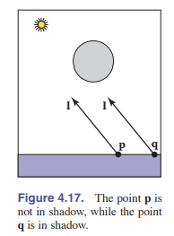

这如图 4.17 所示，当光线 ${\rm\textbf{p}} + t{\rm\textbf{l}}$ 不与任何物体相交，那么它就不处于阴影下。向量 ${\rm\textbf{l}}$ 对于这两个不同的点（一个在阴影中，一个不在），是一样的，因为我们设定光源是无限远，所以两束光平行。判断点是否在阴影中所使用的这些光线称作 **阴影光线** ，它需要和 **视角光线** 区别开。

为了得到阴影算法，我们添加了一个 _if_ 语句来判断这个点是否在阴影中。在简单实现中，阴影光线会检查 $t$ 是否在 $[0,\infty]$ 区间内，但由于浮点精度的误差，0 的端点可能会导致产生一个与平面本身的交点，这不符合我们的定义。所以一般的解决办法是将区间改成 $[\epsilon,\infty]$ ，其中 $\epsilon$ 是一个足够小的常量。

如果我们在 **Phong 光照模型公式** 中继续加入阴影光线，那么就会有下面的伪代码：

```c++
function raycolor( ray e + td, real t0, real t1 )
hit-record rec, srec;
if (scene -> hit(e + td, t0, t1, rec)){
  p = e +(rec.t)·d
  color c = rec.ka*Ia
  if (not scene -> hit(p + sl, epsilon, ∞, srec)){
    vector3 h = normalized(normalized(l) + normalized(−d))
    c = c + rec.kd*I*max(0, rec.n · l)+(rec.ks)*I*(rec.n · h)^rec.p
  }
  return c
}
else
  return background-color
```

请注意，不管 ${\rm\textbf{p}}$ 是否在阴影中，环境光都必须添加。如果有多个光源，那么我们可以在评估多个光源的着色模型之前发送每个光源的阴影光线。上述代码假设了 ${\rm\textbf{d}}$ 和 ${\rm\textbf{l}}$ 不一定必须是单位向量，尤其是 ${\rm\textbf{d}}$ 不一定是单位向量，这对于我们以后进行*实例化*至关重要。_[13.2 节]_

## 4.8 理想的镜面反射

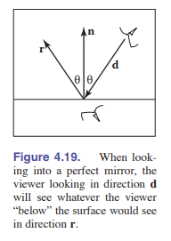

添加一个 _理想高光反射（镜面反射）_ 到光线追踪程序中非常简单。主要示意图如图 4.19，观察者从地点 ${\rm\textbf{e}}$ 进行观察，可以看到 ${\rm\textbf{r}}$ 方向上的物体。向量 ${\rm\textbf{r}}$ 是使用 _Phong 光照反射方程 [第 10 章]_ 的一种变体得到的，在方程前面有一个负号，那是因为在本例中，向量 ${\rm\textbf{d}}$ 是朝着镜面的。方程为：

$$ {\rm\textbf{r}} = {\rm\textbf{p}}-2( {\rm\textbf{d}}\cdot {\rm\textbf{n}} ) {\rm\textbf{n}}$$

在真实世界里，光线反射后会损失一部分能量，不同的色光损失的能量可能不一样。比如，黄金能更有效地反射黄色，因此它会改变反射光的颜色。这个特性可能通过在 _raycolor_ 函数中添加一个递归实现：

$$color \  c = c+k_mraycolor({\rm\textbf{p}}+s{\rm\textbf{r}},\epsilon,\infty) $$

其中， $k_m$ （m 代表镜面反射）是镜面反射的 RGB 颜色。同样的，我们需要保证 $s$ 的取值在 $[\epsilon,\infty)$ ，因为我们不想光线一发射就被判断为与自己表面相交。

另外一个问题在于上面的递归可能永远都不会达成终止条件。比如，如果一条光线生成与房间中进行镜面反射，它永远都不会停下来。这个问题可以通过设置一个最大递归深度来解决。如果仅当 $k_m$ 不为 0 （黑色）时才生成反射光，代码则可以变得更高效。

> 译者注：为了确保递归程序正确工作，递归至少需要两个条件：基本情况（bottom cases）与递推关系（recurrentce relation）。

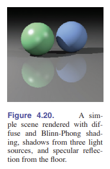

## 4.9 历史上的光追

光线追踪在计算机图形学的早期就已经发展起来 (Appel, 1968) ，但当时没有发展起来，因为当时的电脑性能实在是不太够用。 (Kay&Greenberg, 1980)

光线追踪的 _渐进时间复杂度_ 低于 _基本对象顺序渲染_ 。尽管它传统上被认为是一种 _离线算法_ 。实时光追正变得越来越普遍。

> 译者注：**在线算法**是指它可以以序列化的方式处理输入，也就是说在开始时并不需要已经知道所有的输入。相对的，对于**离线算法**，在开始就需要知道问题的所有输入数据，而且在解决一个问题后就要立即输出结果。例如，*选择排序*在排序前就需要知道所有待排序元素，然而*插入排序*就不必。

> 译者注：为什么光线追踪的 _渐进时间复杂度_ 低于 _基本对象顺序渲染_ ，依然很慢呢？因为渐近时间复杂度的原因，在更大规模时才会显示出它的优势。

## 常见问题

- **_为什么在光线追踪中没有透视矩阵？_**

  在*z-buffer 方法*中存在透视矩阵，因为透视矩阵能将透视投影转换成平行投影。在光线追踪中不需要这个功能，因为从眼睛发出光线，很容易就可以进行透视投影。

- **_光线追踪可以进行交互吗？_**

  对于足够小的图像和模型，现在计算机的性能已经足以实现交互式的光线追踪。在现实中，全屏实现光线追踪需要多个共享*帧缓冲区*的 CPU。现在计算机性能的提升远比屏幕分辨率的提升快，而传统 PC 能对复杂场景进行光线追踪也只是时间问题。

- **_光线追踪在硬件图形程序中有用吗？_**

  光线追踪通常用于 **_选取_** 。当用户在三维图形程序中点击鼠标时，程序需要判断在那个像素点位置到底哪个物体是可见的。光线追踪正是解决这个问题的最好选择。

# 第五章 线性代数

**在图形程序中，最常用且通用的应该是 _矩阵_ 了。矩阵可以改变或转换点和向量。下一章，我们会看到如何使用单列的矩阵表示一个向量，以及一个向量如何与一个方阵相乘，得到不同的 _基向量_ 。我们同时也会展示如何运用这样的矩阵乘法来完成对向量的各种操作：缩放、旋转和平移等。而在这一章，我们从几何的角度回顾线性代数的知识，并着重于直观地解释在二维和三维空间内的可用算法。**

**如果你线性代数基础不错，你可以跳过本章。然而，本章也有一些好康的东西，比如行列式的发展史、关于奇异值的讨论、以及特征值分解等。**

> 译者注：我默认你以及接受过高等教育并学过线性代数，下面仅做知识点脉络梳理。

## 5.1 行列式

我们常常认为行列式产生于对线性方程的求解，但是，在本书中，我们视为向量的相乘。对于二维向量 ${\rm\textbf{a}}$ 和 ${\rm\textbf{b}}$ ，行列式 $\vert{\rm\textbf{a}}{\rm\textbf{b}}\vert$ 是由两个向量构成的平行四边形的面积。这是一个有符号面积。当 ${\rm\textbf{a}}$ 和 ${\rm\textbf{b}}$ 符合右手螺旋定则时，行列式为正。同样的，若它们是三维向量 ${\rm\textbf{a}}$ ， ${\rm\textbf{b}}$ ， ${\rm\textbf{c}}$，行列式 $\vert{\rm\textbf{a}}{\rm\textbf{b}}{\rm\textbf{c}}\vert$
指的是这三个向量构成的平行六面体的体积。由此我们引出以下定律：

1. 行列式的行数乘：视为平行四边形的对侧边数乘

   $$\vert(k{\rm\textbf{a}}){\rm\textbf{b}}\vert = \vert{\rm\textbf{a}}(k{\rm\textbf{b}}) = k\vert{\rm\textbf{a}}{\rm\textbf{b}}\vert$$

2. 行列式的“高斯消元”：视为对平行四边形的剪切（类似于高相同进行切变）：

   $$\vert({\rm\textbf{a}}+k{\rm\textbf{b}}){\rm\textbf{b}}\vert = \vert{\rm\textbf{a}}({\rm\textbf{b}}+k{\rm\textbf{a}})\vert = \vert{\rm\textbf{a}}{\rm\textbf{b}}\vert$$

3. 行列式的某行拆分：

   $$\vert{\rm\textbf{a}}({\rm\textbf{b}}+{\rm\textbf{c}})\vert = \vert{\rm\textbf{a}}{\rm\textbf{b}}\vert+\vert{\rm\textbf{a}}{\rm\textbf{c}}\vert$$

## 5.2 矩阵

矩阵在计算机图形学中有多种用处，其中就包括表示空间变换。在我们的讨论中，我们假设矩阵的元素都是实数。本章会介绍矩阵运算的原理以及方阵所对应的行列式。

### 5.2.1 矩阵算术

1. 矩阵不含交换律：

   $${\rm\textbf{A}}{\rm\textbf{B}}\neq {\rm\textbf{BA}}$$

2. 矩阵具有结合律：

   $${\rm\textbf{(AB)C}} = {\rm\textbf{A(BC)}}$$

3. 矩阵具有分配律：

   $${\rm\textbf{A(B+C) = AB+AC}}$$

### 5.2.2 矩阵的运算操作

1. 矩阵的逆：

   $${\rm\textbf{AA}}^{-1}={\rm\textbf{I}}$$

2. 复合矩阵的逆：

   $$({\rm\textbf{AB}})^{-1} = {\rm\textbf{B}}^{-1}{\rm\textbf{A}}^{-1}$$

3. 矩阵的转置：对矩阵的元素而言，有：

   $$a_{ij} = a'_{ji}$$
4. 复合矩阵的转置：

   $$({\rm\textbf{AB}^T}) = {\rm\textbf{B}^T}{\rm\textbf{A}^T}$$

5. 复合/变换矩阵的行列式性质：

   $$\vert{\rm\textbf{AB}}\vert = \vert{\rm\textbf{A}}\vert\vert{\rm\textbf{B}}\vert$$

   $$\vert{\rm\textbf{A}^{-1}}\vert = \frac{1}{\vert{\rm\textbf{A}}\vert}$$

   $$\vert{\rm\textbf{A}^T}\vert=\vert{\rm\textbf{A}}\vert$$

### 5.2.3 矩阵形式的向量运算

1. 向量的左侧 _预乘_ (考研书上为：左行右列):

$$
\left [\begin{matrix}
0 & -1 \\
1 & 0
\end{matrix} \right] \left[\begin{matrix}
x \\
y
\end{matrix} \right] = \left[\begin{matrix}
-y \\
x
\end{matrix} \right]
$$

2. 将矩阵乘法视为向量乘法：

   例如，矩阵向量乘法 $y=Ax$ 的结果 $y$ 可以理解为一个向量，其中的元素就是 $x$ 与 $A$ 的点积。我们可以把矩阵 $A$ 分成三个行向量：

$$
\left[\begin{matrix} \vert\\\\ y\\\\ \vert \end{matrix} \right] = \left[\begin{matrix} - & r_1 & -\\\\ - & r_2 & -\\\\ - & r_3 & - \end{matrix} \right]  \left[\begin{matrix} \vert\\\\ X\\\\ \vert \end{matrix} \right]
$$

也就是

$$y_i = r_i\cdot X$$

### 5.2.4 特殊类型的矩阵

1. 单位矩阵

   单位矩阵是**对角矩阵**，也是**对称矩阵**，还是**正交矩阵**。

   > **正交矩阵**的性质：行向量/列向量彼此正交，且所有的正交矩阵的行列式都为 1 或-1。其中有一个很有用的性质是： ${\rm\textbf{R}^T}{\rm\textbf{R}} = I = {\rm\textbf{R}{\rm\textbf{R}^T}} \ (for\ orthongal \ {\rm\textbf{R}})$

## 5.3 使用行列式和矩阵进行运算

### 5.3.1 计算逆矩阵

行列式给予了我们计算逆矩阵的工具。对于大型矩阵，用行列式来计算逆矩阵是一种非常低效的方法，但在图形学中的矩阵通常很小。这种方法被开发出来是因为如果一个矩阵有两行完全相同或成比例，那么它所对应的行列式就为零。可以使用平行六面体的体积帮助理解。

计算逆矩阵使用的公式为：

$${\rm\textbf{A}^{-1}} = \frac{1}{\vert{\rm\textbf{A}}\vert}{\rm\textbf{A}^*}$$

> 译者注： ${\rm\textbf{A}^*}$ 指伴随矩阵。伴随矩阵的定义为：将该矩阵元素 $a_{ij}$ 所在行列划去，组成的矩阵称为余子式，将余子式乘 $(-1)^{i+j}$ ，称为代数余子式，记为 $A_{ij}$ ，将原矩阵的 $a_{ij}$ 用 $A_{ij}$ 替换，然后转置，即为伴随矩阵。别忘了，余子式是行列式，所以伴随矩阵和原矩阵具有相同的大小。

### 5.3.2 线性方程组

略。

## 5.4 特征值与矩阵的对角化

只有方阵才有特征值和对应的特征向量。一个非零向量与矩阵相乘，如果结果向量的方向不改变，就称其为特征向量，即：

$${\rm\textbf{Aa}} = \lambda{a}$$

如何求特征向量呢？ 我们可以通过上面的定义，将等式两边同乘单位阵：

$${\rm\textbf{Aa}} = {\lambda I a}$$

移项后，有：

$${\rm\textbf{Aa}}-{\lambda I a} = 0$$

即

$$({\rm\textbf{A}}-{\lambda I })a = 0$$

由于这可以看成一个齐次方程 ${\rm\textbf{A}}x=0$ ，所以当且仅当该方阵 **不满秩** 时（我们将行列式为 0 的矩阵称为*奇异矩阵*），该齐次方程组有非零解，也就是 **a** 。据此我们可以通过行列式为 0 解出特征值。

我们假设 ${\rm\textbf{A}}$ 是一个 $2\times2$ 的矩阵，那么我们可以通过下面的式子解出特征值：

$$
\left \vert\begin{matrix}
  a_{11}-\lambda & a_{12} \\
  a_{21} & a_{22}-\lambda
  \end{matrix} \right \vert  = \lambda^2-(a_{11}+a_{22})\lambda+(a_{11}a_{22}-a_{12}a_{21}) = 0
$$

这是一个二次方程，解可能相同可能不同，甚至可能不是实数。对 $n\times n$ 大小的矩阵，我们会得到一个 $\lambda$ 的 n 次多项式， $n > 4$ 时我们通常找不到解析解，只能寻找数值解。

特征值和特征向量在一个特例里会变得非常简单，那就是对称矩阵。（ ${\rm\textbf{A}}={\rm\textbf{A}^T}$ ）。 **实对称矩阵的特征值是实数** ，且 **实对称矩阵的不同特征值对应的特征向量相互正交** 。而且，这样的不同特征值的矩阵可以进行**对角化**：

$$ {\rm\textbf{A}} = {\rm\textbf{Q}}{\rm\textbf{D}}{\rm\textbf{Q}^T}$$

其中 ${\rm\textbf{Q}}$ 是正交矩阵， ${\rm\textbf{D}}$ 是对角矩阵。 ${\rm\textbf{Q}}$ 的列是 ${\rm\textbf{A}}$ 的特征向量。这样的操作也被称为 _特征值分解_ 。

### 5.4.1 奇异值分解

上一节我们看到了所有的对称矩阵都能进行对角化，或者分解为易于使用的正交矩阵和对角矩阵的乘积形式。但是，图形学中我们遇到的矩阵大多数都是不对称的，这会导致特征值分解很不方便且难以解决，同时也可能会包含复数特征值和特征向量。

> 注：我们建议你按这个顺序学习：特征值/特征向量，奇异值/奇异向量，然后再是非对称矩阵的特征值，因为它比较需要技巧。

我们将对称矩阵的特征值分解进行了一个推广，推广到了非对称（甚至可以不是方阵）：称作 **奇异值分解** 。这两种分解方式的区别在于，在奇异值分解中，左侧和右侧的正交矩阵不需要相同：

$${\rm\textbf{A}} = {\rm\textbf{U}}{\rm\textbf{S}}{\rm\textbf{V}^T}$$

上面的 ${\rm\textbf{U}}$ 和 ${\rm\textbf{V}}$ 是两个可能会不相同的正交矩阵。 ${\rm\textbf{U}}$ 和 ${\rm\textbf{V}}$ 的列向量分别是 _左奇异向量_ 和 _右奇异向量_ 。 ${\rm\textbf{S}}$ 是一个对角阵，元素是 ${\rm\textbf{A}}$ 的奇异值。当 ${\rm\textbf{A}}$ 对称，且所有特征值都非负，奇异值分解就是特征值分解。

这两者还有另外一种联系，可以用来计算奇异值分解（虽然达不到工业级的精度要求）。首先，我们定义 ${\rm\textbf{M}} =  {\rm\textbf{A}} {\rm\textbf{A}^T}$ ，然后我们可以假设对于矩阵 ${\rm\textbf{M}}$ ，可以进行奇异值分解：

$${\rm\textbf{M}}={\rm\textbf{A}}{\rm\textbf{A}^T} = ({\rm\textbf{U}}{\rm\textbf{S}}{\rm\textbf{V}^T})({\rm\textbf{U}}{\rm\textbf{S}}{\rm\textbf{V}^T}) = {\rm\textbf{U}}{\rm\textbf{S}}({\rm\textbf{V}^T}{\rm\textbf{V}}){\rm\textbf{S}}{\rm\textbf{U}^T} = {\rm\textbf{U}}{\rm\textbf{S}^2}{\rm\textbf{U}^T}$$

这个运算用到了穿脱法则，以及**正交矩阵的转置是其逆矩阵**。由于我们制造了矩阵 ${\rm\textbf{M}}$ ，它是一个对称矩阵，所以 ${\rm\textbf{U}}{\rm\textbf{S}^2}{\rm\textbf{U}^T}$ 是进行特征值分解的结果， ${\rm\textbf{S}^2}$ 包含了所有非负的特征值。因此，该矩阵的奇异值就是 ${\rm\textbf{A}}{\rm\textbf{A}^T}$ 的特征值的平方根，左奇异向量就是该乘积的特征向量，相应的右奇异向量需要从 ${\rm\textbf{A}^T}{\rm\textbf{A}}$ 中获得。

## 常见问题

- **_为什么矩阵乘法不是简单的同位置的元素相乘？_**

  虽然用同位置元素相乘来定义矩阵乘法非常好，但是在实践中不是很有用处。大多数矩阵是用来对列向量进行变换的，比如你在三维空间中，可能看到这样的式子：

  $${\rm\textbf{b}} = {\rm\textbf{M}}{\rm\textbf{a}}$$

  其中 ${\rm\textbf{M}}$ 是一个 $3\times 3$ 的矩阵， ${\rm\textbf{a}}$ 和 ${\rm\textbf{b}}$ 是向量。为了完成类似旋转等的几何操作， ${\rm\textbf{a}}$ 的三个元素必须都能通过某种运算最后放入 ${\rm\textbf{b}}$ 的三个值中。这就要求我们需要将 ${\rm\textbf{a}}$ 通过 ${\rm\textbf{M}}$ 进行行变换或列变换。将这样的变换矩阵组合起来，就可以使用一个复合矩阵 ${\rm\textbf{C}}$ 来进行变换：

  $${\rm\textbf{M}}_2({\rm\textbf{M}}_1{\rm\textbf{a}}) = ({\rm\textbf{M}}_2{\rm\textbf{M}}_1){\rm\textbf{a}} = {\rm\textbf{Ca}}$$

  同时，有些时候我们需要同时转换很多向量，这时矩阵的乘法就派上了用场。总之，矩阵乘法之所以这样设计，是因为有相应的需求在。

- **_有些时候我听说特征值和奇异值是一个东西，但有些时候奇异值又是特征值的开方，到底哪个是对的呢？_**

  如果实矩阵 ${\rm\textbf{A}}$ 是对称的，而且它的特征值是非负的，那么特征值就是奇异值。如果 ${\rm\textbf{A}}$ 不对称，那么 ${\rm\textbf{M}} = {\rm\textbf{AA}^T}$ 是对称的，且具有非负的特征值。这个时候 ${\rm\textbf{A}}$ 和 ${\rm\textbf{A}^T}$ 的奇异值相同，且它的奇异值就是 ${\rm\textbf{M}}$ 的奇异值（ ${\rm\textbf{M}}$ 对称，所以也叫特征值）的开方。所以，当我们谈到平方根时，做的是人为制造了一个对称矩阵 ${\rm\textbf{M}}$ ，便于求奇异值。

# 第六章 变换矩阵

**线性代数的原理可以用来在三维场景中排列对象、使用相机查看对象，并且能让对象显示在屏幕上。像旋转、平移、缩放、投影这样的 _几何变换_ 可以使用矩阵乘法解决，而这章的主题就是实现这些操作用到的 _变换矩阵_ 。**

**我们会展示对于 “以原点出发的向量” 这样的方式来表示的一组点该如何进行变换，然后我们会使用图 6.1 所示的时钟图片来向你直观的进行展示。你只需要把这章时钟的图想象成由一组点组成即可，这些点是向量的终点，原点是向量的起点。我们同样也会讨论以下的这些变换对位置（点）、位移向量、以及表面法向量会产生什么样的作用。**

## 6.1 二维线性变换

我们可以使用 $2\times2$ 的矩阵来对一个二维向量进行变换

$$
\left [\begin{matrix}
  a_{11} & a_{12} \\
  a_{21} & a_{22}
\end{matrix} \right]\left[\begin{matrix}
  x \\
  y
\end{matrix} \right] = \left[\begin{matrix}
  a_{11}x+a_{12}y \\
  a_{21}x+a_{22}y
\end{matrix} \right]
$$

这种变换接收一个二维向量作为输入，通过简单的矩阵乘法生成另外一个二维向量输出，称为 **线性变换** 。

这是一个简单的公式，通过这个操作我们可以实现各种各样的转换，这取决于我们在矩阵里面输入什么内容。目前来说，我们要康康如何沿着 $x$ 和 $y$ 轴进行移动。

### 6.1.1 缩放

最简单的变换是沿坐标轴 **缩放** 。这种变换可以改变长度，有时也会改变方向：

$$
scale \ (s_x,s_y) =  \left [ \begin{matrix}
    s_x & 0 \\
    0 & s_y\\
    \end{matrix} \right]
$$

此矩阵有对笛卡尔分量的 $(x,y)$ 作用：

$$
\left [ \begin{matrix}
    s_x & 0 \\
    0 & s_y\\
    \end{matrix} \right]  \left[\begin{matrix}
    x \\
    y\\
    \end{matrix} \right]   = \left[\begin{matrix}
    s_xx \\
    s_yy \\
    \end{matrix} \right]
$$

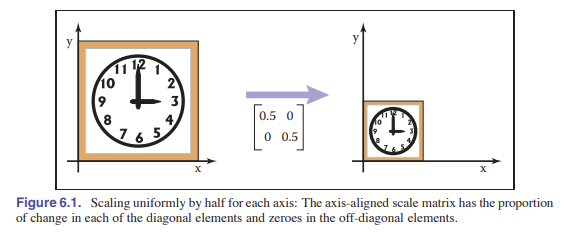
所以，从上述公式里我们可以得知两个缩放系数。 $s_x$ 是对 x 轴的缩放系数， $s_y$ 是对 y 轴的缩放系数。所以，下面的矩阵能将原图片等比缩小成原来的四分之一：

$$
scale \ (0.5,0.5) =  \left [ \begin{matrix}
    0.5 & 0 \\
    0 & 0.5\\
    \end{matrix} \right]
$$

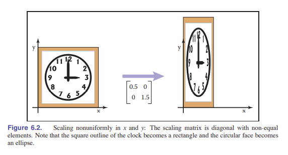

### 6.1.2 切变

切变是一种把东西推到一边的变换。它能产生的效果就像用手推一副扑克牌，让他变得倾斜。水平和垂直方向的切变如下所示：

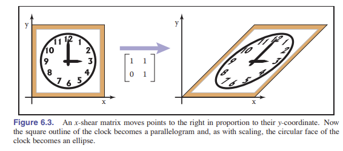
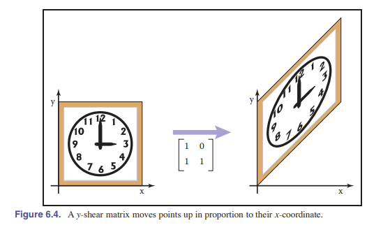

$$
shear \ x(s) =  \left [ \begin{matrix}
    1 & s \\
    0 & 1\\
    \end{matrix} \right] , shear \ y(s) =  \left [ \begin{matrix}
    1 & 0    \\
    s & 1\\
    \end{matrix} \right]
$$

另一种理解切变的方法是只旋转水平/垂直轴。切变将 $y$ 轴顺时针旋转 $\phi$ 度的变换矩阵是：

$$
\left [ \begin{matrix}
    1 & \tan\phi \\
    0 & 1\\
    \end{matrix} \right]
$$

相似的，将 $x$ 轴 _逆时针_ 旋转 $\phi$ 度的变换矩阵是：

$$
\left [ \begin{matrix}
    1 & 0 \\
    \tan\phi & 1\\
    \end{matrix} \right]
$$

### 6.1.3 旋转

假设我们想将一个向量 $\rm\textbf{a}$ _逆时针_ 旋转 $\phi$ 度，得到向量 $\rm\textbf{b}$ ，假设向量 $\rm\textbf{a}$ 与 $x$ 轴成 $\alpha$ 度角，长度是 $r=\sqrt{x_a^2+y_a^2}$ 那么我们可以得到极坐标形式：

$$x_a = r\cos\alpha$$

$$y_a = r\sin\alpha$$

由于 $\rm\textbf{b}$ 仅是 $\rm\textbf{a}$ 旋转，所以长度也是 $r$ ，由于是旋转了 $\phi$ 度，所以使用三角函数的加法，能得到：

$$x_b = r\cos(\alpha+\phi) = r\cos\alpha\cos\phi-r\sin\alpha\sin\phi$$

$$y_b = r\sin(\alpha+\phi) = r\sin\alpha\cos\phi+r\cos\alpha\sin\phi$$

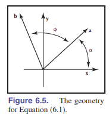

使用 $\rm\textbf{a}$ 的两个分量做替换，有：

$$x_b = x_a\cos\phi-y_a\sin\phi$$
$$y_b = y_a\cos\phi+x_a\sin\phi$$

则我们可以使用矩阵形式来表达，即

$$
rotate \ (\phi) =  \left [ \begin{matrix}
    \cos\phi & -\sin\phi \\
    \sin\phi & \cos\phi\\
    \end{matrix} \right]
$$

请注意， $\phi$ 指的是 **逆时针** 旋转的角度，若需要顺时针旋转，需要添加一个负号。

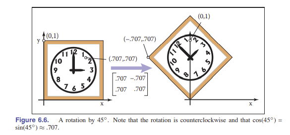

另外，由于三角函数具有 $\sin^2\phi+\cos^2\phi = 1$ 的特性，而且在这个矩阵中，每行每列都是**正交**的，所以我们能得到，这个变换矩阵是 **正交矩阵** ：这个矩阵的两列分别是对标准正交基向量 $(1,0)$ 和 $(0,1)$ 的变换，同时，两行则是*发送到*标准正交基向量的变换。

### 6.1.4 反射（镜像）

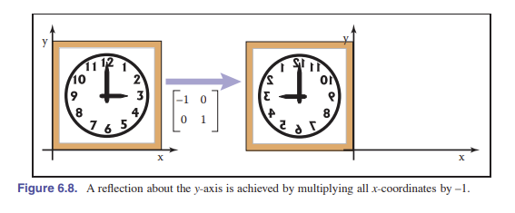 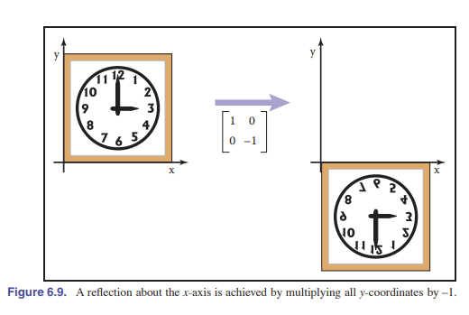

我们可以通过设置一个负值的缩放系数来完成对坐标轴的反射变换（对称变换），见图 6.8，图 6.9：

$$
reflect \ -x =  \left [ \begin{matrix}
    1 & 0 \\
    0 & -1\\
    \end{matrix} \right], \ reflect \ -y =  \left [ \begin{matrix}
    -1 & 0 \\
    0 & 1\\
    \end{matrix} \right]
$$

有些人可能会认为，将矩阵对角线上的所有元素添一个负值也是一个反射变换，但其实它只是一个 $\pi$ 角度的 **旋转变换**。

> 有时上面这种变换也称作：关于原点进行反射变换。

### 6.1.5 变换的组合和分解

图像程序通常都有需要将一个物体进行多次变换。比如，我们可能先对向量 $\rm\textbf{v}_1$ 进行一个缩放变换 $\rm\textbf{S}$ ，然后进行一个旋转变换 $\rm\textbf{R}$ 。这就需要两部来完成:

$$\rm\textbf{v}_2 = \rm\textbf{Sv}_1, \ \rm\textbf{v}_3 = \rm\textbf{Rv}_2$$

也就是

$$\rm\textbf{v}_3 = \rm\textbf{RSv}_1$$

根据结合律，我们可以让 $\rm\textbf{R}$ 和 $\rm\textbf{S}$ 先乘。但请记住，越靠近 $\rm\textbf{v}_1$ 的矩阵越先被施加效果。

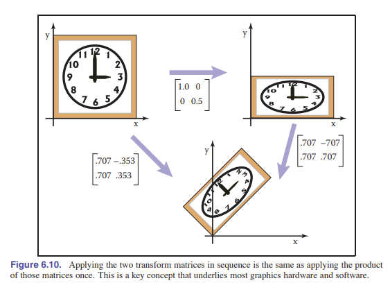

实际中，用旋转和缩放来进行变换已经可以覆盖所有的 _线性变换_ 。这一点很重要，下一节我们会着重讨论。

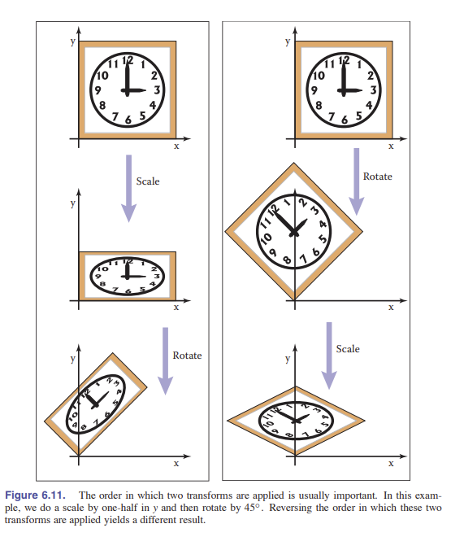

### 6.1.6 变换的分解

有时，有必要“回退”组合转换，将转换分解为更简单的部分相乘。比如，在向用户展示变换的过程时，对单独的旋转和缩放系数进行操作是很有好处的，但往往一整个变换过程被简单的整合在了一个矩阵的内部，旋转变换和缩放变换被混在一起，难以理解。如果可以通过计算将变换矩阵分解为所需的部分，比如分解成特定的旋转和缩放，调整其中的一个部分，就可以实现我们所需的对变换单独进行操作。

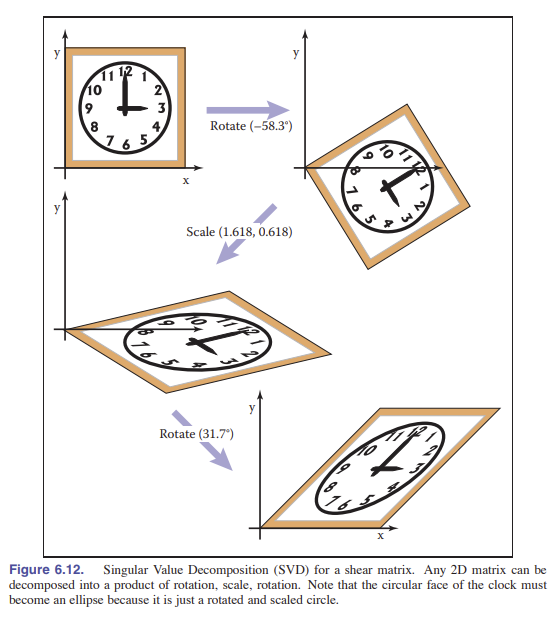

​ 实际上，不管矩阵中的元素是什么，这种分解（或者说因式分解）都是可能被实现的。它提供了一种有用的方式来思考变换，以及变换对几何体的影响。

#### 对称特征值分解

我们首先来看对称矩阵。回忆 5.4 节所学内容，所有的实对称矩阵都可以通过特征值分解进行对角化。如下例：

$${\rm\textbf{A}} =  \rm\textbf{RSR}^T$$

其中 $\rm\textbf{R}$ 是正交矩阵， $\rm\textbf{S}$ 是对角矩阵，我们将使用 $\rm\textbf{v}_1$ 和 $\rm\textbf{v}_2$ 来表示 $\rm\textbf{R}$ 的列向量（特征向量），用 $\rm\lambda_1$ 和 $\rm\lambda_2$ 来表示特征值（对角矩阵的对角线值）。

让我们以几何方面来重新审视以下上面的矩阵乘法：现在我们可以将 $\rm\textbf{R}$ 视为旋转， $\rm\textbf{S}$ 视为缩放，把整个式子看成是组合的变换（图 6.13）：

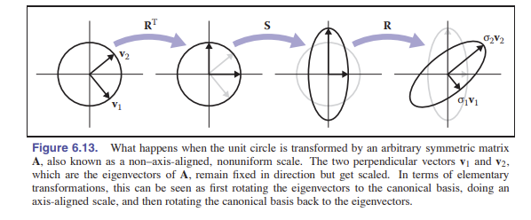

1. 将 ${\rm\textbf{v}}_1$ 和 ${\rm\textbf{v}}_2$ 旋转到 $x$ 轴和 $y$ 轴（ ${\rm\textbf{R}^T}$ 的效果）
2. 使用 $(\lambda_1,\lambda_2)$ 来缩放 x 和 y。（ ${\rm\textbf{S}}$ 的效果）
3. 将 $x$ 轴和 $y$ 轴转回 ${\rm\textbf{v}}_1$ 和 ${\rm\textbf{v}}_2$ 处。（ ${\rm\textbf{R}}$ 的效果）

我们观察这三种变换叠加在一起的效果，能发现它们具有沿着一个对称轴进行不均匀缩放的效果。和沿着坐标轴近似下缩放类似，图形的对称轴是垂直的，但它们并不是 $x \  /\  y$ 轴，而是矩阵 ${\rm\textbf{A}}$ 的特征向量。这就告诉了我们：对称矩阵只是进行了一个缩放操作，尽管这个缩放不是均匀的，也不关于坐标轴对称。

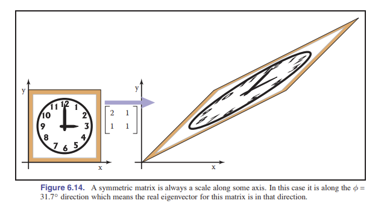

让我们看下面的例子：将下面的矩阵进行特征值分解：

$$
\left [ \begin{matrix}
    2 & 1 \\
    1 & 1\\
    \end{matrix} \right] = {\rm\textbf{R}}\left [ \begin{matrix}
    \lambda_1 & 0 \\
    0 & \lambda_2 \\
    \end{matrix} \right]{\rm\textbf{R}^T}
$$

$$
= \left [ \begin{matrix}
    0.8507 & -0.5257 \\
    0.5257 & 0.8507 \\
    \end{matrix} \right] \left [ \begin{matrix}
    2.618 & 0 \\
    0 & 0.382\\
    \end{matrix} \right]\left [ \begin{matrix}
    0.8507 & 0.5257 \\
    -0.5257 & 0.8507 \\
    \end{matrix} \right]
$$

$$ = \rm rotate(31.7 °) \ scale(2.618,0.382) \ rotate(-31.7°)$$

我们应该记住，这是一个对称矩阵，因为我们是采用对称特征值分解来构造解决这个问题的。

#### 奇异值分解

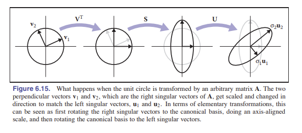

我们在 5.4.1 节也讲过，奇异值分解（SVD）主要用于非对称矩阵的分解，区别在于中间的对角阵两边的矩阵不再是一样的：

$${\rm\textbf{A}} = {\rm\textbf{U}}{\rm\textbf{S}}{\rm\textbf{V}^T}$$

替换掉 ${\rm\textbf{R}}$ 的两个正交矩阵分别是 ${\rm\textbf{U}}$ 和 ${\rm\textbf{V}}$ ，我们将它们的列向量分别称作 ${\rm\textbf{u}_i}$ 和 ${\rm\textbf{v}_i}$ 。在这种情况下， ${\rm\textbf{S}}$ 的对角线元素被称作 **奇异值** 而不是特征值。它的几何描述和对称特征值分解很相似：

1. 将 ${\rm\textbf{v}}_1$ 和 ${\rm\textbf{v}}_2$ 旋转到 $x$ 轴和 $y$ 轴（ ${\rm\textbf{V}^T}$ 的效果）
2. 使用 $(\sigma_1,\sigma_2)$ 来缩放 x 和 y。（ ${\rm\textbf{S}}$ 的效果）
3. 将 $x$ 轴和 $y$ 轴转回 ${\rm\textbf{u}}_1$ 和 ${\rm\textbf{u}}_2$ 处。（ ${\rm\textbf{U}}$ 的效果）

区别在于两个正交矩阵以及旋转过程中。由于奇异值分解会得到两边不同的奇异向量，我们就没有必要得到 _负奇异值_ ，只需要将出现负号的奇异值改正号，然后 **将对应的奇异向量反转方向** 即可。正因为此，奇异值分解总能产生一个正项的对角阵。但矩阵 ${\rm\textbf{U}}$ 和 ${\rm\textbf{V}}$ 并不一定是旋转变换——它可能包含了反射变换。在图形学的几何应用程序中，这一点是一个小问题，不太方便：我们可以通过行列式来区分旋转和反射变换，如果行列式是 +1 ，说明这个变换是一个旋转变换，但如果是反射变换，行列式值是 -1 。如果同时需要旋转，其中一个奇异值可以取反，从而产生旋转-缩放-旋转的效果，此时反射是隐藏在缩放变换中，而不是在旋转变换中。

奇异值分解存在的好处是，我们所看到的**所有**二维变换矩阵**都可以由旋转矩阵和缩放矩阵构成**。切变矩阵是很方便，但组合变换时它不是必需的。

总之，每个矩阵都可以通过 **SVD** 分解为 一个 **旋转矩阵** 乘一个 **缩放矩阵** 再乘另一个 **旋转矩阵** 。只有对称矩阵可以通过特征值对角化分解为 **旋转矩阵** 乘以 **缩放矩阵** ，再乘以 **逆旋转矩阵** ，并且是可以在任意方向上的进行的简单缩放。而对于不对称矩阵的奇异值分解，将通过稍微复杂一点的代数操作，产生与特征值分解相同的三个矩阵的乘积形式。

#### 旋转矩阵的 Paeth 分解

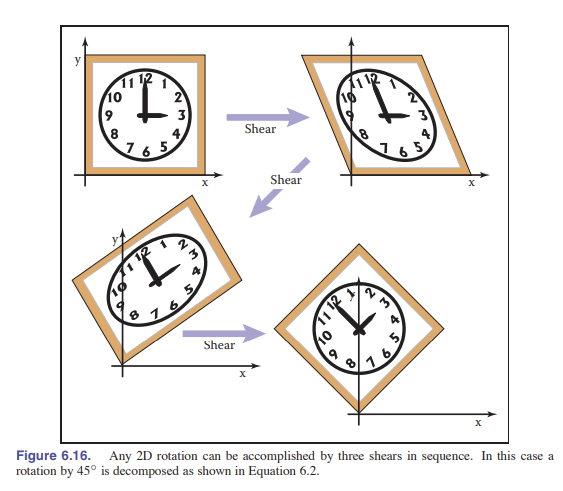

还存在另外一种分解方式：它的作用是即将旋转操作分解为三个切变操作（Paeth，1990），操作如下：

$$
\left [ \begin{matrix}
    \cos\phi & -\sin\phi \\
    \sin\phi & \cos\phi\\
    \end{matrix} \right ] = \left [ \begin{matrix}
    1 & \frac{\cos\phi - 1}{\sin\phi} \\
    0 & -1\\
    \end{matrix} \right ] \left [ \begin{matrix}
    1 & 0 \\
    \sin\phi & -1 \\
    \end{matrix} \right ] \left [ \begin{matrix}
    1 & \frac{\cos\phi-1}{\sin\phi} \\
    0 & -1\\
    \end{matrix} \right ]
$$

这样的变换对 _光栅旋转_ 很有用。因为切变是一种效率非常高的图像光栅操作，它虽然会造成一些锯齿，但不会留下孔洞。一个很好的例子是：如果光栅位置是 $(i,j)$ ，我们施加一个水平的切变，就能得到：

$$
\left [ \begin{matrix}
    1 & s \\
    0 & 1\\
    \end{matrix} \right] \left [ \begin{matrix}
    i \\
    j \\
    \end{matrix} \right] = \left [ \begin{matrix}
    i+sj \\
    j \\
    \end{matrix} \right]
$$

如果我们将 $sj$ 舍入到最近的整数，这就相当于将图像的每一行进行横向移动，但行与行的移动量不同。但行内移动量是相同的，这就让我们能够对图像进行无缝旋转。同样的，垂直的切变也是如此，所以通过切变我们可以轻松实现简单光栅旋转。

## 6.2 三维线性变换

三维线性变换就是二维变换的拓展。例如，笛卡尔坐标系中沿轴缩放为：

$$
scale(a_x,a_y,a_z) = \left [ \begin{matrix}
    s_x & 0 & 0 \\
    0 & s_y & 0 \\
    0 & 0 & s_z \\
    \end{matrix} \right]
$$

但旋转就比二维要复杂多了。这里，我们希望简单的沿着 $z$ 轴旋转，所以只改变 $x$ 和 $y$ 的坐标，我们就可以用二维旋转矩阵：

$$
\rm rotate_z(\phi) = \left [ \begin{matrix}
    \cos\phi & -\sin\phi & 0 \\
    \sin\phi & \cos\phi & 0 \\
    0 & 0 & 1 \\
    \end{matrix} \right]
$$

同样我们可以很容易得到沿着 $x$ 轴和 $y$ 轴的旋转矩阵：

$$
\rm rotate_x(\phi) = \left [ \begin{matrix}
    1 & 0 & 0 \\
    0 & \cos\phi & -\sin\phi \\
    0 & \sin\phi & \cos\phi \\
    \end{matrix} \right]
$$

$$
\rm rotate_y(\phi) = \left [ \begin{matrix}
    \cos\phi & 0 &  \sin\phi\\
    0 & 1 & 0 \\
    -\sin\phi & 0 & \cos\phi \\
    \end{matrix} \right]
$$

为什么 $y$ 轴的旋转矩阵看上去好像反了？我们下一节将会讨论，同时讨论对任意轴的旋转。

和二维一样，我们可以对特定的轴进行切变：

$$
\rm shear_x(d_y,d_z) = \left [ \begin{matrix}
    1 & d_y &  d_z\\
    0 & 1 & 0 \\
    0 & 0 & 1 \\
    \end{matrix} \right]
$$

同样的，和二维一样，所有三维的变换矩阵都可以使用奇异值分解来分解成旋转-缩放-旋转的组合。所有对称的三维矩阵都可以使用特征值分解来分解成旋转-缩放-转回的组合，最后，旋转矩阵同样可以表示成三维切变矩阵的乘积。

### 6.2.1 任意三维旋转

和二维一样，三维旋转矩阵也是 **正交矩阵** 。在几何上来说，这意味着矩阵的三个行向量是三个正交单位向量，列向量是三个可能不同的正交单位向量，让我们写下如下的矩阵：

$$
{\rm\textbf{R}}_{uvw} = \left [ \begin{matrix}
    x_u & y_u & z_u\\
    x_v & y_v & z_v \\
    x_w & y_w & z_w \\
    \end{matrix} \right ]
$$

在这里， ${\rm\textbf{u}} = x_u{\rm\textbf{x}}+y_u{\rm\textbf{y}}+z_u{\rm\textbf{z}}$， ${\rm\textbf{v}}$ 和 ${\rm\textbf{w}}$ 也是如此。由于这些向量是正交单位化的，所以：

$${\rm\textbf{u}}\cdot {\rm\textbf{u}} = {\rm\textbf{v}}\cdot {\rm\textbf{v}} = {\rm\textbf{w}}\cdot {\rm\textbf{w}} = 1$$

$${\rm\textbf{u}}\cdot {\rm\textbf{v}} = {\rm\textbf{v}}\cdot {\rm\textbf{w}} = {\rm\textbf{w}}\cdot {\rm\textbf{u}} = 0$$

通过将旋转矩阵作用于 ${\rm\textbf{u}}$ , ${\rm\textbf{v}}$ , ${\rm\textbf{w}}$ ，我们可以推断出矩阵的行为，例如：

$$
{\rm\textbf{R}}_{uvw}{\rm\textbf{u}} = \left [ \begin{matrix}
    x_u & y_u & z_u \\
    x_v & y_v & z_v \\
    x_w & y_w & z_w \\
    \end{matrix} \right ] \left [ \begin{matrix}
    x_u \\
    y_u \\
    z_u \\
    \end{matrix} \right ]  = \left [ \begin{matrix}
    x_ux_u+ y_uy_u +z_uz_u\\
    x_vx_u+y_vy_u+z_vz_u \\
    x_wx_u+y_wy_u+z_wz_u \\
    \end{matrix} \right]
$$

注意 ${\rm\textbf{R}}_{uvw} {\rm\textbf{u}}$ 的三行都是点乘积，所以我们得到：

$$
{\rm\textbf{R}}_{uvw}{\rm\textbf{u}} = \left [ \begin{matrix}
    {\rm\textbf{u}}\cdot {\rm\textbf{u}}\\
    {\rm\textbf{v}}\cdot {\rm\textbf{u}} \\
    {\rm\textbf{w}}\cdot {\rm\textbf{u}} \\
    \end{matrix} \right ] = \left [ \begin{matrix}
    1 \\
    0\\
    0 \\
    \end{matrix} \right] = {\rm\textbf{x}}
$$

类似的，可以算出 ${\rm\textbf{R}}\{uvw\}{\textbf{v}}={\textbf{y}} , {\textbf{R}}\{uvw\}{\textbf{w}}={\textbf{z}}.$ 所以我们可以通过在向量左边乘上 ${\rm\textbf{R}}\{uvw\}$ 这个矩阵， ${\rm\textbf{R}}\{uvw\}$ 通过这个矩阵提供的旋转变换将 $u, v, w$ 旋转到对应的 $x, y, z$ 坐标轴上。

如果 ${\rm\textbf{R}}\{ uvw \}$ 是一个有正交行向量的旋转矩阵，那么 ${\rm\textbf{R}}^T \{ uvw \}$ 就是带有正交列向量的旋转矩阵，其实这个矩阵就是原矩阵的逆矩阵（正交矩阵的性质）。重要的一点是，对于变换矩阵来说，对于矩阵取逆（代数逆）就是对于图形的变化取逆过程（几何逆）。也就是说，如果 ${\rm\textbf{R}}\{uvw\}$ 将 ${\rm\textbf{u}}$ 转向了 $\rm x$ ，那么 ${\rm\textbf{R}}^T\{uvw\}$ 就会将 $\rm x$ 转回 ${\rm\textbf{u}}$ 。对于 ${\rm\textbf{v}}$ 和 $\rm y$ 也一样。所以 **我们总是可以通过正交基来创建旋转矩阵。**

如果我们想要绕着一个任意向量 ${\rm\textbf{a}}$ 旋转，我们可以构建一个 ${\rm\textbf{w}}={\rm\textbf{a}}$ 的正交基 ，然后将这个正交基通过旋转变换到标准基坐标 ${\rm\textbf{xyz}}$ 下（也就是下面右乘的矩阵），然后绕 ${\rm\textbf{z}}$ 轴旋转（中间的矩阵），最后转回 ${\rm\textbf{uvw}}$ 坐标下（左边的矩阵）。用矩阵的形式表示，沿着 ${\rm\textbf{w}}$ 轴旋转 $\phi$ 角度的复合变换矩阵如下所示：

$$
\left [ \begin{matrix}
    x_u & x_v & x_w\\
    y_u & y_v & x_w\\
    z_u & z_v & x_w\\
    \end{matrix} \right ] \left [ \begin{matrix}
    \cos\phi & -\sin\phi & 0\\
    \sin\phi & \cos\phi & 0 \\
    0 & 0 & 1\\
    \end{matrix} \right ]  \left [ \begin{matrix}
    x_u & y_u & z_u\\
    x_v & y_v & z_v\\
    x_w & y_w & z_w\\
    \end{matrix} \right ]
$$

在这里我们给出了单位向量 ${\rm\textbf{w}}$ ，它是一个向着 ${\rm\textbf{a}}$ 方向的单位向量，那么 ${\rm\textbf{u}}$ 和 ${\rm\textbf{v}}$ 是什么呢？计算它们的方法已经在 2.4.6 节给出。

如果我们有一个旋转矩阵，然后希望由轴角的形式来进行旋转，我们可以计算一个实特征值（应该是 $\lambda = 1$ ），然后对应的特征向量就是旋转轴。这是一条不会因为旋转改变的轴。

除了旋转矩阵。还有一些表示旋转的常用方法，详见 16 章。

### 6.2.2 变换法向量

虽然大多数的三维向量我们用它用来表示位置（离原点的偏移）或表示方向，比如表示光的来源，但有些向量是用来表示表面法线的。表面法向量垂直于表面某点切平面。当变换曲面时，这些法向量并不会按照变换曲面的方式进行变换。比如，如果曲面上的所有点都被变换矩阵 ${\rm\textbf{M}}$ 进行了变换，那么与曲面相切的向量 ${\rm\textbf{t}}$ 在被 ${\rm\textbf{M}}$ 乘后就会与变换后的曲面相切。然而，法向量 ${\rm\textbf{n}}$ 被 ${\rm\textbf{M}}$ 乘后，不一定会垂直于变换后曲面的切平面，如图 6.17 所示。

我们可以计算一个变换矩阵 ${\rm\textbf{N}}$ ，这个矩阵将法向量 ${\rm\textbf{n}}$ 变为另外一个向量，而新向量将垂直于转换后的表面。那么怎么计算呢？ 一个方法是：注意到表面法向量和表面切向量是垂直的，因此它们的点积为 0：

$${\rm\textbf{n}^T}{\rm\textbf{t}} = 0$$

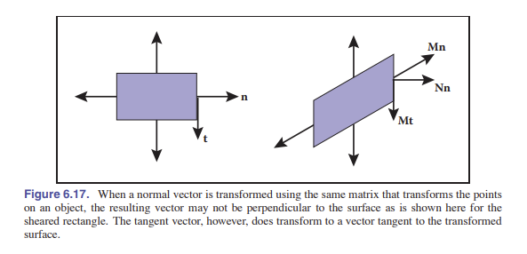

如果我们将转换后的向量记为 ${\rm\textbf{t}}_M =  {\rm\textbf{Mt}}$ ， ${\rm\textbf{n}}_N =  {\rm\textbf{Nn}}$ ，那么我们的目标是找到矩阵 ${\rm\textbf{N}}$ ，让 ${\rm\textbf{n}}_N^T {\rm\textbf{t}}_M = 0$ 。通过这个方程，我们可以用一些代数方面的小技巧来求解。首先，我们通过 ${\rm\textbf{I}}$ 的妙用，将上面的式子插入一个单位矩阵：

$${\rm\textbf{n}^T}{\rm\textbf{t}} = {\rm\textbf{n}^T}{\rm\textbf{It}}={\rm\textbf{n}^T}{\rm\textbf{M}^{-1}}{\rm\textbf{Mt}} = 0$$

然后，通过结合律：

$$({\rm\textbf{n}^T}{\rm\textbf{M}^{-1}})({\rm\textbf{Mt}}) = ({\rm\textbf{n}^T}{\rm\textbf{M}^{-1}}){\rm\textbf{t}}_M = 0$$

这意味着垂直于 ${\rm\textbf{t}}_M$ 的行向量正是上面括号内乘出来的向量。这个表达式适用于切平面中的任意切向量。由于在空间中只有一个向量（及其相反方向的向量）垂直于切平面，所以左边乘出来的那个行向量一定是 ${\rm\textbf{n}_N}$ ，也就是 ${\rm\textbf{n}_N^T}$ 。这就有了一个办法来推导 ${\rm\textbf{N}}$ ：

$${\rm\textbf{n}^T}_N = {\rm\textbf{n}^T}{\rm\textbf{M}^{-1},}$$

然后我们将其转置，得到：
$${\rm\textbf{n}_N} = ({\rm\textbf{n}^T}{\rm\textbf{M}^{-1}})^T = ({\rm\textbf{M}^{-1}})^T{\rm\textbf{n}}$$

因此，我们看到能够正确地变换法向量，让它变换后依然是法向量的矩阵是 ${\rm\textbf{N}} = ({\rm\textbf{M}^{-1})^T}$ ，也就是原矩阵取逆的转置。因为这个矩阵可能会改变 ${\rm\textbf{n}}$ 的长度，我们可以将该向量乘一个任意数，这样它能始终指向正确的方向。矩阵的逆是余子式矩阵的转置再除以该矩阵的行列式 _[5.3，行列式和矩阵]_ 。由于我们不关心法向量的长度，所以我们可以跳过矩阵的除法，最后得到，对于一个 $3\times 3$ 矩阵，

$$
{\rm\textbf{N}} = \left [ \begin{matrix}
    m^c_{11} & m^c_{12} & m^c_{13} \\
    m^c_{21} & m^c_{22} & m^c_{23} \\
    m^c_{31} & m^c_{32} & m^c_{33} \\
    \end{matrix} \right ]
$$

这里我们假设了 $m_{ij}$ 是矩阵 ${\rm\textbf{M}}$ 的第 $i$ 行第 $j$ 列的元素。最终我们得到 ${\rm\textbf{N}}$ 的完整表达式是：

$$
{\rm\textbf{N}} = \left [ \begin{matrix}
    m_{22}m_{33}-m_{23}m_{32} & m_{23}m_{31}-m_{21}m_{33} & m_{21}m_{32}-m_{22}m_{31} \\
    m_{13}m_{32}-m_{12}m_{33} & m_{1}m_{33}-m_{13}m_{31} & m_{12}m_{31}-m_{11}m_{32} \\
    m_{12}m_{23}-m_{13}m_{22} & m_{13}m_{21}-m_{11}m_{23} & m_{11}m_{22}-m_{12}m_{21} \\
    \end{matrix} \right ]
$$

## 6.3 平移和仿射变换

我们一直在研究如何使用矩阵 ${\rm\textbf{M}}$ 来给变换向量。在二维空间中，这些变换的形式为：

$$x' = m_{11}x+m_{12}y $$

$$y' = m*{21}x+m*{22}y $$

但我们不能使用这样的变换来 _移动_ 物体。只能进行缩放和旋转。尤其是原点 $(0,0)$ 在线性变换中永远保持不变。想要移动或平移（Translate）一个物体，使其所有的点都移动相同的量，我们需要下面这样的变换形式：

$$x' = x+x_t $$

$$y' = x+y_t $$

而通过将 $(x,y)$ 左乘一个 $2\times2$ 矩阵并不能实现这样的效果。将平移加到我们的线性变换系统的一个简单方法是将一个平移向量与每个变换矩阵 **关联** _(参见非线性方程组)_ ，让矩阵接管旋转缩放，向量来控制平移。这完全可行，但是使用这种方法的后续管理工作很麻烦，而且进行 **组合变换** 时，它们将不再变得清晰明了。

作为替代，我们可以使用一点小技巧，让一个单独的矩阵乘法能同时包含上述两种操作：将点坐标 $(x,y)$ 重新表示为一个三维向量 $[x,y,1]^T$ ，然后使用下面所示的 $3\times3$ 矩阵：

$$
\left [ \begin{matrix}
    m_{11} & m_{12} & x_t \\
    m_{21} & m_{22} & y_t \\
    0 & 0 & 1\\
    \end{matrix} \right ]
$$

第三行是固定的，用于将 1 固定到转换后向量的最后一个元素处。而该向量的前两个元素值分别就是关于原向量 $x, y$ 的线性组合：

$$
{\rm\textbf{N}} = \left [ \begin{matrix}
    x' \\
    y' \\
    1  \\
    \end{matrix} \right ] = \left [ \begin{matrix}
    m_{11} & m_{12} & x_t \\
    m_{21} & m_{22} & y_t \\
    0 & 0 & 1\\
    \end{matrix} \right ] \left [ \begin{matrix}
    x \\
    y \\
    1  \\
    \end{matrix} \right ]  = {\rm\textbf{N}} = \left [ \begin{matrix}
    m_{11}x+m_{12}y+x_t \\
    m_{21}x+m_{22}y+y_t \\
    1  \\
    \end{matrix} \right ]
$$

我们用单个矩阵就囊括了线性变换！这样的变换我们称作 **仿射变换** 。而这种通过增加一个维度来实现仿射变换的方法称作 **齐次坐标法（Roberts，1965；Riesenfield，1981；Penna&Patterson，1986）** 。齐次坐标不仅仅让实现变换的代码变得清晰明了，而且它让两个变换组合而成的组合变换变得清晰易懂。

但这种新方式也带来了一个问题：当我们需要变换一个不表示位置，只表示 **方向** 或偏移量的向量时，这个向量不应该被改变。而这时，解决办法就是将该向量的第三元素设置为 0：

$$
\left [ \begin{matrix}
    1 & 0 & x_t \\
    0 & 1 & y_t \\
    0 & 0 & 1\\
    \end{matrix} \right ] \left [ \begin{matrix}
    x \\
    y \\
    0 \\
    \end{matrix} \right ] = \left [ \begin{matrix}
    x \\
    y \\
    0 \\
    \end{matrix} \right ]
$$

这样，我们对该向量做缩放/旋转变换，矩阵左上角的 $2\times 2$ 部分会作用于向量，但后面的平移将相乘得到 0 。此外，向量的第三元素在变换后仍然为 0 ，所以方向向量在变换后仍然为方向向量。

这正是我们想要的结果，所以平移变换可以通过这种方式完美融入该系统：指定额外元素是 0 或是 1 ，取决于我们想要对位置还是方向进行编码。我们需要这样的其次坐标来将位置向量和其他向量分开。如：

$$
\rm \left [ \begin{matrix}
    3 \\
    2 \\
    1 \\
    \end{matrix} \right ] \ is \ a \ location \ , \ \left [ \begin{matrix}
    3 \\
    2 \\
    0 \\
    \end{matrix} \right ] is \ a \ displacement \ or \ direction
$$

过会儿我们讨论透视投影的时候，我们将会发现当该齐次坐标不采用 0 和 1 的时候用处会更大。

在图形系统中，齐次坐标几乎无处不在。而且，齐次坐标是图形硬件中设计和操作渲染器的基础。我们将在 _[第 7 章]_ 看到，齐次坐标使构建透视场景变得更容易。这也是它如此流行的原因。

齐次坐标可以当作一个存储平移变换的好方法。但对于几何方面的解释，有一种不同的说法。主要是，当我们在三维进行基于 z 轴的 _切变_ 时，也是下面这个形式：

$$
\left [ \begin{matrix}
    1 & 0 & x_t \\
    0 & 1 & y_t \\
    0 & 0 & 1\\
    \end{matrix} \right ] \left [ \begin{matrix}
    x \\
    y \\
    z \\
    \end{matrix} \right ] = \left [ \begin{matrix}
    x+x_tz \\
    y+y_tz \\
    z \\
    \end{matrix} \right ]
$$

这个样子和二维的平移变换就相差那么一丢丢。只不过这个切变多了一个 z ，z 在二维中没有意义。所以我们通过指定 $z=1$ ，就可以将平移变换用矩阵的形式使用了。比如：首先，在二维平面中移动 $(x_t,y_t)$ 的距离，然后旋转角度 $\phi$ ，就可以用下面的矩阵表示：

$$
{\rm\textbf{M}} = \left [ \begin{matrix}
    \cos\phi & -\sin\phi & 0 \\
    \sin\phi & \cos\phi & 0 \\
    0 & 0 & 1\\
    \end{matrix} \right ] \left [ \begin{matrix}
    1 & 0 & x_t \\
    0 & 1 & y_t \\
    0 & 0 & 1\\
    \end{matrix} \right ]
$$

别忘了，现在的二维旋转矩阵是 $3\times 3$ 了，而且在表示平移的那一列是 0 。通过这种矩阵规范，我们可以将任意数量的二维 **切变、旋转、平移** 组合到一个三维的矩阵中。这个三维矩阵的最后一行永远都是 $(0,0,1)$ ，因此我们其实没啥必要存储它，毕竟这样还能省点空间。只需要在进行计算的时候，我们把最后一行加上即可。

在三维空间中，这样的技巧同样适用，只需要添加第四维度即可，对于方向向量也一样，将第四个坐标设置为 0 就能让它不受平移的影响了。

### 重要例子

在图形学中，我们经常会需要构建变换矩阵。而且图像不一定在原点。如：构建一个变换矩阵，让这两个点 $[x_l,x_h]\times[y_l,y_h]$ 构成的矩形变换到 $[x_l',x_h']\times[y_l',y_h']$ 。此时，我们通过下面的步骤解决问题会更加直观：

1. 将 $(x_l,y_l)$ 移动到原点
2. 将矩形缩放到目标矩形的尺寸
3. 将原点移回到 $(x_l',y_l')$

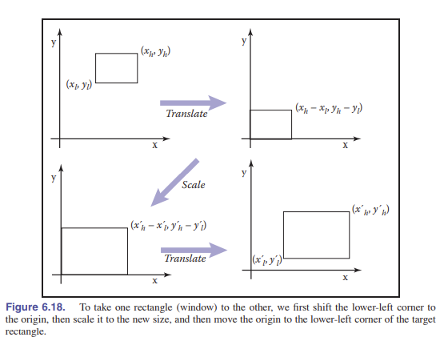

别忘了右边的矩阵先产生作用。这样我们有：

$${\rm Windows} = {\rm translate}(x_l',y_l') \ {\rm scale}(\frac{x_h'-x_l'}{x_h-x_l},\frac{y_h'-y_l'}{y_h-y_l}) \ {\rm translate}(-x_l,-y_l)$$

$$
= \left [ \begin{matrix}
    1 & 0 & x_l' \\
    0 & 1 & y_l' \\
    0 & 0 & 1\\
    \end{matrix} \right ] \left [ \begin{matrix}
    \frac{x_h'-x_l'}{x_h-x_l} & 0 & 0 \\
    0 & \frac{y_h'-y_l'}{y_h-y_l} & 0 \\
    0 & 0 & 1\\
    \end{matrix} \right ] \left [ \begin{matrix}
    1 & 0 & -x_l \\
    0 & 1 & -y_l \\
    0 & 0 & 1\\
    \end{matrix} \right ]
$$

$$
= \left [ \begin{matrix}
    \frac{x_h'-x_l'}{x_h-x_l} & 0 & \frac{x_l'x_h-x_h'x_l}{x_h-x_l} \\
    0 & \frac{y_h'-y_l'}{y_h-y_l} & \frac{y_l'y_h-y_h'y_l}{y_h-y_l} \\
    0 & 0 & 1\\
    \end{matrix} \right ]
$$

有一个重要的变换，可以构成一个类，叫 _刚体变换_ 。这种变换只由平移和旋转组成，因此它们不会对物体进行拉伸或收缩。

## 6.4 变换矩阵的逆

对于一个可逆矩阵，我们可以通过代数方法去求它的逆，同时，如果我们知道了几何逆干了甚么，我们也可以使用几何方法求逆。比如，缩放 $(s_x,s_y,s_z)$ 的逆是 $(1/s_x,1/s_y,1/s_z)$ 。而旋转 $\phi$ 角度的几何逆是旋转 $-\phi$ 角度，平移的逆过程是向相反方向平移。如果我们有一个复合变换矩阵 $\rm\textbf{M} = \rm\textbf{M}_1\textbf{M}_2\cdots\textbf{M}_n$ ，那么它的逆就是

$$\rm\textbf{M}^{-1} = \rm\textbf{M}_n^{-1}\textbf{M}_{n-1}^{-1}\cdots\textbf{M}_1^{-1}$$

同样的，对于确定类型的变换矩阵，求逆很容易。我们已经提到过缩放矩阵，它是对角阵，第二个重要的例子是旋转矩阵，它是正交矩阵。我们在 [5.2.4 特殊类型的矩阵](#524-特殊类型的矩阵) 说过，正交矩阵的逆矩阵就是它的转置。这个性质让它能很轻松的得到旋转的逆和刚体变换的逆。除此之外，如果一个矩阵的底部有 $[0 \ 0 \ 0 \ 1]$ ，那么这个矩阵的逆的底部也有 $[0 \ 0 \ 0 \ 1]$ 。

有趣的是，我们可以使用奇异值分解来对一个矩阵取逆。因为我们知道，所有的矩阵都可以被分解为旋转乘缩放再乘旋转，所以将它们取逆是很简单的。比如：在三维空间中，有：

$${\rm\textbf{M}} = {\rm\textbf{R}_1}\cdot {\rm scale}(\sigma_1,\sigma_2,\sigma_3)\cdot{\rm\textbf{R}_2}$$

根据穿脱法则，有：

$${\rm\textbf{M}^{-1}} = {\rm\textbf{R}_2^T \cdot{\rm scale}(\frac{1}{\sigma_1},\frac{1}{\sigma_2},\frac{1}{\sigma_3})}\cdot{\rm\textbf{R}_1^T}$$

只需要算出各个部分即可求逆。

## 6.5 坐标转换

前面讨论的所有内容都是在讲怎么通过变换矩阵来移动点。但我们也可以讲这个操作视为 **改变这个点所在的坐标系** 。例如，在 _[图 6.19]_ 中，我们看到了描述运动的两种方法。在不同的情况下，这两者中的其中一种会更适用。

 经过了左移-1的变换。右上角是物理移动的样子，右下角是坐标轴移动（移动原点）的样子。")

比如，一个赛车游戏可能会有一个城市的模型和一个车辆的模型。如果游戏向玩家展示的是挡风玻璃外面的视角，那么车内的物体会始终绘制在屏幕的固定位置，同时当玩家开始驾驶时，街景和建筑物开始向后移动。每一帧上我们都会对窗外的事物进行一次变换，让他们相比于上一帧更远。实现这种效果的一种方法是简单地讲建筑物向后移动；另外一种方法则是建筑物不动，但改变我们生成视图的坐标系，让坐标系动起来。后面这种方法所作的变换是在改变城市几何体的坐标，并将城市几何体的坐标表示为车内的坐标。两种方法加在车辆外部几何体的变换矩阵在最后都是完全相同的。

如果这个游戏同样支持俯瞰视角，来让玩家看见车辆在城市中的位置的话，那么建筑和街景就需要在固定位置生成，车辆则需要一帧一帧的移动。正如上面所说的，也有两种方法可以使用。我们可以想象将汽车从世界坐标系的原位置移动到目标位置，或者可以想象这个过程是对车辆的几何体坐标的转换（这个坐标附着在车辆几何上），而不是让固定在城市的坐标系移动。这两种转换坐标的 **转换矩阵** 清楚的说明了两种模式（车相对于城市、城市相对于车）执行的变换 **互为逆矩阵** 。

改变坐标系的思想和编程中的 _类型转换_ 很相似。在我们能够让浮点数和整数相加之前，我们首先需要将整数转换为浮点数，让类型能够匹配。所以当我们一起生成汽车和城市之前，我们需要将车辆坐标转换为城市坐标，或者取决于我们的需要反着来，这样坐标才能匹配。

在管理多个坐标系的时候，会很容易混淆，最后让对象坐标错误，导致对象在不该出现的地方出现。但我们通过系统地思考坐标系之间的转换，我们可以得到准确的转换。

几何上来说，一个坐标系统（坐标框架）由一个 _原点_ 和一个 _基_ （三个向量组成的集合）构成。正交基非常方便，所以我们说到坐标系，如果没有另外说明，就假设它们是正交的。在一个原点为 ${\rm\textbf{p}}$ ，基是 $\{ {\rm\textbf{u,v,w}} \}$ 的坐标框架中，坐标 $(u,v,w)$ 这样表示：

$${\rm\textbf{p}}+u{\rm\textbf{u}}+v{\rm\textbf{v}}+w{\rm\textbf{w}}.$$

当我们在计算机中存储这些向量时，它们需要采用某种坐标系来进行表示。开始之前，我们要设计一些标准坐标系，通常称为 **全局坐标/世界坐标** ，用于表示和区分其他的坐标系。比如在我们上面说的这个城市里，我们可能会采用 _街道网格_ ，按照惯例将 $x$ 轴设定在主街道， $y$ 轴指向上方， $z$ 轴沿着中央大道。然后我们就能清晰的指定车辆坐标系的原点和基。

在二维平面，我们通常使用 ${\rm\textbf{o}}$ 作为原点， ${\rm\textbf{x}}$ 和 ${\rm\textbf{y}}$ 作为右手基向量。

> 注：在二维平面，“右手”是指从 ${\rm\textbf{x}}$ 开始逆时针到 ${\rm\textbf{y}}$ 。

但与此同时，可能会有另外一个坐标，使用 ${\rm\textbf{e}}$ 作为原点， ${\rm\textbf{u}}$ 和 ${\rm\textbf{v}}$ 作为基，这时请注意，标准坐标系不会被显式存储，因为它们作为别的坐标系的参考系。在该坐标系中， ${\rm\textbf{p}}$ 的位置就会被记为有序数对作为简写：

$${\rm\textbf{p}} = (x_p,y_p) = {\rm\textbf{o}}+x_p{\rm\textbf{x}}+y_p{\rm\textbf{y}}$$

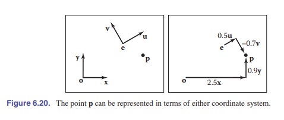

下面来看 _[图 6.20]_ 的例子：在这里， $(x_p,y_p) = (2.5,0.9)$ ，注意这个坐标已经假定了坐标原点 ${\rm\textbf{o}}$ 。相似地，我们可以用另一个方程表示 ${\rm\textbf{p}}$ ：

$${\rm\textbf{p}} = (x_p,y_p) = {\rm\textbf{e}}+u_p{\rm\textbf{u}}+v_p{\rm\textbf{v}}$$

而在图中另外一个坐标系，这个点的坐标是 $(u_p,v_p) = (0.5,-0.7)$ 。同样，其他信息被省略了。

我们也可以用矩阵来表示同样的关系：

$$
\left [ \begin{matrix}
    x_p \\
    y_p \\
    1\\
    \end{matrix} \right ] = \left [ \begin{matrix}
    1 & 0 & x_e \\
    0 & 1 & y_e \\
    0 & 0 & 1 \\
    \end{matrix} \right ] \left [ \begin{matrix}
    x_u & x_v & 0 \\
    y_u & y_v & 0 \\
    0 & 0 & 1 \\
    \end{matrix} \right ]\left [ \begin{matrix}
    u_p \\
    v_p \\
    1\\
    \end{matrix} \right ]  = \left [ \begin{matrix}
    x_u & x_v & x_e \\
    y_u & y_v & y_e \\
    0 & 0 & 1 \\
    \end{matrix} \right ] \left [ \begin{matrix}
    u_p \\
    v_p \\
    1\\
    \end{matrix} \right ]
$$

值得注意的是，这里假设了我们将点 ${\rm\textbf{e}}$ 和向量 ${\rm\textbf{u}}$ 、 ${\rm\textbf{v}}$ 存储在了标准坐标系下，而该等式的第一项是默认了 $(x,y)$ 标准坐标系。根据我们在这一张讨论的变换基本类型，这是一个 **旋转变换** （涉及 ${\rm\textbf{u，v}}$ ），然后进行了一个 **平移变换** （涉及 ${\rm\textbf{e}}$ ）。让我们同时看旋转和平移矩阵，你会发现写下它们很容易：我们只需要将 ${\rm\textbf{u，v，e}}$ 放在这个矩阵的第 1，2，3 列，然后加上最后一行 $[0 \ 0 \ 1]$ 即可。如下：

$$
{\rm\textbf{p}}_{xy} = \left [ \begin{matrix}
    {\rm\textbf{u}} & {\rm\textbf{v}} & {\rm\textbf{e}} \\
    0 & 0 & 1 \\
    \end{matrix} \right ] {\rm\textbf{p}}_{uv}
$$

我们将这个矩阵称为 **_坐标框架-标准坐标矩阵_** 。它接收框架坐标 $(u,v)$ ，然后将它转换为标准坐标系下的坐标。

反过来，我们有：

$$
\left [ \begin{matrix}
    u_p \\
    v_p \\
    1 \\
    \end{matrix} \right ] = \left [ \begin{matrix}
    x_u & y_u & 0 \\
    x_v & y_v & 0 \\
    0 & 0 & 1 \\
    \end{matrix} \right ] \left [ \begin{matrix}
    1 & 0 & -x_e \\
    0 & 1 & -y_e \\
    0 & 0 & 1 \\
    \end{matrix} \right ]\left [ \begin{matrix}
    x_p \\
    y_p \\
    1\\
    \end{matrix} \right ]
$$

这是一个先平移，后旋转的变换：也就是之前那个（先旋转再平移）的逆变换。当这两个变换矩阵相乘组合后，产生的矩阵正是上面那个矩阵（从坐标框架到标准坐标）的 **逆矩阵** 。也就是 **_标准坐标-坐标框架矩阵_** ：

$$
{\rm\textbf{p}}_{uv} = \left [ \begin{matrix}
    {\rm\textbf{u}} & {\rm\textbf{v}} & {\rm\textbf{e}} \\
    0 & 0 & 1 \\
    \end{matrix} \right ] ^{-1} {\rm\textbf{p}}_{xy}
$$

同样的，标准坐标-坐标框架矩阵接收一个标准坐标系的点，并将它转换为 $(u,v)$ 坐标系中的点。我们把这个矩阵简单的标了个逆，是因为它不能使用 ${\rm\textbf{e,u,v}}$ 的标准坐标立即写出来。但请记住，所有坐标系都是等效的，使用 $x$ 和 $y$ 来存储坐标只是我们的习惯，让它看上去不对等。标准坐标-坐标框架矩阵可以简单的表示为 ${\rm\textbf{o,x,y}}$ 的坐标：

$$
{\rm\textbf{p}}_{uv} = \left [ \begin{matrix}
    {\rm\textbf{x}}_{uv} & {\rm\textbf{y}}_{uv} & {\rm\textbf{o}}_{uv} \\
    0 & 0 & 1 \\
    \end{matrix} \right ]  {\rm\textbf{p}}_{xy}
$$

**以上的所有结论再三维空间均可用。**

## 常见问题

- **_我难道不能直接摁算摁编程，而不采用这种矩阵形式吗？_**

  当然可以。但实际上，这样做更难推导，更难 debug，效率也不高。而且，当下所有的图形 API 都采用了矩阵形式，你要是用图形库，就必须理解它。

- **_矩阵的底部永远是_** $[0 \ 0 \ 0 \ 1]$ ，**_那么我还要存储它吗？_**

  除非包含了**透视变换** _[第 7 章]_ ，否则不需要存储。
