<head>
<script>
MathJax = {
  tex: {
    inlineMath: [['$', '$'], ['\\(', '\\)']],
    displayMath: [["$$", "$$"], ["\\[", "\\]"]],
  },
  svg: {
    fontCache: 'global'
  }
};
</script>
<script type="text/javascript" id="MathJax-script" async
  src="https://cdn.jsdelivr.net/npm/mathjax@3/es5/tex-svg.js">
</script>

</head>

- [第七章 视图变换](#第七章-视图变换)
  - [7.1 视图变换](#71-视图变换)
    - [7.1.1 视口变换](#711-视口变换)
    - [7.1.2 投影变换：正交投影变换](#712-投影变换正交投影变换)
    - [7.1.3 相机变换](#713-相机变换)
  - [7.2 投影变换](#72-投影变换)
    - [例子](#例子)
  - [7.3 透视投影](#73-透视投影)
    - [重要例子](#重要例子)
  - [7.4 透视变换的一些性质](#74-透视变换的一些性质)
  - [7.5 视野（FoV）](#75-视野fov)
  - [常见问题](#常见问题)
- [第八章 图形管线](#第八章-图形管线)
  - [8.1 光栅化](#81-光栅化)
    - [8.1.1 画线](#811-画线)
      - [使用隐式方程画线](#使用隐式方程画线)
    - [8.1.2 三角形的光栅化](#812-三角形的光栅化)
      - [处理三角形边界上的像素](#处理三角形边界上的像素)
    - [8.1.3 裁剪](#813-裁剪)
    - [8.1.4 转换前裁剪（方法 1）](#814-转换前裁剪方法-1)
    - [8.1.5 齐次坐标的裁剪（方法 2）](#815-齐次坐标的裁剪方法-2)
    - [8.1.6 对一个面进行裁剪](#816-对一个面进行裁剪)
  - [8.2 光栅化之前和之后的操作](#82-光栅化之前和之后的操作)
    - [8.2.1 简单的二维平面绘图](#821-简单的二维平面绘图)
    - [8.2.2 最小的三维图形管线](#822-最小的三维图形管线)
    - [8.2.3 使用深度缓冲（z-Buffer）隐藏表面](#823-使用深度缓冲z-buffer隐藏表面)
      - [精度问题](#精度问题)
    - [8.2.4 逐顶点着色](#824-逐顶点着色)
    - [8.2.5 逐片元着色](#825-逐片元着色)
    - [8.2.6 纹理映射](#826-纹理映射)
    - [8.2.7 着色频率](#827-着色频率)
  - [8.3 简单抗锯齿](#83-简单抗锯齿)
  - [8.4 剔除图元以提升效能](#84-剔除图元以提升效能)
    - [8.4.1 视锥体剔除](#841-视锥体剔除)
    - [8.4.2 背面剔除](#842-背面剔除)
  - [常见问题](#常见问题-1)

# 第七章 视图变换

**在上一章，我们见识了怎么使用矩阵工具来对二维或三维物体进行变换。几何变换的第二个重要内容是如何将物体在三维空间中移动，同时在二维视角中呈现这一内容。这种从三维到二维的变换称之为 _视图变换_ ，在以对象为顺序的渲染中起着重要作用。在这个过程中，我们需要快速的找到每个物体的图像-空间位置。**

**当我们在第四章学习光线追踪时，我们就介绍了不同种类的透视和正交视图；以及介绍了如何在任意视角生成视角光线。这一章的内容就是把这个过程反过来。在这里我们会解释如何使用矩阵变换来表示任意平行或透视视图。本章中的变换将场景（世界空间）的三维点投影到图像（图像空间）中的二维点上，并将给定像素的观察光线上的如何点投影回该像素在图像空间中的位置。**

**若你忘了之前将的内容，建议重新回顾 [第四章] 。**

**就其本身而言，将点从真实世界投影到图像上的能力仅适用于生成 _线框渲染_ ——仅绘制物体的边缘，而且较近的表面 _不会遮挡_ 较远的表面（见 _[图 7.1]_ ）。正如光线追踪需要找到离他最近的交点一样，显示物体实体外观的对象顺序渲染器必须分辨出多个曲面中哪个离屏幕最近，并仅显示该曲面。在这章中，我们假设我们绘制的图形仅包含 _三维线段_ ，并通过 $(x,y,z)$ 格式的两个端点进行表示。后面的章节才会讲到实体表面渲染所需的方法。**

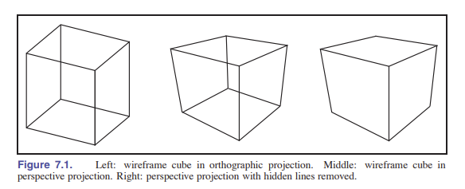

## 7.1 视图变换

视图变换的工作是：将通过 $(x,y,z)$ 表示的三维坐标位置，转化为以像素为单位的图像。它很复杂，这取决于很多方面：相机的方向和位置、投影方法、可视角度、以及图像分辨率。我们在之前已经学到，复杂的变换可以分解为几个简单变换的叠加，视图变换也可以这样。大多数的图形系统使用下面三种变换序列来实现视图变换：

- **相机变换/眼睛变换** ：是一种 _刚体变换 [见 6.3 重要例子]_ ，它能将照相机以合适的朝向放在原点。它只能决定相机的 _位置和方向_ 或者说， _姿势_ 。
- **投影变换** ：它能将摄影机空间中投影点，让所有的点的 $x$ 和 $y$ 都落在 $[-1,1]$ 中。它只能决定 _所需要的投影类型_ 。
- **视口变换/窗口变换** ：它能将上面的单位图像矩阵映射到像素坐标。它只能决定 _图像输出的大小和位置_ 。

> 有些 API 的视图变换仅仅指的是 _相机变换_ 。

为了更好的描述这个变换过程（见图 7.2），我们给进行上述变换所使用的不同坐标系起了不同的名字。

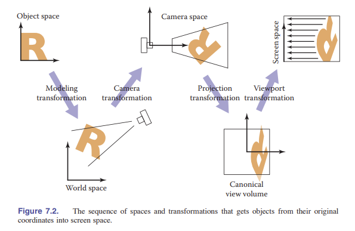

相机变换将 **标准坐标** 中的点转换为 **相机坐标** ，而投影变换将那些点从 **相机坐标** 转换为 **标准视图坐标** ，最后，视口变换将 **标准视图坐标** 映射为 **屏幕空间** 。

上面那三个转换都是独立的，但非常简单。我们会先从 **正交投影** 的案例来讨论视口变换，然后讨论 **透视投影** 下的变换。

> 别名：相机空间也叫眼睛空间；相机变换因此也会被叫做视图变换。标准视图坐标也叫做裁剪空间、标准化设备坐标；屏幕空间也叫做像素坐标。

### 7.1.1 视口变换

我们从一个例子开始，这个例子的解决方案将是通用的：

假设我们要观察的几何体是在 **标准视图空间** 中的，同时我们希望产生正交投影的相机的观察方向是 $-z$ 。 _标准立方体_ 包含了所有在 $x,y,z$ 的 $[-1,1]^3$ 范围内的所有点（见图 7.3）。我们将 $x=-1$ 投影在屏幕左边， $x=1$ 投影在屏幕右边， $y=-1$ 投影在屏幕底部， $y=1$ 投影在顶部。

> 标准 (Canonical) 这个词老是出现。我们选用这个词主要是因为它表述方便。比如标准圆 (Canonical Circle) 就的意思就是单位圆 (Unit Circle)。

请回忆一下第三章的知识，我们做了一个约定：每个像素都占有一块以 **整数坐标为中心的正方形区域** 。同时在图像的边界会相比像素中心超出一半像素的长度。最后，最小像素中心的坐标是 $(0,0)$ 。因此，如果我们需要绘制一幅像素为 $n_x\times n_y$ 的图像，那么我们需要将标准平面 $[-1,1]^2$ 映射到矩形 $[-0.5,n_x-0.5]\times [-0.5,n_y-0.5]$ 的区域上。

现在，我们假设所有需要绘制的线段都在 **标准立方体** 中。在之后我们讲到 _裁剪_ 的时候我们会放宽松这个假设。

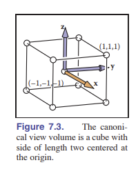

> 注：将一个正方形映射到一个长方形并不是什么问题。我们只需要给 $x$ 和 $y$ 不同的缩放系数即可。

由于我们要进行的视口变换是将一个矩形沿轴映射到另外一个矩形，所以下面的公式是视口变换的一种形式：

$$
\left [ \begin{matrix}
    x_{\rm screen} \\
    y_{\rm screen} \\
    1 \\
    \end{matrix} \right ] = \left [ \begin{matrix}
    \frac{n_x}{2} & 0 & \frac{n_x-1}{2} \\
    0 & \frac{n_y}{2} & \frac{n_y-1}{2} \\
    0 & 0 & 1 \\
    \end{matrix} \right ]  \left [ \begin{matrix}
    x_{\rm canonical} \\
    y_{\rm canonical} \\
    1 \\
    \end{matrix} \right ]
$$

请注意，这个矩阵忽略了标准立方体中的 $z$ 轴量。因为点沿投影方向的距离不会影响该点在图像中的投影位置。但是在我们正式称它为 _“视口矩阵”_ 之前，我们需要添加一行一列，以达到不改变 $z$ 的作用。尽管在这里我们不需要 $z$ ，但最终 $z$ 值的存在是有必要的（用于判断远近曲面的关系）。

所以，视口矩阵：

$$
{\rm\textbf{M}_{vp}} = \left [ \begin{matrix}
    \frac{n_x}{2} & 0 & 0 & \frac{n_x-1}{2} \\
    0 & \frac{n_y}{2} & 0 & \frac{n_y-1}{2} \\
    0 & 0 & 1 & 0 \\
    0 & 0 & 0 & 1 \\
    \end{matrix} \right ]
$$

### 7.1.2 投影变换：正交投影变换

**正交投影的步骤如下：**

1. **固定相机（相机变换）**
2. **把 $z$ 轴扔了**
3. **转换为标准正方形 $[-1,1]^2$ .**

一般情况下我们不希望在 **标准立方体** 之外的地方渲染几何体。我们要做的第一步是 在固定视角方向 (朝着 $-z$ 方向， $+y$ 在摄像机头顶) 的同时，能看到任意的矩形。我们不会替换视口矩阵，而是通过将其与右侧的另一个矩阵相乘来计算。

在这些约束条件下，视图空间是一个轴对齐的长方盒子，我们将这个盒子的不同面使用下面的方式命名： $[l,r]\times [b,t]\times [f,n]$ ，如 [图 7-4] 。我们将这个长方盒称作 **正交立方体** ，它的各个平面如下：

$$x=l \equiv \rm left \ plane $$

$$x=r \equiv \rm right \ plane $$

$$y=b \equiv \rm bottom \ plane $$

$$y=t \equiv \rm top \ plane $$

$$z=n \equiv \rm near \ plane $$

$$z=f \equiv \rm far \ plane $$

这些定义假定了观察者是往 $-z$ 轴方向看，头顶对着 $y$ 轴方向。

> 注：很多程序员发现， $x$ 轴指向右， $y$ 轴指向上是很有用的。在一个右手系中，这就表明了我们的视角方向是 $-z$ 轴。同时有一些系统采用左手系，那么视角方向就是 $z$ 轴方向。左手系的系统在文末有标明。

接上面，由于这样规定，所以我们默认 $n>f$ ，但是如果你假设了整个视图都在 $z<0$ 的区域，那么当且仅当 $n>f$ 时， $n$ 平面（近平面）才是真正的离观察者“近”。

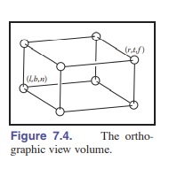
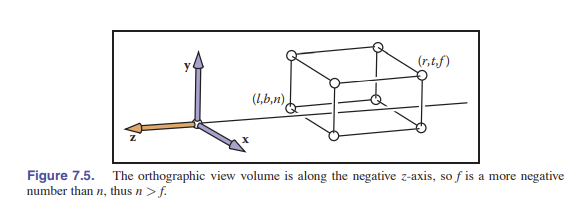

上面这个概念在 [图 7.5] 中展示。从 **正交立方体** 变换到 **标准立方体** 的转换是另外一个转换。我们可以简单的将正交视图和标准视图的 **边界** 代入到 [6.3 重要例子] 中的方程中。这样我们可以得到该转换的矩阵：

$$
{\rm\textbf{M}_{orth}} = \left [ \begin{matrix}
    \frac{2}{r-l} & 0 & 0 & -\frac{r+l}{r-l} \\
    0 & \frac{2}{t-b} & 0 & -\frac{t+b}{t-b} \\
    0 & 0 & \frac{2}{n-f} & -\frac{n+f}{n-f} \\
    0 & 0 & 0 & 1 \\
    \end{matrix} \right ]
$$

别忘了我们的目标是绘制三维线段。为了达成目标，我们需要将其投影到画面上，忽略 $z$ 坐标。我们通过将两个变换矩阵组合的方式来完成。注意，在程序中，我们先将这两个矩阵相乘，再进行下一步操作：

$$
\left [ \begin{matrix}
    x_{\rm pixel} \\
    y_{\rm pixel} \\
    z_{\rm canonical} \\
    1 \\
    \end{matrix} \right ] = ({\rm\textbf{M}_{vp}}{\rm\textbf{M}_{orth}})\left [ \begin{matrix}
    x \\
    y \\
    z \\
    1 \\
    \end{matrix} \right ]
$$

> 注：这就是使用矩阵进行变换能让程序变得简洁的奥秘！

这下子 $z$ 轴坐标就会在 $[-1,1]$ 中了。虽然我们现在没有使用这一点，但在后续的 _z-buffer 算法_ 中会很有用。

对于构造三维线段的伪代码，会变得简洁清爽：

```c++
construct M_vp
construct M_orth

M = M_vp * M_orth

for each line segment(a_i,b_i) do{
    p = M * a_i;
    q = M * b_i;
    drawline(x_p,y_p,x_q,y_q);
}

```

### 7.1.3 相机变换

我们希望能够在三维空间中改变视角，让照相机能够看向任何方向。对于相机的位置和朝向，我们使用下面这种约定：

- 眼睛位置 **e**
- 注视方向 **g**
- 头顶方向向量 **t**

眼睛位置是指眼睛“从什么地方看”的位置。如果认为图形计算是一种摄影的过程，那么眼睛位置就是镜头的中心。注视方向是观察者注视方向的方向向量。头顶方向向量是平面中的任何向量。加入相机在地上，该向量将观察者的头部平分为左右两半，并让相机的顶部指向天空。这些向量为我们提供了足够的信息来以 $\rm\textbf{e}$ 为原点， $\rm\textbf{u,v,w}$ 为基建立一个坐标系。其中：

$$\rm\textbf{w} = -\frac{\textbf{g}}{\parallel \textbf{g} \parallel}$$

$$\rm\textbf{w} = -\frac{\textbf{t}\times \textbf{w}}{\parallel \textbf{t}\times \textbf{w} \parallel}$$

$$\rm\textbf{v} = \rm\textbf{w}\times \rm\textbf{u}$$

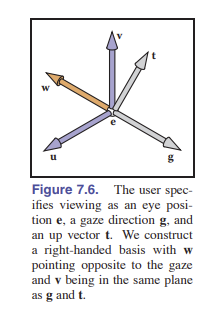
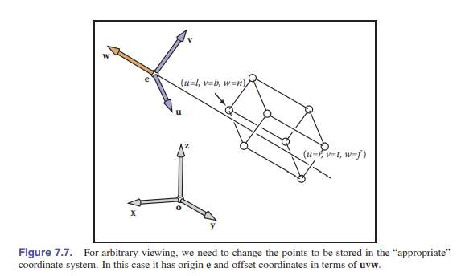

如果我们所希望变换的所有点都以上述坐标系（**e，uvw**）存储，那么就可以下班了！可是，正如 [图 7.7] 所示，模型坐标是存储在标准坐标系（**o，xyz**）中的。那么如果要让他们能够适配我们写好的这些计算过程，我们需要将绘制的线段端点的坐标从 $xyz$ 坐标系转化成 $uvw$ 坐标系中。这种转化方式在 [6.5 节] 中讨论过，实现这种变换的矩阵是相机坐标系的标准基矩阵：

$$
{\rm\textbf{M}_{cam}} = \left [ \begin{matrix}
    {\rm\textbf{u}} & {\rm\textbf{v}} & {\rm\textbf{w}} & {\rm\textbf{e}} \\
    0 & 0 & 0 & 1 \\
    \end{matrix} \right ]^{-1} = \left [ \begin{matrix}
    x_u & y_u & z_u & 0 \\
    x_v & y_v & z_v & 0 \\
    x_w & y_w & z_w & 0 \\
    0 & 0 & 0 & 1 \\
    \end{matrix} \right ]\left [ \begin{matrix}
    1 & 0 & 0 & -x_e \\
    0 & 1 & 0 & -y_e \\
    0 & 0 & 1 & -z_e \\
    0 & 0 & 0 & 1 \\
    \end{matrix} \right ]
$$

或者我们也可以把这种变换理解为：先将 ${\rm\textbf{e}}$ 移动到原点 ${\rm\textbf{o}}$ ，然后将 ${\rm\textbf{uvw}}$ 和 ${\rm\textbf{xyz}}$ 对齐。

> 译者注：有看不懂的吗？其实，我们可以想象这个变换是从标准坐标到相机坐标的逆过程。上面的矩阵取逆就是这个意思。而根据矩阵分块，只需对前 $3 \times 3$ 的矩阵取逆。巧了！这个矩阵因为是正交矩阵，所以转置就是它的逆，综上所述，得到了 ${\rm\textbf{M}_{cam}}$ 矩阵。

为了让我们这种算法（仅适用于 $z$ 轴方向观察）适用于任何方向的相机，我们只需要将这种相机变换添加到视口变换和投影变换的乘积中进行组合即可。这样可以在投影之前将原来的世界坐标转换为相机坐标。伪代码如下：

```c++
construct M_vp
construct M_orth
construct M_cam
M = M_vp * M_orth * M_cam

for each line segment(a_i,b_i) do{
    p = M_ai
    q = M_bi
    drawline(x_p, y_p, x_q, y_q)
}
```

## 7.2 投影变换

我们将透视投影单独出一章节足以显示它的重要性。透视投影需要一些小技巧，好让它适用于我们之前推理得出的向量和矩阵的变换系统。为了更好的理解我们需要做什么，先来看看投影变换需要在 _相机空间_ 中做什么工作。别忘了，视点是位于原点的，相机沿着 $z$ 轴进行观察。

> 注：这里是沿着 $z$ 轴方向，因为我们为了方程更简单忽略了 $z$ 值的正负。在 [7.3 透视投影] 中，我们会考虑正负。

透视图的关键特性在于屏幕上看到的物体大小与 $\frac{1}{z}$ 成正比（相机在原点，看向 $-z$ 轴方向）。这个现象可以用 [图 7.8] 中的方程表示。

$$y_s = \frac{d}{z}y$$

其中， $y$ 是该点的 $y$ 轴坐标， $y_s$ 是需要在屏幕上绘制的位置的 $y$ 值。

如果能够使用刚才我们研究出来的针对正交投影的一套系统，那么就可以将另外一个新的矩阵与之前的矩阵进行组合变换，然后使用已有的算法，那将是极好的。可惜换不得，这样的变换，输入坐标向量会出现在分母位置，所以不能使用 _仿射变换_ 来实现。

但我们可以通过在仿射变换中 **对齐次坐标的推广** 来允许这样的除法。我们已经可以使用 $[x \ y \ z \ 1]^T$ 这样的齐次向量来表示点 $(x,y,z)$ 。其中拓展位始终为 **1** ，这是由 $[0 \ 0 \ 0 \ w]^T \ (w=1)$ 作为仿射变换矩阵的最后一行来保证的。

更绝的是，我们没有必要让最后这个 $w$ 一定是 **1** 。而是可以将其定义为 $xyz$ 坐标的分母。这样，当齐次向量为 $[x \ y \ z \ w]^T$ 时，代表的就是点 $(\frac{x}{w},\frac{y}{w},\frac{z}{w})$ 。使用除了 **1** 以外的其他值可以允许更大的变换。

具体地说，线性变换允许我们计算像下面这样的表达式：

$$x' = ax + by + cz$$

仿射变换能将其拓展为：

$$x' = ax + by + cz+d$$

而让 $w$ 作为分母，增加了更多的可能性，可以让我们计算如下函数：

$$x' = \frac{ax + by + cz + d}{ex + fy + gz + h}$$

这就可以称作是关于 $x,y,z$ 的 **_线性有理函数_** 。但需要满足的一个条件是，所有坐标的分母都应该相同。

表示为矩阵变换，就是：

$$
\left [ \begin{matrix}
    \bar x \\
    \bar y \\
    \bar z \\
    \bar w \\
    \end{matrix} \right ] = \left [ \begin{matrix}
    a_1 & b_1 & c_1 & d_1 \\
    a_2 & b_2 & c_2 & d_2 \\
    a_3 & b_3 & c_3 & d_3 \\
    e & f & g & h \\
    \end{matrix} \right ]\left [ \begin{matrix}
    x \\
    y \\
    z \\
     1 \\
    \end{matrix} \right ]
$$

以及：
$$(x',y',z') = (\frac{\bar x}{\bar w},\frac{\bar y}{\bar w},\frac{\bar z}{\bar w})$$

像这样的变换称为 **投影变换** 。

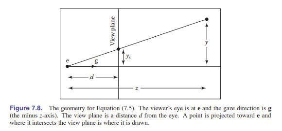
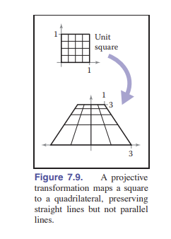

### 例子

下面的矩阵：

$$
\left [ \begin{matrix}
    2 & 0 & -1 \\
    0 & 3 & 0 \\
    0 & \frac{2}{3} & \frac{1}{3} \\
    \end{matrix} \right ]
$$

代表了一个二维投影变换，它能将单位正方形 $([0,1]\times [0,1])$ 转换为 [图 7.9] 中的梯形（透视变换后的形状）。

我们找一个点来具体看一下： $(1,0)$ 这个点，在计算的时候会被表示为 $[1 \ 0 \ 1 ]^T$ 。然后进行转换，如下：

$$
\left [ \begin{matrix}
    2 & 0 & -1 \\
    0 & 3 & 0 \\
    0 & \frac{2}{3} & \frac{1}{3} \\
    \end{matrix} \right ]\left [ \begin{matrix}
    1 \\
    0 \\
    1 \\
    \end{matrix} \right ] = \left [ \begin{matrix}
    1 \\
    0 \\
    \frac{1}{3} \\
    \end{matrix} \right ]
$$

由于额外量 $w = \frac{1}{3}$ ，所以我们将它进行缩放后得到的点是 $(3,0)$ 。同样的，这个缩放过程可以通过在矩阵 $\rm\textbf{M}$ 前面乘上系数 $c$ 得到，这时得到的结果也会按照 $c$ 倍缩放，不会影响结果。

有一种更优雅的方式来表达相同的意思，它能避免处理额外值 $w$ 。这种方法在三维投影变换中只算是 _四维线性变换_ 。它额外规定了所有标量倍数都指向同一点：

$$\rm\textbf{x} \sim \alpha \textbf{x}$$

符号 $\sim$ 读作“等价于”，意思是两个齐次向量都描述了空间内的同一个点。

## 7.3 透视投影

**关于透视变换我们需要做的是：**

1. **将视锥“挤压”成长方体**
2. **做一次正交投影**

投影变换的机制让 **实现透视图所需要的除以 $z$ 步骤** 变得简单。如同 [图 7.8] 所示，我们可以用矩阵变换来实现透视投影，如下：

$$
\left [ \begin{matrix}
    y_s \\
    1 \\
    \end{matrix} \right ] \sim \left [ \begin{matrix}
    d & 0 & 0 \\
    0 & 1 & 0 \\
    \end{matrix} \right ]\left [ \begin{matrix}
    y \\
    z \\
    1 \\
    \end{matrix} \right ]
$$

这个变换的作用是将二维齐次向量 $[y \ z \ 1]^T$ 转化成一维齐次向量 $[dy \ z]^T$ 。也就是代表了一维（数轴）上的点 $(\frac{dy}{z})$ （这是因为化成齐次坐标后的第二个量是 **1** ，所以需要同除 $z$ ）。

对于三维的“标准的”透视投影，我们使用以往的惯例，让相机在原点，朝向 $-z$ 方向。与正交投影一样，我们也采用了相同的标记方式来标记近平面和远平面。在这一节中，我们将使用近平面作为投影平面，所以图像平面的距离是 $-n$ 。

> 别忘了 $n<0$ 。

然后，所需的映射是 $y_s = \frac{n}{z}y$ ，对于 $x$ 也是同样。那么这样的变换就可以写出矩阵形式：

> 为什么是这个式子？因为近平面上的长度是被“挤压”之后的， $x,y$ 会变成 $x',y'$ 。

所以，我们需要如下的变换：

$$
{\rm\textbf{M}_{persp\to orth}}\left [ \begin{matrix}
    x \\
    y \\
    z \\
    1 \\
    \end{matrix} \right ] \Rightarrow \left [ \begin{matrix}
    \frac{nx }{z}\\
    \frac{ny }{z}\\
    ? \\
    \frac{1 }{z} \\
    \end{matrix} \right ] = \left [ \begin{matrix}
    nx \\
    ny \\
    ? \\
    z \\
    \end{matrix} \right ]
$$

而且，我们观察到，在近平面上的点经过变换后，是不会变的：

$$
{\rm\textbf{M}_{persp\Rightarrow orth}}\left [ \begin{matrix}
    x \\
    y \\
    n \\
    1 \\
    \end{matrix} \right ] \Rightarrow \left [ \begin{matrix}
    x \\
    y \\
    n \\
    1 \\
    \end{matrix} \right ] = \left [ \begin{matrix}
    nx \\
    ny \\
    n^2 \\
    n \\
    \end{matrix} \right ]
$$

再且，远平面中心在进行变换之后的点不变：而且，我们观察到，在近平面上的点经过变换后，是不会变的：

$$
{\rm\textbf{M}_{persp\Rightarrow orth}}\left [ \begin{matrix}
    0 \\
    0 \\
    f \\
    1 \\
    \end{matrix} \right ] \Rightarrow \left [ \begin{matrix}
    0 \\
    0 \\
    f \\
    1 \\
    \end{matrix} \right ] = \left [ \begin{matrix}
     0 \\
    0 \\
    f^2 \\
    f \\
    \end{matrix} \right ]
$$

根据矩阵乘法，我们得到下面的矩阵：

$$
{\rm\textbf{P}} = {\rm\textbf{M}_{persp\Rightarrow orth}} =  \left [ \begin{matrix}
    n & 0 & 0 & 0 \\
    0 & n & 0 & 0 \\
    0 & 0 & n+f & -fn \\
    0 & 0 & 1 & 0 \\
    \end{matrix} \right ]
$$

第一、二、四行实现了透视方程的作用。第三行正如在正交变换和视口变换矩阵中的那样，是为了让 $z$ 值“上车”，以便之后使用 $z$ 值判断那些曲面被覆盖了不需要显示。然而，在透视投影中，我们添加了一个额外量的数乘，而不是常量，这会丢失原来的 $z$ 值——但实际上 $x,y$ 变了， $z$ 不可能不变。相反，在近平面和远平面上的点，我们选择保持 $z$ 值不变。

> 等会就讲到了，听我说你先别急。

有很多矩阵都可以用作透视矩阵，而它们无一例外都会非线性地扭曲 $z$ 坐标， [图 7.12] 和 [图 7.13] 的矩阵展现出了良好的特性：它能将 $z=n$ 这个平面（近平面）上的所有点留下不做处理，同时能够对 $z=f$ 这个平面（远平面）上的点在 $x$ 和 $y$ 维度上适当做“伸缩”处理。矩阵对该点的影响如下：

$$
{\rm\textbf{P}}\left [ \begin{matrix}
    x \\
    y \\
    z \\
    1 \\
    \end{matrix} \right ] = \left [ \begin{matrix}
    nx \\
    ny \\
    (n+f)z-fn \\
    z \\
    \end{matrix} \right ] \sim \left [ \begin{matrix}
    \frac{nx}{z} \\
    \frac{ny}{z} \\
    n+f-\frac{fn}{z} \\
    1 \\
    \end{matrix} \right ]
$$

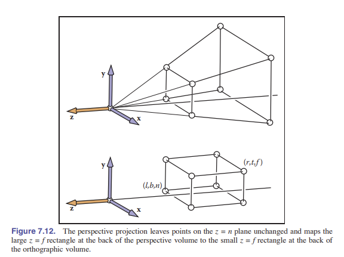
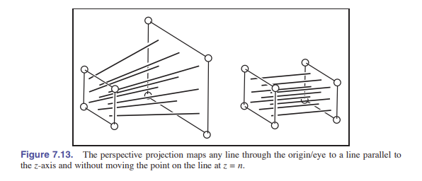

如你所见， $x$ 和 $y$ 是按照 $z$ 的比例来进行缩放的。因为 $n$ 和 $z$ 都是负值，所以 $x$ 和 $y$ 没有“翻转”。虽然不太明显，但这个变换保留了 $z=n$ 和 $z=f$ 之间的 $z$ 值的相对顺序，便于我们之后对 $z$ 进行深度排序，这是我们之后计算被遮挡的曲面所需要的重要信息。

有些时候我们会想要对矩阵 ${\rm\textbf{P}}$ 求逆。例如，当需要将屏幕坐标加上 $z$ 值，并转换回原始空间的时候。 ${\rm\textbf{P}}$ 的逆如下：

$$
{\rm\textbf{P}}^{-1} = \left [ \begin{matrix}
    \frac{1}{n} & 0 & 0 & 0 \\
    0 & \frac{1}{n} & 0 & 0 \\
    0 & 0 & 0 & 1 \\
    0 & 0 & -\frac{1}{fn} & \frac{n+f}{fn} \\
    \end{matrix} \right ]
$$

> 严格意义上来说这不是 ${\rm\textbf{P}}$ 的逆矩阵。但是这是 ${\rm\textbf{P}}$ 所表示的转换的逆操作。

齐次向量乘以标量不会影响它的意义。所以矩阵可以更好看一些：

$$
{\rm\textbf{P}}^{-1} = \left [ \begin{matrix}
    f & 0 & 0 & 0 \\
    0 & f & 0 & 0 \\
    0 & 0 & 0 & fn \\
    0 & 0 & -1 & n+f \\
    \end{matrix} \right ]
$$

回看我们讲过的正交投影矩阵 ${\rm\textbf{M}_{orth}}$ ，透视矩阵仅仅起到了将视锥体（被削了脑袋的金字塔状）映射到正交投影体（轴对齐的盒状）的功能。但透视矩阵的牛逼之处在于我们一使用它，就可以通过正交变换来得到 _标准立方体_ 。因此，所有的正交变换都适用，并且我们只是添加了一个矩阵和一个除以 $w$ 的操作而已。而且，我们没有浪费这个 $4\times 4$ 矩阵的最后一行！

将 ${\rm\textbf{P}}$ 和 ${\rm\textbf{M}_{orth}}$ 进行组合，就得到了 _透视投影矩阵_ 。

$${\rm\textbf{M}_{per}} = {\rm\textbf{M}_{orth}}{\rm\textbf{P}}$$

**但还有一个问题：** 如何确定透视图中的 $l,r,b,t$ ？它们定义了我们看到的窗口的大小。 **答案是：** 由于透视矩阵没有改变 $z=n$ 平面（近平面）的 $x,y$ 值，所以我们只需要通过该平面确定它们的值即可。

为了把这个透视矩阵整合到我们研究的 _正交结构_ 中去，我们只需要将原来的 ${\rm\textbf{M}_{orth}}$ 简单改为 ${\rm\textbf{M}_{per}}$ 即可。所以完整的透视投影一条龙服务矩阵是：

$${\rm\textbf{M}} = {\rm\textbf{M}_{vp}} {\rm\textbf{M}_{orth}} {\rm\textbf{P}}{\rm\textbf{M}_{cam}}$$

伪代码也很相似：

```c++
construct M_vp
construct M_per
construct M_cam
M = M_vp * M_per * M_cam

for each line segment(a_i,b_i) do{
    p = M_ai
    q = M_bi
    drawline(x_p/w_p, y_p/w_p, x_q/w_q, y_q/w_q)
}
```

注意，除了附加矩阵有变化之外，还变了齐次坐标的除法因子 $w$ 。

乘出来之后的矩阵是这样的：

$$
{\rm\textbf{M}_{per} }= \left [ \begin{matrix}
    \frac{2n}{r-l} & 0 & \frac{l+r}{l-r} & 0 \\
    \\
    0 & \frac{2n}{t-b} & \frac{b+t}{b-t} & 0 \\
    \\
    0 & 0 & \frac{n+f}{n-f} & \frac{2fn}{f-n} \\
    \\
    0 & 0 & 1 & 0 \\
    \end{matrix} \right ]
$$

这种矩阵或类似的矩阵经常出现在文档中，当人们发现它们一般来说表示的是几个简单矩阵的乘积时，它们就不那么神秘了。

### 重要例子

许多 API，如 _OpenGL_ 使用与本文所示相同的视图立方体。它们通常还让用户指定 $n$ 和 $f$ 的绝对值。OpenGL 的投影矩阵是：

$$
{\rm\textbf{M}_{per} }= \left [ \begin{matrix}
    \frac{2|n|}{r-l} & 0 & \frac{l+r}{l-r} & 0 \\
    \\
    0 & \frac{2|n|}{t-b} & \frac{b+t}{b-t} & 0 \\
    \\
    0 & 0 & \frac{|n|+|f|}{|n|-|f|} & \frac{2|f||n|}{|f|-|n|} \\
    \\
    0 & 0 & -1 & 0 \\
    \end{matrix} \right ]
$$

其他的 API 通常将 $n$ 设置为 0， $f$ 设置为 1。 _Blinn_ 建议将标准视体设置为 $\left [ 0,1 \right ]^{3}$ 以提高效率。所有这些决策都会稍微改变投影矩阵的格式。

## 7.4 透视变换的一些性质

透视变换的一个重要性质是，它将线段转化成线段，平面转化成平面。此外，它将视图立方体中的线段转化成标准立方体中的线段。为了更好的理解，看下面这个线段：

$${\rm\textbf{q}}+t({\rm\textbf{Q}-\textbf{q}})$$

当它被一个 $4\times 4$ 矩阵 $\rm\textbf{M}$ 转换时，它还是一个齐次坐标的动点：

$${\rm\textbf{M}}{\rm\textbf{q}}+t({\rm\textbf{MQ}}-{\rm\textbf{Mq}}) \equiv {\rm\textbf{r}}+t({\rm\textbf{R}}-{\rm\textbf{r}})$$

因此，这个齐次化的点分布在：

$$\frac{\rm\textbf{r}+\it t{(\rm\textbf{R}-\textbf{r})}}{w_r+t(w_R-w_r)}$$

如果我们能把上面这个式子写成下面这样的形式：

$$\frac{\rm\textbf{r}}{w_r}+f(t) \left(\frac{\rm\textbf{R}}{w_R} -\frac{\rm\textbf{r}}{w_r} \right)$$

那么就能证明所有齐次化的点都在一条线段上。让我们摁解，得到下面这个形式：

$$f(t)=\frac{w_Rt}{w_r+t(w_R-w_r)}$$

结果表明，线段的映射依然是保留所有点顺序的线段。也就是，经过变换后，线段上的点并不会被重新排序或“撕裂”。

将线段转换为线段的一个副产品是，三角形进行变换时，边和顶点会转化成另外一个三角形的边和顶点。因此，三角形转换后仍是三角形，平面也依旧是平面。

## 7.5 视野（FoV）

尽管我们可以使用 $(l,r,b,t)$ 和 $n$ 来指定一个视窗，但有些时候我们会希望以一种更简单的方式描述它：从它的中心查看，这也意味着：

$$l=-r$$

$$b=-t$$

与此同时，如果我们添加了像素必须为正方形的规定，也就是图像中没有 _形状失真_ ，那么 $r$ 与 $t$ 的比率应该是和水平像素与垂直像素的比率相同。

$$\frac{n_x}{n_y} = \frac{r}{t}$$

当已经给出了 $n_x$ 和 $n_y$ 后，那么只有一个自由变量（离视窗的远近）了。我们通常使用 _视野 Fov_ ，单位为角度 $\theta$ 来描述。这有时也会被称为 _垂直视野_ 。用于区分这个角度到底是与左右相比产生的还是对角线相比产生的。由图可见，垂直视野是：

$$\tan \frac{\theta}{2} = \frac{t}{|n|}$$

## 常见问题

- **_正交变换在实践中用处大吗？_**

  它在判断 _相对长度_ 的时候很有用。同时，它也能简化透视图，因为透视图在医疗可视化领域中成本过高。

- **_我使用图形 API 画出了一个镶嵌球体，但看上去像个椭圆。这是 bug 吗？_**

  不，这是对的。如果你把眼睛也放在相同的角度，它看起来也会像椭圆，这是角度问题。

- **_透视矩阵使用反向操作把正值 $z$ 转换成了负值 $z$ ？这会导致问题吗？_**

  是这样的，转换的方程是：
  $$z' = n+f-\frac{fn}{z}$$
  所以 $z = +\epsilon$ 会被转换成 $z' = -\infty$ ， $z = -\epsilon$ 会被转换成 $z' = \infty$ ( $\epsilon$ 指足够小的数 )。因此所有跨越 $z=0$ 的线段将会被“撕裂”，尽管所有点的投影位置是正确的。当所有的对象都在视图立方体内时，这样的撕裂并没有甚么关系。我们可以通过“切分”视图立方体来解决这个问题。然而，由于有撕裂现象，切分操作会变得更复杂（详见 [第 8 章] ）。

- **_透视矩阵更改了齐次坐标的值。这难道不会使移动和缩放变换用不了吗？_**

  对一个齐次坐标点应用透视矩阵后，我们有：

  $$
  \left [ \begin{matrix}
  1 & 0 & 0 & t_x \\
  0 & 1 & 0 & t_y \\
  0 & 0 & 1 & t_z \\
  0 & 0 & 0 & 1 \\
  \end{matrix} \right ]\left [ \begin{matrix}
  hx \\
  hy \\
  hz \\
  h \\
  \end{matrix} \right ] = \left [ \begin{matrix}
  hx+ht_x \\
  hy+ht_y \\
  hz+ht_z \\
  h \\
  \end{matrix} \right ]\xrightarrow{\rm homogenize}\left [ \begin{matrix}
  x+t_x \\
  y+t_y \\
  z+t_z \\
  1 \\
  \end{matrix} \right ]
  $$

  其他变换也有类似的效果。

# 第八章 图形管线

**前几张已经给我们打好了属性基础，我们可以接着做渲染中第二重要的事了：一个接一个在屏幕上渲染物体，也就是 _对象顺序渲染_ 。在光线追踪时，我们是寻找能够影响它颜色的物体，然后挨个考虑单个像素，但在这里不一样。我们现在是先挨个考虑几何体，然后寻找这个几何体能够影响的像素。在充满 _图元_ 的几何体中计算所有像素的过程被称为 _光栅化_ ，所以对象顺序渲染也可以称作 _光栅渲染_ 。进行该渲染所需的步骤序列——从几何体开始，到更新图像中的像素结束，被称为 _图形管线_ 。**

> **所有的图形系统都有一种或多种“原始物体”，它可以直接被处理，而且复杂的物体会被转化成这种简单物体的组合。它称为“图元”。三角形是用的最多的图元。**

> **基于光栅化的系统也叫 _扫描线着色_ 。**

**对象顺序渲染由于它效率特别高，获得了大成功。在大场景下，数据访问模式对性能影响巨大。而且，按顺序地访问场景中的物体来对像素着色，比在场景中一遍遍搜索物体要高效的多。**

**这章的标题暗示了对象顺序渲染只有一种方法。但实际上并不是这样——存在两个相当不同的图形管线，二者的目标也大相径庭。一个是通过采用 _OpenGL_ 和 _Direct 三维_ 等图形 API 的、支持 _交互式渲染_ 的硬件管线；另一种是电影摄制中采用的软件管线，支持 _RenderMan_ 等 API。硬件管线必须足够快，因为它要承担起运行实时游戏、可视化、用户界面的工作，而软件管线（生产管线）必须以最高质量渲染动画和视觉效果，并且这样的渲染应支持大场景，但这样会消耗更多的时间。尽管不同的目标产生了不同的设计思路，但大多数的管线还是有很多相同点。本章将致力于讲解它们的共同点的基础知识，并且稍微偏向硬件管线一些。**

**对象顺序渲染中所需的工作可以被组织为光栅化、光栅化前的几何操作，以及光栅化后的像素操作三个步骤。最常见的几何操作包括前两章学的 _矩阵变换_ ，如将空间的点从物体空间变换到屏幕空间，这样光栅化器的输入格式就是 _像素坐标_ 或者 _屏幕坐标_ （screen space）表示。最常见的像素操作则是隐藏面移除（hidden surface removal），该操作使离观察者更近的表面出现在更远的表面的前方。上述每个阶段还包括了更多的其他操作，这些操作通过相同的通用步骤，从而共同实现了多样化的渲染效果。**

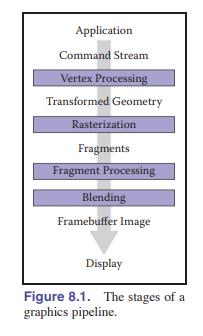

**本章我们将讨论图形管线的四个阶段（如 [图 8.1] ）。几何物体通过交互型应用或者场景描述文件进入管线，而这些几何图形通常由 _顶点集_ 表示。顶点在 _顶点处理阶段_ 被处理，然后由这些顶点产生的 _图元_ 被送到 _光栅化阶段_ 。光栅化器将每个图元分解为一定数量的 _片元_ ，每个被图元覆盖的像素会分配到一个片元。片元在 _片元处理阶段_ 被处理，之后每个像素对应的片元在 _片元混合阶段_ 被组合。**

**我们会从光栅化开始讨论，然后描述在几何阶段和像素阶段分别需要做甚么事情。**

## 8.1 光栅化

光栅化是对象顺序渲染的中心步骤，也是所有图形管线的核心。对于进入的每个图元，光栅器有两个工作：其一是枚举所有被该图元覆盖的像素，其二是对图元中的各个属性进行 **插值** ，插值的目的后面会举例子说明。光栅化器的输出是一系列 **片元** 。每个片元带着自己的属性值们“居住”在一个特定的像素位置上。

> 在不做多重采样抗锯齿（MSAA）时，我们认为一个片元就是一个像素。

这一章中，我们将展示三维场景的光栅化，使用这种光栅化器来渲染三维场景。虽然二维也采用相同的光栅化方法，但如今越来越倾向于采用三维图形系统来包干所有二维的工作。

### 8.1.1 画线

大多数图形工具包都有一个画线命令，这个命令接收两个端点（屏幕坐标）作为参数，见 [图 3.10] ，然后在它们之间画一条线。对于一般的两个端点 $(x_0,y_0)$ 和 $(x_1,y_1)$ ，该 **例程** 需要在这两个点之间绘制一些“合理的”像素，让它们能近似的表示线段。画线的方法基于直线方程，而方程有两种形式可选：隐式方程或参数方程。本章使用隐式方程。

> 尽管我们经常使用整数值端点举例子，但实际上任意的点都应该被支持。

#### 使用隐式方程画线

最常用的画线方法是 _中点算法_ 。中点算法和 _Bresenham 直线算法_ 都能画出相同的直线，但中点算法更直观。

> 译者注：链接：[Bresenham 直线算法](https://zhuanlan.zhihu.com/p/302806158#:~:text=Bresenham%E7%9B%B4%E7%BA%BF%E7%AE%97%E6%B3%95%E6%98%AF%E5%9B%BE%E5%BD%A2%E5%AD%A6%E4%B8%AD%E7%9A%84%E7%BB%8F%E5%85%B8%E7%94%BB%E7%9B%B4%E7%BA%BF%E7%9A%84%E7%AE%97%E6%B3%95%E3%80%82,%E7%9C%9F%E5%AE%9E%E7%9A%84%E7%9B%B4%E7%BA%BF%E6%98%AF%E8%BF%9E%E7%BB%AD%E7%9A%84%EF%BC%8C%E4%BD%86%E6%98%AF%E8%AE%A1%E7%AE%97%E6%9C%BA%E6%98%BE%E7%A4%BA%E7%9A%84%E7%B2%BE%E5%BA%A6%E6%9C%89%E9%99%90%EF%BC%8C%E4%B8%8D%E5%8F%AF%E8%83%BD%E7%9C%9F%E6%AD%A3%E6%98%BE%E7%A4%BA%E8%BF%9E%E7%BB%AD%E7%9A%84%E7%9B%B4%E7%BA%BF%EF%BC%8C%E4%BA%8E%E6%98%AF%E5%9C%A8%E8%AE%A1%E7%AE%97%E6%9C%BA%E4%B8%AD%E6%88%91%E4%BB%AC%E7%94%A8%E4%B8%80%E7%B3%BB%E5%88%97%E7%A6%BB%E6%95%A3%E5%8C%96%E5%90%8E%E7%9A%84%E7%82%B9%EF%BC%88%E5%83%8F%E7%B4%A0%EF%BC%89%E6%9D%A5%E8%BF%91%E4%BC%BC%E8%A1%A8%E7%8E%B0%E8%BF%99%E6%9D%A1%E7%9B%B4%E7%BA%BF%EF%BC%8C%E5%A6%82%E4%B8%8B%E5%9B%BE%E6%89%80%E7%A4%BA%E3%80%82%20%E5%9C%A8%E6%9C%AC%E6%96%87%E4%B8%AD%E6%88%91%E4%BB%AC%E5%AE%9E%E7%8E%B0%E4%B8%80%E4%B8%AA%E7%AE%80%E5%8D%95%E7%9A%84%E7%9B%B4%E7%BA%BF%E7%AE%97%E6%B3%95%EF%BC%8C%E5%B9%B6%E9%80%90%E6%AD%A5%E4%BC%98%E5%8C%96%EF%BC%8C%E6%9C%80%E7%BB%88%E5%BC%95%E5%87%BA%E7%BB%8F%E5%85%B8%E7%9A%84Bresenham%E7%9B%B4%E7%BA%BF%E7%AE%97%E6%B3%95%EF%BC%8C%E5%B9%B6%E8%AF%A6%E7%BB%86%E8%AE%B2%E8%A7%A3Bresenham%E7%9B%B4%E7%BA%BF%E7%AE%97%E6%B3%95%E7%9A%84%E6%AD%A5%E9%AA%A4%E5%92%8C%E5%8E%9F%E7%90%86%E3%80%82)

我们要做的第一件事是找到那两个点对应的隐式方程：

$$f(x, y) ≡ (y_0 − y_1)x + (x_1 − x_0)y + x_0y_1 − x_1y_0 = 0.$$

我们假设 $x_0 < x_1$ 。如果实际上不符合，那么我们交换两个点。那么直线的斜率是：

$$m = \frac{y_1-y_0}{x_1-x_0}$$

下面的讨论假设了 $m \in (0,1]$ ，对于区间 $(-\infty,-1]$ 和 $(-1,0]$ 和 $(1,\infty)$ 是相似的，可以由之前的例子进行推广。

对于 $(0,1]$ 的例子，直线比较“平坦”。也就是 $x$ 比 $y$ 移动地快。如果有一个 API 的 $y$ 轴朝下，我们可能会担心这会让我们的工作变难，但实际上这个细节完全可以忽略。我们可以忽略几何的“上下”，因为不管咋样，数值都是一样的。中点算法的关键假设是：画出中间没有断开的、最细的线（像素沿对角线排列不算断开）。

从左到右的像素绘制过程中，只有两种情况：右边的像素比左边高一格，或是一样高。因此，线段上每一列都只会由一个像素。如果没有像素，那么就是出现了断开，如果有两个以上，这个地方就太粗了。相对的，一行内可能出现不止一个像素。见 [图 8.2] 。

针对 $m \in (0,1]$ 的重点算法首先会确定最左边的像素和最右边的像素的 $x$ **值（列号）** 。然后不断从左向右循环，确定每个像素的 $y$ **值（行号）** 。伪代码如下：

```c++
y = y0
for x = x0 to x1 do
    draw(x, y)
    if (some condition) then
        y = y + 1
```

注意这里的 $x$ 和 $y$ 是整数。上面的代码用文字描述是：“从左到右依次绘制像素，并且有时候向上一格”。打造一个高效的判断方式取决于 _if_ 里面的语句。

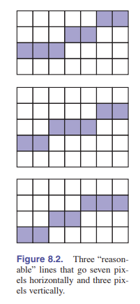 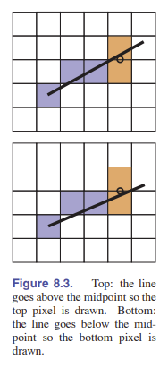

有一种高效的判断方式是考虑两个端点像素中心的中点。具体地说，刚被绘制的 $(x,y)$ 位置的像素在真实屏幕上的位置是 $(x,y)$ ，那么下一个该绘制的像素只可能是 $(x+1,y)$ 或 $(x+1,y+1)$ 。而两个候选点的中点是 $(x+1,y+0.5)$ 。如果线段通过这个点的下方，那么选取 $(x+1,y)$ ，否则就选取 $(x+1,y+1)$ 。如 [图 8.3] 。

为了判断直线到底是在 $(x+1,y+0.5)$ 的上方还是下方，我们计算上面公式的 $f(x,y+0.5)$ 。按照它的符号来确定点相对于直线的位置。由于 $-f(x,y)=0$ 和 $f(x,y)=0$ 都是正确的直线方程，所以我们还不能马上确定什么符号对应着什么样的位置关系。但是我们可以通过系数判断出来：注意到 $y$ 的系数是 $(x1-x0)$ ，由于我们已经假设了 $x1>x0$ ，因此该系数为正，这意味着当 $y$ 不断增加时， $(x1-x0)y$ 也在增加，因而 $f(x,+\infty)$ 必然为正，且在直线上方，这说明直线上方的点在 $f(x,y)$ 的取值都为正。另外一种判断方法是看梯度向量的 $y$ 分量是否为正。这意味着我们现在能够完善 _if_ 语句的内容了:

```vb
if f(x + 1, y + 0.5) < 0 then
    y = y + 1
```

上述代码可以用于斜率在 0 到 1 之间的情况。读者可能自己找出其他三种情况的方法，它们只有微小的不同。

如果我们想要执行更高效，那么可以采用 _增量式方法_ 。其中有一种增量式方法尝试通过复用前一轮的计算结果，使得循环变得更加高效。在中点算法中，主要的计算是 $f(x+1,y+0.5)$ 。注意到在循环内部，循环第一轮之后，对于当前的 $(x,y)$ ，我们已经在上一轮循环计算过了 $f(x-1,y+0,5)$ 或者 $f(x-1,y-0.5)$ 的值。

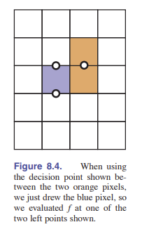

注意到如下关系：

$$f(x + 1, y) = f(x, y)+(y_0 − y_1)$$

$$f(x + 1, y + 1) = f(x, y)+(y_0 − y_1)+(x_1 − x_0).$$

这就能让我们写出增量式方法的代码：

```c++
y = y0
d = f(x0 + 1, y0 + 0.5)
for x = x0 to x1 do
    draw(x, y)
    if d < 0 then
        y = y + 1
        d = d + (x1 − x0)+(y0 − y1)
    else
        d = d + (y0 − y1)
```

该算法相比于原来的算法速度更快，因为它与之前的代码相比几乎没有 _设置成本_ 。但是也可能会因此积累更多的误差，因为 $f(x,y+0.5)$ 的计算是通过一系列值相加得到的，误差也会累加。不过只要直线不是特别长，误差的影响不大。我们稍微增加一些 _设置成本_ ，可以将循环执行的更快：也就是将 $(x_1-x_0)+(y_0-y_1)$ 和 $y_0-y_1$ 提前算好，就可以在循环中不必重复计算。但如果代码很重要，那么需要检查编译后的代码来确保写的代码没有问题。

> 译者注：此处可阅读《深入理解计算机系统》来探究程序的优化方式。 ——— 黑书の抛瓦！

### 8.1.2 三角形的光栅化

我们经常会需要通过三个二维屏幕坐标：${\rm\textbf{p}_0}=(x_0,y_0), \ {\rm\textbf{p}_1}=(x_1,y_1), \ {\rm\textbf{p}_2}=(x_2,y_2)$ 来绘制二维三角形。这和画线比较相似，但它有一些独有的特征。我们可能会想要根据顶点的颜色或是其他属性来做插值，而插值实际上有了 **重心坐标** 的帮助变得很直观了（见 [2.7 节] ）。举个例子。如果三个顶点的颜色分别是 $\rm\textbf{c}_0$ , $\rm\textbf{c}_1$ , $$ ，那么在三角形内某一点 $(\alpha,\beta,\gamma)$ 的颜色就是：

$${\rm\textbf{c}} = \alpha {\rm\textbf{c}_0} + \beta{\rm\textbf{c}_1}+ \gamma {\rm\textbf{c}_2}$$

上述插值的方法称作 _Gouraud 插值法 (亮度插值法)_ 。

三角形光栅化的另一个微妙的地方在于，我们往往需要对共享顶点和边的三角形做光栅化。这意味着我们需要在不出现漏空的前提下对这些三角形进行光栅化。我们可以运用 **中点算法** 画出每个三角形的边，然后填充它们内部的像素。这意味着相邻的三角形会在它们的边上绘制相同的像素。如果相邻的三角形具有不同的颜色，那么渲染出来的公共边的图像效果将由后绘制的三角形决定。避免这种顺序问题、并消灭漏空的最常用方法是：只画那些像素中心在三角形内部的像素，换句话说就是只绘制那些像素中心在 $(0,1)$ 区间内的像素。但这样又会产生另外一个问题：如果中心刚好就在三角形的边上，那该怎么办？我们在之后会讨论这个问题，它有好几种解决方案。我想说的关键在于，重心坐标给了我们判断是否画一个像素、以及通过顶点插值得到像素颜色的方法。因此，光栅化三角形的问题就能被归结为：如何高效的找到像素中心的坐标。暴力光栅化算法如下：

```c++
for all x do
    for all y do
        compute (α, β, γ) for (x, y)
        if (α ∈ [0, 1] and β ∈ [0, 1] and γ ∈ [0, 1]) then
            c = αc0 + βc1 + γc2
            drawpixel (x, y) with color c
```

下面的算法将外层循环的候选像素限制在一个较小的集合里，使得重心坐标的计算更加高效。

> 为了一个小三角形遍历整个屏幕，是不是太浪费了？！

我们可以通过找到三角形的 **_包围盒_** ，并且只考虑矩形内的像素来提升算法效率。于是我们得到如下算法：

```c++
x_min = floor(x_i)
x_max = ceiling(x_i)
y_min = floor(y_i)
y_max = ceiling(y_i)
for y = y_min to y_max do
    for x = x_min to x_max do
        α = f_12(x, y)/f_12(x0, y0)
        β = f_20(x, y)/f_20(x1, y1)
        γ = f_01(x, y)/f_01(x2, y2)
        if (α > 0 and β > 0 and γ > 0) then
            c = α*c_0 + β*c_1 + γ*c_2
            drawpixel (x, y) with color c
```

在这里， $f_{ij}$ 就是由两点得出的线段，由之前我们讲解的直线方程得到（之后还会用到这个约定）：

$$f_{01}(x, y)=(y_0 − y_1)x + (x_1 − x_0)y + x_0y_1 − x_1y_0,$$

$$f_{12}(x, y)=(y_1 − y_2)x + (x_1 − x_2)y + x_1y_2 − x_2y_1,$$

$$f_{20}(x, y)=(y_2 − y_0)x + (x_0 − x_2)y + x_2y_0 − x_0y_2,$$

请注意，我们使用重心坐标的时候没有判断 $\alpha$ 的正负，而是直接默认 $\alpha>0$ 。因为如果三个重心坐标都是正数，那么它们就能天然满足小于 $1$ 的条件，因为重心坐标之和为 $1$ 。我们也可以只计算两个坐标，通过等式计算出第三个，但是在采用了增量式算法时这不确定能不能变得更加高效；每次计算 $\alpha,\beta,\gamma$ 时都会计算形如 $f(x,y)=Ax+By+C$ 的式子，在里面那层循环中，只有 $x$ 产生变化，每次变化 $1$ 。同时注意到 $f(x + 1, y) = f(x, y) + A$ ，这个式子是增量式算法的基础。

在外层循环中，则是考虑 $f(x,y)$ 到 $f(x,y+1)$ 的变化。因此也能够通过增量式算法获取相似的效率提升。由于三个重心坐标在循环中都是按固定数变化，所以颜色 $\rm\textbf{c}$ 的变化也一样，因为它们都呈线性关系，故颜色也可以运用增量式算法。例如，坐标 $(x+1,y)$ 的 _红色值_ 和坐标 $(x,y)$ 的 _红色值_ 相差的常数值能够被提前计算出来。三角形颜色插值的一个例子，如 [图 8.5] 。

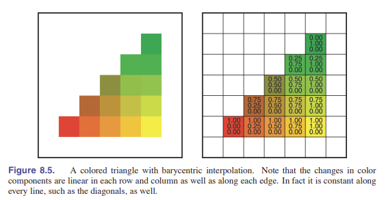 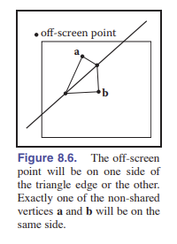

#### 处理三角形边界上的像素

我们还妹有讨论对三角形边界穿过的像素点该做 ♂ 点什么。如果一个像素恰好在三角形的边上，如果旁边还有一个三角形，那么他就会处在公共边上。公共边不能轻易的被归到某个三角形上。不画这个像素是最差的选择，这样就会出现漏空。给两个三角形都绘制像素的方法，如果三角形是透明的，会导致双重着色，所以这个方法比上不足比下有余。我们还是希望能把这个像素判给某个三角形，同时方法越简单越好；选择哪个三角形并不重要，但方法好就可以。

有一种解决方案：我们注意到，任何在屏幕坐标外的点必定会在三角形公共边的某一侧。对于两个不重叠的、有公共边的三角形，单独剩下来的那两个顶点一定在边的两侧，同时肯定有其中的一个点是和 _离屏点_ 在同一侧的（见 [图 8.6] ）。上面所说的是我们接下来要采用的神奇方法的原理。

测试方法将计算出离屏点和三角形孤儿顶点代入直线函数的取值，并将它们相乘。根据该乘积的符号决定将公共边算到哪个三角形头上，符号的选择是任意的，本文选择正号。

注意，上述测试不是完美的，因为线段所在的直线也有可能通过选择的离屏点，这样代入取值就是 **0** 。但我们至少大大减少了出问题的情况。使用哪个离屏点是随意的，一般来说 $(-1,-1)$ 是一个不错的选择。但正是因此，我们需要增加一个检查离屏点是否刚好在边所在直线上的步骤。同时我们希望这个检查和判断内外的部分分离开来。于是有如下伪代码：

```c++
x_min = floor(x_i)
x_max = ceiling(x_i)
y_min = floor(y_i)
y_max = ceiling(y_i)
f_α = f12(x_0, y_0)
f_β = f20(x_1, y_1)
f_γ = f01(x_2, y_2)
for y = y_min to y_max do
    for x = x_min to x_max do
        α = f_12(x, y)/f_α
        β = f_20(x, y)/f_β
        γ = f_01(x, y)/f_γ
        if (α ≥ 0 and β ≥ 0 and γ ≥ 0) then
            if (α > 0 or f_α * f12(−1, −1) > 0) and
                    (β > 0 or f_β*f_20(−1, −1) > 0) and
                    (γ > 0 or f_γ*f_01(−1, −1) > 0) then
                c = α*c0 + β*c1 + γ*c2
                drawpixel (x, y) with color c
```

我们期望上面的代码能够解决漏空和重复着色的问题。实际上，如果两个共享顶点有相同的绘制顺序，直线方程就是相同的。否则的话会变个符号。如果编译器改变了渲染顺序，那么可能会因为这个符号出现问题。所以如果你需要一个健壮的程序，那就需要检查编译器的数学单元。同时，需要小心处理伪代码的前四行，因为有公共边刚好在像素中心的特殊情况。

除了实现增量式算法之外，还有一些可以让程序提前退出的点。例如，如果 $\alpha<0$ ，那么就没有必要计算 $\beta$ 和 $\gamma$ 了。这样提前退出可能可以让算法速度变快，我们可以使用性能分析工具 _ProfilingTools_ 来测量是否有性能提升，因为额外的分支也有可能影响流水线或并行性，拖慢运行速度。所以，如果代码很重要，那么我们需要测试所有力所能及的优化方案。

还有一点，就是上述代码的除法可能会出现除零的问题。比如： $f_\gamma = 0$ 。所以我们可以选择捕获浮点错误，或者设置一个检查措施。

### 8.1.3 裁剪

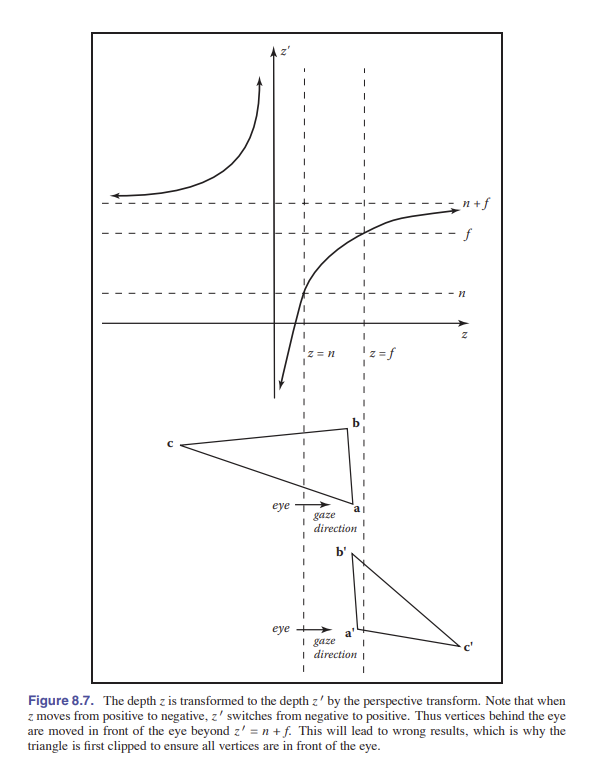

仅仅把图元变换到屏幕坐标并进行光栅化还不太够。因为视景体外，特别是眼睛后面的图元也有可能会被光栅化，导致结果出错。例如，考虑 [图 8.7] 中的三角形：有两个顶点在视景体内，而第三个顶点在眼睛后面。投影变换会将这个点映射到一个 _远平面_ 后面的不可视区域，如果这种操作被允许，三角形就没法被正确地光栅化。因此，光栅化之前需要进行 **裁剪操作** ，以移除图元能够延伸到眼睛后面的部分。

裁剪是图形学中的常规操作，只要一个几何体“切割”到了另外一个几何体就会用到裁剪。例如，如果你使用平面 $x=0$ 切割一个三角形，会将它分为两部分（只要三角形顶点的 $x$ 坐标符号不全相同）。在大多数裁剪的应用中，三角形中在平面的“错误”侧的部分将被抛弃。如 [图 8.8] 所示。

在给光栅化裁剪中，所谓的“错误”侧，也就是需要去掉的一侧是 _视体_ 外面的部分。在视体外的所有几何结构就算都裁剪掉都没啥关系——也就是裁剪掉视体六个平面之外的所有东西，但是有很多系统仅仅裁剪了近平面那一侧的物体。

> 译者注：这里的视体指视锥金字塔截掉前面部分的塔体。

我们将在这一节讨论裁剪模型的基本实现。而不是写一个工业级裁剪工具。

实现裁剪的最常用的两种方法是：

1. 在世界坐标中用视体的六个面进行裁剪（转换前裁剪）
2. 在四维转换空间中的 _齐次除法_ 之前裁剪

上述两种方法都能轻松实现(J. Blinn, 1996) ，对每个三角形应用以下步骤：

```c++
for each of six planes do
    if (triangle entirely outside of plane) then
        break (triangle is not visible)
    else if triangle spans plane then
        clip triangle
        if (quadrilateral is left) then
            break into two triangles
```

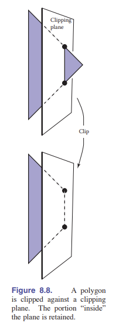

### 8.1.4 转换前裁剪（方法 1）

该方法有一个直接的实现。唯一需要解决的问题是： **六个平面方程是什么？** 由于这些方程对同一个图像中的所有三角形都相同，我们不需要非常高效的计算他们。因此，我们可以仅仅对 [图 5.11] 中的变换取逆，并将它应用于视体的八个顶点上：

$$
(x, y, z) =(l, b, n),\\
(r, b, n)\\
(l, t, n)\\
(r, t, n)\\
(l, b, f)\\
(r, b, f)\\
(l, t, f)\\
(r, t, f)
$$

平面方程可以从他们在世界坐标里的像推导出来。我们也可以用向量的几何性质来直接从 _视角参数_ （viewing parameters）得到。

### 8.1.5 齐次坐标的裁剪（方法 2）

但其实，我们一般采用的方法是在做除法之前，对齐次坐标做裁剪。在这里，视体是四维的，它被一个 _三维超平面_ 包围：

$$-x+lw = 0 \\$$

$$x-rw = 0 \\$$

$$-y+bw = 0 \\$$

$$y-bw = 0 \\$$

$$-z+nw = 0 \\$$

$$z-fw = 0 \\$$

这些平面的表达方式非常简单，所以用这个方法编写的程序效率比上个方法要好。算法可以进一步被优化，方法是将视体 $[l,r]\times [b,t] \times [f,n]$ 转换成 $[0,1]^3$ 空间中。其实这样做并没有比三维空间复杂多少。

### 8.1.6 对一个面进行裁剪

不管我们用哪种方式，我们都需要对面进行裁剪。还记得在 [2.5.5 节] 中，我们有一个对于某平面穿过点 $\rm\textbf{q}$ 的隐式方程：

$$f({\rm\textbf{q}}) = {\rm\textbf{n}} \cdot ({\rm\textbf{p}}-{\rm\textbf{q}}) = 0$$

这一般这样写：

$$f({\rm\textbf{q}}) = {\rm\textbf{n}} \cdot {\rm\textbf{p}}+D = 0$$

有趣的是，这个方程不止描述了三维平面，它也表示了二维的线，以及四维平面的 _体近似物（Volumn Analog）_ 。这些玩意儿在它们自己的维度中都叫做平面。

如果我们在 ${\rm\textbf{a}}$ 和 ${\rm\textbf{b}}$ 点之间有一个线段，我们就可以将它用一个平面来“裁剪”，使用的是 [12.4.3 节] 中的 _BSP 树_ 切割三角形的程序。这里， ${\rm\textbf{a}}$ 和 ${\rm\textbf{b}}$ 通过代入对 $f({\rm\textbf{a}})$ 和 $f({\rm\textbf{b}})$ 取值，看他们是不是一正一负，来判断这俩点是不是在平面的两侧。我们喜欢把 $f({\rm\textbf{q}})<0$ 定义为内侧。如果这条线段确实被隔开了，那么我们就可以将下式:

$${\rm\textbf{q}} = {\rm\textbf{a}}+t({\rm\textbf{b}}-{\rm\textbf{a}})$$

代入方程 $f({\rm\textbf{q}}) = 0$ ，得到：

$${\rm\textbf{n}} \cot ({\rm\textbf{a}}+t({\rm\textbf{b}}-{\rm\textbf{a}}))+D = 0$$

解出 $t$ ：

$$ t = \frac{{\rm\textbf{n}\cdot\textbf{a}}+D} { \rm{\textbf{n}} \cdot (\textbf{a}-\textbf{b})} $$

这样我们就能找到交点，然后将看不到的地方裁剪掉。

裁剪三角形，我们也可以通过 [12.4.3 节] 中的方法进行，得到一个或两个三角形。

## 8.2 光栅化之前和之后的操作

> 注：首先，一个用顶点描述的几何对象通过交互应用或者场景描述文件被扔进管线， **顶点处理** 对这些点（通过正交视图或者透视视图，注意视图主要处理 x、y 值，z 值用于后续的表面遮盖处理，所以后续的光栅化也是针对二维）处理成为 **图元（geometric primitive，一般为三角形）** ；接着，图元被送进 **光栅化阶段** ，光栅化器会将图元分解为许多 **片元** ，一个片元是一个像素的 3D 投射，其与像素有一样的属性，同时图元会覆盖每一个像素；然后，片元进入 **片元处理阶段** 进一步处理；最后片元与对应的像素在 **fragment blending stage（片元混合阶段）** 组合。

在一个图元被光栅化之前，它的顶点坐标必须是屏幕坐标，同时颜色之类的属性应该已经被插值，这些属性必须都是已知的。我们通过 _顶点处理（信息准备）_ 这一阶段完成数据的准备工作。在这个阶段，被送来的顶点们将依次经过模型、视图、投影变换，然后将它们的原始坐标转换成屏幕坐标（别忘了，屏幕坐标是以像素为单位的）。与此同时，其他的信息如颜色、表面法线或纹理坐标，会按需转换。我们在之后的例子会讨论这些属性怎么搞。

在光栅化之后，我们会进行进一步处理，也就是对每一个分片计算颜色和深度。这个过程可以很简单，只经过颜色插值和光栅化计算深度，或者也可以很复杂，包含复杂的着色操作。然后最后，会经过一个 _Blend 阶段_ ，它将
图元生成的多个分片进行组合，然后计算出像素的最终值。最常见的 Blend 方法是选取离眼睛最近（深度最小）的分片。

我们会提供不同阶段的例子以便理解。

### 8.2.1 简单的二维平面绘图

最简单的图形管线，在 **顶点处理** 和 **片元处理** 的时候啥也不做。在混合阶段，每个片元的颜色只是简单的覆盖之前那个片元的颜色。这个应用使用像素坐标直接提供图元，光栅化器做所有的工作。这样的安排在以前古老的图形 API 中很常见，一般这样的图形 API 是用来绘制 UI 之类的二维玩意儿的。如果图元的顶点都是一个颜色，那么我们就会以纯色填充。同时我们的模型光纤也支持使用颜色插值进行渐变色填充。

### 8.2.2 最小的三维图形管线

为了绘制三维空间中的物体，我们需要对二维的图像管线做一些改变。唯一需要改变的地方就是改变一个简单的转换矩阵： **顶点绘制阶段** 通过将 顶点位置坐标 和 之前模型-相机-投影-视口变换产生的矩阵 相乘，获得和二维空间中绘制方式相同的 _屏幕-空间三角形_ 。

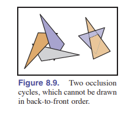
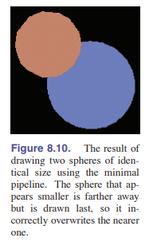

这存在一个小问题。我们的简单三维图形管线为了让绘制的前后关系正确（也就是让前面的覆盖后面的），需要从后往前渲染。这个方法就是 _画家算法_ 。先画最远，然后一步一步画近处的覆盖远处的。这个定理给了我们一个解决问题的思路，但仍会有一个问题：那就是——如果三个三角形相互交错（如 [图 8.9] ），那么画家定理就失效了，因为你不可能找得到正确顺序。而且最主要的是，给图元进行深度排序是很费时间的，尤其是大场景，会拖慢整个管线的速度。

### 8.2.3 使用深度缓冲（z-Buffer）隐藏表面

实际上，由于有 bug，画家定理并没有被广泛使用。我们通常使用一种简单有效的方法来移除隐藏的表面，这就是我们要讲的： **深度缓冲（z-Buffer）** 。方法很简单：对于每个像素，我们将它们离得最近的表面的信息留下，把远处的片元信息给丢掉。我们使用一个除了 RGB 值之外额外的值来存储深度。也就是深度（z 值）。深度缓冲区（z-Buffer）指的就是这个额外的值组成的像素网格。

深度缓冲算法是在 **混合阶段** 被实现的。 通过比较每个片元深度缓冲区的值，我们可以判断出哪个片元更近。如果更近，那么这个像素此时的颜色和深度值就会被新的值覆盖。但如果更远，那么我们就不管它了。为了保证第一个片元能够覆盖原始值，我们将深度的原始值设置成 MAX （MAX 是远平面的深度。或者一个足够大的值也可以）。这样不管是什么顺序渲染，我们都能显示出正确的渲染画面。

深度缓冲算法需要每个片元都携带一个深度值。那么我们就可以通过获取顶点的深度值，然后进行**插值**实现，就和我们处理颜色的道理一样。

深度缓冲的方法真是太好用辣！它提供了一种处理隐藏平面的简单实用的方法。这种方法比几何方法（几何方法是将曲面切成一片一片，然后按照深度排序）简单多了，因为这种方法不会弄出来新的问题要解决。深度信息只有、也只需要在确定像素的时候才用得到。深度缓冲在 _硬件图形管线_ 中被 **原生支持** ，同时也是软件管线的最常用方法。

#### 精度问题

在实际处理中，缓冲区存的深度值类型是 **非负整型** 。用整型比浮点数更好，因为在管线中，我们需要快速的内存交换，节约这些时间来优化图形管线，牺牲那么一点精确度是完全值得的。

但整型的使用会导致一些进精度问题。如果我们使用的整型有范围： $\{0,1,2, \cdots B-1\}$ ，我们就会将近平面的深度值设为 $0$ , 将远平面的深度设为 $B-1$ 。对了，这里的讨论我们假定 $z,n$ 和 $f$ 都是正的。尽管负的时候我们也有相同的解决办法。为了减少内存的用量， $B$ 越小越好，所以我们把深度 $z$ 值映射到一个桶： $\Delta z = (f-n)/B$ 中。

如果我们能分配 $b$ 个比特来存储深度值，那么 $B = 2^b$ 。我们在这里又要尽量使 $B$ 越大越好，为了能够清晰区分不同深度。

举个例子。如果你在渲染一个场景，而每个三角形的深度间隔都至少为 $1$ 米。那么设置 $\Delta z < 1$ 就可以显示正确的画面。缩小 $\Delta z$ 有两种办法：将近平面和远平面之间的间隔缩小；或者是将 $b$ 增大。在一般的 API 中，一般来说 $b$ 是固定的，我们只能调整远近平面的距离。

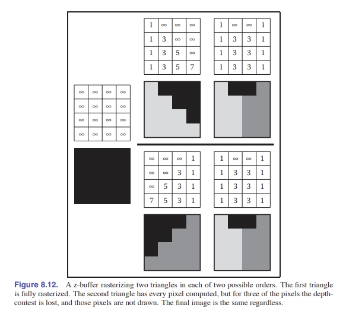

在生成透视图像时，深度值的精度设置必须小心。我们一般将 $\Delta z$ 用在透视除法之后。别忘了我们在 [7.3 节] 讲过的透视除法：

$$z = n+f-\frac{fn}{z_w}$$

在这里，实际的深度是 $z_w$（世界深度） 而不是 $z$ （除法后获得的深度）。我们可以通过将两个转换后平面的值相减来获得前后的深度差：

$$\Delta z \approx \frac{fn\Delta z_w}{z_w^2} $$

深度差的大小与深度坐标有关。在世界坐标下，前后深度差为：

$$\Delta z \approx \frac{z_w^2\Delta z}{fn}$$

请注意 $\Delta z$ 这个量是我们之前讨论的那个。深度最大值是 $z'=f$ 对应的那个。也就是：

$$\Delta z^{max}_w \approx \frac{f\Delta z}{n}$$

如果我们为了看到我们眼睛正前方的物体，取了近平面值 $n=0$，那么这个值就会变得无穷大——这是我们不想看到的。为了让 $\Delta z^{max}_w$ 越小越好，我们应该缩小 $f$ ，放大 $n$ 。因此，选择正确的 $n,f$ 值很重要。

### 8.2.4 逐顶点着色

目前为止，我们设计的这个程序需要给送进来的三角形图元确定颜色。光栅化器只做了 **颜色插值** 的工作，它将插值后的颜色直接输出。但是有些时候我们决定这样还不够，对于三维空间的物体着色，除了正确的颜色，我们还需要光照，这才是真正的着色过程。所以我们需要 [第 4 章] 学过的 **光照方程** 。别忘记，那个方程有一些参数：它需要 **光源方向** 、 **眼睛方向** 、 **表面法线** 来计算表面的颜色。

一种着色的计算方法在 **顶点处理阶段** 进行。应用程序会提供在顶点处的表面法向量，同时单独提供光源的位置和颜色（由于它对每个表面作用都是相同的，所以不需要每个顶点特意区分一下）。对于每个顶点，我们通过相机-光源-顶点的位置来联合判断观察者的方向和光源的方向。我们想要的着色方程，它的输出应该是一个颜色，这个颜色输出到光栅化器中，当作顶点颜色使用。像这样给顶点着色的方式，也被称作是 _高洛德着色_ 。

与此同时，我们需要确定在着色过程中使用哪种坐标。我们可以选择世界坐标，或是相机坐标。但不管使用什么坐标，我们都得确保这种坐标是 **正交** 的，因为其他的投影，如透视投影是会改变角度的，这样对着色过程会产生影响。如果我们使用相机坐标，那么有一个好处就是不用管相机位置了，因为它始终都在原点，在正交投影中，视角方向永远是 $+z$ 。

逐顶点着色也有一些弊端。比如它能渲染的最高精度就是 **图元** 。因为它是逐顶点处理，所以无法对更小的部分单独处理。若是有一个包含地板的房间需要着色，房间中间有一个光源，地板仅使用两个大三角形进行绘制。这样的话，我们会从地板的角落开始逐顶点绘制。这样在经过三个顶点的插值之后，地板中间的颜色会变得河南，明显是不真实的。再者，对于需要着色镜面高光的那些光滑表面，需要非常小的图元来进行着色，不然着色看上去就会非常虚假。

> 我们怎么知道顶点的法向量是什么？
>
> - 因为一个顶点的周边可能会有很多个三角形，我们可以将它旁边的三角形的法向量们做平均（简单平均或加权平均）
> - 使用重心坐标进行插值

[图 8.13] 展示了使用逐顶点着色的两个球体。

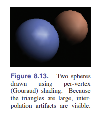
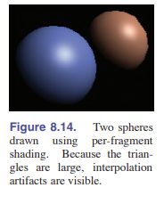

### 8.2.5 逐片元着色

> 我们也将这种着色称作 _Phong（冯）着色_ ，但它不基于布林-冯着色模型。

为了防止逐顶点着色插值引起的瑕疵，我们可以将 **插值** 这一步移动到 **着色** 这一步的 **前面**。在逐片元着色中，我们使用完全一样的方程。但该方程接收 以插值后的向量表示的片元 作为输入，而不是原来那样的顶点输入。

在逐片元着色中，着色所需要的各种参数是作为属性通过 **光栅化器** 传输的，所以在 **顶点处理** 阶段，我们需要和 **片元处理** 同步，并且正确的处理数据。有一种方法，是将相机空间中的表面法向量和相机空间中的顶点坐标进行插值，这样它们每个像素都会拥有一个属于自己的法线向量，就可以进行着色了。正如逐顶点着色的过程一样。

[图 8.14] 展示了使用逐片元着色的两个球体。

### 8.2.6 纹理映射

纹理（将在 [第 11 章] 讨论）是添加在着色表面的图像，它能给物体的表面添加额外的纹理细节，让它们看上去更加逼真。原理很简单——在着色计算完毕后，我们使用纹理中的颜色代替渲染出来的颜色即可。这一步叫 _纹理查找_ 。着色器会找到一个 _纹理坐标_ ，纹理映射负责找到那一个点的图像值，然后返回给着色器。在着色计算中会使用这个纹理值。

定义纹理坐标的一个最常用的办法是，将纹理坐标作为顶点的另外一个属性存在。这样每个图元就知道它在纹理的哪个地方了。

### 8.2.7 着色频率

着色计算应该在第几个步骤被执行？这个问题是由颜色变换的快慢（也就是需要的细节量）决定的。对大场景进行着色，比如光滑表面的漫反射，计算频率可以不必那么高，我们可以计算完之后进行 _插值_ 。这就是 **低着色频率** 。而对于那些小场景的着色，如高光着色、丰富的纹理着色，就需要 **高着色频率** 。如果我们需要在图像中能够清楚的看到某些细节，那么对于那些细节的着色频率就至少应该是 _每个像素着色一次_ 。

因此，大场景的视觉效果可以在 **顶点处理阶段** 进行安全的计算。虽然这样定义的图元挺大的，有好几个像素。但其实同样的，只要顶点在图像中比较密集，高着色频率也可以在顶点处理阶段进行计算；对于那些比较稀疏的顶点，那么可以放到 **片元处理阶段** 进行计算。

举个例子，在游戏中使用的实时渲染管线一般使用的图元是包含了好几个像素的，为了运行的更快。所以它的着色步骤一般就会在 **片元处理阶段** 。与此相对的， _PRMan_ （皮克斯公司的动画渲染器）这个系统会对每个顶点都做一次着色，在第一次切片后，所有的表面都会被切分成由“微多边形”构成，这个“微多边形”就是一个像素的大小。因为图元很小，这个场景就很适合使用 **逐顶点着色** 。

## 8.3 简单抗锯齿

就和光线追踪一样，光栅化也会导致 斜线/三角形边 产生锯齿，这和我们判断一条线经不经过像素没关系。实际上，我们这章讲的简单三角形光栅化，就是会产生锯齿的，所以也叫 _走样光栅化_ 。和光学追踪的解决方法一样，解决办法可以是允许像素被图元 **部分覆盖** ，这样做一些模糊会有助于优化视觉效果，如 [图 8.15] 所示。

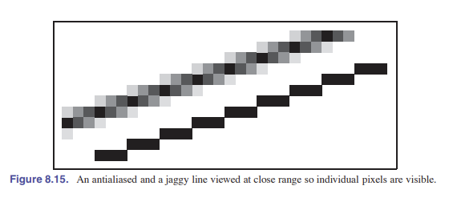

我们对于 _反走样_ ，也就是抗锯齿，有一些不同的实现方式。和光学追踪的操作一样，我们可以通过 _模糊_ ，也就是使用 _盒式滤波_ 对像素进行模糊化处理。这意味着我们定义的物体都有一块区域可供绘制。比如 [图 8.15] 就可以被认为是一种边缘宽度为 $1$ 的盒式滤波的结果.

> 有比盒式滤波更好的滤波器。但是对于大部分应用来说它已经够用了。

实现盒式滤波最简单的方法是通过 _超采样_ ：我们可以使用更高的分辨率绘制图像，然后将其降低分辨率。比如我们想要一个 $256\times 256$ 的图像，宽度是 $1.2$ 像素宽度，那么我们可以渲染一个 $1024\times 1024$ 的图像，然后将它 $4\times 4$ 的格子里取平均。这就是一种盒式滤波的类似操作，只要物体那些不是特别小，小到像素距离以内，它的效果就很好。

但是超采样很耗性能。因为导致走样的便基本上都是图元的边，而不是我们想象的因为颜色的突变产生走样。如果每个像素能存储多个遮盖和深度的信息，那么就算只有一种颜色计算出来，也能获得比较好的反走样效果。在 **逐顶点着色** 的系统中，如 RenderMan，我们可以简单通过超分辨率来实现，这种系统这样做开销不大，是因为逐顶点着色简单地将色彩插值，然后分发给不同的片元。而在 **逐片元着色** 的系统中，如实时渲染流水线，我们使用 _多重采样抗锯齿（MXAA）_ ，通过在一个片元后面添加多个采样点，然后计算采样点的覆盖率来计算颜色。深度值也是如此。

## 8.4 剔除图元以提升效能

对象顺序渲染的长处：只遍历整个场景的所有物体一次，也是它的软肋。在处理复杂场景的时候，会显得不那么友好。比如我们有一整个城市的建模，但你处在城市中央只需要看到几栋楼，这时对象顺序渲染的压力就会非常大；但那些后面的东西你本来就看不到，相当于做了无用功。

将看不到的东西扔掉，避免它们浪费处理资源，这个过程就叫 **剔除** 。有三种常见的剔除策略：

- 视锥体剔除：移除视锥体以外的几何体
- 遮挡剔除：移除视锥体内的、但可能被近处的几何体遮挡或很模糊的几何体
- 背面剔除：移除不朝向相机的那一面图元

我们会简单讨论一哈 视锥剔除 和 背面剔除 ，但在高性能计算中剔除优化是一个复杂的课题。

### 8.4.1 视锥体剔除

如果一整个图元都在视锥外面，那么它就不会渲染任何片元出来，我们就可以剔除它。如果我们能设计一个快速的判断方法，那么应该就可以极大的提升运行效率。但从另外一个角度来说，单独去一个一个判断图元是否在视锥内，消耗是非常大的，还不如直接全着色然后最后让光栅化器来展示一部分。

视锥体剔除，对于那些物体里有很多三角形的情况效果非常好。这样我们就能将这个物体放进一个 _包围体_ 中。如果这个包围体都在视锥外了，那么就说明整个物体都不需要渲染了。例如，我们有由 $1000$ 个三角形组成的一个物体，被一个球体包围，它的中心是 $\rm\textbf{c}$ ，半径是 $r$ 。那么我们可以通过下面这个方程判断这个球是否在裁切平面之外：

$$\rm(\textbf{p} - \textbf{a})\cdot \textbf{n} = 0$$

这里 $\rm\textbf{a}$ 是平面上的点， $\rm\textbf{p}$ 是一个变量。这个方程的意思也可以换个说法，也就是判断球心 $\rm\textbf{c}$ 与平面的距离是否大于 $r$ 。也就是：

$$\frac{\rm(\textbf{c} - \textbf{a})\cdot \textbf{n}}{\parallel \rm \textbf{n} \parallel} > r$$

不过，这个球体可能会和平面重叠，也就是所有的三角形都在平面外的时候，因此，这个判断是相对保守的。测试是否保守取决于球体以何种方式包围物体。

类似的方法可以在 [12 章] 的空间数据结构中使用到。

### 8.4.2 背面剔除

当多边形都是闭合的（也就是它是不会“进水”的），那么就如 [第 10 章] 讨论的，每个闭合的多边形都有一个指向外侧的法向量。而对于这些模型，离眼睛的远端显然不需要着色，所以这些多边形甚至可以在管线 **开始之前** 就进行裁切。这种测试和 [10.3.1 节] 进行的剪影绘制相同。

## 常见问题

- **_我经常看到别的地方使用大量篇幅来解释裁切，内容多很多，为啥这章这么少？_**

  这一章介绍的裁切能用了，只是缺少优化。一般来说工业级的裁切才用的到这些优化。

- **_不是三角形的多边形如何光栅化？_**

  它们可以通过直接逐行扫描进行光栅化，或者它们被分解成三角形进行光栅化。后者较为常见。

- **_采用反走样总会更好是吗？_**

  其实不是。有些图不用抗锯齿可以更加清晰，正如一些程序使用不抗锯齿的字体，因为它们刚好辨认。

- **_我用的 API 文档提到了“视觉关系场景图”和“矩阵堆栈”。这些是图形管线的一部分吗？_**

  图形管线肯定在设计之初考虑到了这些。其实不管我们认为它属不属于管线都无所谓。本书在 [12 章] 会对它进行讨论。

- **_将深度作为一个单独的距离参数是比之前透视矩阵的非线性矩阵的参数更好吗？_**

  看情况。单独的深度信息有一个特点是距离更短，离眼睛处的分辨率更高。如果使用的是 LOD 系统（多细节层次），那么越远的物体就越糊，这时候深度的特性就派上用场了。

- **_深度缓存软件很有用吗？_**

  是的。大多数 3D 计算机图形制作的电影都使用了 Pixar 提供的深度缓存软件。
