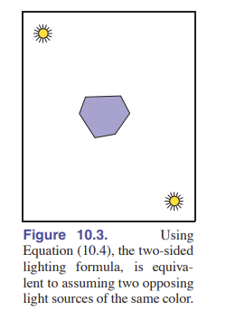
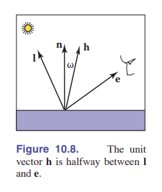

<head>
<script>
MathJax = {
  tex: {
    inlineMath: [['$', '$'], ['\\(', '\\)']],
    displayMath: [["$$", "$$"], ["\\[", "\\]"]],
  },
  svg: {
    fontCache: 'global'
  }
};
</script>
<script type="text/javascript" id="MathJax-script" async
  src="https://cdn.jsdelivr.net/npm/mathjax@3/es5/tex-svg.js">
</script>
</head>

- [第九章 信号处理](#第九章-信号处理)
  - [9.1 数字音频：一维采样](#91-数字音频一维采样)
    - [9.1.1 采样失真和走样](#911-采样失真和走样)
  - [9.2 卷积](#92-卷积)
    - [9.2.1 滑动平均（MA）](#921-滑动平均ma)
    - [9.2.2 离散卷积](#922-离散卷积)
      - [卷积滤波](#卷积滤波)
      - [卷积的性质](#卷积的性质)
    - [9.2.4 连续函数的卷积](#924-连续函数的卷积)
      - [例子：两个盒式滤波函数进行卷积](#例子两个盒式滤波函数进行卷积)
      - [狄拉克 Delta 函数](#狄拉克-delta-函数)
    - [9.2.5 离散-连续函数的卷积](#925-离散-连续函数的卷积)
    - [9.2.6 多维卷积](#926-多维卷积)
  - [9.3 卷积滤波器](#93-卷积滤波器)
    - [9.3.1 一些卷积滤波器](#931-一些卷积滤波器)
      - [盒式滤波](#盒式滤波)
      - [帐篷滤波/线性滤波](#帐篷滤波线性滤波)
      - [高斯滤波](#高斯滤波)
      - [三次 B 样条滤波](#三次-b-样条滤波)
      - [三次 Catmull-Rom 滤波](#三次-catmull-rom-滤波)
      - [三次 Mitchell-Netravali 滤波](#三次-mitchell-netravali-滤波)
    - [9.3.2 滤波器的性质](#932-滤波器的性质)
      - [可分离滤波器](#可分离滤波器)
      - [例子：可分离帐篷滤波](#例子可分离帐篷滤波)
      - [例子：二维高斯滤波](#例子二维高斯滤波)
  - [9.4 图像的信号处理](#94-图像的信号处理)
    - [9.4.1 使用 **离散滤波器** 对图像进行滤波](#941-使用-离散滤波器-对图像进行滤波)
    - [9.4.2 图像采样中的抗锯齿](#942-图像采样中的抗锯齿)
    - [9.4.3 重建和重采样](#943-重建和重采样)
  - [9.5 采样理论](#95-采样理论)
    - [9.5.1 傅里叶变换](#951-傅里叶变换)
    - [9.5.2 卷积和傅里叶变换](#952-卷积和傅里叶变换)
    - [9.5.3 一些傅里叶变换](#953-一些傅里叶变换)
    - [9.5.4 采样原理中的狄拉克脉冲](#954-采样原理中的狄拉克脉冲)
    - [9.5.5 采样和混叠](#955-采样和混叠)
      - [在采样中避免混叠](#在采样中避免混叠)
      - [在重建中避免混叠](#在重建中避免混叠)
      - [在重采样中避免混叠](#在重采样中避免混叠)
    - [9.5.6 理想的滤波器 vs 有用的滤波器](#956-理想的滤波器-vs-有用的滤波器)
- [第十章 表面着色](#第十章-表面着色)
  - [10.1 漫反射着色](#101-漫反射着色)
    - [10.1.1 兰伯特光照模型](#1011-兰伯特光照模型)
    - [10.1.2 环境光着色](#1012-环境光着色)
    - [10.1.3 基于顶点的漫反射](#1013-基于顶点的漫反射)
  - [10.2 冯-着色](#102-冯-着色)
    - [10.2.1 冯-光照模型](#1021-冯-光照模型)
    - [10.2.2 表面法向量插值](#1022-表面法向量插值)
  - [10.3 艺术化着色](#103-艺术化着色)
    - [10.3.1 描边](#1031-描边)
    - [10.3.2 冷暖色调着色](#1032-冷暖色调着色)
  - [常见问题](#常见问题)

# 第九章 信号处理

**在图形学中，我们经常会遇到变量连续变化的函数：图像就是其中之一。但你会随着图形学的研究深入遇到越来越多的这类函数。这类函数和流式数据类似，不能被计算机直接表示。但我们不管咋样，都得在计算机中用一些比特来表示它。有一个很好用的方法是对这些函数进行 _采样_ ：也就是存储这个函数许多不同点的值，然后在需要函数的时候，通过这些值来还原这个函数。**

**你现在肯定已经熟悉使用二维网格表示像素的过程了——这其实就是一种采样！想象一下数码相机拍的照片：实际图像是由相机镜头构成的一个连续函数，但相机将它采样为二位网格状的数据。从数学的角度来说，这就是将一个 $\mathbb{R}^2 \Rightarrow \rm\textbf{C}$ （C 代表颜色集合）的函数转换成了一个二位的色彩采样阵列，即 $\mathbb{Z}^2 \Rightarrow \rm\textbf{C}$ 类型的函数。**

**另外一个采样表示的例子就是二位输入平板，可以在上面写写画画。在这里，原始函数是一个描述运动的函数，也就是 $\mathbb{R} \Rightarrow \mathbb{R}^2$ 的函数，平板将运动数字化，组成二位坐标的序列，也就是 $\mathbb{Z} \Rightarrow \mathbb{R}^2$ 的函数。**

**让我们增加一个维度，看看 CT 扫描仪：它能无创的扫描人体，然后得到人身体断层的密度值。扫描仪的输出是三维网格的密度数据：它将身体的密度数据（ $\mathbb{R}^2 \Rightarrow \mathbb{R}$ ）转化成三维实数数组 ( $\mathbb{Z}^2 \Rightarrow \mathbb{R}$ )。**

**看上去这些例子不太一样，但实际上他们都是用的同一种数学方法。所有的例子都将一个函数采样成多维网格的形式，同时，所有例子我们都需要将采集后的采样点重新组合成一个函数。**

**回到二维图像的例子上来，看上去像素已经够表示一幅图片了，我们也没想过怎么将采样点转化回函数。但，如果你想要缩放图像呢？尤其是非整数倍的缩放，那该怎么办？简单的算法难以完成这些要求，因为它在缩放时很容易产生 _走样_ 。想要了解为什么会产生走样，我们需要走进采样理论的世界。**

**重建一个连续函数，并不是图形学的专利。它在很多地方得以使用，如数字音频、计算物理等，图形学只不过是其中的一个受益人而已。采样重建理论的基础形成于 1920 年左右，并在 1940 年时产生了我们现在用得到的那些理论。**

**这一张从一维音频开始，介绍了采样重建理论。然后，我们会讲述采样理论基础的数学和算法，最后，我们会研究频域视角的细节，它能让我们更直观的看到算法的行为。**

## 9.1 数字音频：一维采样

虽然采样很早就在通讯领域使用了，但直到 1982 年光盘的产生之后，数字音频才开始成为采样的第一“大客户”。

在录音时，麦克风将声音（声音是空气中的压力波）转化为随时间不断变化的电压。这种电信号会以某种方式存储起来，以便以后发送给扬声器重新播放，这时候电压就会在扬声器内，通过与电信号同步，让振膜发出声音，信号重新变成压力波。

录制音频，并将它数字化的方法用到了采样：使用 _模数转换器_ 测量电压信号，一秒测量几千次，这样能够形成一个数据流，可以存储在计算机的磁盘上或其他地方；在播放的时候，数据流以合适的速度进行读取，通过 _数模转换器_ ，数据信号会转换成电信号，放入扬声器的输入区。


事实证明，能否录制出效果好的音频取决于每秒的采样率。较低的采样率对于录制鼓点可能效果还行，但录制笛子的时候就会听上去有问题，升高采样率就能很好的录制笛声。为了去除 _欠采样失真_ ，数字录音机会将模数转换器的输入端做 _滤波_ ，去除输入信号的高频区域，正是它们导致了失真问题。

输出端会出现另外一个问题：数模转换器会在接受采样输入的同时产生电压输出，但直到下一个采样输入前，电压是保持不变的，这就造成了一个类似楼梯的电压图像，这样的电压图像转化成声音就会产生高频噪声，听上去“滋滋滋”。为了去除 _重建性失真_ ，音频播放器也会进行滤波，平滑波形。

### 9.1.1 采样失真和走样

我们上面说的录音机的采样流程和图形学需要的采样很类似。同样地，采样率不够会导致欠采样走样和重建性走样；同样地，解决方案都是在采样之前进行滤波，然后在重建后再进行一次滤波。


过低采样率引发的问题，有一个很直观的解释，请看 [图 9.2] 。这里我们有两个 $\sin$ 函数。第一个函数我们在一个周期内采样 10.8 次，第二个只采样 1.2 次。高采样率显然更能体现图像特性，但主要问题是下面的使用低采样率的采样结果，和低频正弦波采样出的点是同一个。这种情况下，我们一般会将其重建为另外一个低频正弦波，这样就产生了失真。

一旦采样完毕后，只有点留下，我们就不知道这些点到底是高频正弦还是低频正弦的采样结果了，也没法正确的还原原始的函数。这样的情形就叫 _“走样”_ 。

只要采样和重建的频率比较凑巧，那么就会出现走样。在音频中，比如原音频是 10KHz 的铃声，使用 8KHz 采样，就会变成 6KHz 的音调，听起来非常奇怪。在图像中，走样一般以 _摩尔纹_ 的形式呈现。如 [图 9.34] 的百叶窗。

同样的， [图 9.34] 提供了图像走样的另外一种样子：也就是斜线产生锯齿。

理解上面的问题比较容易，但还有一些定量的问题需要探究：

- 多大的采样率能保证较好的成品？
- 采样和重建阶段使用的滤波器用哪种合适？
- 抗锯齿需要用哪种程度的平滑？

等到我们在 [9.5 节] 讲完之后，我们就能回答这些问题了。

## 9.2 卷积

讨论采样和重建算法之前，我们先要看看数学基础： _卷积_ 。卷积是一个简单的数学概念，它是我们采样、滤波、重建操作的基础，也是后面我们分析算法的基础。

卷积是一种函数操作：它接受两个函数，将他们合成一个新的函数。本书中，卷积的符号表示采用 $\star$ 。 $f$ 和 $g$ 的卷积是 $f\star g$ 。这时候我们说， $f$ 被 $g$ 卷积， $f\star g$ 是 $f$ 和 $g$ 卷积的结果。

卷积可以应用于连续函数（关于实数 $x$ 的函数 $f(x)$ ）或离散序列（关于整数 $i$ 的函数 $a[i]$ ）。 它可以应用于在一维、二维或更高维上定义的函数（也就是一、二或更多参数的函数）。 我们将首先从离散的一维情况开始，然后继续介绍连续函数以及二维和三维函数。

为了方便定义，我们假定了函数定义域是无穷，尽管实际应用中它会在某些地方停止。

### 9.2.1 滑动平均（MA）


为了对卷积有一个简单的印象，请思考一下对一个函数使用滑动平均（ [图 9.3] ）。我们使用距离 $r$ 定义平滑操作的 _半径_ 。在这个范围内对函数取平均值。

这种思想可以用于离散，也可以用于连续函数。如果用于连续函数，如果我们在对一个连续函数 $g(x)$ 做平滑，那么它的平均就相当于对其积分，并处以区间长度：

$$h(x) = \frac{1}{2r} \int_{x+r}^{x-r} g(t) dt$$

从另外一个角度来说，如果是离散的函数 $a[i]$ 那么取平均的意思就是对 $a$ 进行求和，然后除以值的个数：

$$c[i] = \frac{1}{2r+1} \sum_{j=i-r}^{i+r} a[j]$$

你会注意到在例子中，我们使用的分母是经过计算的，这样你在处理常数函数的时候结果肯定也是原来那个常数。

滑动平均的思想是卷积的精髓。他们之间唯一的区别是，在卷积中，滑动平均是以一种加权平均。

> **为什么我们要在这里讨论卷积？** 你可以想想滑动平均的功能：它能平滑曲线，滤除超高或超低的值。

### 9.2.2 离散卷积

我们从最离散的卷积情况开始：也就是将一个离散序列 $a[i]$ 和另外一个离散序列 $b[i]$ 进行卷积。结果是 $(a\star b)[i]$ 。这个过程就像将 $a$ 进行一个滑动平均，但和直接使用半径 $r$ 取平均不同，这一次我们的权重是由 $b[i]$ 指定的：其中值 $b[i-j]$ 给出了位置 $j$ 处样本的权重，该位置距离正在计算卷积的位置 $i$ 的距离为 $i-j$ 。 这就是 $(a \star b)$ 的定义，表示为:

$$(a \star b)[i] = \sum a[j]b[i-j]$$


[图 9.4] 描述了通过一个滤波序列 $b$ 计算离散序列 $a$ 的卷积。序列 $b$ 支持 $5$ 个样本。计算出的结果 $a\star b$ 是对序列 $a$ 这个地方周围共 $5$ 个值通过 $b$ 这五处的值进行加权平均。

如果我们忽略上面的 $j$ 的边界，我们就可以知道，这个求和操作是从 $-\infty$ 到 $+\infty$ 的，正如上面所说，我们能计算出来 $b[0] = \frac{6}{16}$ ， $a[\pm 1] = \frac{4}{16}$ 等等。

在图形学中，我们用于计算的函数很可能是 _有限支持_ 的，换句话说，函数只在一块区间内是非零。如果我们假设 $b$ 是有限支持的，那么就会有一个 _非零半径_ ，让 $|k| < r$ 时有 $b[k] = 0$ 。在之前 $a\star b$ 的例子中，我们可以将求和公式这样写：

$$(a\star b)[i] = \sum_{j=i-r}^{i+r} a[j]b[i-j]$$

然后我们也可以写出伪代码：

```vb
function convolve(sequence a, filter b, int i)
    s = 0
    r = b.radius
    for j = i − r to i + r do
        s = s + a[j] * b[i − j]
        return s
```


#### 卷积滤波

由于我们需要卷积来滤波，所以卷积很重要。回过头看看我们之前讲的滑动平均，你会发现滑动平均也是一种特殊的卷积。当我们对某范围内进行滑动平均，也就相当于通过某个半径内权重相同，半径外权重为 $0$ 的序列卷积。这种在特定非零区间上权重相同的滤波器称为 _盒式滤波_ 。对于半径为 $r$ 的盒式滤波，有：

$$
b[k] = \begin{equation*}
    \begin{cases}
        \frac{1}{2r+1} \ \ \ ,-r \leq k \leq r,  \\
        0 \ \ \ \ \ \ \ \ , \rm otherwise.
     \end{cases}
\end{equation*}
$$

就像这个例子一样，卷积滤波一般会被定义为所有的权重和为 $1$ 。这样，信号就不会被增强或减少。

#### 卷积的性质

写了这么多卷积的东西，我们发现卷积似乎是 _不对称操作_ ： $a$ 是需要做平滑的序列； $b$ 是提供权重的序列。但其实，卷积有一个很棒的特点：那就是 **滤波器** 和 **信号** 其实是可以交换的。我们想想之前所说的 $a\star b$ ：如果两者交换，那么切片其实就是从 $b$ 的原点开始往后数数；也就是，我们可以将原式的 $j$ 换成 $i-k$ 。改变序号后的式子如下：

$$
(a\star b)[i] = \sum_{k}a[i-k]b[i-(i-k)] \\
 \ = \sum_{k}b[k]a[i-k]
$$

这不就是原来的式子吗？所以，我们说有 $(a\star b)=(b\star a)$ ，也就是说，卷积有 **交换律** 。

更广泛地说，卷积是一种 **“类似于乘法”** 的运算。就像数或函数的加法或乘法，卷积也一样，卷积的结果不会因为改变了项或者括号的顺序而改变。也就是具有 **结合律、交换律和分配律** 。

这样的性质非常自然而然，而且我们还可以在计算的时候利用这些性质来化简。（想想分配律的组合化简）。

最简单的滤波可以是单位滤波，也就是半径为 $0$ ，或是序列 $d[i] = ...,0,0,1,0,0,...$ 。显然，这样卷积 $a$ 和 $d$ ，卷积出来的结果还是 $a$ 自己。它有时候挺有用：比如我们在使用 $b$ 平滑 $a$ 之后需要把他本身减掉，那么可以直接使用 $d-b$ 作为卷积的第二个序列。

### 9.2.4 连续函数的卷积

尽管在计算机中进行运算的实际上是离散的序列，但那些采样的序列总是被用来表示某些连续函数的。所以我们需要能够计算出这些连续函数。所以，研究离散和连续/连续和连续函数的卷积的很有必要的。

连续函数的卷积公式来自离散的推广：

$$(f\star g)(x) = \int_{-\infty}^{+\infty}f(t)g(x-t)dt$$

怎么解释这个公式呢？从图像上看，最后的值代表了 $g$ **翻转** 后， $f$ 和 $g$ 的乘积所画出的图形 与 $x$ 轴包围的面积。就和离散状况一样，卷积是一种滑动平均，滤波器的值提供了做平均的 _权重_ 。见 [图 9.10]

同样，连续函数的卷积也有 **交换律、结合律和分配律** 。

#### 例子：两个盒式滤波函数进行卷积

定义 $f$ 是一个盒式滤波函数：

$$
f(x) = \begin{equation*}
     \begin{cases}
         1  \ \  - \frac{1}{2} \leq x \leq \frac{1}{2} \\
         0 \ \ \ \rm otherwise. \\
     \end{cases}
 \end{equation*}
$$

那么 $f \star f$ 是什么呢？由定义，我们可以得到：

$$(f\star f)(x) = \int_{-\infty}^{\infty} f(t)f(x-t)dt$$

[图 9.11] 展示了这个情况。在 $x \leq -1$ 和 $x \geq 1$ 的区间上，我们看到两个盒式滤波器出现了值为 $0$ 的重叠区域，这意味着卷积的结果是 $0$ 。而有重叠的非零区域，我们容易得到结果是 $1-|x|$ 。

综上可得，

$$
(f \star f)(x) = \begin{equation*}
     \begin{cases}
         1-|x|  \ \ \  -1 \leq x \leq 1 \\
         0 \ \ \ \ \ \ \ \ \ \ \ \ \ \ \ \rm otherwise. \\
     \end{cases}
 \end{equation*}
$$

这个函数叫 _帐篷函数_ ，也是一个常用的滤波器函数。见 [9.3.1 节]

#### 狄拉克 Delta 函数

在离散卷积中，我们发现了脉冲序列 $d$ 起到了作为 _单位函数_ 的作用。也就是，任何函数和他进行卷积，结果不变。在连续函数中，也有一种类似的函数。我们将这种函数称作 **_狄拉克 Delta 函数_** 。用 $\delta (x)$ 表示。

看上去，狄拉克函数是类似于在 $0$ 点竖了一根针。它很细，但这块地方进行积分，结果是 $1$ 。这样定义的目的是让狄拉克函数选择（也就是卷积）出另外一个函数在 $0$ 处的值：

$$\int_{-\infty}^{\infty} \delta (x)f(x)dx = f(0)$$

但狄拉克函数在 $0$ 点时的值没有定义过（你可以认为值接近与 $+\infty$ ），但对于任意的 $x \neq 0$ ，它的值始终是 $0$ 。


由于狄拉克函数的性质，我们得以找到对于卷积运算的“单位函数”。

### 9.2.5 离散-连续函数的卷积

我们已经发现了一种联系离散和连续的方式： **采样** 。通过简单的忽略其他的非整数值，我们可以得到一个序列：

$$a[i] = f(i)$$

倒着讲，我们将离散序列变成连续函数的方式称为 _重建_ 。我们通过使用另外一种形式的 **卷积** 来完成重建的过程。也就是我们这一节讲的： **离散-连续函数的卷积** ：

$$(a\star f)(x) = \sum a[i]f(x-i)$$


---

书上的内容似乎不太好理解。如果你没看懂，我们来看一个例子：

在物理课上, 我们知道机械波是可以叠加的。我们假设有一个机械波 $g(x,t)$ , 描述了 $t$ 时刻 $x$ 点的位移。假设它的 **振源** 是原点, 那么如果将振源 **平移** 到点 $y$ , 那么这个机械波就变成了 $g(x-y,t)$ 。该函数表示的意义是：有一个振源在 $y$ 点，那么 $t$ 时刻在 $x$ 位置的位移是 $g(x-y,t)$ 。

现在我们假设有 $n$ 个振源，它们分别位于点 $y_1,...,y_n$ ，每个振源都是 $0$ 时刻开始振动。由于机械波是可以叠加的, 在 $t$ 时刻，任意点 $x$ 处由振荡引起的位移便是:

$$h(x,t) = \sum^{n}_{i=1} g(x-y_i,t)$$

现在情况稍微复杂一点：每个振源的振动强度不一样，由 $A_1,...,A_n$ 表示。上式就会变成：

$$h(x,t) =  \sum^{n}_{i=1} A_ig(x-y_i,t)$$

既然振源和振幅一一对应了，我们可以考虑把它写成一个函数 $f(x_i) = A_i$ 。其他地方则取 $0$ 。再次改变上式，很容易就能得到：

$$h(x,t) =  \sum^{n}_{i=1} f(y_i)g(x-y_i,t)$$

写到这里，你应该已经发现了，对每个时刻 $t$ ，将 $g(x-y_i,t)$ 视为 $g_t(x-y_i)$ ，它描述了在某时刻，各点的运动状态，这样我们也能将 $h(x,t)$ 视作 $h_t(x)$ 。剔除了 $t$ 的影响，我们终于能写出 $x$ 和 $y$ 之间的纯粹的关系：

$$h_t(x) = \sum^{n}_{i=1} f(y_i)g_t(x-y_i)$$

这样我们就得到了单离散单连续情形的卷积 $h_t = f \star g_t$ ！

---

### 9.2.6 多维卷积

我们之前一直在讲一维的卷积：单个变量 $x$ 或者是单个序列 $i$ 。但图形学中的应用大多数是二维的，尤其是二维图像。不过，从一维拓展到二维、三维卷积，是比较简单的。

从离散卷积的定义开始，类似的，我们拓展到二维：

$$(a \star b)[i,j] = \sum_{i'} \sum_{j'}a[i',j']b[i-i',j-j']$$

如果 $b$ 是一个定义好的滤波器，拥有 $r$ 的半径，那么一共就会有 $(2r+1)^2$ 个值，我们就可以加上边界：

$$(a \star b)[i,j] = \sum_{i'=i-r}^{i+r} \sum_{j'=j-r}^{j+r} a[i',j']b[i-i',j-j']$$

具体图像如 [图 9.16] 所示。


用代码表示如下：

```vb
function convolve2d(sequence2d a, filter2d b, int i, int j)
    s = 0
    r = b.radius
    for i_1 = i-r to i+r do
        for j_1 = j-r to j+r do
            s = s+a[i_1][j_1]*b[i-i_1][j-j_1]
    return s
```


它的几何意义和一维是一样的：每个输出的值是输入值周围一圈的带权平均。这里的 _滤波器_ 则是类似于遮罩一样、罩住需要取带权平均的区域。

所以，类似的，我们也能推广出二维连续函数的卷积公式：

$$(f\star g)(x,y) = \int\int f(x',y')g(x-x',y-y')dx'dy'$$
$$(a\star g)(x,y) = \sum_{i}\sum_{j} a[i,j]g(x-i,y-j)$$

上面的情况都一样，都是某个点的值经过周围值平均后的结果。对于双连续函数的卷积，则是按照周围一圈区域的积分来确定平均的权值。

同样的，我们已经可以轻易推出更高维的情况了。

## 9.3 卷积滤波器

了解了卷积，我们来看看在图形学中常用的一些滤波器。

下面要介绍的滤波器都有一个固定的半径，它们的半径有一个默认值，便于我们使用。例如，盒式滤波的默认半径是 $\frac{1}{2}$ ，立方体滤波的默认半径是 $2$ 。最后，我们规定了所有的滤波器都要满足积分为 $1$ ，即 $\int_{x=0}^{\infty}f(x)dx = 1$ ，这样我们就能不改变信号的平均大小，然后对信号做采样和重建。

我们在 [9.4.3 节] 即将说到，一些应用需要不同尺寸的滤波器，这可以通过缩放滤波器得到。我们可以通过定义一个缩放系数 $s$ 来缩放滤波函数 $f(x)$ ：

$$f_s(x) = \frac{f(x/s)}{s}$$

这样，这个滤波函数会在水平方向上被拉伸 $s$ 倍，然后在垂直方向上被挤压成原来的 $\frac{1}{s}$ 。这样做的理由是需要保持积分不变，也就是面积不变。经过缩放之后，原来的半径 $r$ 变成了 $sr$ 。

### 9.3.1 一些卷积滤波器


#### 盒式滤波


盒式滤波是分段的常数函数。离散形式是：

$$
a_{box,r}[i] = \begin{equation*}
     \begin{cases}
         \frac{1}{2r+1}  \ \ \ \ \ \ \  |i| \leq r \\
         0 \ \ \ \ \ \ \ \ \ \ \ \ \ \rm otherwise. \\
     \end{cases}
 \end{equation*}
$$

为了对称性，这个方程将端点包含在内。

该滤波器的连续形式是：

$$
f_{box,r}(x) = \begin{equation*}
     \begin{cases}
         \frac{1}{2r}  \ \ \ \ \ \ \  -r\leq x < r \\
         0 \ \ \ \ \ \ \ \ \ \ \ \ \ \rm otherwise. \\
     \end{cases}
 \end{equation*}
$$

那么为什么这个方程的区间不是对称的呢？因为在连续的情形，我们想要对函数进行 **重建** ，那么就需要连续的区间，这时边界值需要好好考虑。最后，对于默认半径 $r=\frac{1}{2}$ ，我们用 $f_{box}$ 表示。

#### 帐篷滤波/线性滤波

同理，帐篷滤波是一种连续的、部分线性的函数：

$$
f_{tent}(x) = \begin{equation*}
     \begin{cases}
         1-|x|  \ \ \ \ \ \ |x| < 1 \\
         0 \ \ \ \ \ \ \ \ \ \ \ \ \ \rm otherwise. \\
     \end{cases}
 \end{equation*}
$$

默认半径是 $r=1$ 。像这种默认函数（ $C^0$ 是该函数连续的意思），我们不需要在端点定义跳变，那就不需要将离散和连续分开定义。

#### 高斯滤波

高斯函数，也被称为正态分布函数，是非常重要的一种函数。之后我们会讲到更多这方面的东西。该函数如下：

$$f_{g},\sigma(x) = \frac{1}{\sigma \sqrt{2\pi}}e^{-x^2/2\sigma ^2}$$

参数 $\sigma$ 叫做 **_标准差_** 。高斯滤波由于它的平滑性，在采样滤波中很有用。之后我们会详细讲述。

但注意，高斯滤波没有默认半径，因为我们可以通过控制标准差 $\sigma$ 来控制滤波距离。同样的，高斯滤波没有 _支持半径_ ，因为越往两边，函数值越小，但不会是 $0$ ，只是趋近于 $0$ 。当我们有需要的时候，我们可以将半径 $r$ 以外的部分设置为 $0$ （一般可以设置为 $1$ 或 $3$ ），这样我们就能得到 _裁剪高斯滤波_ 。这意味着不同的应用可以使用不同的半径，也可以将这个半径进行缩放成 $sr$ ，这时标准差也会缩放到 $s\sigma$ 。如果我们需要半径，那么将半径 $r$ 和标准差 $\sigma$ 共同作为参数挺不错。


#### 三次 B 样条滤波

很多滤波器被定义为一些 _多项式_ 。而具有四段（默认半径为 $r=6$ ）的三次滤波常用来进行 **重建** 。有这样一种滤波，叫 **B 样条滤波** ，见 [图 9.22] ，它以 $(0,\frac{2}{3})$ 点为最大值，样子类似正态分布。叫这个名字是因为它是一些 _样条曲线_ 的 **混合** （Blend）。

$$
f_{B}(x) = \begin{equation*}
     \begin{cases}
         -3(1-|x|)^3+3(1-|x|)^2 +3(1-|x|)+1, \ \ \ \ \ \ -1 \leq |x| \leq 1 \\
         (2-|x|)^3, \ \ \ \ \ \ \ \ \ \ \ \ \ \ \ \ \ \ \ \ 1 \leq |x| \leq 2\\
         0, \ \ \ \ \ \ \ \ \ \ \ \ \ \ \ \ \ \ \ \ \ \ \ \ \  \ \ \ \ \ \ \ \ \ \rm otherwise.\\
     \end{cases}
 \end{equation*}
$$

在分段立方体中，B 样条非常的特殊，因为它的一阶导和二阶导 **连续** （可以用 $C^2$ 表示一二阶导连续）。我们可以通过一种更简洁的方式定义上面那个方程组，那就是： $f_B = f_{box} \star f_{box} \star f_{box} \star f_{box}$ 。这就是我们花大篇幅讲卷积的意义，它是这个滤波的出处。

#### 三次 Catmull-Rom 滤波

这个滤波也是样条滤波，它在 $x=-2,-1,1,2$ 的时候函数值为 $0$ 。这意味着它可以作为重建滤波器插值样本。

$$
f_{C}(x) = \frac{1}{2}\begin{equation*}
     \begin{cases}
         -3(1-|x|)^3+4(1-|x|)^2 +(1-|x|), \ \ \ \ \ \ -1 \leq |x| \leq 1 \\
         (2-|x|)^3-(2-|x|)^2, \ \ \ \ \ \ \ \ \ \ \ \ \ \ \ \ \ \ \ \ 1 \leq |x| \leq 2\\
         0, \ \ \ \ \ \ \ \ \ \ \ \ \ \ \ \ \ \ \ \ \ \ \ \ \  \ \ \ \ \ \ \ \ \ \ \ \ \ \ \ \ \ \ \ \ \ \ \ \ \ \ \ \ \ \ \rm otherwise.\\
     \end{cases}
 \end{equation*}
$$

#### 三次 Mitchell-Netravali 滤波

三次 Mitchell-Netravali 滤波器用于解决重采样图像问题，在上述两种三次滤波器中折中改进，这种滤波器是前面两种滤波器的加权组合。数学表达式：

$$f_M(x) = \frac{1}{3}f_B(x)+\frac{2}{3}f_C(x)$$

$$
f_{C}(x) = \frac{1}{2}\begin{equation*}
     \begin{cases}
         -21(1-|x|)^3+27(1-|x|)^2 +9(1-|x|)+1, \ \ \ \ \ \ -1 \leq |x| \leq 1 \\
         7(2-|x|)^3-6(2-|x|)^2, \ \ \ \ \ \ \ \ \ \ \ \ \ \ \ \ \ \ \ \ 1 \leq |x| \leq 2\\
         0, \ \ \ \ \ \ \ \ \ \ \ \ \ \ \ \ \ \ \ \ \ \ \ \ \  \ \ \ \ \ \ \ \ \ \ \ \ \ \ \ \ \ \ \ \ \ \ \ \ \ \ \ \ \ \ \ \ \ \ \ \rm otherwise.\\
     \end{cases}
 \end{equation*}
$$

### 9.3.2 滤波器的性质

滤波器有一些常用的术语，用来描述或比较。

_冲激响应_ 描述了一个滤波函数对一个只包含单个脉冲的信号的相应（回想一下，对单个脉冲进行卷积，得到的是本身）。

如果一个连续滤波函数被用在一个离散序列上进行 **重建** 操作，重建出来的函数能经过所有的 _采样点_ ，我们就称之为 **_插值_** 。插值滤波就是那些 $f(0)=1$ 且在任意不为零的 $i$ , 有 $f(i)=0$ 的函数。


如果一个滤波器存在负值，那么在滤波时，会产生 _振铃效应_ / _过冲_ ：它会让原函数变化的区域产生额外的信号抖动。比如， _Catmull-Rom 滤波_ 在图像两侧都有负值区域，所以当它被用于一个阶跃函数时，会在阶跃函数的 0 点产生 _下冲_ ，在 1 点产生 _过冲_ 。


如果一个滤波器用于常数函数，输出的仍然是常数函数，那么我们说它是 _无纹波_ 的。这个概念的定义和全域积分为 $1$ 是一样的：

$${\rm \sum_{i}f(x+i)=1 \ for \ all \ }x$$

之前讲的所有滤波函数，在他们的 _默认半径下_ 都是无纹波的，除了 **高斯滤波** 。但是他们在非整数的应用场景下并不需要无纹波。如果我们很需要无纹波这一特性，可以这样做：计算结果前全部同除以权重和。


$$(\overline{a\star f})(x) = \frac{\sum_{i}a[i]f(x-i)}{\sum_{i}a[i]}$$

这个表达式也可以写成 $a$ 和 $\overline{f}$ 的卷积。

连续的滤波函数有一个 _连续程度_ ，通过高阶导数来描述。一个盒式滤波函数，由于有 **间断点** ，所以它不是连续的。一个帐篷滤波函数，是连续的，但它在某些地方斜率突然改变，也就是一阶导不连续，我们称为 $C^0$ 。同理，二阶导也连续的函数，如 **B 样条函数** ，是 $C^2$ 。连续性的好和坏对于 **重建** 很重要，因为重建函数的连续性是和滤波函数的连续性息息相关的。

#### 可分离滤波器

对于图像这类的 **二维** 数据，我们也需要一个滤波器。但我们至今只说过一维滤波器。理论上来说，任意的二维函数都可以作为二维滤波器，有些时候这样定义反而比较简单，但是，大多数情况下，我们构造二维滤波器的方式是通过 **一维滤波的组合** 实现的。

最好用的方法是使用 **可分离滤波器** 。对于一个可分离滤波器 $f_2(x,y)$ ，我们可以简单的将某个一维滤波器的 $x,y$ 取值相乘：

$$f_2(x,y) = f_1(x)f_1(y)$$

离散情况也一样：

$$b_2[i,j] = b_1[i]b_1[j]$$

$f_2$ 的任意垂直或水平图形都是 $f_1$ 拉伸后的图像。如果 $f_1$ 标准化过，那么 $f_2$ 的积分其实就是 $f_1$ 积分的平方，所以也是 **标准化** 的。

#### 例子：可分离帐篷滤波


我们选的是帐篷函数当作 $f_1$ 进行组合，那么得到的 _双线性函数_ 是：

$$
f_{\rm 2,tent}(x,y) = \frac{1}{2}\begin{equation*}
     \begin{cases}
         (1-|x|)(1-|y|), \ \ \ \ \ |x| \leq 1 \ and \ |y| \leq 1 \\
         0, \ \ \ \ \ \ \ \ \ \ \ \ \ \ \ \ \ \ \ \ \ \ \ \ \  \ \ \ \ \ \ \ \rm otherwise.\\
     \end{cases}
 \end{equation*}
$$

_轴方向_ 的坐标形成的是帐篷函数，但 _对角线方向_ 是 **二次函数** 。比如说，我们在 $x=y$ 这条对角线上，函数的正值区域的曲线是 $y=(1-x)^2$ 。

#### 例子：二维高斯滤波


同样的，选取高斯函数作为 $f_1$ ，有：

$$
f_{2,g}(x,y) = \frac{1}{2\pi}(e^{-x^2/2}e^{-y^2/2}) \\
\ \ \ \ \ \ \ =\frac{1}{2\pi}(e^{-(x^2+y^2)/2}) \\
=\frac{1}{2\pi}(e^{-r^2/2})
$$

其实你会发现，将一维高斯滤波绕着 $y$ 轴旋转，产生的图形就是二维高斯滤波。所以二维高斯滤波是既旋转对称，也是可分离的。

---

对于其他的二维滤波，可分离的滤波有一个明显的优势：容易实现，效率较高。下面说说为什么效率高：

我们先把可分离滤波 $a_2$ 的表达方式写成离散卷积的方式:

$$(a\star b_2)[i,j] = \sum_{i'}\sum_{j'}a[i',j']b_1[i-i']b_1[j-j']$$

我们发现 $b_1[i-i']$ 的值不取决于 $j'$ ，可以提出来：

$$ = \sum*{i'}b_1[i-i']\sum*{j'}a[i',j']b_1[j-j']$$

将后面的求和缩写为 $S[i']$ ：

$$S[i'] = \sum_{j'}a[i',j']b_1[j-j']$$
$$(a\star b_2)[i,j] = \sum_{i'}b_1[i-i']S[i']$$

为啥要这样化呢？ 这样化出来，我们能够将 $S[i']$ 的每个对应值都存储起来，然后用于计算外层的求和。这有助于提高效率。

举个例子：如果我们要计算在 $[2,2],[3,2]$ 两个点的 $a\star b_2$ 值， $b_1$ 的半径是 $2$ 。我们看上面推出来的公式就会发现，我们需要 $S[0],S[1],...,S[4]$ 来计算 $[2,2]$ 处的值，而同时需要 $S[1],S[2],...,S[5]$ 来计算 $[3,2]$ 处的值。那么我们就可以把这些和全都存起来，这样省去了一大部分计算的时间。

对于大型的滤波器，这样能省非常多的性能， **相当于脱掉了一层循环** 。

算法伪代码如下：

```vb
function filterImage(image I, filter b)
    r = b.radius
    n_x = I.width
    n_y = I.height
    allocate storage array S[0 ... nx−1]
    allocate image I_out[r ... n_x−r−1,r ... ny−r−1]
    initialize S and I_out to all zero
    for j=r to ny−r−1 do
        for i_1=0 to nx−1 do
            S[i_1]=0
            for j_1=j−r to j+r do
                S[i_1] = S[i_1] + I[i_1, j_1]*b[j − j_1]
        for i=r to nx−r−1 do
            for i_1 = i−r to i+r do
                I_out[i, j] = I_out[i, j] + S[i_1]*b[i − i_1]
    return Iout
```

为了简洁，算法省略了边界问题。实际上边界问题有多种解决方法，见 [9.4.3 节] 。

## 9.4 图像的信号处理

我们讨论了采样、滤波、和重建，但都是空谈，而且大多数是针对一维信号。这节我们终于可以开始将图像这样的二维数据处理了。

### 9.4.1 使用 **离散滤波器** 对图像进行滤波

最简单的卷积应用可能就是使用离散卷积处理图像了。而且大多数广泛使用的滤波器都是简单的卷积滤波器。我们可以通过 _低通滤波器_ 实现图像的模糊操作，比如盒式滤波， $\cdots$ ，高斯滤波。高斯滤波能提供非常平滑的模糊，用途广泛。


模糊的反义词是 **锐化** 。那么我们怎么做呢？我们可以做原先模糊的“反操作”。鉴于模糊是将周围的值加到中间，锐化滤波就可以将中间的值减去周围的值。我们将相减的系数设为 $\alpha$ 。为了不影响总体的亮度，我们需要：

$$
I_{sharp} = (1+\alpha)I-\alpha(I\star f_{g,\sigma}) \\
= I \star((1+\alpha)d-\alpha f_{g,\sigma}) \\
= I \star f_{sharp}(\sigma,\alpha).
$$

其中 $f_{g,\sigma}$ 是高斯滤波，宽度为 $\sigma$ 。我们使用离散脉冲 $d$ 充当所谓“单位矩阵”的作用，我们可以将卷积通过分配律化简成一个。


另外一个使用两个滤波器组合的应用是给图像落下阴影。在落下阴影的过程中，我们需要拷贝原图像的信息，然后做一个模糊的外围环绕阴影。对于“外围”的实现，我们可以做一个 _偏离的脉冲函数_ ：

$$
d_{m,n}(i,j) = \begin{equation*}
     \begin{cases}
         1, \ \ \ \ \ i=m \ {\rm and} \ j = n \\
         0, \ \ \ \ \  \rm otherwise.\\
     \end{cases}
 \end{equation*}
$$

然后，将两者组合（我们使用高斯滤波）：

$$
I_{\rm shadow} = (I\star d_{m,n})\star f_{g,\sigma} \\
 = I\star (d_{m,n}\star f_{g,\sigma}) \\
 \ \ \ \ \ \ = I\star f_{\rm shadow}(m,n,\sigma).
$$

这样我们就能使用一个函数（接受三个变量）处理三个滤波做的事情。

### 9.4.2 图像采样中的抗锯齿

在图像合成中，我们经常需要对具有连续数学性质的图像进行采样，然后输出各个点的颜色，最经典的例子就是光线追踪。 [第 4 章] 讲述了光线追踪的例子以及对光线追踪实例进行抗锯齿的具体步骤。用我们这节课的术语来说，我们有一个二维 **信号** （也就是图像），然后通过 **采样** 生成一个二维网格。如果我们就这样下去，不采用特殊操作，那么就会遇到各种各样的 **混叠** ，在图像的比较尖锐的边缘就会出现 **锯齿** 。而在重复出现的纹路上，会出现 **摩尔纹** 。见 [图 9.34] 。


为什么会出现这样的问题？原因是在这里有太多的 **小尺寸细节** 。如果不进行平滑，那么采样的频率就会跟不上细节的频率，造成混叠。所以为了防止这种视觉问题，我们需要在采样前进行 **平滑处理** 。见上图 [图 9.34] ，使用简单的盒式滤波仍然会产生一些摩尔纹，但高斯滤波非常平滑，可以有效防止摩尔纹的产生，但要付出更加模糊的代价。上述方法有效说明了，人们一直在做 **锐度** 和 **混叠** 之间的斗争。

### 9.4.3 重建和重采样

在对图像做滤波时，我们需要仔细留意 **重采样** 操作，也就是改变采样率 ，或者说，改变图像尺寸。

假设我们已经用相机拍了一张 $3000 \times 2000$ 的照片，但我们要在 $1280 \times 1024$ 的显示器上显示，因为我们不想照片被拉伸，所以实际上显示出来的尺寸应该是 $1280 \times 852$ 像素。那么怎么做呢？

一种办法是将这种缩小尺寸的过程看作是扔掉一些不需要的像素。我们发现缩小比例是两到三倍，所以一个像素旁边的一个或两个像素应该被丢弃。这样是可行的，但是你会发现图像质量很差。 [图 9.34] 其实用的就是丢弃像素的方法。虽然效果不会，但丢弃像素运行的非常快，适合生成缩略图。

其实，我们可以将缩放图像的过程看成 **重采样** 的过程。我们将这个图像的“函数”进行连续化，然后再以我们想要的采样率进行重采样。见 [图 9.36] 。为了防止混叠，我们会在各个步骤时使用合适的滤波器。


[图 9.37] 展示了一个例子：原始的图像是 $12\times 9$ 像素，新图像是 $8\times 6$ 的，也就是像素数量（图像面积）变成了原来的 $2/3$ 。

为了能在后续阶段正确采样出样本，我们需要能够计算样本之间的像素值应该取多少。 **丢弃像素法** 给了我们一个很好的思路：也就是寻找离得最近的一个原图像的像素，新的采样点的像素值就是它了。其实，这样操作和 _使用一个半径为 1 的盒式滤波器_ 是一样的效果。

如果我们这一节说的是依据性能选择滤波器，那么这个方法肯定能稳坐宝座了。可惜不是。实际上，在整个图像中使用盒式滤波存在一些困难。但对于更高质量的重采样，重建/采样的过程框架提供了宝贵的灵活性。

我们先在一维讨论算法问题，然后将其推广，这样比较简单。我们在 [9.2.5 节] 说过 _重建函数_ ，这里我们直接利用它：

```vb
function resample(sequence a, float x0, float dx, int n, filter f)
    create sequence b of length n
    for i=0 to n−1 do
        b[i] = reconstruct(a, f, x0 + i*dx)
    return b
```

这里的变量 $x_0$ 提供了基于旧序列的新序列起始地址。也就是，如果输出序列的第一个样本落在旧序列的 $3,4$ 之间，那么 $x_0$ 就是 $3.5$ 。

这个过程相当于通过连续的滤波器重建了一个连续的图像，然后用点来对这个连续图像进行采样。其实连续的图像并不存在，只是存在于我们定的规则之中，但实际上来说，这个函数计算了 $a\star f$ 上一系列点的值。

好像不太对...我们忘记了在采样之前进行模糊化处理！ 正确的过程应该是：我们将重建函数与滤波器 $g$ 进行卷积，然后与点采样函数 $a$ 再进行一次卷积，也就是 $g\star (f\star a)$ 。不过由于结合律，实际上和 $(g\star f)\star a$ 是一样的。因此，我们可以将 **采样滤波器** 和 **重建滤波器** 合并，见 [图 9.38] 。合并后的滤波器我们称之为 **重采样滤波器** 。


我们进行重采样时，会在旧图像中指定一个 _源矩形_ ，用来确定新图像中需要保留旧图像的哪部分内容。例如，利用我们第三章讲过的 _像素位置_ ，假如我们想要重采样的图像大小为 $(-0.5,n_x^{old}-0.5)\times (-0.5,n_y^{old}-0.5)$ ，指定一个 _源矩形_ 为 $(x_l,x_h) \times (y_l,y_h)$ ，那么采样间隔就是 $\Delta x = (x_h-x_l)/n_x^{new}$ ， $\Delta y = (y_h-y_l)/n_y^{new}$ 。所以，我们可以将某处的左下采样点标记为 $(x_l+\Delta x/2,y_l+\Delta y/2)$ 。

我们使用伪代码给这个方法套上两个循环，可以写出：

```vb
function resample(sequence a, float xl, float xh, int n, filter f)
    create sequence b of length n
    r = f.radius
    x_0 = x_l + dx/2
    for i = 0 to n − 1 do
        s = 0
        x = x_0 + i*dx
        for j = ceil(x−r) to floor(x+r) do
            s = s + a[j]*f(x − j)
            b[i] = s
    return b
```

这个例程包含了重采样一个图像的所有基础操作。但还有最后一个问题，那就是在图像的边界我们应该做点什么。有一些办法，如下：

- 如果序列到头了，就停止循环——这等价于将图像周围以全 $0$ 像素填补。
- 如果序列超出界限，使用序列的最后一个值作为替代——这等价于在图像的周围做了一圈与最边缘颜色相同的填补。
- 定义滤波器在图像边缘的行为，彻底解决这一问题。

第一种方法会让图像边缘部分变暗，所以不太好用。第二种方案比较容易实现。第三种应该是效果最好的。自定义边缘滤波器可以有一个简单的定义法
：那就是 **重新归一化** 。简单的将包进来的有效像素取平均，忽略无效像素。这样，滤波器最后的均值依旧为 $1$ ，亮度不会发生变化。为了该算法有更好的效率，我们只需要在滤波器处于边缘的时候再使用，图片的中心区域可以省略这一步骤。

选择一个好的重采样的滤波器是很重要的。什么是好的滤波器？我们需要回答下面两个问题：我们需要的滤波器形状和半径是什么？由于滤波器在采样和重建阶段都会用到，所以这两个变量的取值很重要。对于重建的任务，我们想要的是一个尽可能平滑的模糊滤波器，能起到反走样的效果；对于采样的任务，我们想要滤波器足够大，以防止采样不足的问题，同时也需要平滑，这样可以防止摩尔纹。 [图 9.39]() 显示了两种不同的需求。


总之，我们会选择一种滤波器形式，然后将它按照输入和输出的图像大小进行各自的缩放。下面两种分辨率决定了滤波器的尺寸：当输出比输入更 _稀疏采样_ ，也就是我们将缩小图像（ _降采样_ ）时，那么我们对于采样所需的模糊度就比重建滤波器的模糊度要求 **更高** 。所以我们按照输出图像的间隔（在 [图 9.39] 中是 $r=3$ ）。而当输出图像采样效果更佳（也就是 **升采样** ，放大图像）时，那么重建所需的模糊度更高（意思是重建函数已经 **足够平滑** 了，可以比开始之前使用更高的采样率）。所以滤波器的大小就取决于输入样本的间隔（在 [图 9.39] 中是 $r=1$ ）。

选择滤波器本身就是一种速度和质量之间的权衡。一般来说，需要速度就用 **盒式滤波** ，两者都需要就用 **帐篷滤波** ，需要质量就使用 **分段三次滤波** 。在分段三次滤波中，平滑程度可以通过 $f_B$ 和 $f_C$ 进行插值来调整， _三次 Mitchell-Netravali 滤波_ 就是一个很好的选择。

正如图像滤波，分离式滤波器可以显著提高速度。分离式滤波器的基本思想是先将所有 **行** 进行采样，然后得到一个宽度改变但高不变的图像；然后再将图像的 **列** 进行重采样，得到最终结果，见 [图 9.40] 。我们可以很容易的修改前面的伪代码，然后将这样做带来的好处收入囊中。

## 9.5 采样理论

如果你只想看看实现的过程，那么就别往下看了！你已经可以使用之前讲过的东西写出很好的代码了。然而，对于通信方面的知识，有好多更深的内容，通过数学理论来阐述。采样理论就是对通信方式的一种严格证明和推导。

最主要的是，采样理论给了我们在图形学的采样和重建领域非常牛逼的一些观点。它能让学生理解，如何使用最优的代码达成最好的效果。

### 9.5.1 傅里叶变换

采样理论最基础的两个理论基础，就是 **傅里叶变换** 和 **卷积** 。你可以在很多地方读到傅里叶变换的介绍。

傅里叶变换的基本原理就是：任何函数都可以表示为一系列正弦波（可以是不同频率）的和。使用合适的正弦波做叠加，我们就能得到任意一个函数。


举个例子， [图 9.41] 中的方形波可以通过下面的序列来表示：

$$\sum_{n=1,3,5\dots}^{\infty} \frac{4}{\pi n}\sin 2\pi nx$$

这个 _傅里叶序列_ 从频率为 $1$ 的正弦波（ $\sin 2 \pi x$ ）开始叠加——也就是和方形波的频率一样。然后剩下的项作为 _修正_ ，减少波纹，最后， _取极限_ ，逼近原函数。请注意，上面这个式子里面的项的频率都是正弦波频率的 **整倍数** 。为什么这样？这是因为其他频率生成的式子和目标函数的频率不一致，达不到拟合的效果。

但很神奇的是，信号 **不一定** 需要有周期，也可以由一系列正弦波组成。只是它需要更多的正弦波来表示：要对无周期性的函数进行傅里叶变换，我们就不能使用一系列离散正弦波相加的方式了，而是需要对一簇正弦波进行 **积分** 。例如，盒式滤波函数可以由一簇余弦波积分而成：

$$\int_{-\infty}^{\infty} \frac{\sin \pi u}{\pi u}\cos 2\pi ux \ du$$


上述公式是相加了无穷个余弦波的结果，见 [图 9.42] ，最后合成了一个盒式滤波函数。当一个函数 $f$ 以这种方式用关于 $u$ 的式子表示的时候，我们将它称为 $f$ 的 _傅里叶变换_ ，写作 $\hat{f}$ 。函数 $\hat{f}$ 告诉了我们怎么通过一系列正弦波构造函数 $f$ ：

$$f(x) = \int_{-\infty}^{\infty} \hat{f} (u)e^{2\pi iux} \ du$$

上式称作 _逆傅里叶变换_ ，因为它是之前那个式子的反过程。

对了，你肯定很奇怪为什么会有 $e^{2\pi iux}$ 这个鬼东西。实际上，这个东西是余弦波的代替，同时， $\hat{f}$ 是一个 _复变函数_ 。我们需要复数域的值来表示相位和频率，来控制正弦波能表示不在零点对称的函数。 $\hat{f}$ 的大小又称作 _傅里叶相位谱_ 。

通过 $f$ 计算 $\hat{f}$ 看上去和上面的逆傅里叶变换挺像的：

$$\hat{f}(x) = \int_{-\infty}^{\infty} f (u)e^{-2\pi iux} \ du$$

我们终于能给它一个名字了，那就是 **傅里叶变换** 。这俩的区别就是指数上的符号改变了一下。我们可以将这傅里叶变换和逆傅里叶变换都看成一种操作。

有些时候 $f-\hat{f}$ 这样的符号不简洁，我们将 $f$ 的傅里叶变换 简写为 $\mathcal{F}\{f\}$ ，同理， $\hat{f}$ 的逆傅里叶变换称为 $\mathcal{F}^{-1}\{\hat{f}\}$ 。

傅里叶变换有很多有用的性质。我们接下来会讨论的有：

- 一个函数和其傅里叶变换后的函数 **的平方** **的积分相同** 。

$$\int(f(x))^2dx = \int(\hat{f}(u))^2dx$$

> 物理解释是：他们具有相同的能量。 见 [图 9.43]


- 特殊地，傅里叶变换对数乘可交换，也就是 $\mathcal{F}\{ af\} = a \mathcal{F}\{ f\}$ 。

- 将一个函数沿 $x$ 轴方向进行伸长，相当于对其傅里叶变换后的函数在 $u$ 轴上压缩，也就是 [图 9-44] ：

$$\mathcal{F}\{ f(x/b)\} = b\hat{f}(bx)$$

> 上面的数乘 $b$ 是为了能量在转换后不变。

这个性质告诉我们，如果我们对一簇函数感兴趣（例如以原点为中心的一系列盒式滤波函数），那么我们只需要知道其中一个函数的 _标准化_ 傅里叶变换（也就是这个盒式滤波函数的宽和高都是 $1$ ）。然后我们就可以轻松通过缩放得到其他函数的傅里叶变换。我们可以将最初的那个盒式滤波函数的傅里叶变换改写为 长为 $a$ 宽为 $b$ 的盒式滤波函数的新傅里叶变换：

$$ab\frac{\sin \pi bu}{\pi bu}$$

- 原函数的平均值 $\rm avg(f)$ 与变换后函数零处的值 $\hat{f}(0)$ 相等。

> _所以在频域，0 频率也被称为直流分量_

- 如果 $f$ 是 **实函数** ，那么 $\hat{f}$ 就是一个 _奇函数_ 。反之亦然。

> 我们用不太到这个性质，因为图形学处理的几乎都是实函数。我们关心的是 $\hat{f}$ 的大小。

### 9.5.2 卷积和傅里叶变换

傅里叶变换最后一个值得一说的性质是它与卷积的关系。简单地说：

$$\mathcal{F}\{ f\star g\} = \hat{f} \hat{g}$$

也就是说，对两个卷积起来的函数进行傅里叶变换会得到两个傅里叶变换后的函数的 **乘积** 。类似的，也有：

$$\hat{f} \star \hat{g} = \mathcal{F}\{ f g\}$$

对两个傅里叶函数的卷积会得到两个 **函数乘积的傅里叶变换** 。

这些性质都能从定义中简单推导出。而它们之间的关系正是傅里叶变换在采样原理中如此有用的原因。我们已经知道采样、滤波、重建可以看成是不同形式的 _卷积_ ，但现在傅里叶变换又给了我们另外一个 **域** —— **频域** 。在频域中，卷积就是简单的乘积。


### 9.5.3 一些傅里叶变换

看完了介绍，我们来看一些例子。尤其是我们在 [9.3.1 节] 讲过的滤波器例子，它们的傅里叶变换在 [图 9.46] 中呈现。

我们已经见过了 **盒式滤波函数** 的样子：

$$\mathcal{F} \{f_{\rm box}\} = \frac{\sin \pi u}{\pi u}  =  {\rm sinc} \ \pi u$$

> 函数 $\sin x / x$ 非常重要，我们将它称为 ${\rm sinc} \ x$ 。

> 同时，请注意上面的函数 $\frac{\sin \pi u}{\pi u}$ 在 $u=0$ 的时候是 _不存在_ 的，但这个函数在 **零点连续** 。我们可以将这个点的值视为 **极限值，1** 。

帐篷函数就是盒式滤波函数自身的一次卷积。所以，傅里叶变换后就是上面的变换后盒式滤波的 **乘方**：

$$\mathcal{F} \{f_{\rm tent}\} = \frac{\sin^2 \pi u}{\pi^2 u^2}  =  {\rm sinc^2} \ \pi u$$

我们继续！B-样条滤波函数因此就是四次卷积：

$$\mathcal{F} \{f_{\rm B}\} = \frac{\sin^4 \pi u}{\pi^4 u^4}  =  {\rm sinc^4} \ \pi u$$

高斯滤波进行傅里叶变换后的样子很神奇：

$$\mathcal{F} \{f_{\rm G}\} = e^{-(2\pi u)^2 /2}$$

这是另外一个高斯函数！只不过 **标准差** 从原来的 $1.0$ 变成了 $1/2\pi$ 。

### 9.5.4 采样原理中的狄拉克脉冲

我们可以在连续函数和它的傅里叶变换中，使用脉冲来表示样本们。比如一个在 $a$ 点的值为 $b$ 的样本，就可以被写作 $b\delta (x-a)$ 。这样，我们可以通过这个狄拉克函数对一个连续函数 $f(x)$ 进行采样：在 $a$ 点采样后的结果就是 $f(a)\delta (x-a)$ 。

这样，对一系列均匀分布的点坐标所对应的函数值位置 **进行采样** 的这个操作，就可以表示为对这个函数乘以一系列均匀分布的脉冲，这个脉冲因此被称为 _冲激抽样_ 。见 [图 9.47] 。一个周期为 $T$ 的 _冲激抽样_ ，意思是各个脉冲之间相隔 $T$ 距离，表示为：

$$s_T (x) = \sum_{i=-\infty}^{\infty} \delta (x-Ti)$$


对于 $s_1$ 的傅里叶变换，还是 $s_1$ 自己：也就是整数区间内的一个个脉冲。为什么会这样？你可以想一下我们用 _冲激抽样_ 乘以一个正弦波然后对其积分（求和）的样子。我们会得到，对于非整数的频率，求和会相互抵消成为 $0$ ，对于整数的频率，求和会变成 $+\infty$ 。那么，这还是一个一模一样的 $s_1$ 。

由于傅里叶变换的 **尺度变换特性** ，我们可以推测出一个周期为 $T$ 的冲激抽样，它的傅里叶变换周期是 $1/T$ 。在时域中更 **密集** 地采样相当于在频域上更 **稀疏** 地采样。

### 9.5.5 采样和混叠

我们现在已经有了一些数学基础，我们来试着理解一下 **频域** 内的采样和重建。傅里叶变换最牛逼的地方就在于它让信号的卷积过程变得更加清晰明了，并且更加清晰的解释了为什么我们在采样和重建需要 **滤波** 。

先从原始的、连续的信号开始研究。一般来说，对连续函数进行傅里叶变换后，会包含所有不同频率的部分，但对于某些信号（尤其是图像）来说，我们希望频率越高的地方，包含的信息越少，这样能尽量避免混叠。同时，图像也有很大一部分在 $0$ 频率的分量——别忘了我们之前说过， $0$ 频率，又叫 _直流分量_ ，是对整个图像的积分得到的结果。由于图像内部的值都是正值，所以最后直流分量的值会相当大。

我们看看如果我们在采样和重建的过程中啥也不做，会发生什么。见 [图 9.48] ，我们先对信号采样，在操作上来说，也就是将一个冲激抽样乘以该函数。这样我们能得到 $f{s_T}$ 。由于卷积的乘法性质，对 $fs_T$ 采用傅里叶变换后，我们得到 $\hat{f} \star \hat{s_T} = \hat{f} \star s_{1/T}$ 。


回想一下狄拉克函数，它在卷积中起到 _“单位函数”_ 的作用 。这意味着：

$$(\hat{f} \star s_{1/T})(u) = \sum_{i=-\infty}^{\infty} \hat{f}(u-i/T)$$

也就是说，进行傅里叶变换后的函数 $\hat{f}$ 与这个冲激抽样进行卷积，最后得到的是一系列均匀分布、有周期性的，函数 $f$ 的值组成的图案。这图案其实很奇怪，也没啥意义可言，换一种好理解一点的说法就是，我们卷积不是能得到一堆频率嘛（就是上面的 $(\hat{f} \star s_{1/T})(u)$ ），经过一个周期之后，这一系列数都重新加了起来，那就意味着我们无法区分相差整数倍频率的那些频率到底有多强，因为它们全加起来了，然后才得到我们能看到的采样后的频率图。 我们把采样前的频谱称作 _基础频域_ ，叠加后的频谱成为 _混叠频域_ 。

为什么会产生这一问题？其实是因为信号的频谱在 **一半的采样频率** 之外还有一些值（高频分量）存在。当存在这些高频分量时，每一次的采样，叠加，都会将这些高频分量叠加一遍，而且这样的操作 **不可逆** 。这就是 _第一类混叠_ 。如果因为这个原因发生了混叠，聪明的你肯定想到是什么原因了：因为 **欠采样** 。也就是，对信号进行采样的频率太低了。

> 想想为啥是“一半的采样频率”？

假如我们使用 _最近邻方法_ 重建信号。也就是使用一个 $r=1$ 的盒式滤波。（这里的离散-连续卷积和之前我们提到的使用冲激抽样卷积是一个东西）由于卷积的乘法性质，我们重建信号的最终结果是由采样信号和盒式滤波函数 的 **频谱进行乘积** 得到的。最终我们得到的傅里叶变换后的信号包含了 _基础频域_ 和 _混叠频域（包含衰减）_ 。由于盒式滤波函数的傅里叶变换 **频域非常大** ，那些混叠频域的内容就会被放大，成为 _第二类混叠_ 。最后，这些会组成图像中的瑕疵，看上去像 **马赛克** 。


#### 在采样中避免混叠

要做高质量的采样和重建，我们已经明白为啥一定需要选取合适的采样和重建滤波器了。从频域的角度来说，使用 _低通滤波器_ 的意义在于限制 _频域范围_ ，这样那块 _混叠频域_ 就不会和 _基础频域_ 重叠。 [图 9.49] 描述了采样率高低对（经过傅里叶变换后的）频谱造成的影响。更高的采样率能让混叠频域相隔更远，这样再怎么样混叠产生的噪声都不会很明显了。

> **回忆一下为什么采样率高了反而更远？** 因为对于冲激抽样，它的傅里叶变换周期是原周期的倒数。

最主要的就是，频谱必须在一份份采样中 _“不相互交叉”_ 。那就是著名的 **奈奎斯特采样定理** ：**采样频率必须两倍于信号中的最高频率，或更高。** 奈奎斯特-香农采样理论指出，一个满足上述准则的信号，可以正确的从样本之中重建出来。


如果我们的采样率实在是特别高，也就是两倍以上了，那么我们就完全不需要使用采样滤波器了。但如果我们处理的信号有很宽的频域（有明显边缘的图像等），那么我们就必须在采样前先对其进行滤波。 [图 9.50] 展示了三种低通滤波器（ _平滑滤波_ ） ， [图 9.51] 则展示了使用不同滤波后的频谱图像。就算频谱会产生混叠，使用低通滤波器已经足以收窄频域，形成一个令人满意的采样结果了。当然，这样我们会 **丢失图像的高频信息** 。但在混叠的问题前相比，这点信息丢掉更好。

#### 在重建中避免混叠

从频域的角度来看，重建滤波器的工作应该是去除掉混叠频域的内容。在 [图 9.48] 中，我们看到了最简单粗暴的重建滤波器——盒式滤波，他能一定程度上减弱混叠频域的强度。更重要的是，它完全阻挡了混叠频域中的 _直流尖峰_ 。这正是我们所需要的重建滤波器：该滤波器的频域中，与采样频率倍数对应的值都是 $0$ 。这也就是所谓的在空间频域中的 _无纹波特性_ 。


所以一个好的重建滤波器应该是一个好的 **低通滤波器** ，同时能阻隔所有是采样频率倍数的信息。盒式滤波不是那么令人满意，因为它不能做到将混叠频域完全消灭。我们需要一个：消除混叠频域、减少高频泄露、尽量对基础频域干扰小一点的滤波器。 [图 9.52] 展示了重建时不同滤波器的作用。我们可以看到，效果应该是 **盒式滤波 < 帐篷滤波 < B-样条滤波** 。但 B-样条滤波也将基础频域做了一定的平滑。这就是我们之前提到，在平滑和混叠之间权衡的问题了。

#### 在重采样中避免混叠

当重建和采样两个操作在 **合并** 成重采样过程之后，尽管这些操作和数学法则都没变，但它们两个操作就只能使用同一个滤波器了。 [图 9.53] 展示了重采样滤波器是如何工作的，它需要消除混叠频域， **并且** 让频谱尽可能的窄，才能保证重采样的采样率不会过低。


### 9.5.6 理想的滤波器 vs 有用的滤波器

根据上面的结论，一个盒子形状的滤波器可以作为采样和重建的理想滤波器。这样的滤波器可以在两个阶段都起到避免混叠的作用，同时不会让低于 _奈奎斯特频率_ 的那些频率消失。

回忆一下傅里叶变换和逆傅里叶变换，它们其实是理论上相同的过程，所以空间频域上呈现为盒子形状的滤波器，它的傅里叶变换后的函数是 $\sin \pi x/\pi x = {\rm sinc} \ \pi x$

然而我们在实际应用中，不管是采样还是重建都不常使用 $\rm sinc$ 函数。因为它虽然能理论上提供最好的结果，但很多情况下并不是我们想要的。


对于采样， $\rm sinc$ 函数的范围是无穷，且在中心周围下降缓慢，会起到反作用；而且对于某些种类的采样，该函数的负值部分会导致某些问题。 **高斯滤波器** 则是一个相当不错的滤波器，它对与那些需要移除高频内容的高难度情况效果良好，因为它的傅里叶变换是呈指数下降的，也没有跳变，不会让混叠泄露出来。而对于一般情况，帐篷滤波就够用了。

对于重建， $\rm sinc$ 的尺寸也会引发问题，而且更重要的是，这个函数的形状上的“波纹”会导致重建信号有 _振铃效应_ 。

# 第十章 表面着色

**要使对象看起来更真实，使用着色即可，也就是使用光来“绘制”表面。本章将介绍最常见的启发式的着色方法。前两个是漫反射和冯-着色，它们是在 20 世纪 70 年代开发的，在大多数图形库中都可以使用。最后一种是艺术着色，它使用艺术惯例为对象指定颜色。这会让人想起工图，在许多应用中都挺有用的。**

## 10.1 漫反射着色

世界上许多对象的表面，外观可以简单的描述为“无光泽”，这说明该物体没有光泽。例如纸张、未加工的木材和干燥的未抛光的石头。在很大程度上，这样的对象的颜色不会随着视点的变化而变。例如，如果你盯着一张纸上的一个点，你的人在移动，但你的目光固定在该点上，该点的颜色将不会改变。这样的无光泽物体可以被视为 _兰伯特对象_ 。本节会讨论如何实现这类对象的着色。一个关键点是，在应用透视变换后，本章中的所有公式都应在世界坐标中进行计算，而不是在扭曲坐标中进行计算。否则，法线之间的角度将更改，造成不准确的着色。

### 10.1.1 兰伯特光照模型

兰伯特对象的着色遵循兰伯特余弦定律，这个定律规定了曲面的颜色 $c$ 与曲面法线和光源方向之间的夹角的余弦成正比：

$$c \propto \cos \theta$$

向量形式是：

$$c \propto {\rm \textbf{n}} \cdot {\rm \textbf{l}} $$

[图 10.1] 展示了 ${\rm \textbf{n}}$ 和 ${\rm \textbf{l}}$ 的位置。因此，曲面上的颜色将根据曲面法线和灯光方向之间角度的余弦而变化。但我们通常认为向量 ${\rm \textbf{l}}$ 不依赖于对象在世界中的位置。也就是将光源视作无限远。这种远光称为 _平行光_ ，因为光源位置只通过方向指定。





通过改变光源的强度或表面的反射率，可以使物体表面变亮或变暗。漫反射系数 $c_r$ 表示表面反射光线的程度。对于不同的颜色组件，该系数也是不同的。例如，如果表面反射红色入射光的比例高于蓝色入射光的比例，那么这个表面就是红色。如果我们假设表面颜色与从表面反射的光成比例，则漫反射光就应该表示为 **RGB 颜色** ：

$$c \propto c_r{\rm \textbf{n}} \cdot {\rm \textbf{l}}$$

上面这个方程的右边是一个 RGB 颜色，每个 RGB 分量的值区间是 $[0,1]$ 。我们一般希望添加灯光强度的效果的同时，将 RGB 组件的值范围保持在范围 $[0,1]$ 内，这时候就可以添加一个 RGB 光照强度项 $c_l$ ，它的范围在 $[0,1]$ 内：

$$c = c_rc_l{\rm \textbf{n}} \cdot {\rm \textbf{l}}$$

这是一个很方便的写法，但它仍然可能导致 RGB 分量越界，因为向量的点积可能是负数。如果乘积为负数，那么说明物体是背对光源的，不应该收到任何光，所以我们将公式改进为：

$$c = c_rc_l{\rm max}(0,{\rm \textbf{n}} \cdot {\rm \textbf{l}})$$

或者如果你需要 _双面照明_ ，你可以使用如下公式，尽管看上去好像不太符合物理常识：

$$c = c_rc_l|{\rm \textbf{n}} \cdot {\rm \textbf{l}}|$$

### 10.1.2 环境光着色

上面提到的最大值光照方程（漫反射着色方程）的一个问题是，它的法线面背对着光源的所有点都将是黑色的。在现实生活中，光是四处存在的，不会存在纯黑，此外，通常会有天窗提供“环境”照明。处理这种情况的一种方法是 **使用多个光源** 。一个常见的技巧是始终在相机（眼睛）处放置一个暗淡的光源，以便所有看得到的地方都能接收到一些光线。另一种方法是使用上一节所述的双面照明。更常见、更好的方法是 **添加环境项** 。这是添加到上面方程中的一个恒定颜色项：

$$c = c_r(c_a+c_l {\rm max}(0,{\rm \textbf{n}} \cdot {\rm \textbf{l}}))$$

其实，你可以将环境光颜色看成是场景中所有曲面的平均颜色。如果你要确保计算的 RGB 颜色保持在范围 $[0,1]^3$ 内，那么就需要保证 $c_a+c_l \leq (1,1,1)$ 。要么就需要让代码将大于 $1$ 的 RGB 值强制替换为 1。

### 10.1.3 基于顶点的漫反射

如果我们将本章第一个方程应用于由 **三角形** 组成的物体上，它看上去就会有很多小面。但我们实际上需要的是用三角形近似表示曲面，所以为了防止出现一堆小面的外观，我们可以将表面法向量放在三角形的顶点上，然后对各个顶点计算光照（见 [图 10.4] ）这样会在三角形的每个顶点上产生一种颜色，然后我们就可以使用重心坐标对三角形中间的颜色进行 **插值** 。见本书[8.1.2 节]。


三角形顶点着色有一个问题，那就是我们需要获取法向量。其实许多模型都会提供法线。如果你想细分自己的平滑模型，那么可以在创建三角形时就创建法线。如果呈现的多边形模型在顶点处没有法线，并且你还希望能平滑着色，那么就可以通过一些启发式方法计算法线。最简单的方法是：平均三角形的每个顶点的法线，并在顶点处使用该平均后的法线。不过平均后的法线不一定是单位长度，因此在将其用于着色之前，应先 **单位化**。

## 10.2 冯-着色


有些表面本质上虽然类似于哑光表面，但它们也具有 _高光_ 。这类表面的例子有磨砂瓷砖、光泽油漆和白板。随着视点的移动，高光也会在曲面上移动。这意味着我们必须在方程中加入一个朝向相机的单位向量 ${\rm \textbf{e}}$ 。如果你仔细观察高光，你会发现它实际上就是光的反射；而这些反射有时候是模糊的。这些高光的颜色是灯光的颜色，表面颜色似乎不会影响到高光的颜色。这是因为反射发生在对象的表面，而穿透该表面并获得对象颜色的光是被漫反射和散射出来的。

### 10.2.1 冯-光照模型

我们想在正确的位置添加一些与光源颜色相同的模糊“光点”。如 [图 10.5] 所示，点的中心应绘制在眼睛方向 ${\rm \textbf{e}}$ 与自然反射方向 ${\rm \textbf{r}}$ _“共线”_ 的位置。这里的“共线”在数学上等同于角度 $\sigma$ 为零。但我们希望高光是一个区域，而不是一个点，所以我们设定眼睛在 $\sigma$ 很小的地方也看到一些高光。

给定一个 ${\rm \textbf{r}}$ ，我们需要一个神奇函数，当 ${\rm \textbf{e}} = {\rm \textbf{r}}$ 时它是明亮的，当 ${\rm \textbf{e}}$ 离开 ${\rm \textbf{r}}$ 时它会逐渐消失。显然，我们发现一个可用方法是计算它们之间夹角的余弦：

$$c = c_l({\rm \textbf{e}}\cdot {\rm \textbf{r}})$$

但如果你真用了这个方程，你会发现两个问题：一个是 **点乘积可能是负数** ，这可以添加一个 _if_ 语句来判定和解决。但另外一个问题更严重：这样产生的高光比现实的高光 **大得多** 。虽然光强最大的地方是对的，饭范围实在是太大。所以我们找到一个好方法，给式子添加一个平方项，这样可以减小光照范围：

$$c = c_l{\rm max}(0,{\rm \textbf{e}}\cdot {\rm \textbf{r}})^p$$

这里指数 $p$ 称作 _冯-指数_ 。这是一个正实数，指数对于高光的影响如下 [图 10.6] 所示。


为了完善等式，我们首先要计算单位向量 ${\rm \textbf{r}}$ 。给定单位向量 ${\rm \textbf{l}}$ , ${\rm \textbf{n}}$ 后， ${\rm \textbf{r}}$ 就是 ${\rm \textbf{l}}$ 相对于 ${\rm \textbf{n}}$ 反射之后的方向。 [图 10.7] 展示了向量的方向，这样的向量可以用下面的方式计算：

$${\rm \textbf{r}} = -{\rm \textbf{l}}+2({\rm \textbf{l}}\cdot {\rm \textbf{n}}){\rm \textbf{n}}$$

这里点乘积是用来计算 $\cos n$ 的。




还有一种神奇方法，我们上面算出来的冯-着色公式需要判断正负值，这种方法省去了这个麻烦，我们也不用计算 ${\rm \textbf{r}}$ ，而是计算一个 _半程向量_ ${\rm \textbf{h}}$ ，它是眼睛方向和光源方向的角平分线：

$${\rm \textbf{h}} = \frac{{\rm \textbf{e}} + {\rm \textbf{l}}}{ \parallel {\rm \textbf{e}}+{\rm \textbf{l}} \parallel }$$

这样，如 [图 10.8] 计算光线的问题就转变成计算半程向量和表面法线之间角度的问题了：

$$c = c_l({\rm \textbf{h}}\cdot {\rm \textbf{n}})^p$$

同样的，这里的 $p$ 也是一样的效果。但由于新角度是原计算方法的角度的一般，所以指数的值也要做出一些微小调整。使用 ${\rm \textbf{n}}$ 和 ${\rm \textbf{h}}$ 之间的余弦的优点是，它相对于平面上方的眼睛和光线方向永远是正的。缺点是需要平方根和除法来计算 ${\rm \textbf{h}}$ 。

在实际应用中，我们想要大多数材质除了具有高光外，还具有漫反射的外观。我们可以将之前讲过的两个方程结合起来吗，得到：

$$c = c_r(c_a+c_l {\rm max}(0,{\rm \textbf{n}} \cdot {\rm \textbf{l}}))+c_l({\rm \textbf{h}}\cdot {\rm \textbf{n}})^p$$

如果我们要让高光的亮度可调整，就可以加入一个控制项 $c_p$ ：

$$c = c_r(c_a+c_l {\rm max}(0,{\rm \textbf{n}} \cdot {\rm \textbf{l}}))+c_lc_p({\rm \textbf{h}}\cdot {\rm \textbf{n}})^p$$

$c_p$ 这个项是一个 RGB 颜色，这样高光颜色就完全可调了。这对于 $c_p=c_r$ 的金属物品来说很有用，因为金属上的高光是金属色。此外，将 $c_p$ 设置为一个小于 $1$ 的中性值也很有用，以便高光不是全白。如设置 $c_p = 1-M$ ，其中 $M$ 是 $c_r$ 中的最大值，这样就能将最后的总颜色控制在 $1$ 以内。

### 10.2.2 表面法向量插值

与几何相同的兰伯特表面相比，具有高光的平滑曲面往往会快速改变颜色。因此，法向量处的着色可能会产生伪影。因此我们可以在多边形上对法向量进行插值，然后在每个像素处应用不同向量的冯-着色，这样就能减少这些问题。这种方法让在三角面不小的几何体也能获得良好的渲染效果。

回想一下 [第三章] 的内容，当我们对一个三角形进行光栅化的时候，需要通过 $(\alpha,\beta,\gamma)$ 计算重心坐标，对颜色向量 $(c_0,c_1,c_2)$ 进行插值：

$$c = \alpha c_0+\beta c_1+\gamma c_2$$

相似的，表面法向量也可以这样插值：

$${\rm \textbf{n}}= \alpha {\rm \textbf{n}}_0+\beta {\rm \textbf{n}}_1+\gamma {\rm \textbf{n}}_2$$

这样插值过后，上面计算颜色的最终公式就可以用于每个像素了，它们计算出来的颜色就会不一样。注意，我们计算出的 ${\rm \textbf{n}}$ 很可能不是一个单位向量，计算颜色之前需要进行单位化。这样的插值方式叫 _冯-法向量插值_ 。

## 10.3 艺术化着色

**兰伯特着色** 和 **冯-着色** 方法基于启发式的方法，是想要模拟真实世界中物体的外观。艺术化着色注重的是模仿人类艺术家的绘画。这种着色方法在许多应用中似乎都更有用。例如，汽车厂商会让艺术家为车辆说明书绘制图例。但这比使用“真实”的照片要贵得多，因此当需要一些特定类型的渲染结果时，艺术家的着色方法就会更好。在本节中，我们将展示如何画出描边画，让画看上去人类绘制的图像。创建这样的图像通常称为 _非照片级真实感渲染_ ，但我们将避免使用该术语，因为许多非照片级真实感技术这个词现在被用烂了。

### 10.3.1 描边

> 本节将 _silhouette_ 翻译为描边，实际上在本章的前半段主要讲的是针对有阴影的边界的描边（剪影描边），后半是介绍多面体描边。

在绘画中，我们能发现和现实世界不一样的地方在于 _描边_ ，如果有一组三角形有公共边，且一侧的三角形对着观察者，另外一组背对着观察者，我们会画一条边，让它们隔开。这种情况用向量描述就是：

$${\rm draw \ silhouette \ if \  (\textbf{e} \cdot \textbf{n}_0)(\textbf{e} \cdot \textbf{n}_1) \leq 0}$$

在这里 ${\rm \textbf{e}}$ 是从边缘到眼睛的一个向量。这个向量可以在公共边上的任何点做计算。或者，如果一个隐平面的方程是 $f_i({\rm \textbf{p}}) = 0$ ，上述的判断也可以写成：

$${\rm draw \ silhouette \ if \  }f_0(\textbf{e})f_1(\textbf{e}) \leq 0$$

我们还希望能够将多面体的可见边画出来。为了实现这个功能，我们可以使用 [第 12 章] 的隐藏表面方法，先渲染背景颜色，再将每个三角形的边描黑。这个方法其实也可以画出剪影描边，但对于一个光滑的表面，我们不需要画出黑边，不然就一坨黑了。尽管我们想要在大于某个角度的时候绘制 _折痕_ 。我们可以设置阈值，绘制折痕 (crease) ：

$${\rm draw \ crease \ if \  }(\textbf{n}_0 \cdot \textbf{n}_1) \leq \rm threshold$$

### 10.3.2 冷暖色调着色

当画家给线条着色时，他们通常使用暗光着色，这样可以给表面留下一些有起伏的感觉，接着再为物体绘制颜色。朝向一个方向的表面将使用冷色调（如蓝色）进行着色，而朝向相反方向的曲面将使用暖色调（如橙色）进行着色。通常这些颜色不会过饱和，也不会过暗。这样，黑色的轮廓就能很好地展现出来。总的来说，这实现了卡通般的效果。要实现这样的效果，可以设置“暖”色光 ${\rm \textbf{l}}$ 的方向并使用方向余弦来控制颜色。这里 $k_w$ 是暖光系数，范围是 $[0,1]$ ：

$$k_w = \frac{1+{\rm \textbf{n} \cdot {\rm \textbf{l}}}}{2}$$

颜色 $c$ 其实就是对冷色和暖色的一个 _线性混合_ ：

$$c = k_wc_w+(1-kw)c_c$$

有挺多的可用 $c_w$ 和 $c_b$ 能提供看上去不错的结果。比如：

$$c_c = (0.4,0.4,0.7)$$

$$c_c = (0.8,0.6,0.6)$$

[图 10.9] 展示了传统 **冯-着色** 和这写 **艺术家着色** 的区别。


## 常见问题

- **_这一章介绍的阴影看上去都是假货，不是真正的阴影。这样说对吗？_**

  其实是对的。然而，它们的生成方法是经过精心设计的，而且在实践中证明是有用的。从长远来看，我们可能会有更好的动机算法，包括物理、心理学和色调映射等。然而，图像质量的改善可能得慢慢来。

- **_我讨厌使用乘方 pow() 函数。在冯-着色中怎么避免用它呢？_**

  一个简单操作是只是用 2 的倍数进行乘方。实际上，对于大多数应用程序来说，使用 pow 并不会怎么样。当然你也可以使用查找表，但一般来说快不了多少。


