<head>
<script>
MathJax = {
  tex: {
    inlineMath: [['$', '$'], ['\\(', '\\)']],
    displayMath: [["$$", "$$"], ["\\[", "\\]"]],
  },
  svg: {
    fontCache: 'global'
  }
};
</script>
<script type="text/javascript" id="MathJax-script" async
  src="https://cdn.jsdelivr.net/npm/mathjax@3/es5/tex-svg.js">
</script>
</head>
<style>
  .sidebar-widget {
       float: right;
    margin: 20px;
    padding: 10px;
    right: 100px;
    background-color: #f1f1f1;
  }

.sidebar-widget img {
max-height: 100%;
max-width: 100%;
}
</style>

# 第十一章 纹理映射

**现实世界不仅有物体模型，还有物体表面的特征。木材有生长纹理；皮肤有皱纹；布料有编织结构；油漆会有刷子或滚筒的痕迹。就算光滑的塑料也会有凸起，光滑的金属也有加工时留下的痕迹。原先毫无特点的材料也很快就会被凹痕、污渍、划痕、指纹和污垢所覆盖。**

**在计算机图形学中，我们将这些现象统称为“随位置变化的表面属性”，也就是说，表面的属性因位置而异，但并不会真正改变表面的几何形状。为了实现这些效果，所有类型的建模和渲染系统都提供了一些纹理映射的方法：使用一个称为纹理贴图（纹理图像、表面纹理）的图像，来存储在表面上描述的细节，然后用数学方法将图像“映射”到表面上。**

> **这里的映射就是 [2.1 节] 提到过的映射。**

**事实证明，如果我们有一种将图像映射到曲面上的机制，就可以使用许多不太明显的方法来渲染纹理，这些方法超出了引入曲面细节的基本目的。纹理可以用于生成阴影和反射，提供照明，甚至用来定义曲面的形状（没错，法线贴图也是纹理贴图）。在复杂的交互式程序（说人话：游戏）中，纹理甚至用来存储各种数据，不一定非要是图片（举个例子，我们可以把骨骼动画烘焙到一张纹理中，从而让 GPU 去执行蒙皮操作（GPU Skining），提高性能）。**

**本章将会讨论如何使用纹理来表示曲面细节、阴影和反射。虽然基本思想很简单，但是当你看到几个使用纹理的复杂例子之后你就不会这么想了。首先，纹理很容易失真，我们怎么设计才能将纹理正确映射到曲面上呢？此外，纹理映射是一个重采样过程，就像重新缩放图像一样。正如我们在 [第 9 章] 中看到的，重新采样很容易引入混叠走样。纹理映射和动画的结合使用会让画面产生难看的瑕疵，而纹理映射系统的大部分复杂性也正源于克服这些瑕疵的反走样功能。**

## 11.1 查找纹理值

首先，让我们考虑一个简单的纹理贴图应用程序。假设有一个木地板场景，我们希望通过显示带有木纹的地板的图像来控制地板的漫反射颜色。而不管我们使用的是光线追踪还是传统光栅方法，计算光线表面交点，或是通过光栅化器生成片段颜色的代码，都需要着色点处纹理的颜色值，才能通过 [第 10 章] 中兰伯特着色模型中正确生成漫反射颜色。

为了获取颜色值，着色器会进行 _纹理查找_ ：它会在纹理图像的坐标系中找出与着色点相对应的位置，并读取图像中该点的颜色，从而生成 _纹理样本_ ，然后将该颜色用于着色。由于每个看到地板的像素都要进行一遍纹理查找，得到不同的颜色值，因此图像中会显示不同颜色的图案。代码可能长得和下面的伪代码差不多：

```java
Color texture_lookup(Texture t, float u, float v) {
  int i = round(u * t.width() - 0.5)
  int j = round(v * t.height() - 0.5)
  return t.get_pixel(i,j)
}
Color shade_surface_point(Surface s, Point p, Texture t) {
  Vector normal = s.get_normal(p)
  (u,v) = s.get_texcoord(p)
  Color diffuse_color = texture_lookup(u,v)
  // 使用漫反射和法向量计算颜色
  // return 着色结果
}
```

在这段代码中，着色器会查询曲面在纹理中的位置，并且，我们想要使用每个使用纹理着色的曲面都能返回值。这就引出了纹理映射的第一个关键：我们需要一个**从表面映射到纹理的函数**，这样就可以很容易地为每个像素计算该函数货，获得颜色值。 [图 11-1] 就是一个 _纹理坐标函数_ ，它将纹理坐标映射到表面的每一个点上。

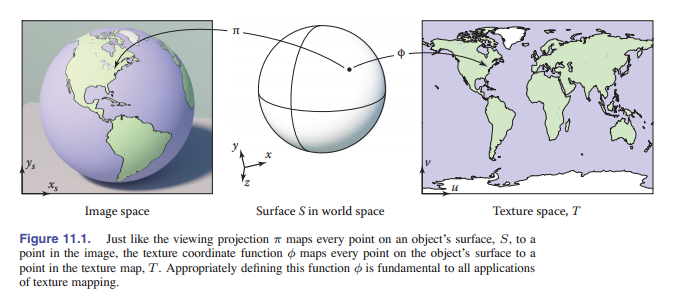

数学上看，就是从表面 $S$ 到纹理域 $T$ 发生了映射：

$$\phi : S \to T$$
$$:(x,y,z) \mapsto (u,v)$$

集合 $T$ ，通常称为 **纹理空间** ，一般来说是一个矩形图像；通常矩形用的是单位正方形： $(u,v) \in [0,1]^2$ （在本书中，我们将使用 $u$ 和 $v$ 作为两个纹理坐标的名字）。在很多情况下，它类似于第 7 章中讨论的视图投影（在本章中称为 $π$ ）。视图投影的作用是将场景中物体表面上的点映射到图像中的点；两者其实都是 3D 到 2D 的映射，渲染的时候也都需要它们：一个用处是获得纹理值，另一个的用处是将着色后的颜色值放在图像正确的位置上。虽然但是，它们也有一些区别： $π$ 的变换方式基本上都是透视或正交投影，而 $φ$ 可以有多种形式；而且，图像只有一个视图投影，而场景中的每个物体的纹理坐标函数可能各不相同。

从表面到纹理的映射看上去好像不太对，但我们是把纹理贴在物体的表面，这样的函数正是我们需要的。

而对于上述的木地板情景，如果地板恰好处于 $z$ 轴的固定高度，并与 x 和 y 轴对齐，我们可以使用下面的映射：

$$u=ax; \quad  v=by$$

我们选出合适的 $a,b$ ，将物体坐标 $(x,y,z)$ 映射到纹理坐标 $(s,t)$ 上，然后使用纹理上与该坐标最近位置的 $(u,v)$ 的像素值（ _texel_ ）。 [图 11-2] 是使用这种方法渲染出来的场景。

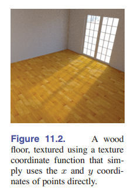
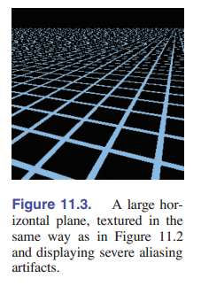

不过，这种方法有很多限制：如果房间是以与 x 轴和 y 轴中间的某一个夹角建模，或者如果我们想要弯曲的椅背上的木质纹理，那么怎么办呢？这就需要一些更好的方法来计算曲面上点的纹理坐标。

上面讲的简单形式的纹理映射法产生的另一个问题是，我们通过一种从狭窄的的角度，将高对比度的纹理渲染到低分辨率的图像中，最后得到了奇怪的图像。 [图 11.3] 显示了一个使用高对比度格子纹理渲染的大平面，视角类似于朝向地平线的样子。你可以看到，它产生了混叠（前面的锯齿和后面密密麻麻的点），这就很像 [第九章] 我们不使用滤波器对图像进行重采样的图案。这里的图像这么小你都能看到混叠，说明它其实非常明显。实际情况可能会好一点，但在动画的生成中，这些图案会四处移动，就算混叠不严重，也会很容易看到画面的问题。

至此，我们现在已经看到了基本纹理映射中的两个大问题：

- 定义纹理坐标函数的困难
- 如何查找纹理值，但不引入太多的混叠

这两个问题对于所有类型的纹理映射应用都很重要，并在 [11.2 节] 和 [11.3] 节中进行了讨论。你了解了它们以及它们的解决方案，你就算是参悟了纹理贴图了。剩下的就是如何在不同的应用中将纹理映射模块进行合理的安排，参见 [11.4 节] 。

## 11.2 纹理坐标函数

纹理映射的结果如何，主要取决于纹理坐标函数设计的好不好。怎么设计呢？你可以想象一下将一幅矩形的图像慢慢贴合到你绘制的三维物体上；或者，你将三维物体的表面压平，不要让它起皱、撕裂或折叠，最终将它平放在图像上。这个步骤有些时候很容易：也许 3D 表面已经是一个扁平的矩形。在其他情况下，这其实是非常棘手的：3D 形状可能非常复杂，就像角色的身体表面，你很难将图片完美贴合。

学术界早就在研究如何定义纹理坐标函数的问题了。最早遇到这样问题的可能是制作地图的那帮人：地球是圆的，但你需要它展开成一张长方形的地图。从地球仪到平面地图的映射会不可避免地导致区域、角度和/或距离的失真，这会让地图不精确。几个世纪以来，人们提出了许多地图投影，所有投影都在平衡几个不同的问题：在最大限度地减少各种失真的同时，能覆盖纹理映射中尽可能大的一个连续块。

在一些应用程序中(我们将在本章后面看到)，我们有理由使用某些特定种类的映射，不用自己单独写。但在大多数情况下，设计纹理坐标映射是一项高端任务，需要在一系列冲突的收益面前找到平衡点，熟练的建模师也需要付出相当大的努力。

你可以用任何想得到的方法来定义 $φ$ 。但有几个利益冲突的地方需要考虑:

- **双射。** 在大多数情况下，你希望 $φ$ 是 _双射_ 的(参见 [2.1.1 节] )，这样表面上的每个点都能映射到纹理空间中的各个点。如果几个点映射到同一个纹理空间中的点，纹理中一个点的值改变将影响表面上所有映射的点的值。如果你想让纹理在表面上重复(比如有重复图案的壁纸或地毯)，那么多对一映射是有意义的，但如果是个意外，那就不太好了。
- **大小失真。** 纹理的缩放应该在整个表面上基本不变。也就是说，所有表面上距离相同的紧密点也应该都被映射到纹理中距离相同的点。因此就函数 $φ$ 而言， $φ$ 的导数的变化率（二阶导）不能太大。
- **形状失真。** 纹理看上去不应该是是扭曲的。也就是说，在表面绘制的一个小圆形，应该映射到纹理空间中的一个合理的圆形，而不是一个被压扁或拉长的样子。因此对函数 $φ$ 而言， $φ$ 的导数在不同方向上（方向导数）不应相差太大。
- **连续性。** 生成的纹理贴图不应该有太多缝：表面上的相邻点也应该映射到纹理中的相邻点。也就是说对函数 $φ$ 来说，应该是连续的，再不济也需要不连续尽可能的少。在大多数情况下，一些不连续是不可避免的，那么我们可以尽量把它们放在不显眼的位置。

通过 _参数方程_ ( [2.5.8 节] )定义的曲面有一个开箱即用的纹理坐标函数可作为选择：也就是简单地将曲面参数方程取逆，然后将两个参数 $u,v$ 用作纹理坐标。这些纹理坐标可能有，但也也可能没有我们想要的属性（取决于表面形状等因素），但它们确实提供的是一个映射，可以作为纹理映射。

但是对于 _隐式曲面_ ，或者只是由三角形网格定义的曲面，我们需要一些其他的方法来定义纹理坐标，不能依赖于现有的参数化的方法。广义上讲，定义纹理坐标的两种方法是从表面上的点坐标、或从网格表面，通过几何的计算，在它们的顶点存储纹理坐标的值，然后对整个表面进行插值。下面让我们挨个看看这些方法。

### 11.2.1 几何确定的纹理坐标

几何确定的纹理坐标用于形状简单的场景或某些特殊情况。它是一种快速的办法。或者我们可以先算出它，然后手工调整纹理坐标映射。我们将通过讲解如何把 [图 11.4] 的测试图像映射到表面，来阐述各种各样的纹理坐标函数。纹理图像中的数字可以让你方便地从渲染出的图像中看到近似的 $(u, v)$ 坐标，网格可以让您看到映射的扭曲程度。

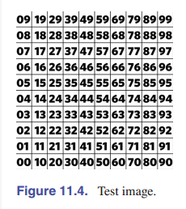
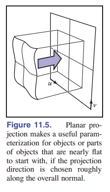

#### 平面投影

从 3D 到 2D 最简单的映射可能就是平行投影了：它用的映射和正交投影使用的映射相同( [图 11-5] )。我们在 [7.1 节] 已经研究出来的用于 _视图变换_ 的机制，可以直接用在纹理坐标的变换上：就像正交投影可以通过矩阵相乘，然后可以丢掉 $z$ 分量一样，通过平面投影生成的纹理坐标也可以通过简单的矩阵相乘来完成：

$$
\phi (x,y,z) = (u,v) \quad {\rm where}  \left [ \begin{matrix}
    u \\
    v \\
    * \\
    1 \\
    \end{matrix} \right ] = M_t \left [ \begin{matrix}
    x \\
    y \\
    z \\
    1 \\
    \end{matrix} \right ],
$$

其中，纹理矩阵 $M_t$ 表示仿射变换， $*$ 表示我们不关心第三个坐标的结果，也就是可丢弃的 $z$ 。

这对于几乎平坦的表面有很好的效果，因为表面法线没有太多变化，通过对法线取平均就可以找到一个不错的投影方向了。但是对于所有的闭合物体，这样的平行投影 **不是单射**：不管是前面还是后面的物体坐标，都会被映射到同一个纹理值上。（ [图 11-6] ）

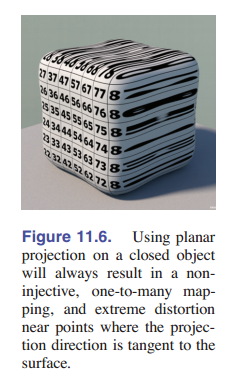
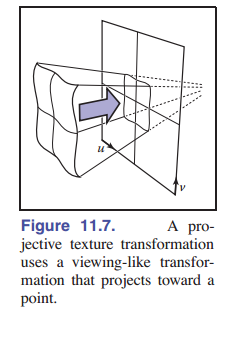

通过简单地用透视投影代替正交投影，我们同样能得到投影纹理坐标( [图 11-7] )：

$$
\phi (x,y,z) = (\tilde{u}/w,\tilde{v}/w) \quad {\rm where}  \left [ \begin{matrix}
    u \\
    v \\
    * \\
    1 \\
    \end{matrix} \right ] = P_t \left [ \begin{matrix}
    x \\
    y \\
    z \\
    1 \\
    \end{matrix} \right ],
$$

现在 $4×4$ 矩阵 $P_t$ 表示一个投影变换（不一定是仿射变换）：也就是说，最后一行可能不是 $[0,0,0,1]$ 。

基于投影的纹理坐标在 _阴影映射_ 技术中很重要，详见 [11.4.4 节] 。

#### 球坐标映射

对于球面，我们一般通过参数化球面的经纬度来构建球坐标。

形状大致为球形的表面的参数化可以使用这种纹理坐标函数：使用径向投影将表面上的点映射到球体上的点（也就是说，从球体中心通过表面上的点取一条直线，并找到与球体的交点），这个交点的球坐标就是纹理映射的起始坐标。

说人话！另一种说法是，你用球坐标 $(ρ,θ,φ)$ 表示曲面上的点，然后丢掉 $ρ$ 坐标（因为没啥用，我们映射纹理与这个球上有没有凸出来的点没有关系），将 $θ$ 和 $φ$ 分别映射到范围 $[0,1]$ 内，就是一个纹理映射了。这个公式依赖于 **球坐标** ，参见 [2.5.8 节] 。

$$\phi (x,y,z) = ([\pi+{\rm atan2}(y,x)]/2\pi ,[\pi - acos(z/\parallel x \parallel)]/ \pi)$$

> **atan2** 函数之前提到过，参见 https://baike.baidu.com/item/atan2/10931300

如果一个物体从中心点看，可以看到整个表面，那么球坐标除了球的极点以外的所有地方都是 **双射** 。和球坐标一样，它也有两极附近失真的问题。 [图 11.8] 显示了一个使用球面坐标的物体，这样的纹理映射比较合适。

> 本章中的所有纹理坐标函数用于标准立方体 $[−1,1]^3$ 中，以原点为中心。

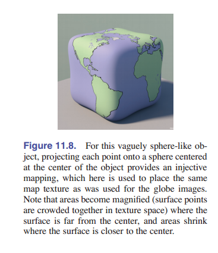
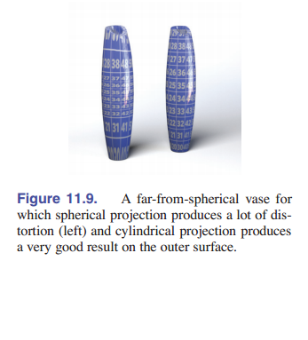

#### 柱坐标映射

对于长得更像柱状，而不是球形的物体，从一根竖着的轴 向外投射到圆柱体上 的方法 比 由中间一个点投射到球体上的映射效果更好。与球面投影类似，这相当于转换为柱坐标，然后丢掉半径：

$$\phi (x,y,z) = \left(\frac{1}{2\pi} [\pi+{\rm atan2}(y,x)]/2\pi, \frac{1}{2}[1+z] \right)$$

#### 立方体贴图

使用球坐标来参数化一个球形或类似球形的物体，通常会导致在这两个球极点附近有很明显的走样，也就说明了纹理中有两个特殊的点出了问题。有一个常用的解决办法是将映射规范化，但它会将纹理变得不连续。这个方案的具体做法是：先将图案先投射到一个立方体上，而不是球体上，然后为立方体的六个面使用六个单独的正方形纹理。这六个正方形纹理就叫 **立方体贴图** 。

计算立方体贴图的纹理坐标也比球面坐标开销更少，因为投影到平面上只需要进行一个除法 —— 它的本质和视图成像的透视投影一样：

$$(x,y,z) \mapsto \left(\frac{x}{z} , \frac{y}{z} \right).$$

立方体贴图存在一个问题，那就是如何在六个面上定义 u 和 v 方向，而这需要一个约定俗成的规矩。选择不同的规定会影响纹理的内容，所以引入一个通用的规矩很重要。由于立方体贴图通常是用在从立方体内部看向六个面，纹理是在立方体的内部，所以我们通常约定，把 $u$ 和 $v$ 调整为从里面看 $u$ 相对于 $v$ 是时针方向。 **OpenGL** 采用下面的约定：

$$\phi_{-x}(x,y,z) = \frac{1}{2} [1+(+z,-y)/|x|]$$
$$\phi_{+x}(x,y,z) = \frac{1}{2} [1+(-z,-y)/|x|]$$
$$\phi_{-y}(x,y,z) = \frac{1}{2} [1+(+x,-z)/|y|]$$
$$\phi_{+y}(x,y,z) = \frac{1}{2} [1+(+x,+z)/|y|]$$
$$\phi_{-z}(x,y,z) = \frac{1}{2} [1+(-x,-y)/|z|]$$
$$\phi_{+z}(x,y,z) = \frac{1}{2} [1+(+x,-y)/|z|]$$

其中，下标表示每个投影对应于立方体的哪个面。例如， $φ_{−x}$ 表示在映射到 $x = +1$ 这个面的点。你可以观察绝对值最大的坐标，来判断一个点投影到了哪个面:例如，如果 $|x| > |y|$ 和 $|x| > |z|$ 也就是 $x$ 的绝对值最大，那么这个点就投影到了 $+x$ 面或 $-x$ 面，按 $x$ 的符号而定。

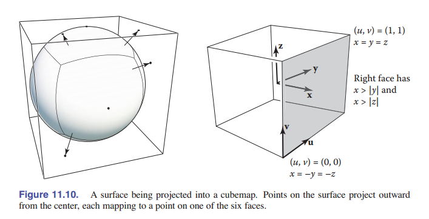

一个用于立方体贴图的纹理包含了六个正方形 (见 [图 11.10] )，它们通常是存储在一张图里的，也就是存储了立方体的展开图。

### 11.2.2 插值纹理坐标

对于三角形网格表面，我们可能需要更精细地控制纹理坐标函数。您可以显式地存储每个顶点的纹理坐标，然后用 **重心坐标** （[8.1.2 节]）对它插值。插值方法与网格上定义的其他平滑变化的量完全相同：比如颜色，法线，就算是 3D 位置本身也是通过这种方法插值的。

> 重心坐标很简单，但很重要，如果你忘了就回去看看！

我们来看一个例子，只有一个三角形。 [图 11-11] 显示了一个三角形纹理，它映射了一部分先前的测试图案。通过观察三角形上的图案，很容易就能发现这三个点的纹理坐标是 $(0.2,0.2)$ 、 $(0.8,0.2)$ 和 $(0.2,0.8)$ ，它们在纹理中也是一个三角形。
和上一节的映射一样，我们通过指定纹理映射函数来指定纹理在表面上的位置。这样，再赋值三个顶点，顶点和纹理空间的位置就对应起来了。只要顶点成功定位了，三角形之间的点就可以通过线性（重心）插值解决。

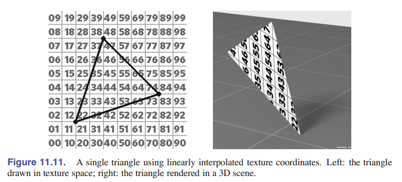
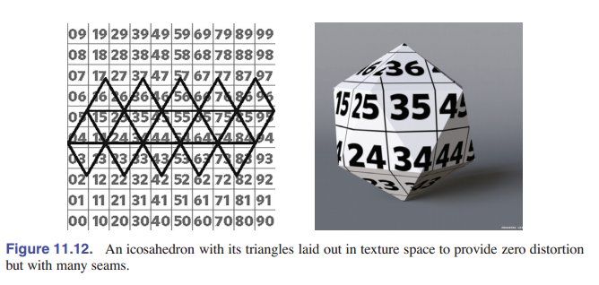

[图 11-12] 中，我们介绍了一种在整个网格上让纹理坐标可视的方法：也就是在纹理图像上直接画三角形，然后确定三角形各个顶点的纹理位置。通过这样的可视化，我们看到哪部分纹理用在哪个三角形上。这种方法在 debug 和划分纹理区域的时候非常有用。

通过顶点定义的纹理坐标映射的画面质量取决于顶点的选择 —— 也就是说，取决于怎么选取合适的网格。不管分配了什么坐标，只要网格中的三角形有公共顶点( [12.1 节] )，纹理坐标映射就是连续的。因为相邻的三角形在它们共享顶点上的纹理坐标一样。但是上面描述的其他性质就没那么好了。 _单射性_ 意味着，三角形在纹理空间中一定不会重叠 —— 如果重叠了，就说明纹理中的某个点会在曲面上好几个地方出现，那肯定不对。

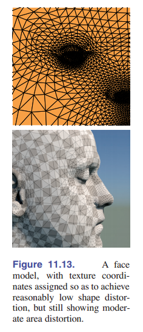

当纹理空间中三角形的面积与其在三维空间中的面积成比例时，就不容易出现 _大小失真_ 。比如，如果用连续的纹理坐标函数映射一个人脸，鼻子部分的纹理空间通常就只能在纹理图像中的一小块区域，如 [图 11-13] 。虽然鼻子上的三角形比脸颊上的小，但尺寸比例在纹理空间上的显示更加离谱。最终结果就会造成鼻子上的纹理被放大，因为小面积的纹理覆盖了较大的面积。同样地，我们比较一下前额和太阳穴，三角形在三维空间中大小相似，但太阳穴周围的三角形在纹理空间中更大，会导致纹理在太阳穴看起来更小。

同样，当三角形的形状在三维和纹理空间中比较近似时，大小失真就不明显了。其实这个人脸的例子的大小失真还算是比较轻微的，但是，还有一个例子，[图 11-17] 中的球体在极点附近的大小失真就很明显。

### 11.2.3 材质平铺、拼接模式和纹理转换

我们应该允许纹理坐标超出纹理图像的边界。有这样一个细节让我们考虑这个问题：比如纹理坐标计算中的舍入错误，可能会导致一个落在纹理边界上的顶点的超出一点点，但纹理映射机制不应该轻易报错。而大多数情况，纹理映射能够超出图像边界的功能有其他用途。

如果一个纹理只应该覆盖表面的一部分，但是纹理坐标已经被设置成了对整个表面进行映射，那么我们有一种选择是：准备一个尺寸不大的、大部分空白的纹理图像。但是这样的话你要得到非空白的纹理，那一小块地方必须做的非常精细。还有一种方法，就是缩放所有纹理坐标，这样的话它就能覆盖更大的范围，比如 $[-4.5,5,5] \times [-4.5,5,5]$ 。这样就可以把单位正方形定位在曲面中心的十分之一大小的地方了。

对于上面这样的情况，如果查找落到了单位正方形的外面，应该返回恒定的背景颜色。一种方法是设置一个背景色，接收到单位正方形外的纹理查询就可以直接返回。如果纹理图像已经有恒定的背景颜色了(例如，白色背景上的徽标)，另一种方式是拓展背景颜色到平面上，可以允许单位正方形以外的查找，返回纹理图像边缘上最近点的颜色。我们可以从第一个像素到最后一个像素逐渐逼近 $u$ 和 $v$ 坐标（也就是 **拉伸** ），来实现这个效果。

不过有时候一个重复的图案正是我们需要的，比如棋盘、瓷砖地板或砖墙。如果这种纹理在矩形网格上重复出现一模一样的，那么创建这么大的图像就太浪费了。相反，我们可以使用 _环绕索引_ 来处理纹理图像之外的纹理查找 —— 当查找的点超出纹理图像的右边后，它就会返回到左边缘。我们通过对坐标进行整数取余操作就可以非常简单的处理这个问题。代码如下：

```java
Color texture_lookup_wrap(Texture t, float u, float v) {
  int i = round(u * t.width() - 0.5)
  int j = round(v * t.height() - 0.5)
  return t.get_pixel(i % t.width(), j % t.height())
}

Color texture_lookup_wrap(Texture t, float u, float v) {
  int i = round(u * t.width() - 0.5)
  int j = round(v * t.height() - 0.5)
  return t.get_pixel(max(0, min(i, t.width()-1)),
                    (max(0, min(j, t.height()-1))))
}
```

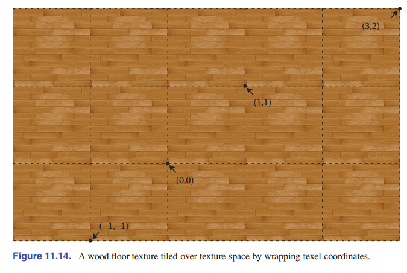

怎么选择这两种越界查找的处理方式呢？我们可以通过选择 _拼接模式_ 来完成。包装模式包含了平铺、拉伸， 或者也可以是这两种方式的组合或变体。使用拼接模式，我们可以将纹理想象成一个函数，它可以在无限二维平面中的任何一点返回颜色 ( [图 11.14] ) 。当我们使用图像指定了一个纹理时，拼接模式就可以告诉纹理映射函数怎么使用有限的图像数据来寻值。在 [11.5 节] 中，我们将看到纹理可以通过程序自然地扩展到无限大的平面上，因为它们不受有限图像数据的限制。由于两者在逻辑上都是无限的，这两种类型的纹理可以互换。

当调整纹理的缩放和位置时，我们不应该修改生成纹理坐标的方法，也不应该修改存储在网格顶点中的纹理坐标，相反地，我们可以在对纹理进行采样前应用矩阵变换：

$$\phi({\rm \textbf{x}}) = {\rm\textbf{M}}_T \ \phi_{\rm model} (\rm\textbf{x})$$

这里 $\phi_{\rm model}$ 是模型提供的纹理坐标函数， ${\rm \textbf{M}}_T$ 是一个 3x3 的矩阵,表示一个使用齐次坐标进行二维纹理坐标的仿射变换或投影变换。这样的变换有有时是被限制的，只能进行缩放或平移。大部分使用纹理映射的渲染器都支持这样的功能。

### 11.2.4 正确的透视插值

我们其实没法对三角形进行纹理坐标插值来获得正确的透视视觉效果，但是我们可以在光栅化阶段解决这个问题。事情不简单的原因是我们只在屏幕空间对纹理进行了插值，这导致图片的视觉效果有问题，就像 [图 11.15] 展示的网格纹理一样。

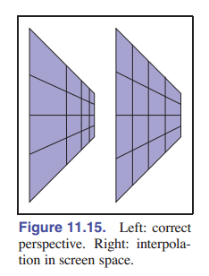

由于透视中的物体随着与观看者距离的增加而变小，所以在三维中均匀间隔的线条应该在二维图像空间中被压缩。为了实现这一点，需要对纹理坐标进行更仔细的插值。

我们可以按 [8.1.2 节] 修改光栅化的方法,通过对 $(u,v)$ 坐标进行插值来实现三角形上的纹理映射，但是这会导致 [图 11.15] 右图所示的问题。如果屏幕空间的重心坐标在下面的光栅化代码中被这样使用，类似的的问题也会在三角形上出现：

```java
for all x do
  for all x do
    compute(α, β, γ) for (x, y)
    if α ∈ (0, 1) and β ∈ (0, 1) and γ ∈ (0, 1) then
      t = α*t_0 + β*t_1 + γ*t_2
      drawpixel (x, y) with color texture(t) for a solid texture
      or with texture(β, γ) for a 2D texture.
```

这段代码会渲染出有问题的图像。为了解决问题，让我们思考一下从世界空间 $\rm\textbf{q}$ 到齐次点 $\rm\textbf{r}$ 再到齐次点 $\rm\textbf{s}$ 的过程:

$$
\left [ \begin{matrix} x_q \\ y_q \\ z_q \\ 1 \\\end{matrix} \right ]
\stackrel{\rm transform}{\longrightarrow}
\left [ \begin{matrix} x_r \\ y_r \\ z_r \\ 1 \\\end{matrix} \right ]
\stackrel{\rm homogenize}{\longrightarrow}
\left [ \begin{matrix} x_r/h_r \\ y_r/h_r \\ z_r/h_r \\ 1 \\\end{matrix} \right ]
\equiv
\left [ \begin{matrix} x_s \\ y_s \\ z_s \\ 1 \\\end{matrix} \right ]
$$

处理纹理坐标插值问题最简单的方法是，当我们有两个点 $\rm\textbf{q}$ 和 $\rm\textbf{Q}$ ，都和纹理坐标 $(u,v)$ 相关联的时候，我们需要在图像中沿着 $\rm\textbf{s}$ 和 $\rm\textbf{S}$ 之间的直线生成纹理坐标。如果世界坐标中有一个在 $\rm\textbf{q}$ 和 $\rm\textbf{Q}$ 之间的点 $\rm\textbf{q}'$ ，它被投影到 $\rm\textbf{s}$ 和 $\rm\textbf{S}$ 中的一点 $\rm\textbf{s}'$ ，那么这两个点应该有相同的纹理坐标。

上面那个朴素的屏幕空间的算法告诉我们，对于点 $\rm\textbf{s}' = \alpha(\textbf{S} - \textbf{s})$ ，我们可以直接用坐标 $u_s + \alpha (u_S-u_s)$ 和 $v_s + \alpha (v_S+v_s)$ 来表示。但是世界空间的点 $\rm \textbf{q}'$ 映射到屏幕空间的某点 $\rm\textbf{s}'$ 并不是 $\rm\textbf{q}+\alpha (\rm\textbf{Q}-\textbf{q})$ 可以表示的。

但是，我们从 [7.4 节] 中又知道，线段上 $\rm\textbf{q}$ 和 $\rm\textbf{Q}$ 之间的点确实在 $\rm\textbf{s}$ 和 $\rm\textbf{S}$ 之间的线段上，只不过比例不一样罢了。所以下面这个公式成立：

$$\rm\textbf{q} + t(\rm\textbf{Q}-\textbf{q}) \mapsto \rm\textbf{s} + \alpha(\rm\textbf{S}-\textbf{s}) $$

如上，它们的比例系数不一样。不过它们比例系数之间的关系有迹可循：

$$t(\alpha) = \frac{w_r\alpha}{w_R+\alpha(w_r-w_R)} \ \  {\rm and} \ \ \alpha(t) = \frac{w_Rt}{w_R+t(w_R-w_r)}$$

> 我其实建议您推导一下这个公式，用的是我们第七章讲过的公式。

我们得到了这些方程式，就可以用它来解决屏幕空间的插值问题。可以通过计算 $u_s' = u_s+t(\alpha)(u_S+u_s)$ 和 $v_s' =v_s + t(\alpha)(v_S-v_s)$ 来得到屏幕空间 $\rm\textbf{s} + \alpha(\rm\textbf{S}-\textbf{s})$ 这个点的纹理坐标。为什么？因为我们添加的系数已经能把空间坐标转换成屏幕坐标 $\rm\textbf{q}'$ 转换成屏幕坐标 $\rm\textbf{s}'$ 了。不过，每个片元都算一遍 $t(\alpha)$ 是很慢的，有一个更好的办法。

不管怎样，我们上面得到了一个很有用的结论，那就是透视变换能保留线和平面。所以变换后我们进行不会插值到别的地方去。不过别忘了纹理坐标也需要和点一起经过透视变换。为了从几何上直观地理解这个问题，我们可以先降一维，先看齐次点 $(x_r,y_r,w_r)$ ，同时纹理是一维的 $u$ 的情况。属性 $u$ 应该是 $x_r$ 和 $y_r$ 的线性函数，所以如果我们将其视为二维的函数，画出来的图不应该有凹陷或者凸起，应该是一个平面。我们现在将 $u$ 作为第三个坐标来看（也就是地位和 $x_r,y_r$ 平等），我们叫它 $u_r$ 。然后我们就能发送一整个三维齐次点坐标 $(x_r,y_r,u_r,w_r)$ 来做透视变换。获得的结果是 $(x_s,y_s,u_s)$ ，就是屏幕上的一个点了。这个原来的平面内部经过了变换，肯定会有一定失真，但应该还是平的。这就说明 $u_s$ 是 $x_s,y_s$ 的一个线性函数。也就意味着我们还是可以通过某种线性变换将 $(x_s,y_s)$ 转换成纹理坐标 $u_s$ 。

回到我们的问题上来，我们想要对纹理坐标 $u,v$ 进行插值，而纹理坐标可以表示为世界坐标 $(x_q,y_q,z_q)$ 的线性组成。既然是线性组成，那么我们矩阵运算也可以带上它们：

$$\left [ \begin{matrix} u \\ v \\ 1 \\ x_r \\ y_r\\z_r\\w_r \end{matrix} \right ] \stackrel{\rm homogenize}{\longrightarrow}  \left [ \begin{matrix} u/w_r \\ v/w_r \\ 1/w_r \\ x_r/w_r = x_s \\ y_r/w_r = y_s\\z_r/w_r=z_s\\1 \end{matrix} \right ] $$

上面公式的含义是，我们可以对所有基于 $(x_s,y_s)$ 组成的值（包括深度缓冲中的 $z_s$ ）进行插值。之前我们用的朴素方法出的问题在于选择的插值分量不一致，只要涉及的数量来自透视变换之前或全部来自透视变换之后，就没问题了。

这样我们剩下了最后一个问题： $(\frac{u}{w_r}, \frac{v}{w_r})$ 不能直接用于查找纹理上面，我们实际上需要的是 $(u,v)$ ，这也是我们为什么在上面的公式多放了一个参数 $w_r$ ，它经过变换之后是 $1$ 。只要有这个参数，我们就可以将纹理坐标还原出来了。

为了检查上面的推论是不是正确的，我们来看看屏幕空间中对 $\frac{1}{w_r}$ 的插值会不会有世界空间中进行 $w_r$ 插值的效果：

$$\frac{1}{w_r} +\alpha(t) \left(\frac{1}{w_R} - \frac{1}{w_4} \right) = \frac{1}{w_r'} = \frac{1}{w_r+t(w_R-w_r)}$$

别忘记我们 [11.1 节] 提到过 $\alpha(t)$ 和 $t$ 是有关系的。

我们能够在转换后的空间中对 $\frac{1}{w_r}$ 正确的进行线性插值，所以我们能对三角形进行正确的纹理查找。所以我们可以将这些结论放在我们的扫描转换代码中，通过输入已经通过观察矩阵变换，但尚未经过齐次化的三个点 ${\rm\textbf{t}}_i=(x_i,y_i,z_i,w_i)$ ，得到它们的纹理坐标 $(u_i,v_i)$ 。修改后的代码如下：

```java
for all x_s do
  for all y_s do
    compute (α, β, γ) for (x_s, y_s)
    if (α ∈ [0, 1] and β ∈ [0, 1] and γ ∈ [0, 1]) then
      u_s = α(u0/w0) + β(u1/w1) + γ(u2/w2)
      v_s = α(v0/w0) + β(v1/w1) + γ(v2/w2)
      1_s = α(1/w0) + β(1/w1) + γ(2/w2)
      u = u_s/1_s
      v = v_s/1_s
      drawpixel (x_s, y_s) with color texture(u, v)
```

当然，这个伪代码中出现的许多表达式的值都是在循环之外预先计算好的，这样可以提高速度。对于实体纹理，在属性列表中加入原始世界空间坐标 $(x_q,y_q,z_q)$ ，并将这三个变量看作是和 $u,v$ 地位一样的量，就可以获得正确的插值的世界空间坐标，将其传递给实体纹理函数。

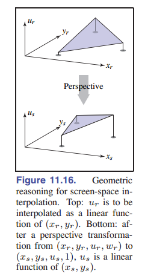

### 11.2.5 连续性和接缝

对于评判一个好的纹理映射函数，低失真度和高连续性是必不可少的指标。但是有一些失真和不连续是不可避免的。对于任何闭合的三维曲面，拓扑学告诉我们：没有一个连续的双射函数可以将整个曲面映射到纹理图像中。所以需要采取措施，我们引入了接缝（即纹理坐标突然改变的表面上的曲线）—— 这样我们可以在其他地方保持低失真度。上面讨论的许多几何确定的映射已经包含了接缝：在球面和圆柱坐标中，接缝是 $\rm atan2$ 函数计算的角度，范围是 $(π,-π)$ ，而在立方体贴图中，接缝沿着立方体的边缘，六个方形纹理之间的映射不断切换。

对于插值纹理坐标，接缝需要特别留意，因为它们不是自然而然发生的。之前我们学到了插值纹理坐标如何在共享顶点网格上自动连续 —— 使用共享纹理坐标可以做到。但这意味着，如果三角形跨接缝，并且一侧有一些顶点，而另一侧有一些顶点，则插值机制会很乐意提供连续的贴图，但是它可能会高度失真或折叠，从而导致不是单射。 [图 11-17] 在用球坐标映射的地球仪上说明了这个问题。

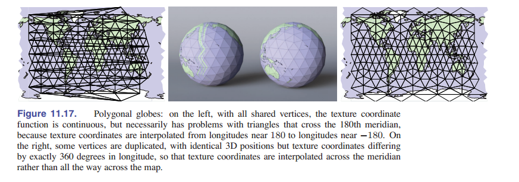

例如，在地球底部附近有一个三角形，它的一个顶点在新西兰南岛的顶端，另一个顶点在北岛东北约 400 公里处的太平洋上。一个聪明的飞行员在这些点之间飞行，他会飞越新西兰，但是路径的起点是经度 $\rm 167°s \ E \ (+167)$ ，结束于$\rm 179°s \ W \ (-179)$ ，如果采用线性插值，飞行员会选择一条穿越南美洲的路线。这将导致整个地图的后半部分会挤在一起，显示在本初子午线那块地方！当然我们可以通过等效经度 $\rm 181°s \ E$ 来标记第二个顶点，但这只会将问题推到下一个三角形，并不能解决问题。

创建一个正确的边缘过渡的唯一方法是，避免在接缝处共享纹理坐标：穿过新西兰的三角形需要插值到 $+181$ 经度，太平洋中的下一个三角形需要继续从 $-179$ 经度开始。为此，我们在接缝处复制顶点：对于每个顶点，我们添加一个具有相等经度的顶点，但相差 $\rm 360°s$ ，并且接缝两侧的三角形用这两个不同的顶点。 解决方案如 [图 11-17] 的右半部分所示，其中纹理空间最左侧和最右侧的顶点是重复的，三维空间的坐标实际上相同。

## 11.3 抗锯齿纹理查询

> 该复习了！看看第九章的前半部分吧家人们。

纹理映射的第二个基本问题是抗锯齿。渲染纹理映射的图像可以看作是一个采样的过程：将纹理映射到表面上，然后将表面投影到显示的图像中，这个步骤实际上就是在整个图像平面上产生二维的函数，我们会以像素为单位对其进行采样。就像我们在 [第 9 章] 中看到的，当图像包含细节或锐利的边缘时，使用点样本执行此操作会产生锯齿 —— 并且由于纹理的整个点都要引入细节，因此它们产生了像我们在 [图 11-3] 中看到的锯齿。

类似于线条或三角形的抗锯齿光栅化、抗锯齿光线跟踪（参见 [13.4 节] ）、以及对图像进行降采样（参见 [9.4 节] ），解决方案是使像素值不再是点的样本，而是图像面积的平均值，平均值采取的区域基于像素的大小。使用与抗锯齿光栅化和光线跟踪相同的超采样方法，只要有足够的样本，纹理映射机制不进行改动也能获得出色的结果：我们通过多种纹理映射方法，在纹理图像上找多个采样点，然后做平均，可以估算像素上图像的平均颜色。但是，使用详细的纹理需要很多采样点才能获得良好的效果，而这很耗性能。如何在表面存在纹理的情况下， **高效** 地计算这块地方的颜色平均值？ 这是纹理抗锯齿的需要解决的一个主要问题。

由于纹理图像通常由光栅图像定义，因此，就像对图像进行上采样一样，我们还需要考虑重建的问题( [9.4 节] )。
重建的解决方案可以用在纹理上：使用重采样滤波器在纹理像素之间进行插值。

我们将在以下几节中详细介绍这些主题。

### 11.3.1 一个像素的覆盖区

使抗锯齿纹理比其他类型的抗锯齿更复杂的原因在于，渲染图像和纹理之间的关系是不断变化的。每个像素值都应该是图像中属于该像素的 **区域** 的平均颜色，通常情况下，像素对应单个表面，这相当于对表面上一个区域求平均。如果表面颜色来自纹理，则需要依次对纹理的相应部分进行取平均，这称为像素的 _纹理空间覆盖区_ 。 [图 11-18] 说明了一块正方形区域（像素较低的图像的一个像素就像这样，很大）的覆盖区如何映射到地板纹理空间中大小和形状完全不同的各个区域上。

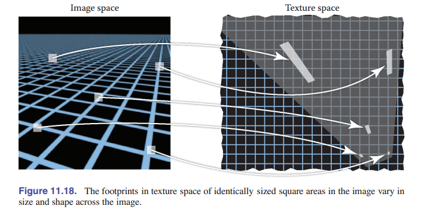

回忆一下使用纹理进行渲染所涉及的三个空间：投影 $π$ 将三维空间中的点映射到图像中，纹理坐标函数 $\phi$ 将三维空间的点映射到纹理空间中。为了处理像素覆盖区，我们需要了解这两个映射的组合：首先反向跟随 $π$ ，从图像到表面，然后向前跟随 $\phi$ 。组合 $\psi =\phi \ \circ \pi^{-1}$ 决定了像素覆盖区：像素覆盖区是图片经过 $\psi$ 变换后的一个方形区域。

纹理抗锯齿的核心问题是计算像素覆盖区上纹理的平均值。通常，要精确地做到这一点可能是一件相当复杂的工作：对于一个具有复杂表面形状的遥远物体，覆盖区可能在纹理空间中覆盖了大面积的复杂的形状，或者是几个不连续的区域。但是在一般情况下，像素会落在表面的平滑区域中，这个区域会映射到纹理图像中的一个区域。

因为 $\psi$ 既包含从图像到表面的映射，又包含从表面到纹理的映射，所以覆盖区的大小和形状取决于视角和纹理坐标函数。当表面更靠近相机时，像素覆盖区较小；当同一表面移得更远时，区域面积会变大。当以倾斜角度观察表面时，像素在表面上的覆盖区会变长，这意味着它在纹理空间中也会变长。就算视角是固定的，纹理坐标函数也会导致覆盖区变化：如果纹理坐标函数使区域变形了，则覆盖区的大小也会发生变化；如果它使形状变形了，那么就算是俯视图，看上去也是拉长的。

但是，为了找到一个高效计算抗锯齿查询的算法，我们需要进行一些近似。

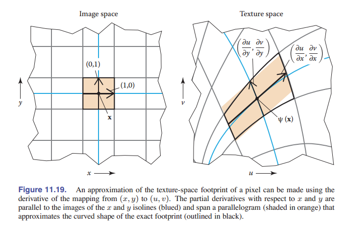

当一个函数是平滑的，一个线性近似值通常是有用的。对于纹理抗锯齿，这意味着从图片空间到纹理空间的 $\psi$ 映射被近似看作了一个从 2D 到 2D 的映射：

$$\psi (\rm\textbf{x}) = \psi (\textbf{x}_0) + J(\textbf{x}-\textbf{x}_0)$$

这里 $2×2$ 矩阵 $\rm\textbf{J}$ 是 $ψ$ 的导数的近似。它有四个元素，如果我们将图像空间的位置表示为 $x = (x, y)$ ，将纹理空间的位置表示为 $u = (u, v)$ ，那么就是：

$${\rm\textbf{M}} = \left [ \begin{matrix} \frac{du}{dx} & \frac{du}{dy} \\  \frac{dv}{dx} & \frac{dv}{dy} \end{matrix} \right ] $$

> 数学上说，这里使用一阶泰勒来近似函数 $\psi$ 。

这里四个导数描述了当我们改变 $x$ 和 $y$ 时，在图像中 $(x, y)$ 点上看到的纹理点 $(u, v)$ 是如何变化的。

这种近似方法的几何解释是，图像中以 $x$ 为中心的，单位大小的正方形像素区域，被近似地映射到纹理空间中的以 $\psi (\rm\textbf{x})$ 为中心、向量 ${\rm\textbf{u}}_x = (du/dx,dv/dx),{\rm\textbf{u}}_y = (du/dy,dv/dy)$ 为边的平行四边形上。

导数矩阵 $\rm\textbf{J}$ 很有用，因为它描述了整个图像（近似）纹理空间覆盖区变化的整个过程。较大的导数表示较大的纹理空间覆盖区，并且导数向量 ${\rm\textbf{u}}_x$ 和 ${\rm\textbf{u}}_y$ 之间的关系表示了形状。当它们正交且等长时，覆盖区为正方形，并且它们变得偏斜/长度相差很大，覆盖区将会被拉长。

现在，我们已经得到了这种问题的所谓“正解”：在特定图像空间位置处的 **纹理过滤** 样本，应该是此点纹理坐标导数定义的平行四边形形状轮廓上的纹理贴图的均值。这基于一个假设，即假设从图像到纹理的映射是平滑的，它已经足够准确了，可以得到很好的图像质量。但是，该平行四边形面积平均值开销太大，无法精确计算，因此我们有各种近似方法来代替计算。纹理抗锯齿的方法在速度/质量的折中方面，不同的偏好有不同的方法。我们将在之后章节中讨论这些方法。

> 这里的方法使用一个盒式滤波对图像进行采样。一些系统转而使用高斯像素滤波器，它会在纹理空间中变成椭圆高斯，这便是椭圆加权平均 (EWA) 。

### 11.3.2 重建

当覆盖区小于纹理像素时，我们会将纹理映射到图像中时将其放大。 这种情况类似于对图像进行上采样，并且主要考虑在纹理像素之间进行插值以生成平滑的图像，以生成纹理像素网格不明显的平滑图像。 就像在图像上采样中一样，此平滑过程由重建滤波器定义，该重建滤波器用于计算纹理空间中任意位置的纹理样本。（参见 [图 11-20] ）

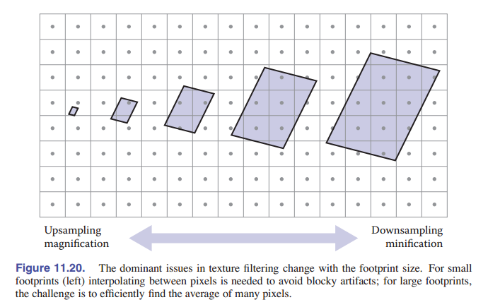

需要注意的事项与图像重采样几乎相同，但有一个重要区别。在图像重采样中，任务是在规则的网格上计算输出样本，并且在可分离的重采样滤波器的情况下，这种规则实现了重要的优化。在纹理过滤中，查找模式不规则，必须分别计算样本。这意味着大型高质量的重建滤波器使用起来开销非常大，因此，通常用于纹理的最高质量滤波器就是 _双线性插值_ 。

双线性插值纹理样本的计算与计算一个图像上的像素的双线性插值上采样方法相同。首先，我们根据纹理像素坐标（实数值）表示纹理空间采样点，然后读取与它相邻的四个纹理像素的值，取其平均值。纹理通常在单位正方形上进行参数化，并且纹理像素的位置与图像中的像素定义差不多，在 $u$ 方向上以 $1/n_u$ 的间隔和在 $v$ 方向以 $1/n_v$ 的间隔放置，为了保持对称性，纹理像素 $(0,0)$ 的位置是往边缘内部半个纹理像素的地方。（有关完整说明，请参见 [第 9 章] 。）下面是代码：

```java
Color tex_sample_bilinear(Texture t, float u, float v) {
  u_p = u * t.width - 0.5
  v_p = v * t.height - 0.5
  iu0 = floor(u_p); iu1 = iu0 + 1
  iv0 = floor(v_p); iv1 = iv0 + 1
  a_u = (iu1 - u_p); b_u = 1 - a_u
  a_v = (iv1 - v_p); b_v = 1 - a_v
  return a_u * a_v * t[iu0][iv0] + a_u * b_v * t[iu0][iv1] +
          b_u * a_v * t[iu1][iv0] + b_u * b_v * t[iu1][iv1]
}
```

在许多系统中，双线性插值成为了重要的性能瓶颈，主要是因为从纹理数据中获取四个纹理像素值会导致内存延迟。因为从图像到纹理空间的映射是任意的，纹理的采样点可能不规则，但通常是连贯的，因为附近的图像点倾向于映射到附近的纹理点，这些点可能读取相同的纹理像素。因此，高性能系统具有专门用于纹理采样的硬件，这种硬件可处理插值并管理最近使用的纹理数据的缓存，以最大程度地减少从存储纹理数据的内存中提取慢速数据的次数。

阅读第 9 章后，您可能会觉得线性插值对于某些要求苛刻的应用程序不够平滑。但是，我们可以通过使用更好的滤波器，将纹理重新采样到更高的分辨率，从而使纹理足够平滑，双线性插值的效果也会变得令人满意。

### 11.3.3 Mipmapping（多级渐远处理）

好的插值只适用于纹理被放大的情况：也就是像素占位面积比纹理像素间距小的时候。当像素覆盖区覆盖了多个纹理像素时，良好的抗锯齿功能需要计算许多纹理像素的平均值以平滑信号，采样的时候才不会出差错。

一种计算覆盖区上的平均纹理值的非常准确的方法是找到覆盖区中的所有对应的纹理像素值并将其相加求平均。但是，当像素覆盖区很大时，这可能会开销非常大 —— 一次查找就可能需要读取数千个纹理像素。更好的方法是在不同大小和位置的各个区域上预先计算好，并存储纹理的平均值。

这个方法的一个常用实现叫做“MIP 映射”（Mipmapping）。一个 Mipmap 是一系列纹理图像，它们包含多个相同的图像，但分辨率越来越低。原始的全分辨率纹理图像称为 mipmap 的 **基本级别** 或 **级别 0** ，而级别 1 则是通过获取该图像并将其在每个维度中降采样 2 倍（原来的四分之一大小）而生成的。大致来说，此图像中的一个纹理像素是 0 级图像中面积为 $2\times 2$ 纹理像素区域的平均值。

可以继续进行此过程，以定义所需的任意多个 mipmap 级别：通过对 k 级图像 进行降采样 2 倍，来计算 k-1 级图像。k 级的纹理像素对应于原始纹理中面积为 $2^k$ 纹素大小的正方形区域。例如，从 $1024×1024$ 纹理图像开始，我们可以生成具有 11 个级别的 mipmap：0 级为 $1024×1024$ ；1 级为 $512×512$ ，依此类推，直到级别 10，只有一个纹理像素。这种具有以一系列越来越低的采样率表示相同内容的图像的结构，被称为 _图像金字塔_ ，将所有较小图像堆叠在原始图像顶部，看上去就像金字塔一样。

### 11.3.4 基于 Mipmap 的基础纹理过滤

使用 mipmap 或图像金字塔，与单独访问许多纹理像素相比，过滤得更有效。当我们需要在大面积上平均的纹理值时，我们只使用来自更高级别的 mipmap 的值，因为这些值已经是图像大面积上的平均值。最简单、最快的方法是从 mipmap 查找单个值，然后查看各个级别的纹理图像，看看哪个级别的图像上的纹理像素覆盖的大小与像素覆盖区的整体大小差不多。当然，像素覆盖区的形状可能与纹素表示的（正方形）区域的形状不同，所以有一些失真是无法避免的。

当像素覆盖区具有拉长的形状时该怎么做？我们先把这个问题放一放。假设覆盖区是长度为 $D$ 的正方形，以全分辨率纹理中的像素表示。那么哪个级别的 mipmap 适合采样？由于第 k 级的纹理像素覆盖了边长为 $2^k$ 的正方形，因此我们似乎可以选择：

$$2^k \approx D$$

，因此我们有理由令 $k=\log_2D$ 。当然，这在大多数情况下 $k$ 不是整数，但我们只存储了整数级别的 mipmap 图像。 两种可能的解决方案是，仅针对最接近 $k$ 的整数来查找纹理值（这样很高效，但在级别之间的突然过渡处会产生接缝），或者查找针对 $k$ 的两个最接近整数的值，并线性插值（工作量加大了一倍，但看上去更加顺滑）。

在我们实际写下对 mipmap 进行采样的算法之前，我们必须找到当覆盖区不是正方形时，“宽度” $D$ 的选择方法。 一些可能的方法是使用面积的平方根、或是找到覆盖区的长边，将其设定成宽度。实际上为了易于计算，用的是最长边的长度：

$$D = \max \{ \parallel{\rm\textbf{u}}_x \parallel\ , \parallel{\rm\textbf{u}}_y\parallel\}$$

```java
Color mipmap_sample_trilinear(Texture mip[], float u, float v, matrix J) {
  D = max_column_norm(J)
  k = log2(D)
  k0 = floor(k); k1 = k0 + 1
  a = k1 - k; b = 1 - a
  c0 = tex_sample_bilinear(mip[k0], u, v)
  c1 = tex_sample_bilinear(mip[k1], u, v)
  return a * c0 + b * c1
}
```

基本的 mipmapping 可以很好地消除锯齿，但是由于它无法处理细长的、或 _各向异性_ 的像素覆盖区，因此在以掠瞄的角度查看平面时的效果不佳。比如一个人站在大平原上看。 以非常陡峭的角度观察地面上较远的点，会产生非常各向异性的覆盖区，该覆盖区会被映射到较大的正方形区域。生成的图像将在水平方向上被拉长，显得很模糊。

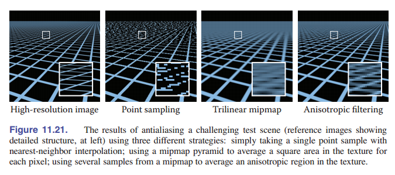

### 11.3.5 各向异性过滤

Mipmap 可以与多个查找一起使用，以更好地近似一个拉长的覆盖区。 这个想法是根据覆盖区的短边，而不是长边来选择 mipmap 的级别，然后将沿长轴间隔的几个查找平均在一起。（见 [图 11-21] ）

## 11.4 纹理映射的应用

只要你理解了为定义表面的纹理坐标的方法、以及查询纹理值的机制，就会发现这种机制有很多的用途。 在本节中，我们研究了纹理映射中一些最重要的技术。纹理是非常通用的工具，这里的应用范围受限于程序员想象力。

### 11.4.1 控制着色参数

纹理映射的最基本用途是通过使从光照中计算出来的漫反射颜色（无论是在光线追踪还是在片元着色过程中）依赖于从纹理中查询到的值，从而引入了颜色变化。纹理的漫反射部分可用于在表面上粘贴 _贴花_ ，涂鸦或打印文本，它还可以模拟材质颜色的变化，例如木材或石头。

不过，我们不仅能够更改漫反射颜色。其他的所有参数（如镜面反射率、镜面粗糙度）也可以进行纹理处理。例如，粘贴有透明胶带的纸板箱在任何地方都具有相同的漫反射颜色，但是贴了胶带的地方的镜面反射率更高，更亮。在很多情况下，不同参数的映射是相关的：比如，印有 Logo 的光滑白色陶瓷杯在印刷时可能会让表面变得更粗糙或更暗 [图 11.22] ，书本的标题如果用的是金属墨水印刷，可能会同时改变漫反射颜色，镜面反射颜色和粗糙度。

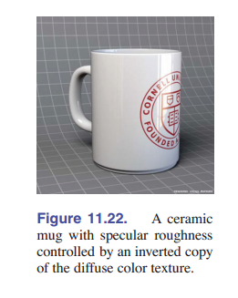

### 11.4.2 法线贴图和凹凸贴图

与着色关系很大的另一个变量是表面法线。对于法线插值（ [8.2 节] ），我们知道着色法线不必与基础表面的几何法线相同。 _法线贴图_ 指定了一些着色法线，使着色用的法线不依赖与几何法线。最简单的方法是将法线存储在纹理中，在每个纹理像素处存储三个分量，而不是颜色的三个量，作为法线向量的三维坐标。

但是，在使用法线贴图之前，我们需要知道从贴图读取的法线表示的是哪个坐标系的坐标。将法线直接存储在模型空间中，也就是用于表示表面几何形状的同一坐标系中是最简单的方法：从贴图读取的法线可以与表面本身所表示的法线数据一样使用：在大多数情况下，程序会将其转换到世界空间以进行光照计算，就和几何体附带的法线一模一样。

但是，存储在模型空间中的法线贴图与表面几何是联系在一起的，即使法线贴图没有效果，为了用几何法线再现正确的结果，法线贴图的内容必须保持与模型表面的法线一致。因此，如果表面变形了，几何法线发生了变化，那么模型空间法线贴图也就废了，因为着色法线没变，显然会出错。

解决方案是为附着在表面上的法线定义一个坐标系。这样的坐标系可以基于曲面的切线空间（参见 [2.5 节] ）：选择一组切线向量，并使用它们定义标准正交基（参见 [2.4.5 节] ）。纹理坐标函数本身提供了一种选择一组切线向量的有效方法：使用与常数 $u$ 和 $v$ 的切线方向。这些切线通常不是正交的，但是我们可以用 [2.4.7 节] 中的“平方向上”方法，或者可以使用表面法线和一个切向量来定义。

当法线使用这种方法表示时，它们的变化值要小得多；由于它们大多指向光滑表面的法线方向附近，因此它们将在法线映射中的向量都会在 $(0,0,1)^T$ 附近。

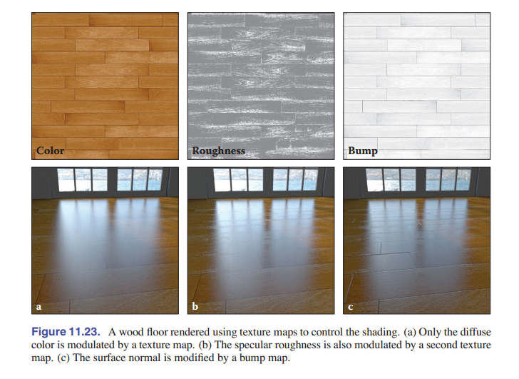

法线贴图从哪儿来？通常，它们是根据更详细的模型计算出来的，光滑的表面近似于该模型。有时它们可以直接从真实表面进行测量得出。也可以作为建模过程的一部分进行编写。在这种情况下，其实最好是使用 _凹凸贴图_ 来间接指定法线。这个想法是，凹凸贴图是一个高度场：这是一个函数，给出了光滑表面上方的局部高度。值较大的地方（如果将贴图显示为图像，则这个贴图会看起来很亮），该表面突出于平滑表面之外；值较低的地方（贴图看起来较暗），表面会往下凹陷。例如，凹凸贴图中的黑色细线是凹陷处，小的白点是突出处。

从凹凸贴图导出法线贴图很简单：法线贴图（在切线空间中表示）是凹凸贴图的导数。

[图 11.23] 显示了纹理贴图，该纹理贴图用于创建木纹颜色，并模拟了由于精加工浸入木材的多孔部分而导致的粗糙表面，还有使用凹凸贴图创建饰面和木板之间的缝隙，从而制作出逼真的木地板。

### 11.4.3 置换贴图

法线贴图的一个问题是，它们实际上根本不会改变表面，贴图只能算作一个着色技巧。当法线贴图所表示的几何形状应该在三维空间中引起明显效果时，这一点变得很明显了。在静止图像中，首先要注意的问题就是，尽管内部出现了凹凸，但物体的轮廓还是平滑的。在动画中，缺乏视差会消除高低感，尽管看起来很像，但实际上看到的东西仍然只是画在了表面上。

纹理不仅可以用于着色，还可以用于改变几何形状。 _置换贴图_ 是此方法最简单的实现之一。它的概念与凹凸贴图相同：通过一张高度标量（单通道）的贴图，给出高于“平均地形”的高度。但是它产生的效果不同。置换贴图实际上是在更改表面，是将每个点沿平滑表面的法线移动到了一个新的位置，而不是从高度图中直接得到着色法线。这几种情况下，法线大致相同，但是得到的表面就不同了。

实践置换贴图最常见的方法是使用大量小三角形对光滑表面进行细分，然后使用置换贴图对所得到的网格的顶点进行位移。在图形管线中，可以在顶点着色阶段使用纹理查询来完成这个操作，这对于地形制作尤其方便。

### 11.4.4 阴影贴图

阴影是一个场景中物体位置关系的重要线索，正如我们已经看到的，阴影在光线追踪的图像中很容易包含。但是，如何在光栅化的渲染中获得阴影，这个问题就有点复杂了，因为表面是独立的。阴影贴图是一种使用纹理映射机制从点光源获取阴影的技术。

阴影贴图的想法是，我们可以表示出点光源所照亮的空间。思考一下，像聚光灯或视频投影仪这样的光源，它从一个点向指定的方向范围内发出光。被照亮的体积是多个光线（线段）的并集，这些线段从光源出发，到它能照到的最近的表面点为止。

有趣的是，这个空间与在光源处的透视投影相机的可见空间是一样的！也就是说，如果光源处有一个摄像机，它能看到这个点，这个点就会被光照亮。不管相机是在眼睛处还是光源处，我们都需要评估场景中各个点对相机来说是否可见：对于可见性，我们需要知道相机是否可以看到片元，也就是是否需要在图像中绘制片元；对于阴影，我们需要知道光源是否可见一个片元，也就是要知道这个片元是否被光源照亮了（[图 11.24]）。

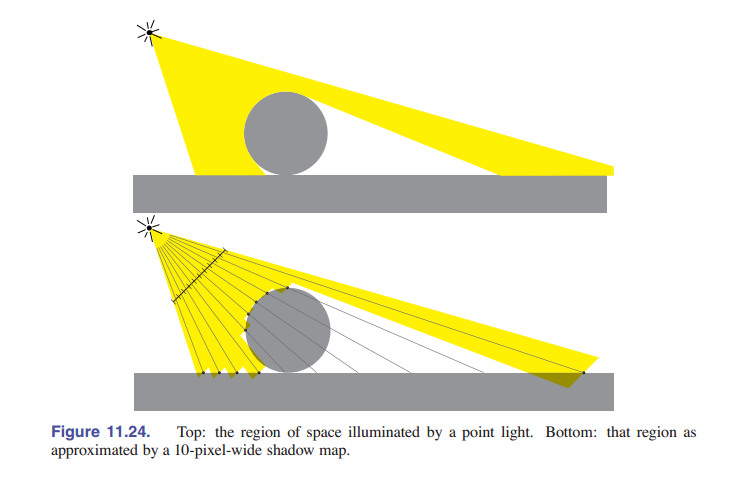

在这两种情况下，解决方案都是相同的：深度贴图表明了一束射线到最近表面的距离。在是否可见的问题中，这是我们之前说过的 **z-buffer 深度缓冲** [8.2.3 节] 。在阴影这里，它就叫做阴影贴图。在这两种情况下，通过将新片元的深度与缓冲区中存储的深度进行比较，来判断是否可被光源照射，如果该表面的深度大于最近可见表面的深度，就说明该表面对于投影点是隐藏的（也就是被遮挡，在阴影中） 。不同之处在于，深度缓冲区用于追踪到目前为止所看到的最接近表面，并会在渲染过程中进行更新，而阴影贴图指示的是整个场景中到最接近表面的距离。

阴影贴图是提前在单独的渲染通道中计算好：和平常一样简单地光栅化整个场景，并保留生成的深度贴图（无需计算像素的值）。然后，在拥有阴影贴图的情况下，执行普通的渲染流程，当您想知道片元是否接触到光源时，您可以在阴影贴图中投影它的位置（使用用于渲染阴影贴图的透视投影矩阵），然后将查找值 $d_{map}$ 与到光源的实际距离 $d$ 进行比较。如果距离相同，则片段的点是被照亮的；如果 $d > d_{map}$ ，就意味着存在一个表面更靠近光源，它因此应该在阴影中。

“如果距离相同”这句话应该引起您的警觉：我们用浮点数来表示变量，这就意味着有一些误差不可避免。因此我们不能指望它们完全相同。对于可见点， $d \approx d_{map}$ ，但有时候 $d$ 会大一点，或者小一点。因此，我们需要一定的 _容差_ ：如果 $d-d_{map} < \epsilon$ ，那么我们认为这个点被照亮了。这里的 $\epsilon$ 称作 _阴影偏差_ 。

在阴影贴图中查询时，在贴图中记录的深度值之间进行插值没啥意义。尽管这可能会在光滑区域中获得更准确的深度（阴影偏差可以设置得更小），但这样做反而会在阴影边界附近（深度值突然变化的地方）带来更大的问题。因此，阴影贴图中的纹理查找是使用 _最近邻重采样_ 完成的。为了减少锯齿，可以使用多次采样，对 1 或 0 阴影结果（而不是深度）进行平均。这称为 _百分比渐近过滤（PCF）_ 。

### 11.4.5 环境贴图

正如纹理可以通过表面着色引入细节而不必在模型中添加细节，纹理也可以用于将细节引入光照中，而不必对复杂的光源几何结构建模。当光源很远时，场景中点到点的照明变化很小。我们就假设光照仅依赖于所看的方向，并且场景中的所有点的光照都相同，然后就可以使用 _环境贴图_ 来表示光照对方向的这种依赖关系了。

引入环境贴图的思想是，在三维空间的各个方向上定义的函数是单位球面上的函数，因此可以使用纹理贴图来表示它，就像在球形物体上表示颜色变化一样。我们不再从表面点的三维坐标来计算纹理坐标，而是使用完全相同的公式从表示光照的单位方向向量的三维坐标来计算纹理坐标。

环境贴图最简单的应用是：给光线追踪中不会碰到任何物体的光线赋予颜色：

```java
trace_ray(ray, scene)
{
  if (surface = scene.intersect(ray))
  {
    return surface.shade(ray)
  }
  else
  {
    u, v = spheremap_coords(r.direction)
    return texture_lookup(scene.env_map, u, v)
  }
}
```

通过更改光线跟踪，能反射其他场景对象的光滑对象现在也可以反射背景环境了。

在光栅化环境中，可以通过向着色计算中添加镜面反射，来实现类似的效果。该镜面反射的计算方式与光线追踪器中的计算方式相同，但图像只是直接在环境贴图中查找，不考虑场景中与该对象有关的其他对象：

```java
shade_fragment(view_dir, normal) {
  out_color = diffuse_shading(k_d, normal)
  out_color += specular_shading(k_s, view_dir, normal)
  u, v = spheremap_coords(reflect(view_dir, normal))
  out_color += k_m * texture_lookup(environment_map, u, v)
}
```

这项技术称为 _反射贴图_ 。

更高级的环境贴图可以计算环境贴图的所有光照，而不仅仅计算镜面反射。这也叫 _环境光照_ ，它在光线追踪中可以使用蒙特卡洛积分进行计算，在光栅化中可以通过使用点光源的集合来近似环境，生成都多个阴影贴图来完成。

环境贴图可以存储在任何坐标中，只要这种坐标可以映射到球坐标上。 球坐标（经-纬度坐标）用的比较多，尽管球极点处的纹理压缩会浪费纹理分辨率，并会在极点处产生失真。立方体贴图是一种更有效的选择，被广泛用于交互式应用程序（ [图 11.25] ）。

## 11.5 程序化 3D 纹理

在前面的章节中，我们使用 $c_r$ 作为对象上某个点的漫反射率。对于没有实体颜色的对象，我们可以将其替换为函数 $c_r({\rm\textbf{p}})$ ，该函数会将三维点映射为 RGB 颜色。此函数可能只是返回包含 $\rm\textbf{p}$ 的对象的反射率。但如果是对于具有纹理的对象，我们希望 $c_r({\rm\textbf{p}})$ 随 ${\rm\textbf{p}}$ 能随着点在表面上移动而变化。

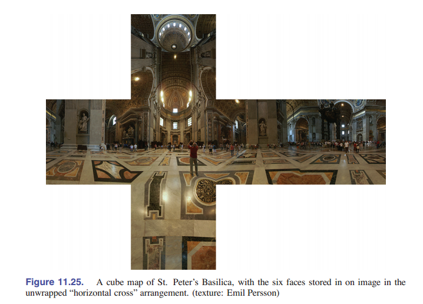

定义从 3D 表面映射到 2D 纹理空间的纹理映射功能的另一种方法是，创建一个 3D 纹理，该纹理在 3D 空间中的每个点都有一个定义好的 RGB 值。我们只需要调用表面上的点 ${\rm\textbf{p}}$ ，但是给所有三维空间中的点添加一个定义要比给任意表面的二维点更容易做，由于表面已经嵌入到了三维空间中，从三维的纹理空间中进行映射不会有失真问题。这种方法看上去就比较适合固体介质（例如大理石雕塑）“雕刻”出来的表面。

不过 3D 纹理也有缺点。它的不足之处在于将它们存储为三维的光栅化图像或 _光栅化立方体_ 会占用大量内存。因此，3D 纹理坐标最常用在 _程序化纹理_ 中，在程序化纹理中，纹理值不是通过从纹理图像中查找，而是通过数学程序来计算。在本节中，我们会介绍一些用于定义程序化纹理的基本工具。这些工具可以用于定义 2D 程序化纹理，尽管在二维中直接使用光栅化纹理图像更为常见。

### 11.5.1 三维条状纹理

制作条状纹理的方法有很多。假设我们要使用两种颜色 $c_0$ 和 $c_1$ 来制作条带的颜色。我们需要一些有振荡性质的的函数，才能让输出在两种颜色之间切换。一个简单的函数就是正弦函数：

```java
RGB stripe( point p )
  if (sin(x_p) > 0) then
    return c_0
  else
    return c_1
```

我们同样可以让条带的宽度可控：

```java
RGB stripe( point p, real w)
  if (sin(π*x_p/w) > 0) then
    return c_0
  else
    return c_1
```

如果我们想要在条纹颜色之间平滑插值，我们可以使用一个参数 $t$ 来线性区分颜色

```java
RGB stripe( point p, real w )
  t = (1 + sin(π*p_x/w))/2
  return (1 − t)*c_0 + t*c_1
```

三种情况的图像由 [图 11-26] 所示。

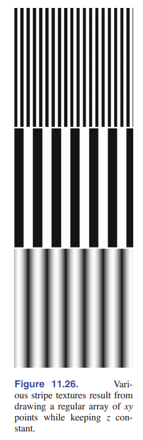

### 11.5.2 固体噪声

虽然常规纹理（如条纹）很有用，但我们希望也能够制作“斑驳”的纹理，例如在鹌鹑蛋上看到的那样。这通常是通过使用一种叫 “固体噪声” 的技术来完成的，通常以其发明人的名字命名为 _Perlin 噪声_ ，Perlin 噪声因其对电影业的影响而获得了奥斯卡技术奖。

通过为每个点调用随机数函数来获得有噪声的外观是不合适的，因为这就像以前电视中的“雪花片”一样。而我们希望在不损失随机质量的情况下能使其更平滑。一种可能的方法是模糊白噪声，但是目前还没有实际的实现。另一种可能性是在每个 “晶格” 上制作一个随机数的大的晶格，然后使用这些随机点的值进行插值，作为格点之间的新点。这只是上一节最后一部分中我们讲过的有随机数的三维纹理数组。使用这种方法会让格子之间过于明显。 Perlin 使用了多种技巧来改进这种基本的点阵技术，让格子间变得不那么明显。这些步骤因此看上去具有巴洛克风格。但实际上，他是在线性插值中做了三处改变来实现的：一是，使用 _埃尔米特插值_ 来避免 _马赫带效应_ ，就像常规纹理一样。二是，使用带点积的随机向量来代替取值，得出随机数。通过将局部最小值和最大值移出网格顶点，可以使底层网格结构在视觉上变得不明显。三是，使用一维数组和哈希来创建随机向量的虚拟三维数组。这增加了计算量，但能降低内存的用量。

> 马赫带效应指色阶断层时人眼注意到的色阶边缘，看上去对比度加强的一种视觉效应。

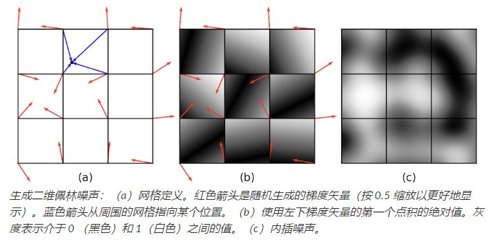

下面是他的具体方法：

$$n(x,y,z) = \sum_{i=\lfloor x \rfloor}^{\lfloor x\rfloor +1}\sum_{j=\lfloor y \rfloor}^{\lfloor y\rfloor +1}\sum_{k=\lfloor z \rfloor}^{\lfloor z\rfloor +1} \Omega_{ijk} (x-i,y-j,z-k)$$

这里 $(x,y,z)$ 是 $\rm\textbf{x}$ 的笛卡尔坐标；

$$\Omega_{ijk} (u,v,w) = \omega(u) \omega(v) \omega(w) (\Gamma_{ijk} \cdot (u,v,w))$$

这里 $\omega(u,v,w)$ 是三次权重函数：

$$
\omega(t) =
\begin{equation*}
    \begin{cases}
        2|t|^3-3|t|^2 +1\ \ \ \ |t| < 1,  \\
        0 \ \ \ \ \ \ \ \ \ \ \  \rm otherwise.
     \end{cases}
\end{equation*}
$$

最后的 $\Gamma _{ijk}$ 是一个相对于晶格点 $(i,j,k)$ 的随机单位向量。我们想要 $ijk$ 是完全任意的，就要使用伪随机表：

$$\Gamma_{ijk} = {\rm\textbf{G}}(\phi(i+\phi(j+\phi(k))))$$

${\rm\textbf{G}}$ 在这里是由 $n$ 个随机单位向量组成的，提前算好的一个数组， $\phi(i) = P[i \ {\rm mod} \ n]$ 这里， $P$ 是一个长度为 $n$ 的数组， 包含了从 $0$ 到 $n-1$ 所有的整数排列。在实际应用中，Perlin 认为 $n=256$ 有比较好的效果。首先，选择随机单位向量：

$$v_x = 2\xi - 1$$
$$v_y = 2\xi' - 1$$
$$v_z = 2\xi'' - 1$$

上面的 $\xi ,\xi',\xi''$ 是标准随机数（也就是 $[0,1)$ 上的随机数）。然后，如果 $(v_x^2 +v_y^2+v_z^2)<1$ ，那么就将这个向量单位化；否则就重新取随机数，直到满足条件为止。这是一个 _拒绝方法_ 的例子，我们会在 [第 14 章] 展开讲。本质上，这个 _if_ 条件保证了点会在单位球体上，且点的位置完全随机。不过，对于单位正方体，这样的取随机数方法就不是随机的了。所以我们在测试中“去掉”了角落。

因为固体噪声可以是正的，也可以是负的，所以在转换为颜色之前必须对其进行转换。 $10\times 10$ 的正方形上的噪声绝对值如 [图 11-27] 所示，后面还有这幅图的拉伸过的版本。这些图片是通过缩放噪声函数的输入点生成的。

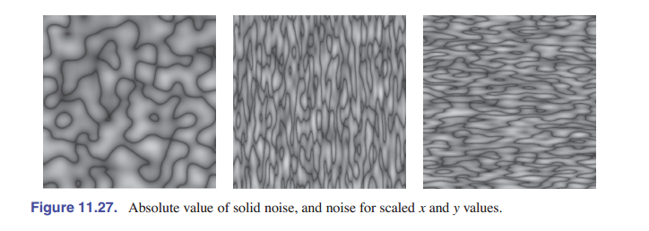
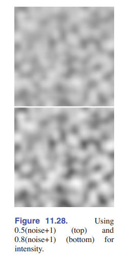

### 11.5.3 湍流

许多自然纹理在同一纹理中包含了各种特征尺寸。Perlin 使用一种伪分形的“湍流”函数：

$$n_t(x) = \sum_{i} \frac{|n(2^i {\rm\textbf{x}})|}{2^i}$$

这样可以高效地在其自身顶部重复地添加按比例缩放的噪声函数，如 [图 11-29] 所示。

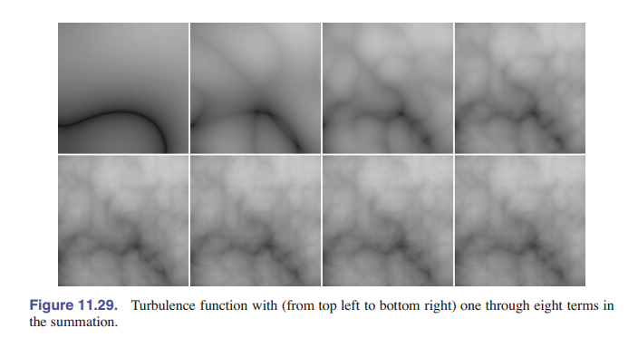

湍流可用于扭曲条纹函数：

```java
RGB turbstripe( point p, double w )
  double t = (1 + sin(k_1 * z_p + turbulence(k_2 * p))/w)/2
  return t ∗ s_0 + (1 − t) ∗ s_1
```

$k_1$ 和 $k_2$ 取不同值，能生成 [图 11-30] 所示的图像

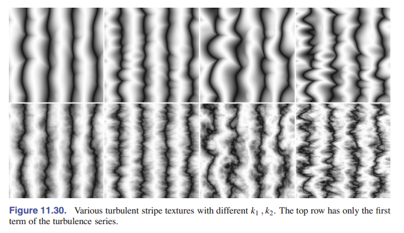

## 常见问题

- **_我该如何在光线追踪中实现置换贴图？_**

  暂时没有理想的实现方法。生成所有三角形并在必要时缓存几何体可以防止内存过载（Pharr&Hanrahan,1996； Pharr,Kolb，Gershbein&Hanrahan,1997）。 当置换函数受到限制时，可以尝试直接与位移表面相交（Patterson,Hoggar&Logie,1991； Heidrich&Seidel,1998； Smits,Shirley&Stark,2000）。

- **_为什么我使用纹理的图片看起来不真实?_**

  人类善于观察表面的小瑕疵。但是使用纹理贴图获取细节的计算机生成图像通常看不出来瑕疵，因此它们看起来“太平滑”了。

# 第十二章 图形数据结构

**某些数据结构好像在图形应用程序中反复出现，也许是因为它们解决了表面、空间和场景结构等基本概念。本章讨论了几种最常见、最有用的，基本且不相关的数据结构类别：网格结构、空间数据结构、场景图和平铺多维数组。**

**对于网格，我们讨论了用于存储静态网格和将网格传输到图形 API 的基本存储方案。我们还讨论了翼边数据结构(Baumgart, 1974)和与该结构相关的半边结构，这对于管理曲面分布变化的模型很有用，例如细分或模型简化。虽然这些方法可以推广到任意多边形网格，但我们在这里只关注三角形网格的简单情况。**

**接下来，我们会介绍场景图的数据结构。这种数据结构的各种形式在图形应用程序中无处不在，因为它们在管理对象和转换时非常有用。所有新的图形 API 的设计都能够很好地支持场景图。**

**对于空间数据结构，我们讨论了在三维空间中组织模型的三种方法：包围盒体系结构、层次结构空间细分和均匀空间细分，以及使用层次空间细分（BSP 树）去除隐藏曲面的方法。同样的方法也可以用于其他地方，包括几何体剔除和碰撞检测。**

**最后给出了平铺的多维数组。最初开发这种结构是为了那些需要频繁从磁盘交换图形数据的程序中提高分页性能，现在这种结构对于机器上的内存局部性至关重要，不管数组是否能在主存中对齐。**

## 12.1 三角形网格

大多数真实世界的模型都由具有共享顶点的三角形复合体组成。这些通常被称为 _三角形网格_ 、 _三角网格_ 或 _三角不规则网络_ （TINs）。为了图形程序的性能，我们需要高效地处理它们。效率的重要性取决于不同应用程序。网格存储在磁盘和内存中，我们希望将消耗的存储量降至最低。当网格通过网络传输或从 CPU 传输到图形系统时，它们会消耗带宽，带宽通常比存储更宝贵。在对网格执行操作的应用程序中，除了简单地存储和绘制网格（如细分、网格编辑、网格压缩或其他操作）外，能够高效访问邻接信息也很重要。

三角形网格通常用于表示曲面，因此网格不仅仅是不相关三角形的集合，而是通过 **共享顶点和边** 相互连接以形成单个连续曲面的三角形网络。这是网格的一个重要设计：与相同数量的三角形，但他们不相关相比，网格处理起来更有效。

三角形网格所需的最小信息是一组三角形（三角形也就是三个顶点）及其顶点（在三维空间中）的位置。但许多程序需要在顶点、边或面上存储额外的数据，以便能够支持纹理映射、着色、动画和其他操作。 **顶点数据** 是最常见的：每个顶点都可以具有材质参数、纹理坐标、光照度 —— 其他所有可以在整个曲面上插值的参数。然后在每个三角形上对这些参数进行线性插值，我们就可以定义网格整个曲面上的连续函数。不过，存储每个边或每个面的数据有时也比较重要。

### 12.1.1 网格拓扑

网格类似于曲面的这种想法可以视为对 _网格拓扑结构_ 的约束，即不考虑顶点位置，三角形连接在一起的方式。许多算法只能用于具有可预测连接性的网格，或者在连续网格上更容易实现。对网格拓扑的最简单和最严格的要求是曲面为 _流形_ 。流形网格是“水密的” —— 它没有间隙，将曲面内部的空间与外部空间隔开。而且，它在网格上的任何位置看上去都像一个曲面。

> 我们把精确的定义留给数学家；参见本章注释。

流形一词来自数学领域的拓扑学：粗略地说，流形（特别是二维流形/2-流形）是一个曲面，其中任何点周围的一个小邻域都可以平滑为一个平面。我们举一个反例，它能清楚地解释这个定义：如果网格上的一条边有三个三角形与其相连，则边上某一个点的邻域与其三角形内部的一个点的邻域不一样，因为它有一个额外的“鳍状平面”伸出（ [图 12.1] ）。如果这条公共边只连接着两个三角形，则边上的点与内部的点一样，具有相同的邻域，只是中间有一个折痕而已。类似，如果共享一个顶点的两个三角形处于 [图 12.2] 中左图的样子中，则这个点的邻域就像两块在中心粘在一起的曲面，如果不将其折叠，就无法将其在这个点上展平。而右图显示的具有更简单邻域的顶点就没有这个问题。

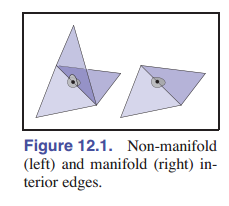
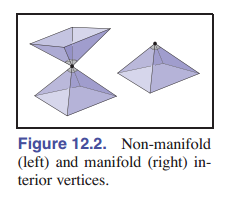

很多算法都假设网格是流形的。如果你导入或新建了一个网格，那么你最好验证一下是不是流形，防止程序崩溃或无限循环。如何验证呢？验证方法可以归结为一下两点：

- 每条边都由有且仅有两个三角形共用。
- 每个顶点周围都有且仅有一个完整的三角形环（可以是半圆环，但必须是连续的）。

[图 12-1] 说明了一条边因为共享的三角形太多而不符合第一个条件， [图 12-2] 说明了一个顶点因为附着了两个独立的三角形环而不符合第二个条件。

流形网格很方便，但有时需要放宽一点条件，允许网格具有边缘或 _边界_ 。这样的网格实际上不是流形 —— 因为在边缘的边只有一个三角形接触到。也就说明这样的网格不是水密的。然而，我们可以将流形网格的要求放宽到有边界流形的要求，这样放宽条件也不会对网格处理算法造成什么影响。放宽后的条件是：

- 每条边要么接触一个三角形，要么被两个三角形共享。
- 每个顶点都能连接到 **一组边相连的三角形** 。

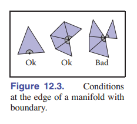
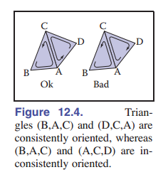

[图 12.3] 说明了这些条件，从左到右，是：一条只有连接一个三角形的边；一个单边连通三角形集合的共享顶点，和一个被两个相互不连通的三角形集合所共享的顶点。

最后，在许多应用中，我们需要能够区分表面的（“正面”/“外部”）与（“背面”/“内部”） —— 这就是表面的方向。对于单个三角形，我们根据顶点列出的顺来序定义方向：三角形的三个顶点按 **逆时针顺序** 排列的那个面是 **正面** 。连续网格的三角形在某个面上都是“正面”或“背面”。也就是说，连续网格的 _方向一致_ ，当且仅当每对相邻三角形的方向均相同。

在一对方向一致的三角形中，两个共享顶点以 **相反的顺序** 出现在两个三角形的顶点列表中（ [图 12.4] ，BAC/CAD）。我们看重的是方向的一致性，因为某些系统可能使用顺时针而不是逆时针顺序来定义正面，所以方向均一致才是我们追求的。

所有包含了非流形边的网格都没有方向一致性。不过也有网格是一个有边界流形(甚至是一个流形)，但方向不一致的情况 —— 它们不是 _可定向曲面_ 。 [图 12-5] 所示的莫比乌斯环就是一个例子。不过其实现实中我们很少遇到这样的问题。

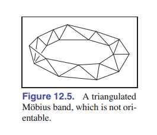

### 12.1.2 索引化的网格存储

一个简单的三角形网格如 [图 12.6] 所示。你可以将这三个三角形存储为独立的实体，每一个三角形都存储成这样的形式：

```c++
Triangle {
  vector3 vertexPosition[3]
}
```

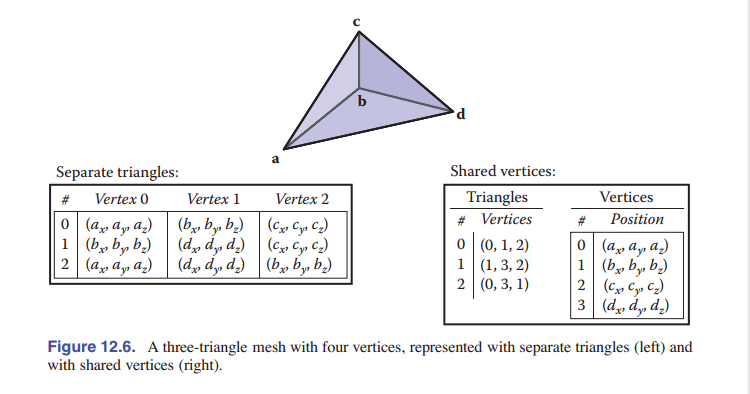

这将导致顶点 $\rm\textbf{b}$ 存储了三次，其他顶点每个被存储了两次，总共存储了九个点（三个三角形中的每个顶点都存储了一遍）。或者，你可以只存储四个共享的顶点，这样保存就形成了 _共享顶点网格_ 。从逻辑上讲，这样的数据结构还应该有指向顶点的三角形的数据：

```c++
Triangle {
  Vertex v[3]
}
Vertex {
  vector3 position // 或其他的顶点信息
}
```

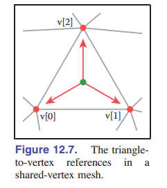、

需要注意的是， $\mathtt{v}$ 数组是一个指向 $\mathtt{Vertex}$ 对象的引用或指针。也就是说，在三角形类内部并不存储顶点的信息。

在实际实现中，顶点和三角形通常存储在数组中，三角形到顶点的引用通过存储 **数组索引** 来处理：

```c++
IndexedMesh {
  int tInd[nt][3]
  vector3 verts[nv]
}
```

第 $i$ 个三角形的第 $k$ 个顶点可以在 $\mathtt{tInd[i][k]}$ 中使用索引来找，并且这个顶点的位置存储在 $\mathtt{vert}$ 数组的对应行中。示例参见 [图 12-8] 。这种存储共享顶点网格的方法就叫做 _索引化的三角形网格_ 。

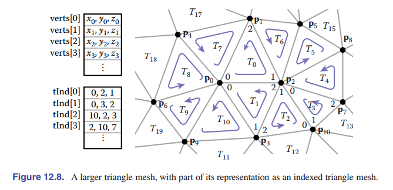

使用上面的方法可以很好的存储单独的三角形和共享顶点。那么这样存储共享顶点是否有空间优势呢？假设我们的网格有 $n_v$ 个顶点， $n_t$ 个三角形，并且我们假设使用的浮点数、指针、整型都占用一样的存储（这个假设不太正经），那么存储空间花费如下：

- **直接存储三角形** ：每个三角形 3 个顶点，共 $9n_t$ 个存储单元
- **索引化网格** ：每个顶点需要一个向量，每个三角形需要三个整数，共 $3n_v + 3n_t$ 个存储单元

相对存储需求取决于 $n_t$与 $n_v$ 的比值。

> 看上去好像相差不大，有意义吗？答案当然是有。让你想要给顶点添加很多别的属性的时候，两者的存储空间差距会越来越大。

根据经验，在网格中，一个顶点平均会被 6 个三角形共享。由于一个三角形有三个顶点，说明在一个大网格中，三角形的数量通常是顶点的两倍： $n_t≈2n_v$ 。 通过替换，我们可以得出，$\mathtt{Triangle}$ 结构的存储需求是 $18n_v$ , $\mathtt{IndexedMesh}$ 的存储需求是 $9n_v$ 。使用共享顶点将存储需求降低了大约 $1/2$ 。实际情况也确实如此。

### 12.1.3 三角形条带和扇形

索引网格是三角形网格在内存中最常见的表示形式，因为它对简单性、便利性和紧凑性有很好地平衡。它们还通常用于在网格上以及应用程序和图形管线之间传输。在紧凑性要求更高的应用程序中，三角形顶点索引（只占据索引网格的三分之二空间，因为只存储顶点的位置）可以使用 _三角条带_ 和 _三角扇形_ 更高效地表示。

三角扇形如 [图 12-9] 所示。在一个索引网格中，三角形数组长这样： $[(0,1,2),(0,2,3),(0,3,4),(0,4,5)]$ 。尽管只有 6 个不同的顶点，我们也存储了 12 个顶点索引。在三角扇形中，所有的三角形共享一个公共顶点，其他的顶点则用来生成一系列的三角形，就像风扇的叶片一样。图中的扇形可以用序列 $[0,1,2,3,4,5]$ 指定：意思是，第一个顶点确定扇形的中心，然后后面每两个顶点组成一条边（如 $(1-2,2-3,\rm etc.)$ 这样），最终组成三角形。

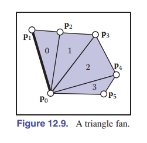
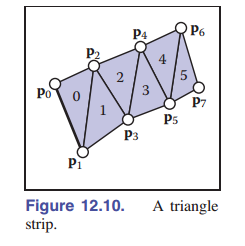

三角条带也是类似的思想，但它适用于更广泛的网格。如 [图 12-10] 所示，在线性条带中交替添加顶部和底部的顶点。图中的三角形可以用序列 $[0\ 1\ 2\ 3\ 4\ 5\ 6\ 7]$ 指定，然后每三个相邻的顶点组成一个三角形，如 $0-1-2,\ 1-2-3,\ \rm etc.$ 。为了保持 **方向一致性** ，每隔一个三角形，新的三角形都需要将其顶点顺序反过来。如 $(0,1,2),(2,1,3),(2,3,4),(4,3,5),\rm etc.$ 对于加进来的新的顶点，我们先前最老的顶点删除，剩下的两个顶点的顺序交换，然后把新的顶点加进来。一个更大的例子参见 [图 12-11] 。

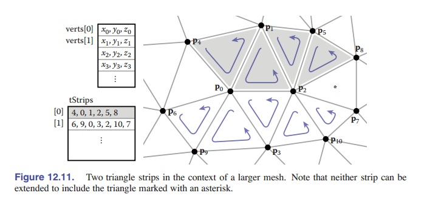

在三角条带和三角扇形中， $n+2$ 个顶点已经足够描述 $n$ 个三角形 —— 这比标准索引网格所需的 $3n$ 个顶点节省了很多。如果程序是通过顶点关联的，那么三角条带能够节省足足三倍的时间！

根据上面的分析，三角条带似乎只有在条带很长的情况下才有用，但实际上，较短的条带也能获得不错的优化。存储空间的节省（与顶点索引相比）如下:

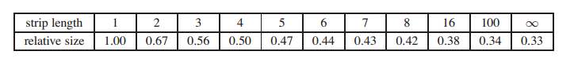

所以，事实上，随着条带的变长，占用空间的比值会迅速逼近最佳值。因此，就算对于一个非结构化的网格，使用一些贪婪算法将它们聚集成条状也是值得的。

### 12.1.4 为处理网格连接性的数据结构

索引网格、条带和扇形都是静态网格的挺不错的紧凑型表示。然而，它们不太支持网格的修改操作。为了能够有效地编辑网格，我们需要更复杂的数据结构来支持高效的查询等操作，查询操作有：

- 给定一个三角形，它相邻的三个三角形分别是什么？
- 给定一条边，哪两个三角形共用这条边？
- 给定一个顶点，哪些 **面** 共用这个顶点？
- 给定一个顶点，哪些 **边** 共用这个顶点？

三角形网格、多边形网格和带孔的多边形网格可以由多种不同的数据结构表示（参见章末注释以获得参考）。在许多应用程序中，网格是非常大的，因此找到一种有效的表示至关重要。

最直接的表示方法（比较臃肿），它的实现有三种类型， $\mathtt{vertex}$ ， $\mathtt{Edge}$ 和 $\mathtt{Triangle}$ ，他们之间的关系采用直接存储：

```java
Triangle {
  Vertex v[3]
  Edge e[3]
}
Edge {
  Vertex v[2]
  Triangle t[2]
}
Vertex {
  Triangle t[]
  Edge e[]
}
```

这让我们可以直接获得上述查询的答案。但由于这些信息彼此都相互关联，这样存储会占用过多的空间。此外，在顶点中存储它们的关系数据，会导致变长数据结构（因为顶点的邻接点可能很多），这种结构的实现效率通常较低。与其显式地存储所有这些关系，不如定义一个类接口来处理查找请求，在这个接口后面可以隐藏效率更高的数据结构。事实证明，我们只能存储部分连接，在有需要的时候高效地恢复其他信息就可以了。

$\mathtt{Edge}$ 和 $\mathtt{Triangle}$ 类采用固定大小的数组，这说明连接信息应该存储在别的地方更高效。实际上，对于多边形网格来说，由于多边形具有任意数量的边和顶点，只有边的连通性信息是固定大小，所以许多传统的网格数据结构是 **基于边** 的。但是对于只有三角形的网格，在（数量较少的）面中存储连通性信息是很不错的。

一个好的网格数据结构应该是 **合理紧凑** 的，并能高效地回答所有邻接查询。高效意味着常数时间复杂度（ $\rm O_1$ ）：寻找邻居的时间不应该取决于网格的大小。我们将研究网格的三种数据结构，一种基于三角形，其他两种基于边。

#### 相邻三角形网格（The Triangle-Neighbor Structure）

我们可以创建一个基于三角形的紧凑网格数据结构，通过将基本的 **共享顶点网格** 的指针从三角形扩展到三个相邻的三角形，并将顶点的指针结构扩展成能够表示相邻的一个三角形（任意一个）。见 [图 12-12] ：

可以从图中看出，某个三角形对象中的相邻三角形 $\mathtt{neighbor\_triangles[k]}$ 与其共享 $\mathtt{v[k]}$ 和 $\mathtt{v[k\ mod\ 3]}$ 这两个顶点。

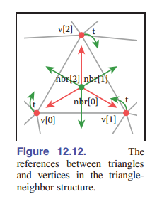

```java
Triangle {
  Triangle nbr[3];
  Vertex v[3];
}
Vertex {
  // ... 该三角形逐个顶点的信息 ...
  Triangle t; // 一个任意的邻接三角形信息
}
v[2]
```

在数组 $\mathtt{Triangle.nbr}$ 中，第 $k$ 个索引指向相邻的、共享顶点 $k$ 和 $k+1$ 的三角形。我们称这种结构为 _相邻三角形网格结构_ 。从最初的 **标准索引网格数组** 开始，我们可以添加两个额外的数组来实现它：一个数组存储每个三角形的三个邻居，另一个存储每个顶点的邻接三角形中的一个（示例参见 [图 12-13] ）：

```java
Mesh {
  // ... 各个顶点的信息 ...
  int tInd[nt][3]; // 顶点索引
  int tNbr[nt][3]; // 边邻接三角形（共三个）索引
  int vTri[nv]; // 点邻接三角形（一个）索引
}
```

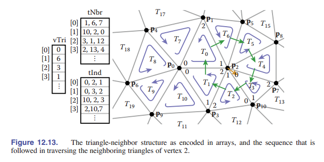

显然，三角形的相邻三角形和顶点可以直接在数据结构中找到（图中的 $\mathtt{tNbr}$ 数组和 $\mathtt{tInd}$ ），通过使用这个三角形的邻接信息，也可以在常数时间内查询顶点的连通性信息。

再进一步观察，我们还可以发现，对于某个三角形对象的第 $k$ 个顶点： $\mathtt{v[k]}$ ，相邻三角形 $\mathtt{neighbor\_triangle[k]}$ 是该顶点 $v$ **在顺时针方向上的下一个相邻三角形** ，利用这一事实，我们可以做到给定某个顶点，遍历其所有的相邻三角形：

> 笔者注：看着很难理解，但你通过注释走一遍循环就明白了。

```c++
AdjacentTriangleOfVertex(v)  //对于围绕的顶点 v
{
    t = v.adjacent_triangle // 先从顶点得到所属的面片索引
    do
    {
        // do something
        find i such that (t.adjacent[i] == v) // 找到这个顶点在面片中的索引下标i
        t = t.neighbor_triangle[i]  //这个下标i代表下一个邻接的面片, 从对应的nbr数组中跳转到下一个面片
    } while(t != v.adjacent_triangle) //循环直到回到起点
}
```

具有重大意义的一步！我们成功找到了顶点相关的连接信息，且使用常数时间（尽管需要搜索来找到每个三角形顶点列表中中心顶点的位置，但顶点列表的大小是恒定的，因此搜索需要常数时间），但这份代码有些低效，因为 `find i such that t.adjacent[i]==v` 这一步要求我们做次数不定的比较，而我们之所以要找 $i$ ，是因为我们在进入新的三角形时并没有索引相关的信息，我们无从知道这个顶点在新的三角形中的索引。我们可以增加一个类来帮助我们存储这个信息。

说得具体一点，问题在于，一旦我们跟随一个指针从一个三角形到下一个三角形，我们就不知道我们是从哪个方向来的：我们必须搜索三角形的顶点，来找到连着上一个三角形的顶点。为了解决这个问题，我们不存储指向相邻三角形的指针，而是通过存储指针的索引，从而存储指向这些三角形特定边的指针：

```cpp
Triangle { //由边邻接的三个边索引和三个顶点索引
  Edge nbr[3];
  Vertex v[3];
}

Edge { // 其所属的其中一个面片索引和其在面片中的下标 i
  Triangle t;
  int i; // i is in {0,1,2}
}

Vertex { //其所属的其中一条边的索引
  // ... 每个顶点的信息 ...
  Edge e; // any edge leaving vertex
}
```

实际实现中， $\mathtt{Edge}$ 是通过从三角形索引 $t$ 中借用两 $\rm bit$ 的存储空间来存储边缘索引 $i$ ，因此总存储需求保持不变。

在这种结构中，一个三角形的邻接数组告诉了我们相邻三角形的哪条边与该三角形的这三条边共享。有了这些额外的信息，我们就能找到原始三角形，这导致了数据结构的不变量：对于任何三角形 $t$ 的任意第 $j$ 条边，有：

$$t.\mathtt{nbr[j].t.nbr[t.nbr[}j \mathtt{].i].t == }\ t.$$

知道我们从哪条边进入，我们就可以立即知道要从哪条边离开，以便继续遍历下一个顶点，这就导出了一个简化的算法：

```cpp
TrianglesOfVertex(v) {
  {t, i} = v.e;
  do {
    {t, i} = t.nbr[i];
    i = (i+1) mod 3;
  } while (t != v.e.t);
}
```

三角形邻接结构非常紧凑。对于一个只有顶点位置的网格，我们每个顶点存储四个数字(三个坐标和一条边)，每个面存储六个(三个顶点索引和三条边)，每个顶点总共存储 $4n_v + 6n_t≈16n_v$ 的单位，而基本索引网格的存储单位为 $9n_v$。

这里提出的三角形邻接结构只适用于流形网格，因为它需要返回到起始三角形的条件来终止顶点邻居的遍历，而如果这个网格没有完整的三角形循环，在边界顶点上的循环无法终止。不过，推广到有边界的流形并不困难，我们只需为边界三角形的邻居引入一个合适的哨兵位（如 −1），并规定边界顶点必须指向逆时针最多的相邻三角形即可。

#### 翼边结构

一种广泛使用的网格数据结构是 _翼边数据结构_ ，它的连接性信息存储在 **边** 上。这种数据结构使 **边** 成为数据结构中的“一等公民”，如 [图 12-14] 和 [图 12-15] 所示。

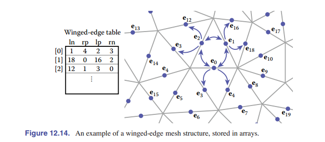

在翼边网格中，每条边都存储了指向它连接的 **两个顶点** （头顶点和尾顶点）的指针、它所在的 **两个面** (左面和右面)，以及最重要的是，还存储了它的左面和右面的逆时针遍历中的下一条和上一条边( [图 12-16] )。每个顶点和面还存储一个与它对应的任意一条边的指针。也就是说：

- 对每个面，储存其中的一个边索引
- 对每条边，储存其两个顶点，左右两个面，左边面与之连接的两条边，右边面与之连接的两条边
- 对每个点，储存其对应的一个边索引

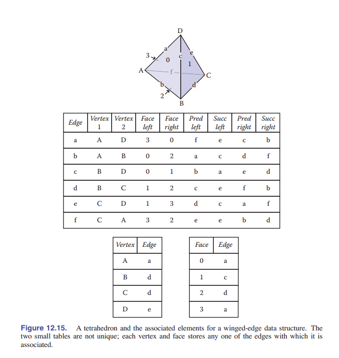

存储伪代码如下：

```java
Edge {
  Edge lprev, lnext, rprev, rnext;
  Vertex head, tail;
  Face left, right;
}
Face {
  // ... per-face data ...
  Edge e; // any adjacent edge
}
Vertex {
  // ... per-vertex data ...
  Edge e; // any incident edge
}
```

翼边结构的另一大优点就是在索引邻接关系的时候非常方便，因为边储存了足够多的信息，利用这个结构我们可以在网格中自由检索。而之前的绕点检索方法伪代码如下，注意配合上图一起实践：

```java
EdgesOfVertex(v) {
  e = v.e;
  do {
    if (e.tail == v) // 当在边的尾部检索时，左转
    e = e.lprev;
  else
    e = e.rprev;
  } while (e != v.e);  // 否则右转
}

EdgesOfFace(f) {
  e = f.e;
  do {
    if (e.left == f)
      e = e.lnext;
    else
      e = e.rnext;
  } while (e != f.e);
}
```

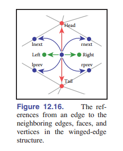

这些算法和数据结构不局限于三角形网格，多边形网格一样适用。这是 **基于边的数据结构** 的一个重要优势。

与任何数据结构一样，翼边数据结构需要进行各种时间/空间的权衡。例如，我们可以不使用前驱指针 $\mathtt{prev}$ 来节省空间，虽然这使得顺时针绕着面或逆时针绕着顶点遍历更加困难，但如果我们需要查询前一条边的信息时，我们可以不停地在一个圆中取后续的边，直到我们回到起始边之前，也能达成同样的目的。它节省空间，但会使某些操作变慢。（有关这些权衡的更多信息，请参阅本章注释）

#### 半边数据结构

翼状边缘结构相当不错，但它还存在一个小问题 —— 在移动到下一个边缘之前，我们需要不断检查边的方向。这种检查直接类似于我们在三角形邻接结构的基本版方案中看到的搜索：需要寻找是从头部还是从尾部进入的当前边。解决方案也很像：我们存储的不是每条边的数据，而是每条半边的数据。共享一条边的两个三角形各有一条半边，这两条半边的方向相反，每条边的方向都与自己的三角形一致。

由于存在上述痛点，又提出了半边结构 (The Half-Edge Structure) 来优化翼边结构。半边结构将一条边拆成了两个半边，每个半边储存用于单向检索的辅助信息和指向另一方向半边的指针，结构如下：

- 对每个面，储存其中的一个半边索引
- 对每条边，储存指向另一半边的指针和指向下一半边的指针，还有半边自己所属的那个顶点和所属的面
- 对每个点，储存其对应的一个半边索引

```java
HEdge {
  HEdge pair, next;
  Vertex v;
  Face f;
}

Face {
  // ... per-face data ...
  HEdge h; // any h-edge of this face
}

Vertex {
  // ... per-vertex data ...
  HEdge h; // any h-edge pointing toward this vertex
}

```

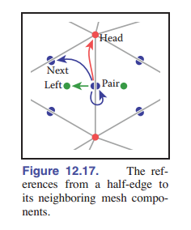

<div class="sidebar-widget">
  
</div>
