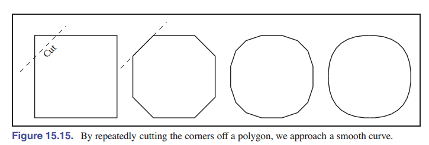

<head>

</head>

- [第十五章 曲线 _By Micheal Gleicher_](#第十五章-曲线-by-micheal-gleicher)
  - [15.1 曲线](#151-曲线)
    - [15.1.1 参数化 与 重新参数化](#1511-参数化-与-重新参数化)
    - [15.1.2 分段参数化曲线的表示](#1512-分段参数化曲线的表示)
    - [15.1.3 样条](#1513-样条)
  - [15.2 曲线的性质](#152-曲线的性质)
    - [15.2.1 连续性](#1521-连续性)
  - [15.3 多项式片段](#153-多项式片段)
    - [15.3.1 多项式表示](#1531-多项式表示)
    - [15.3.2 线段](#1532-线段)
      - [多项式的矩阵形式](#多项式的矩阵形式)
    - [15.3.3 线段之外更复杂的表示](#1533-线段之外更复杂的表示)
    - [15.3.4 三次曲线的基矩阵](#1534-三次曲线的基矩阵)
    - [15.3.5 混合函数](#1535-混合函数)
    - [15.3.6 多项式插值](#1536-多项式插值)
  - [15.4 合并线段](#154-合并线段)
    - [15.4.1 端点](#1541-端点)
    - [15.4.2 使用独立的片段](#1542-使用独立的片段)
    - [15.4.3 将线段连成完整的曲线](#1543-将线段连成完整的曲线)
  - [15.3 三次曲线](#153-三次曲线)
    - [15.5.1 自然三次样条](#1551-自然三次样条)
    - [15.5.2 埃尔米特三次样条](#1552-埃尔米特三次样条)
    - [15.3.3 基数三次样条 Cardinal Cubics](#1533-基数三次样条-cardinal-cubics)
  - [15.6 拟合曲线](#156-拟合曲线)
    - [15.6.1 贝塞尔曲线 Bézier Curves](#1561-贝塞尔曲线-bézier-curves)
      - [直观理解贝塞尔曲线](#直观理解贝塞尔曲线)
      - [德卡斯特里奥算法 de Casteljau Algorithm](#德卡斯特里奥算法-de-casteljau-algorithm)
    - [15.6.2 B样条](#1562-b样条)
      - [均匀线性B样条（均匀一次B样条）](#均匀线性b样条均匀一次b样条)
      - [均匀二次B样条](#均匀二次b样条)
      - [均匀三次B样条](#均匀三次b样条)
    - [15.6.3 非均匀B样条](#1563-非均匀b样条)
      - [重复节点 和 B样条插值](#重复节点-和-b样条插值)
    - [15.6.4 非均匀有理B样条 **NURBS**](#1564-非均匀有理b样条-nurbs)
  - [15.7 总结](#157-总结)

# 第十五章 曲线 _By Micheal Gleicher_

## 15.1 曲线

直观上，我们可以把曲线想象成用笔画出来的东西。曲线是笔在一段时间内画出的一组点。尽管我们想到的应该是一支笔在纸上写字（如二维空间中的曲线），但实际上，笔可以在三维空间中移动，画出空间的曲线。

在数学上，曲线的定义至少可以通过两种方式来理解：

1. n 维空间中在某区间内产生的连续图像
2. 从一维空间到 n 维空间的连续映射

这两种定义都是从区间（笔沿着曲线开始画的时间区间）这一概念开始的。然而，有一个显著的区别：在第一个定义中，曲线是笔根据时间画出的点的集合（图像），而在第二个定义中，曲线是时间和这组点之间的映射。在本章中，我们用第一个定义。

曲线是无限多个点的集合。曲线上的点具有这样的特性，即任何点都有两个邻居，除了少数点只有一个邻居(端点)。有些曲线没有端点，要么是因为它们是无限的(直线)，要么是因为它们是封闭的(自环)。

因为曲线的“笔”很细(无限小)，所以很难创建填充区域。虽然我们有可能做到在空间填充曲线(通过将它们无限次折叠起来)，但我们在这里不考虑这种数学上的奇怪现象。一般来说，我们认为曲线是物体的 *轮廓* 。

我们需要解决的问题是如何指定曲线 —— 命名，以及给出曲线的一种表示，以便我们可以在计算机上绘制。对于某些曲线，命名问题很容易，因为它们的形状家喻户晓：线段、圆、圆弧等。没有“命名”形状的一般曲线有时被称为 *自由曲线* 。因为自由曲线几乎可以呈现任何形状，所以它们很难指定和特化。

有三种主要的数学方法来定义一条曲线：

1. **隐式曲线** 曲线表示通过给出一个过程来定义曲线上的点的集合，这个过程可以测试一个点是否在曲线上。通常，隐式曲线表示法由如下形式的隐函数定义：

   $$f(x,y) = 0$$

曲线就是满足这个方程的点的集合。隐函数 $f$ 是一个标量函数(它返回一个实数)。

1. **参数曲线** 参数曲线表示提供了从 _自由参数_ 到曲线上点集的映射。也就是说，这个所谓的自由参数提供了曲线上点的索引。曲线的参数形式是为自由参数值分配位置的函数。直观地讲，如果你把曲线想象成可以用笔在纸上画的轨迹，自由参数就是时间 —— 从我们 **开始画** 到 **完成曲线** 的时间。曲线的参数函数告诉我们笔在任意时刻的位置：
   $$(x,y) = {\rm\textbf{f}(t)},$$
   参数函数是一个向量函数。这个例子是一个二维曲线，所以函数的输出是一个二维向量，在三维中则是一个三维向量。

2. **生成式曲线** 生成式曲线（以及过程曲线）的表示法可以提供不属于前两类曲线上的点的过程曲线。生成曲线描述的例子包括 **细分** 和 **分形** 。

记住，曲线是点的集合。这些表示法也只是一些能让我们能获取那些点集的方法。曲线有许多不同的表示法，一条曲线可以被表示成多种形式。因此，数学家通常会小心地区分曲线和它的表示法。不过，在计算机图形学中，我们对这方面的约束比较宽松，因为我们通常只需要知道表示法，而不是曲线本身。当我们讲到“隐式曲线”时，指的要么是用隐函数表示的 **曲线** ，要么是曲线的一种表示形式： **隐函数** 。除非我们需要考虑同一曲线的不同表示，不然前面两个其实讲的是同一个东西。由于我们将在本章中讨论不同的曲线表示，这方面的描述会比较重要。当我们使用“多项式曲线”这样的术语时，我们要指的是：可以用多项式表示的 **曲线** 。

根据本章开头给出的定义，曲线必须有参数表示。然而，许多曲线有其他的表示。例如，一个圆心为原点，半径为 1 的二维圆可以隐式表示为：

$$f(x,y) = x^2+y^2-1=0$$

或者用参数化表示：

$$(x,y) = \mathbf{f}(t) = (\cos t, \sin t)$$

对于给定曲线，参数形式不一定是最方便的表示。事实上，曲线可能具有简单的隐式或生成式表示，但 **很难** 找到参数表示。

不同的曲线表示方式各有优缺点。例如，参数曲线更容易绘制，因为我们可以对自由参数进行采样，得到曲线上的点。一般来说，参数形式是计算机图形学中最常用的，因为它们更容易使用。我们的重点也会放在曲线的参数化表示。

### 15.1.1 参数化 与 重新参数化

> 参数化的好处是给了我们一种方便对比不同曲线的方法, 但是缺点是对曲线进行的参数化有时候会导致混乱, 这是因为曲线本身是不需要这个特殊参数的参与的(例如隐式曲线). 只看参数形式的话很多截然不同的曲线会有相同的参数形式, 这些曲线绘制出来的时形象是一样的, 但是例如在曲线内将参数写为二次幂形式, 同样参数为 0.5 时, 二次幂的代表的点显然与一次时代表的不同。

> 相同的曲线出现了不同的表达, 解决方法是给出共识让各个机器都以相同的方法选择参数, 这种为了便于定义曲线创建的参数形式称为自然参数化, 最常用的是弧长参数化, 也就是让函数沿着曲线的弧长改变, 相当于固定了函数的切线斜率。

*参数曲线* 是指在特定 **区间** 内由特定参数函数给出的曲线。更精确地说，参数曲线有一个给定的函数，它是参数区间的 **映射** 。我们发现，让参数在从 $0$ 到 $1$ 的单位间隔内进行映射会很方便。当自由参数在单位区间内变化时，我们通常用 $u$ 来表示参数。

如果我们把参数化曲线看作是用笔画的一条线，我们可以认为 $u = 0$ 是笔第一次放在纸上的时间，参数的单位是绘制曲线所需的时间 ( $u = 1$ 是曲线的终点)。

曲线可以通过将时间（区间内的参数）映射到位置的函数来指定。基本上，如果一个函数可以回答“ $u$ 时刻笔在哪里？”的问题，那它就能确定一条曲线。

如果给定一个函数 $\mathbf{f}(t)$ ，它表示区间 $[a, b]$ 上的曲线，我们可以很容易地找到一个新函数 $\mathbf{f}_2(u)$ ，它表示单位区间 $[0,1]$ 上的相同曲线。我们可以首先定义：

$$g(u) = a+(b-a)u$$

然后

$$\mathbf{f}_2(u) = \mathbf{f}(g(u))$$

这两个函数 $\mathbf{f}$ 和 $\mathbf{f}_2$ 都表示同一条曲线。然而，它们提供了不同的曲线参数化。我们将参数区间进行转换，为的是之后处理更方便。为现有曲线创建新参数化的过程称为 *重新参数化* ，从旧参数到新参数（在本例中为 $g$ ）的映射称为 *重新参数化函数* 。

如果我们通过一些参数化定义了一条曲线，那么存在无限多的其他参数化（因为我们总是可以重新参数化）。能够对曲线进行多个参数化很有用，因为它允许我们创建方便的参数化。然而，它也可能有问题，因为重新参数化后，你很难看出来两个不同的函数是否表示同一条曲线。

这个问题的本质更普遍：自由参数（或时间元素）的存在为我们的曲线表示增加了一个看不见的，潜在的未知元素。也就是说，当我们看到画好的曲线时，我们不一定知道时间是什么。这支笔可能在整个时间间隔内以恒定的速度移动，或者它可能开始很慢，然后加速。

例如，虽然 $u = 0.5$ 是参数空间的中间点，但如果笔的运动开始很慢，并在后面加速，则它对应的点就可能不是曲线的中点。考虑下面一条非常简单的曲线的表示：

$$(x,y) = \mathbf{f}(u) = (u,u)$$

$$(x,y) = \mathbf{f}(u) = (u^2,u^2)$$

$$(x,y) = \mathbf{f}(u) = (u^5,u^5)$$

这三个函数在单位区间上显然表示同一曲线。然而，当 $u$ 不为 $0$ 或 $1$ 时， $\mathbf{f}(u)$ 在这三个函数中指的是不同的点。

如果我们给出了曲线的参数化，我们可以直接使用它来说明曲线，抑或是，我们可以开发一个更方便的参数化形式。

通常，我们用 _自然参数化_ 来创造一种方便确定曲线的参数化表示。这样我们就不需要知道参数沿曲线的变化速度。

如果我们提前能知道笔是 **匀速移动** 的，那么自由参数的值会变得更有意义，因为参数在区间中点的时候就是曲线的中点。因此，我们不用时间作为参数，而是用 _曲线长度_ 作为参数。这种参数化称为 _弧长参数化_ ，因为它们通过从沿曲线的距离(称为弧长)映射到位置的函数来定义曲线。我们经常用变量 $s$ 来表示弧长参数。

> 也就是说，速度恒定的参数曲线即是弧长参数化曲线。

理论上来说，如果一个曲线弧长 _正切，tangent_ 的大小（即参数化对参数的导数）是 **常数** ，则这样的参数化就是 **弧长参数化** 。用方程表示，

$$\left| \frac{d\mathbf{f}(s)}{ds}\right|^2 = c$$

计算一条曲线的长度是很棘手的。一般来说，它是由上述导数的积分来定义的（直观地说，导数的大小是笔沿着曲线移动的速度）。因此，给定参数 $v$ 的值，你可以计算 $s$ （沿曲线从点 $\mathbf{f}(0)$ 到点 $\mathbf{f}(v)$ 的弧长距离）是：

$$s = \int^{v}_{0} \left| \frac{d\mathbf{f}(t)}{dt}\right|^2 dt \tag{15.1}$$

由于上式可写为函数： $s = s(v)$ ，函数是单调递增的。所以有反函数： $v = v(s)$ 。此时我们可以找到 $\mathbf{f}(v(s))$ 这个函数，它可以在给定弧长 $s$ 的情况下，先得到点的参数，再由参数获得该点的值。

至此我们称， $\mathbf{f}(t)$ 是用 **自然参数化** 定义曲线的函数。

使用弧长参数化要求能够在给定 $s$ 的情况下解出 $t$ (方程 15.1)。但是，对于我们所研究的许多类型的曲线，我们找不到它的 _闭式解_ （解析解），只能找到它的数值解。

通常，我们使用变量 $u$ 来表示在单位区间内的自由参数， $s$ 来表示弧长自由参数， $t$ 来表示除前两个之外定义的自由参数。

### 15.1.2 分段参数化曲线的表示

对于一些曲线，我们很容易就能找到一个参数函数来表示它们的形状。例如，直线、圆和椭圆都有简单的函数，可以根据参数定义它们所包含的点。但是，对于许多曲线来说，找到一个函数来指定它们的形状是很困难的。那么怎么办呢？我们创建复杂曲线的主要策略是分而治之：将曲线分解成许多更简单的小段，每段都有一个简单的描述。

例如，考虑 [图 15-1] 中的曲线。前面的这两条线很容易分成两部分，在图中(b)所示曲线的情况下，我们通过线段和圆来分段描述。

要创建复合曲线的参数表示（如 [图 15-1] (b)中的曲线），我们需要让参数函数在表示分段之间的能够切换。如果我们在 $0≤u≤1$ 的范围内定义了参数函数，那么 [图 15-1] (a)或(b)中的曲线可以定义为

$$
\mathbf{f}(u)=\left\{
\begin{aligned}
\mathbf{f}_1(2u) \ \ \ \ \ \ \ \ & {\rm if} & u\leq 0.5 \\
\mathbf{f}_2(2u-1) \ \ \ \ \ \ \ \  & {\rm if} & u > 0.5 \\
\end{aligned}
\right. \tag{15.2}
$$

其中 $\mathbf{f}_1$ 是第一段的参数化， $\mathbf{f}_2$ 是第二段的参数化，并且两个函数的定义域都是单位区间。

我们需要仔细定义函数 $\mathbf{f}_1$ 和 $\mathbf{f}_2$ ，以确保曲线的各个部分能匹配在一起。如果 $\mathbf{f}_1(1)  \neq \mathbf{f}_2(0)$ ，我们定义出来的曲线段会不连续。

为了表示 [图 15-1] (b)中的曲线，我们需要使用两种不同类型的曲线种类：线段和圆弧。我们可能更喜欢使用单一类型的曲线段，因为那样比较简单。但如果我们试图只用一种类型的曲线段来表示 [图 15-1] (b)中的曲线（如 [图 15-1] (c)所示），两条曲线看上去就不一样了。如果对于使用来说，它已经足够精确，那你也可以尝试这样的方法来近似曲线。

当我们使用越来越多的线段时，我们画出来的线就越近似原来的曲线。在极限情况下（使用无限数量的线段），我们可以准确地表示原始形状。

使用分段表示的一个优点是，它让我们能够在以下几个方面做权衡：

1. 我们所表示的曲线需要与实际形状有多近似
2. 我们用的曲线段要多复杂
3. 我们要用多少段曲线段

因此，如果我们要表示的形状很复杂，那么我们或许可以粗略地近似一下。如果要近似的效果很好，那么可以选择使用更多的片段，以及使用更复杂的片段。

在计算机图形学实践中，我们倾向于使用相对简单的曲线片段（线段、弧或多项式线段）。

### 15.1.3 样条

在电脑出现之前，人们想要画一条光滑的曲线时，他们会使用一片金属长条，然后将其弯曲成所需的形状，最后描出曲线。因为金属有延展性，它会弯出一个光滑的曲线。这样的金属片，我们称为 _样条_ 。

后来，数学家们发现，他们可以用分段多项式函数来表示出那个样子的曲线。以前，样条这个词表示的仅仅是光滑的分段多项式函数；现在，只要是分段多项式函数，均可以被称为样条。

对我们来说， *样条* 是一个分段多项式函数。这样的函数在表示曲线时非常有用。

## 15.2 曲线的性质

为了描述一条曲线，我们需要给出一些定义，来描述它的性质。对于“有名字的”曲线，我们自然想到和曲线名字有关系的属性。例如，要描述一个圆，我们可以提供它的半径和圆心的位置。对于椭圆，我们还可以提供其长轴的方向和轴长之比。然而，对于自由曲线，我们需要一些更一般的属性来描述各段曲线的性质。

曲线的一些性质只与曲线上的某个位置有关，而另一些性质则是整个曲线都有的。为了直观地了解两者的区别，可以把曲线想象成火车轨道。如果你在雾天站在赛道上，你只能分辨出你所在的这段轨道是直的还是弯的，以及你是否在火车站（端点处）。这些是 _局部属性_ 。但是，你无法判断轨迹是否闭合，交叉，或者它有多长。我们称这种属性为 _全局属性_ 。

对几何物体（曲线和曲面）局部性质的研究被称为 **微分几何** 。曲线的性质要成为微分性质的话，这些性质有一些数学上的限制。这里我们使用 _局部性质_ 作为下面的描述，而不是数学上严格的微分性质。

局部性质是描述曲线的重要工具，因为它们不需要了解整个曲线。局部属性包括：

- 连续性
- 曲线上某一点的位置
- 曲线上某一点的方向
- 曲线上某一点的曲率（以及其他导数）

### 15.2.1 连续性

理解两条参数曲线的局部性质非常重要。如果曲线是用类似于 [式(15.2)] 的公式定义的，那么我们需要注意如何定义这些部分。如果 $\mathbf{f}_1(1)  \neq \mathbf{f}_2(0)$ ，那么曲线就“断了” —— 我们将无法连续一笔画出曲线。我们把曲线片段拼接在一起的条件称为 *连续性* 条件，因为如果这个条件成立，曲线就是连续的线。

我们在本章开头对“曲线”的定义已经要求了曲线是连续的，所以上面那个线甚至不在曲线的范畴中。

除了位置，我们还可以检查曲线段的导数在端点处是否能匹配上。若 $\mathbf{f}'_1(1)  \neq \mathbf{f}'_2(0)$ ，那就说明曲线在端点的一阶导数会发生突变，也就是一阶导数不连续。一般来说，如果一条曲线的 $n$ 阶导数在每个端点上都能匹配，我们就说这条曲线是 $C^n$ 连续。我们将端点位置定义为零阶导数，因此 $C^0$ 连续就要求曲线的位置连续， $C^1$ 连续意味着位置和一阶导数都是连续的。曲线的定义要求曲线为 $C^0$ 连续。

[图 15-2] 展示了一些连续性条件。一阶导数的不连续（曲线是 $C^0$ ）通常看上去很明显，因为端点看上去是一个尖角。二阶导数的不连续有时能明显感知到。不同的应用，需要不同的连续性。例如，如果曲线表示运动，则二阶导数的突变也会很明显，因此表示运动需要三阶导数的连续性。如果曲线上有流体流过（例如，如果它是飞机机翼或船身的形状），那么四阶或五阶导数的不连续可能会导致湍流。

我们刚刚介绍的连续性类型（ $C^n$ ）通常被称为 **参数连续性** ，因为它存在于两个参数化曲线片段的交点处。如果我们画线的“速度”在端点处不同了，那么它们就不是 $C^1$ 连续的。而对于关心曲线形状而不是其参数化的情况，我们定义 **几何连续性** ，它要求当曲线被等效参数化时（例如，使用弧长参数化）曲线片段的导数能匹配。直观地说，这意味着相应的 **导数必须有相同的方向** ，即使它们的大小不同。

因此， $C^1$ 连续实际上是：

$$\mathbf{f}'_1(1)  = \mathbf{f}'_2(0)$$

$G^1$ 连续则是：

$$\mathbf{f}'_1(1)  =k \mathbf{f}'_2(0)$$

一般来说，几何连续性比参数连续性约束更少。只要参数的导数不消失， $C^n$ 曲线一定是 $G^n$ 。

## 15.3 多项式片段

计算机图形学中最广泛使用的曲线表示是将多项式定义的基本元素拼凑在一起，称为多项式片段。例如，线段元素是由线性多项式给出的。

在 [15.3.1 节] 中，我们给出了一个正式的定义，并解释了如何将多项式片段组合在一起。

### 15.3.1 多项式表示

多项式是这个样子的函数：

$$f(t) = a_0 + a_1t + a_2t^2 + ... + a_nt^n. \tag{15.3}$$

其中 $a_i$ 称为 _系数_ ，如果 $a_n\neq 0$ ，则 $n$ 称为多项式的次数。我们也可以把 [式(15.3)] 写成这样：

$$\mathbf{f} (t) = \sum_{i=0}^{n} \mathbf{a}_it^i \tag{15.4}$$

我们称它为多项式的 **标准型** 。

我们可以将标准型式推广为：

$$\mathbf{f} (t) = \sum_{i=0}^{n} \mathbf{c}_ib^i(t) \tag{15.5}$$

这里 $b_i(t)$ 是一个多项式。我们可以为不同的应用选择方便的多项式形式，这样的多项式函数我们称之为 **基函数** 或 _混合函数_ （见 [15.3.5 节] ）。在 [式(15.4)] 中， $t_i$ 对应 [式(15.5)] 的 $b_i(t)$ 。如果基函数集选择正确，则任何 $n+1$ 次的多项式曲线都可以用适当选择的控制点 $\mathbf{c}$ 表示出来。

我们不一定能给多项式曲线找到方便表示标准型的系数。出于实践的目的，在本章中，我们找到的一组基函数，这些基函数的系数都比较方便，能够控制由多项式函数曲线。

要指定一条二维空间中的曲线，可以指定 $t$ 中的两个多项式：一个表示 $x$ 如何随 $t$ 变化，另一个表示 $y$ 如何随 $t$ 变化；或者指定一个多项式，其中每个 $\mathbf{a}_i$ 都是一个二维的点。 $n$ 维空间中的曲线也一样。

### 15.3.2 线段

为了介绍分段多项式曲线表示的概念，我们将讨论线段。在实践中，线段非常简单，甚至不需要数学推导。然而，通过这个简单的例子，我们之后可以更容易理解复杂的多项式。

考虑一条连接点 $\mathbf{p}_0$ 和点 $\mathbf{p}_1$ 的线段。我们可以把这个线段在单位定义域域中的参数函数写成：

$$\mathbf{f}(u) = (1-u)\mathbf{p}_0 +u\mathbf{p}_1 \tag{15.6}$$

通过将其写成向量形式，我们隐藏了点的维度和我们分别处理每个维度的工作。例如，如果我们在二维中这样定义，我们实际上是定义了单独的两个方程：

$$f_x(u) = (1-u)x_0 +ux_1$$

$$f_y(u) = (1-u)y_0 +uy_1$$

我们定义的直线由两个端点确定，但从现在开始，我们会在之后的讲解中使用向量符号，因为它更简洁明了。我们将参数所控制的向量 $\mathbf{p}$ 称为控制点集， $\mathbf{p}$ 中的每个元素称为一个 **控制点** 。

虽然用其端点的位置来描述线段是简洁且方便的，但描述线段还有其他方法。例如：

1. 线段中心的位置、线段方向、线段长度
2. 线段一个端点的位置和第二个端点相对于第一个端点的偏移量
3. 线段的中点和其中一个端点的位置

只要知道上面的其中一条，我们就能确定一个线段。

描述线段的另一种方法是使用多项式的标准型式（如 [15.3.1 节] 所述）：

$$\mathbf{f}(u) = \mathbf{a}_0+u\mathbf{a}_1 \tag{15.7}$$

任何线段都可以通过指定 $\mathbf{a}_0$ 和 $\mathbf{a}_1$ 或端点（ $\mathbf{p}_0$ 和 $\mathbf{p}_1$ ）来表示。指定端点通常更方便，因为那样我们可以从端点计算其他参数。

为了将标准型式写成向量表达式，我们定义一个向量 $\mathbf{u}$ ，它是 $u$ 的幂向量：

$$\mathbf{u} = [1 \ u \ u^2 \ u^3 \dots \ u^n]$$

这样 [式15.4] 就可以写成

$$\mathbf{f}(u) = \mathbf{u} \cdot \mathbf{a} \tag{15.8}$$

这种向量符号能让不同形式的曲线之间更加容易转换。

[式(15.8)] 用多项式化简后的多项式系数集来描述曲线段。我们称这种表示为 **标准型** 。我们用 $\mathbf{a}$ 表示标准型的参数。

虽然它在数学上很简单，但标准型并不总是表示曲线的最方便的方式。例如，我们可能更喜欢通过其 **端点的位置** 来指定线段。如果我们想定义 $\mathbf{p}_0$ 为线段的起点（即线段在 $u = 0$ 时的位置）， $\mathbf{p}_1$ 为线段的终点（即线段在 $u = 0$ 时的位置），我们可以这样写：

$$\mathbf{p}_0 = \mathbf{f}(0) = [1 \ 0 ] \cdot [\mathbf{a}_0 \ \mathbf{a}_1]$$

$$\mathbf{p}_1 = \mathbf{f}(1) = [1 \ 1 ] \cdot [\mathbf{a}_0 \ \mathbf{a}_1] \tag{15.9}$$

我们可以解出 $\mathbf{a}_0$ 和 $\mathbf{a}_1$ 的方程：

$$
\begin{align*}
  \mathbf{a}_0 &= \mathbf{p}_0 \\
\mathbf{a}_1 &= \mathbf{p}_1-\mathbf{p}_0
\end{align*}
$$

#### 多项式的矩阵形式

上面所说的第一个例子很容易解决，但对于更复杂的例子，将方程 (15-9) 写成以下形式更容易理解：

$$
\left [ \begin{matrix} \mathbf{p}_0 \\ \mathbf{p}_1 \\ \end{matrix} \right ] =
\left [ \begin{matrix} 1 & 0\\ 1 & 1 \\ \end{matrix} \right ]
\left [ \begin{matrix} \mathbf{a}_0 \\ \mathbf{a}_1 \\ \end{matrix} \right ]
$$

这样我们就能将上式写成

$$\mathbf{p}  = \mathbf{C} \ \mathbf{a} \tag{15.10}$$

我们称 $\mathbf{C}$ 为 **约束矩阵** 。 如果你觉得点向量比较难理解，你可以独立地考虑每个维度的分量（这样， $\mathbf{p}$ 就是 $[x_0 \ x_1]$ 或 $[y_0 \ y_1]$ ； $\mathbf{a}$ 也同样分解）。

我们可以通过求 $\mathbf{C}$ 的逆矩阵来解出方程 (15-10) 中的 $\mathbf{a}$ 。我们将逆矩阵用 $\mathbf{B}$ 表示，称为 **基矩阵** 。基矩阵具有很好的性质，因为它告诉我们如何在参数型 $\mathbf{p}$ 和标准型 $\mathbf{a}$ 之间进行转换。因此，我们得到了一个计算曲线的简单方法：

$$\mathbf{f}(u)  = \mathbf{u} \ \mathbf{B} \ \mathbf{p} = \mathbf{u} \ \mathbf{a}$$

我们可以为曲线的任何形式找到一个基矩阵，只要参数的定义中没有 _非线性参数_ 。例如，我们使用线段的长度和角度来定义曲线，那么它的参数就是非线性的。

现在，假设我们要对线段进行参数化，使 $\mathbf{p}_0$ 为中点 $(u = 0.5)$ ， $\mathbf{p}_1$ 为终点 $(u = 1)$ 。为了导出该参数化的基矩阵，我们设置以下的转换：

$$
\begin{align*}
  \mathbf{p}_0 = \mathbf{f}(0.5) &= 1\mathbf{a}_0 + 0.5\mathbf{a}_1 \\
\mathbf{p}_1 = \mathbf{f}(1) &= 1\mathbf{a}_0 + 1\mathbf{a}_1
\end{align*}
$$

这样

$$\mathbf{C} = \left [ \begin{matrix} 1 & 0.5 \\ 1 & 1 \\ \end{matrix} \right ],$$

$$\mathbf{B} = \mathbf{C}^{-1} = \left [ \begin{matrix} 2 & -1 \\ -2 & 2 \\ \end{matrix} \right ],$$

### 15.3.3 线段之外更复杂的表示

线段太简单了，我们很容易就能找到一个基矩阵。让我们来尝试一下给阶数更高的曲线找一个基矩阵。首先，让我们看看二次曲线（也就是阶数为二次的曲线）。这时我们能发现标准型（ 式(15.4) ）的优点，就是标准型适用于更复杂的曲线，我们只需要改变标准型中的阶数 $n$ 即可。

二次多项式有三个系数： $a_0$ 、 $a_1$ 和 $a_2$ 。

这些系数不太好描述曲线的形状。不过，我们可以使用相同的基矩阵方法来设计更方便的参数。如果我们知道 $u$ 的值，则 式(15.4) 就会在参数中变为一个线性方程，我们还是可以使用上一节的线性代数来进行变换。

假设我们想用起始点 $(u = 0)$ 、中间点 $(u = 0.5)$ 和终点 $(u = 1)$ 的位置来描述我们的曲线。在 式(15.4) 中输入合适的值：

$$
\begin{align*}
  \mathbf{p}_0 &=& \mathbf{f}(0) &=& &\mathbf{a}_0& + &0^1& &\mathbf{a}_1 + &0^2&
  &\mathbf{a}_2 \\
  \mathbf{p}_1 &=& \mathbf{f}(0.5) &=& &\mathbf{a}_0& + &0.5^1& &\mathbf{a}_1 + &0.5^2& &\mathbf{a}_2 \\
  \mathbf{p}_2 &=& \mathbf{f}(1) &=& &\mathbf{a}_0& + &1^1& &\mathbf{a}_1 + &1^2& &\mathbf{a}_2 \\
\end{align*}
$$

约束矩阵是

$$\mathbf{C} = \left [ \begin{matrix} 1 & 0 & 0 \\ 1 & 0.5 & 0.25 \\ 1 & 1 & 1 \\\end{matrix} \right ],$$

基矩阵是：

$$\mathbf{B} = \mathbf{C}^{-1} = \left [ \begin{matrix} 1 & 0 & 0 \\ -3 & 4 & -1 \\ 2 & -4 & 2 \\\end{matrix} \right ],$$

指定某些其他约束（或参数）有时会让计算变得更方便：例如曲线在特定值处的导数（与自由参数相比）。直观上，导数告诉我们曲线如何变化，一阶导数告诉我们曲线的方向，二阶导数告诉我们曲线改变方向的速度等。稍后我们将看到一些例子，说明为什么指定导数作为参数会更好。

对于一个二次曲线：

$$\mathbf{f}(u) = \mathbf{a}_0 + \mathbf{a}_1u+\mathbf{a}_2u^2,$$

它的一阶和二阶导数很简单：

$$\mathbf{f}'(u) = \frac{d\mathbf{f}}{du} = \mathbf{a}_1+2\mathbf{a}_2u,$$

$$\mathbf{f}''(u) = \frac{d^2\mathbf{f}}{du^2} = \frac{d\mathbf{f}}{du}' =  2\mathbf{a}_2,$$

更一般地，

$$
\begin{align*}
  \mathbf{f}'(u) &= \sum_{i=1}^{n}iu^{i-1}\mathbf{a}_i \\
   \mathbf{f}''(u) &= \sum_{i=2}^{n}i(i-1)u^{i-2}\mathbf{a}_i
\end{align*}
$$

例如，考虑这样一种情况，我们希望通过其中间的位置、一阶导数和二阶导数来指定一条二次曲线段 $(u = 0.5)$ 。

$$
\begin{align*}
  \mathbf{p}_0 &=& \mathbf{f}(0.5) &=& \mathbf{a}_0 + 0.5^1 \ \mathbf{a}_1 + 0.5^2
  &\mathbf{a}_2& \\
  \mathbf{p}_1 &=& \mathbf{f}(0.5) &=&   \mathbf{a}_1 + 2 \ 0.5 \ &\mathbf{a}_2& \\
  \mathbf{p}_2 &=& \mathbf{f}(0.5) &=&  + 2 \  &\mathbf{a}_2& \\
\end{align*}
$$

约束矩阵是：

$$\mathbf{C} = \left [ \begin{matrix} 1 & 0.5 & 0.25 \\ 0 & 1 & 1 \\ 0 & 0 & 2 \\\end{matrix} \right ],$$

基矩阵是：

$$\mathbf{B} = \mathbf{C}^{-1} = \left [ \begin{matrix} 1 & -0.5 & 0.125 \\ 0 & 1 & -0.5 \\ 0 & 0 & 0.5 \\\end{matrix} \right ],$$

### 15.3.4 三次曲线的基矩阵

三次多项式在图形学中很常见 （见 [15.5 节] ）。各种形式的三次曲线的推导就像我们在这一节已经看到的推导。我们将再通过一个例子进行练习。

三次多项式的一种非常有用的形式是 _埃尔米特形式_ 。

> 三次埃尔米特是指使用初始点，初始速度（向量），最终点，最终速度（向量）四个参数来确定的三次多项式函数曲线。

这个曲线的四个控制点是 开始和结束时是位置和一阶导数，即，

$$
\begin{align*}
  \mathbf{p}_0 &=& \mathbf{f}(0) &=& \mathbf{a}_0 + 0^1 \ \mathbf{a}_1 &+& 0^2 \mathbf{a}_2 &+& 0^3 &\mathbf{a}_3&\\
  \mathbf{p}_1 &=& \mathbf{f}'(0) &=&  \mathbf{a}_1 &+& 2 \ 0^1 \ \mathbf{a}_2 &+& 3 \ 0^2 \ &\mathbf{a}_3&\\
  \mathbf{p}_2 &=& \mathbf{f}(1) &=& \mathbf{a}_0 + 1^1 \ \mathbf{a}_1 &+& 1^2 \ \mathbf{a}_2 &+ &1^3 &\mathbf{a}_3&\\
  \mathbf{p}_3 &=& \mathbf{f}'(1) &=& \mathbf{a}_1 &+& 2 \ 1^1  \mathbf{a}_2 &+& 3 \ 1^2 \ &\mathbf{a}_3&\\
\end{align*}
$$

约束矩阵是：

$$
\mathbf{C} = \left [ \begin{matrix}
1 & 0 & 0 & 0 \\
0 & 1 & 0 & 0 \\
1 & 1 & 1 & 1 \\
0 & 1 & 2 & 3 \\ \end{matrix} \right ],
$$

基矩阵是：

$$
\mathbf{B} = \mathbf{C}^{-1} = \left [ \begin{matrix}
1 & 0 & 0 & 0 \\
0 & 1 & 0 & 0 \\
-3 & -2 & 3 & -1 \\
2 & 1 & -2 & 1 \\ \end{matrix} \right ],
$$

我们将在 [15.5.2 节] 讨论 _三次埃尔米特样条_ 。

### 15.3.5 混合函数

如果我们知道基矩阵 $\mathbf{B}$ ，我们可以把它乘以参数向量 $\mathbf{u}$ ，得到一个函数向量：

$$\mathbf{b}(u) = \mathbf{u} \ \mathbf{B}$$

注意，我们用 $\mathbf{b}(u)$ 表示这个向量是为了强调它的值是由 自由参数 $u$ 决定的。我们称 $\mathbf{b}(u)$ 的元素为 **混合函数** ，因为这些函数指定了如何将控制点的值混合在一起：

$$\mathbf{f}(u) = \sum_{i=0}^{n} \mathbf{b}_i(u)\mathbf{p}_i \tag{15.11}$$

要注意，对于选定的 $u$ 值，式(15.11) 始终是一个 _线性方程_ ，它让控制点能够 _线性混合_ （即加权平均）。无论多项式在 $\mathbf{b}_i$ 函数内部是啥样，它都是一个线性函数。

混合函数为描述曲线提供了一个很好的抽象。任何类型的曲线都可以表示为其控制点的线性组合，这些权重就是自由参数组成的函数。

### 15.3.6 多项式插值

一般来说，针对 $n$ 个点进行多项式曲线插值，需要多项式的阶数是 $n+1$ 阶。如果我们现在有一个向量 $\mathbf{p} = (p_0,\dots,p_n)$ ，要对一个系数向量 $\mathbf{t} = (t_0,\dots,t_n)$ 进行插值，我们可以用前面讲过的基矩阵法，找到一个 $(n+1)\times(n+1)$ 的基矩阵，这样能得到函数 $f(t)$ ，使 $f(t_i) = p_i$ 。

对于任意给定的向量 $\mathbf{t}$ ，我们需要建立并求解一个 $n = 1 \times n+1$ 的线性方程组。这为我们提供了一组共 $n+1$ 个基函数来执行插值：

$$\mathbf{f}(t) = \sum_{i=0}^{n} \mathbf{p}_ib_i(t).$$

这些插值基函数可以用其他方法推导出来。定义它们的一种特别优雅的方式是拉格朗日形式：

$$b_i = \prod_{j=0,j \neq i}^{n} \frac{x-t_j}{t_i-t_j} \tag{15.12}$$

有比拉格朗日形式（参见 De Boor(1978)）更有效的计算方式来表达插值基函数。

**总结：** 插值多项式让我们能够定义一组点的插值曲线。 [图 15-3] 显示了一些示例。虽然理论上可以创建一个多项式来插值任意数量的点，但我们很少使用高阶多项式来表示计算机图形学中的曲线，这样求解会比较困难。相反，我们更喜欢使用样条（分段多项式函数）进行插值。 [15.5.3 节] 将讨论其中的一些原因。

## 15.4 合并线段

现在，我们已经了解了多项式曲线的片段是怎么产生的。接下来就是考虑如何将这些片段组合在一起了。

### 15.4.1 端点

分段参数化函数的基本思想就是每一段的参数都在一个区间内。比如，如果我们想定义一个函数，它有三个端点，连接着两个曲线段。（如 [图 15-4] （a）所示），我们可以这样定义：

$$
\mathbf{f}(u)=\left\{
\begin{aligned}
\mathbf{f}_1(2u) \ \ \ \ \ \ \ \ & {\rm if} & 0 \leq u\leq \frac{1}{2} \\
\mathbf{f}_2(2u-1) \ \ \ \ \ \ \ \  & {\rm if} & \frac{1}{2} \leq u < 1 \\
\end{aligned}
\right. \tag{15.13}
$$

其中 $\mathbf{f}_1$ 和 $\mathbf{f}_2$ 分别是两个曲线段的函数。注意，我们已经重新调整了每个片段的参数（也就是重新参数化），以便于将其方程写成下面的形式：

$$\mathbf{f}_1(u) = (1-u)\mathbf{p}_1+u\mathbf{p}_2.$$

对于我们的分段函数中的每个多项式，都有一个开始和结束的位置（或参数值）。片段函数开始或结束的位置（是一个参数）称为 **节点** 。对于 [式15.13] 中的例子，三个节点的值分别为 $0$ 、 $0.5$ 和 $1$ 。

我们也可以将多项式函数从分段的形式改写为基函数的和的形式，每个基函数是系数缩放而成的。例如，我们可以将 [式15.13] 中的两条线段改写为：

$$\mathbf{f}(u) = \mathbf{p}_1b_1(u)+\mathbf{p}_2b_2(u)+\mathbf{p}_3b_3(u) \tag{15.14}$$

$b_1(u)$ 定义为：

$$
b_1(u)=\left\{
\begin{aligned}
1-2u \ \ \ \ \ \ \ \ & {\rm if} \ \ \  0 \leq u\leq \frac{1}{2} \\
0 \ \ \ \ \ \ \ \  & {\rm otherwise,} \\
\end{aligned}
\right.
$$

$b_2$ 和 $b_3$ 也这样定义，通常让范围内的基函数有值，范围外无值。画出来的图像是 [图 15-4] (b) 。

多项式函数的节点是用于创建它的所有部分的节点的组合。 **节点向量** 是存储所有节点值 $(u)$ 的向量，以升序存储。

> 总结：在本节中，我们使用了两种不同的方法来组合多项式片段：我们可以使用 _参数分段_ ，也可以使用分段多项式函数将各个片段混合在一起。

### 15.4.2 使用独立的片段

在 [15.3 节] 中，我们定义了单位参数范围上的多项式。 如果我们要把这些片段组合起来，我们需要从整体函数的参数转换为部分参数的值。通常来说，也是最简单的方法是在参数范围 $[0,n]$ 上定义整个曲线，其中 $n$ 是曲线有 $n$ 段。根据参数的值，我们可以将其移动到所需的范围。

### 15.4.3 将线段连成完整的曲线

如果我们想将两条线段连成出一条完整的曲线，我们需要确保前面线段的结尾与后面线段的头部位置相同。连接这两个部分的方法有三种（按简单程度排序）：

1. 将线段表示为它的两个端点，但不同片段的前后端点需要相同。我们称之为 **共享点** 模式。
2. 后一个片段的头是通过复制前一个片段的尾来得到的，称之为 **依赖** 模式。
3. 直接写出连接处点的位置的定义方程，在参数发生变化时通过数值方法强制计算。

其中，对共享点模式来说，基本上片段是由两个端点决定的。由于规定了前后片段相连端点的值相等，因此修改端点只会影响到与之相连的两个片段。这种只会影响局部顶点的性质称为 **局部性** ，很多时候我们希望曲线能够拥有局部性。 而对于依赖模式，基本上由起点和中间点决定片段的形态, 因此一旦修改了其中某一个片段导致了后端点的改变, 就会导致后面的所有片段的起点发生改变从而连环产生影响，这称为 **缺少局部性** 。

具体的图示如 [图 15-5] 。上面的分段曲线的各个部分由端点参数化，并使用共享模式来保证曲线的连续性。下面的分段曲线则通过起点和中点参数化其片段，并使用依赖模式组合曲线的片段。这两个分段曲线可以是相同的曲线：它们都是 $n$ 个相连线段的集合。但是，由于局部性问题，端点共享模式可能会更方便。假如我们要改变这两个分段曲线中第一个控制点的位置。对于端点共享模式的曲线，只有第一个段会变，而在起点中点确定的曲线段中，后面所有的线段都会受到影响。

我们强调，曲线的 **局部性** 能让控制曲线变得简单。有了局部性，想要对曲线局部做出调整，我们只需要移动几个控制点即可。

## 15.3 三次曲线

在图形学中,当我们使用分段多项式表示曲线时，通常会用线段或三次多项式表示片段。三次多项式在计算机图形学中使用广泛，因为：

- 分段三次多项式允许 $C^2$ 连续，这对于大多数视觉任务来说已经足够。但二次函数提供的 $C^1$ 平滑度通常不够。且更高阶的多项式提供的更大的平滑性不太用得上。
- 三次曲线为一组点提供了 _最小曲率插值_ 。也就是说,如果你有 $n+3$ 个点，并且要定义通过这些点的 “最平滑” 曲线（即在其长度上曲率最小的曲线），则该曲线可以表示为由 $n$ 个段组成的分段三次曲线。
- 三次多项式具有很好的对称性，可以在开始和结束时指定曲线的位置和导数。
- 三次多项式在计算中的数值问题和平滑性之间取得了很好的平衡。

不过，我们也不是非要用三次曲线，它们只是在平滑度量和复杂度之间取到了平衡而已。不同的应用可能有不同的权衡。我们关注三次曲线，因为三次曲线是最常用的。

三次多项式的标准型是：

$$\mathbf{f}(u) = \mathbf{a}_0 + \mathbf{a}_1u+\mathbf{a}_2u^2+\mathbf{a}_3u^3.$$

不过我们在 [15.3 节] 提到，这种方法表示曲线段并不方便。

我们想找到一种三次多项式的表示形式，能有一种方便的方法来控制它的系数，从而操纵生成的曲线。其中，”方便“ 的基础是：这种方法要能保证曲线的连续性。

每段三次多项式需要四个系数或控制点。这意味着,对于一个 $n$ 段的分段多项式,如果没有重用或依赖关系，我们可能需要多达 $4n$ 个控制点。不过其实更常见的是，每个片段的某些部分要么与相邻段共享，要么依赖于相邻段，所以总控制点数目可以少很多。另外，”控制点“ 既可以是曲线上的位置，也可以是曲线的导数。

不幸的是，对于分段三次曲线没有唯一的“最佳”表示法。我们找不到一种表示法能同时具有以下所有好性质:

- 曲线的每一部分都是三次曲线
- 曲线通过控制点插值得出
- 曲线有局部性
- 曲线有 $C^2$ 连续

尽管我们不能拥有全部四个好性质，但可以拥有其中任意三个属性。在本书中，我们将讨论无法对其控制点插值的 **三次B样条** （但具有局部性且 $C^2$ 连续）， **Cardinal 基样条** 和 **Catmull-Rom 样条** （可以对控制点插值且有局部性），但不是 $C^2$ 连续；和 **自然三次样条** （是 $C^2$ 连续，但没有局部性）。

三次函数的连续性指的是各部分（在节点处）的连续性。三次曲线片段本身的导数具有无限的连续性（我们到目前为止一直在讨论连续性）。注意，如果你有很多控制点，曲线可能扭来扭曲，看起来并不“光滑”。

### 15.5.1 自然三次样条

使用分段三次曲线，可以创建 $C^2$ 连续的曲线。要实现这样的曲线，我们需要在每个线段的开始处指定起始点的 **位置** ，以及 **一阶导数** 和 **二阶导数** （要确保它与前一个线段的终点的值相同）。注意，每个曲线段有四个参数，但它只从上一个曲线段的终点处得到三个参数（不需要三阶导数）。这些 $C^2$ 连续的三次曲线被称为 **自然三次样条** ，也可以称作 _自然三次曲线_ 。

对自然三次样条的一个片段来说，我们需要知道其起点的位置、起点的一阶导和二阶导来对这个片段进行 **参数化** 。因此控制点有四个：

$$
\begin{alignat*}{7}
  \mathbf{p}_0 &= \mathbf{f}(0) =& \mathbf{a}_0&& + 0^1\mathbf{a}_1&& + 0^2\mathbf{a}_2&& + 0^3\mathbf{a}_3&& \\
\mathbf{p}_0 &= \mathbf{f}'(0) =& &&\phantom{} 1^1\mathbf{a}_1&& + 2\times 0^2\mathbf{a}_2&& + 3\times 0^3 \mathbf{a}_3 \\
\mathbf{p}_0 &= \mathbf{f}''(0) =&  &&\phantom{} &&\phantom{}  2\times 1^1\mathbf{a}_2&& + 6\times 0^3\mathbf{a}_3&& \\
\mathbf{p}_0 &= \mathbf{f}(1) =& \mathbf{a}_0&& + 1^1\mathbf{a}_1&&+ 1^2\mathbf{a}_2&& + 1^3\mathbf{a}_3&&
\end{alignat*}
$$

因此，我们写出约束矩阵：

$$
\mathbf{C} = \left[
\begin{array}{rrrr}
1 & 0 & 0 & 0 \\
0 & 1 & 0 & 0 \\
0 & 0 & 2 & 0 \\
1 & 1 & 1 & 1 \\ \end{array} \right],
$$

基矩阵是：

$$
\mathbf{B} = \mathbf{C}^{-1} = \left[
\begin{array}{rrrr}
1 & 0 & 0 & 0 \\
0 & 1 & 0 & 0 \\
0 & 0 & 0.5 & 0 \\
-1 & -1 & -0.5 & 1 \\ \end{array} \right],
$$

给定 $n$ 个控制点，自然三次样条就有 $n−1$ 个三次曲线段。第一个线段的控制点定义了它的起始位置、结束位置以及起点的一阶导数和二阶导数。如果我们使用 _依赖模式_ ，终点处的位置、一阶导、二阶导将被复制到下一条曲线段的起点处参加计算。

自然三次样条的缺点是它没有局部性。只要有一个地方变化，都可能需要改变整个曲线（不管咋样，改变的那个点之后的所有线段都需要修改）。不仅如此，自然三次样条曲线的控制会让人头疼：曲线前部的一个小变化可能导致曲线后面产生很大的改变。另一个问题是，只有曲线开始时的导数可以由我们决定，因为曲线之后的那些曲线段的导数是依据前面的点计算出来的。

### 15.5.2 埃尔米特三次样条

[15.3.4] 介绍了埃尔米特三次多项式。三次埃尔米特样条片段允许指定两个端点的位置和一阶导数值。通过对片段首尾相接，且让他们的一阶导数值相等，我们可以获得一个 $C^1$ 连续的样条。

给定一组 $n$ 个控制点，其中每个其他控制点都是导数值，三次埃尔米特样条包含 $(n−2)/2$ 个曲线段。样条插值点如 [图 15-6] 所示，但它只能保证 $C^1$ 连续。

这种曲线比较经典，后面的曲线都是通过在埃尔米特曲线上加入一些额外控制来得到。
埃尔米特三次样条很方便，我们可以对曲线的局部进行控制，且有 $C^1$ 连续性。但是，由于用户必须同时指定位置和导数，因此程序需要为导数提供一个特殊的接口。

### 15.3.3 基数三次样条 Cardinal Cubics

**基数三次样条** 指的是一种由三次多项式片段构成的 $C^1$ 插值曲线。给定 $n$ 个控制点，基数三次样条可以利用 $n-2$ 条曲线段计算出除头尾外的所有点的坐标。

基数三次样条有一个参数叫 **张力** ，它用来控制曲线在插入点之间的“松紧程度”。张力是一个在 $[0,1]$ 范围内的数字，它控制曲线如何向下一个控制点弯曲。对于 $t = 0$ 的特殊情况，这个样条退化成 _Catmull-Rom 样条_ 。

基数三次样条的每一部分使用 **四个** 控制点。对于第 $i$ 个片段，使用的点是 $i$ , $i + 1$ , $i + 2$ 和 $i + 3$ ，因为线段与相邻片段会共享三个点。曲线段连接了第二和第三个控制点。曲线开始处的切向量由 **第一个控制点** 和 **第三个控制点** 构成的 **向量** 决定，同理，曲线结束处的切向量由第**二**个控制点和第**四**个控制点构成的向量决定，如 [图 15-7] 所示。

**张力** 描述了起止点的切向量对向量的缩放程度。具体来说，切向量是两点之间向量的 $(1 - t)/2$ 倍。

因此，我们写出下面的公式：

$$
\begin{align*}
  \mathbf{f}(0) &= \mathbf{p}_2 \\
  \mathbf{f}(1) &= \mathbf{p}_3 \\
  \mathbf{f}'(0) &= \frac{1}{2}(1-t)(\mathbf{p}_3-\mathbf{p}_1) \\
  \mathbf{f}'(1) &= \frac{1}{2}(1-t)(\mathbf{p}_4-\mathbf{p}_2) \\
\end{align*}
$$

求解控制点的方程，我们得到：

$$
\begin{alignat*}{7}
  \mathbf{p}_0 &= \mathbf{f}(1) - \frac{2}{1-t}\mathbf{f}'(0) &= \mathbf{a}_0 &+ (1-\frac{1}{s})&&\mathbf{a}_1 + &&\mathbf{a}_2+ &&\mathbf{a}_3, \\

  \mathbf{p}_1 &= \mathbf{f}(0) \phantom{} &= \mathbf{a}_0& &\phantom{}\\

  \mathbf{p}_2 &= \mathbf{f}(1) \phantom{} &= \mathbf{a}_0&+ (1-\frac{1}{s})&&\mathbf{a}_1 + &&\mathbf{a}_2 + &&\mathbf{a}_3, \\

  \mathbf{p}_3 &= \mathbf{f}(0) + \frac{1}{s}\mathbf{f}'(1) &= \mathbf{a}_0&+ \frac{1}{s}&&\mathbf{a}_1 + 2\frac{1}{s}&&\mathbf{a}_2+ 3\frac{1}{s}&&\mathbf{a}_3, \\
\end{alignat*}
$$

得到基矩阵：

$$
\mathbf{B} = \mathbf{C}^{-1} = \left[
\begin{array}{rrrr}
0 & 1 & 0 & 0 \\
-s & 0 & s & 0 \\
2s & s-3 & 3-2s & -s \\
-s & 2-s & s-2 & s \\ \end{array} \right].
$$

由于第 $i$ 个片段的第三个点（ $i+3$ ）是第 $i+2$ 个片段的第二点，很容易得到 Cardinal 样条是首尾相连的。同样，每个片段尾部的一阶导数就是下一个片段的头部的一阶导数，所以自然而然地有 $C^1$ 连续。

Cardinal 样条挺不错，它提供了一种简单的方法来插值一组点，且插值出来的曲线既有局部性又有 $C^1$ 连续。但由于连续性只到 $C^1$ ，所以它有些时候看上去像“打结了”一样。我们可以控制张力参数来决定是否需要这样的现象，如 [图 15-8] 。注意，图中的首尾节点没有被插值。

给定一组 $n$ 个控制点，让你插值出曲线，为什么我们更喜欢使用基数三次样条（即 $n-2$ 个三次样条的集合），而不是 [15.3.6] 中描述的单个 $n$ 阶多项式呢？插值多项式的一些缺点是：

- 插值多项式产生的曲线可能会过拟合，如 [图 15-9] 所示。随着点的数量增加，这种过拟合会变得更明显，不可接受。基数样条曲线则表现得很好。
- 插值多项式的控制没有局部性。改变样条起始点会影响整个多项式样条。但基数样条是局部的：样条上的任何位置最多只被它的四个相邻点影响。
- 对插值多项式的点求值没有局部性。对多项式上的一个点求值需要它的所有点参与计算。但对于基数样条来说，不管有几个点，只需要那一段的点参与计算就行了。

当点的数量增加时，在使用多项式插值样条时还会出现各种各样的数值和技术问题。参见 _De Boor(2001)_ 。

基数样条的缺点是它不对头尾点进行插值。不过我们可以添加额外的两个控制点来解决这一问题。基数样条也不是连续的 —— 在结点处只提供 $C^1$ 连续。

## 15.6 拟合曲线

> 尽管插值曲线也能有不错的性质，但其仍然有节点连续性不足，控制点间的曲线难以控制的缺点。为了解决这个问题，进一步扩展插值曲线后人们提出了拟合曲线。拟合曲线的特点是它们牺牲了穿过所有控制点的性质，换来了更好的几何性质，所谓的拟合就是指线在拟合控制点构成的形状。这其中常见的是下面介绍的贝塞尔曲线，B 样条曲线和非均匀有理B样条 NURBS，其本质是定义逐渐扩大。

指定一组控制点来进行插值似乎是控制曲线最简单的方法了。然而，在实践中，插值方案通常具有一些缺点，因为它们具有较低的连续性，并且无法精细控制点之间的曲线。我们更喜欢只拟合点的方案。在拟合方案中，控制点能影响曲线的形状，但曲线并不是一定要经过控制点。虽然我们放弃了通过精确设定节点来确定曲线的功能，但这样做获得了更好的曲线行为和局部控制。如果我们需要对一组控制点进行插值，则可以依据控制点的位置进行计算，使曲线通过这些插值点。

在计算机图形学中，两种最重要的近似曲线是 **Bézier 曲线** 和 **B 样条** 曲线。

### 15.6.1 贝塞尔曲线 Bézier Curves

贝塞尔曲线是计算机图形学中自由曲线最常见的表示形式之一。这些曲线以 _Pierre Bézier_ 的名字命名， _Pierre Bézier_ 是对曲线的发展起到重要作用的人之一。贝塞尔曲线有一个有趣的历史，它们是由几个独立的小组同时开发的。

贝塞尔曲线是一条拟合控制点的多项式曲线。是多项式曲线，曲线的度可以任意指定。 $d$ 度贝塞尔曲线由 $d+1$ 个控制点控制。曲线只经过它的首和尾控制点，其他控制点影响曲线的形状。

一般来说，我们绘制的复杂形状是通过一些低阶贝塞尔曲线连接而成的。在计算机图形学中，一般用的是三次贝塞尔曲线（ $d=3$ ）。许多流行的绘图程序，如 _Adobe Illustrator_ ，以及一些字体表示方案，如 $\LaTeX$ ，用的是三次贝塞尔曲线，形成矢量图后显示。贝塞尔曲线在计算机图形学中非常常用，因为它们易于控制，有许多好特性，并且处理它们我们可以使用有非常有效的算法。

我们这样构造一条贝塞尔曲线：

- 曲线用参数 $u = 0, u=1$ 分别插值第一个和最后一个控制点
- 曲线开始（结束）处的一阶导向量由 **头两个（末两个）控制点** 形成的向量确定。导数的大小是是这些点之间的向量乘以曲线度数来计算的。
- 曲线起点/终点处的高阶导数由曲线开始（结束）处的一系列点计算。如： $n$ 阶导数取决于起点及之后/终点及之前的 $n+1$ 个点。

例如， [图 15-10] 所示的三次贝塞尔曲线：该曲线有四个控制点 $(d+1=4)$ 。从第一个控制点 $(\mathbf{p}_0)$ 开始，到最后一个控制点 $(\mathbf{p}_1)$ 结束。起点的一阶导数与 **第一和第二个控制点之间的向量** 成正比 $(\mathbf{p}_1−\mathbf{p}_0)$ 。具体地说，就是 $\mathbf{f}'(0)= 3(\mathbf{p}_1−\mathbf{p}_0)$ 。同样，曲线末端的一阶导数为 $\mathbf{f}'(1)= 3(\mathbf{p}_3−\mathbf{p}_2)$ 。同样的，曲线起点的二阶导数可以由控制点 $\mathbf{p}_0,\mathbf{p}_1$ 和 $\mathbf{p}_2$ 确定。

至此，我们可以通过 [15.5] 的方法给贝塞尔曲线创建一个参数函数。由之前的定义，可得：

$$
\begin{alignat*}{3}
  \mathbf{p}_0 &= \mathbf{f}(0) &&= \ \ \mathbf{a}_30^3 + \mathbf{a}_20^2 + \mathbf{a}_10 + \mathbf{a}_0 \\
  \mathbf{p}_3 &= \mathbf{f}(1) &&= \ \ \mathbf{a}_31^3 + \mathbf{a}_21^2 + \mathbf{a}_11 + \mathbf{a}_0 \\
  3(\mathbf{p}_1 - \mathbf{p}_0) &= \mathbf{f}'(0) &&= 3\mathbf{a}_30^2 + 2\mathbf{a}_20 + \mathbf{a}_1  \\
  3(\mathbf{p}_3 - \mathbf{p}_2) &= \mathbf{f}'(1) &&= 3\mathbf{a}_31^2 + 2\mathbf{a}_21 + \mathbf{a}_1 \\
\end{alignat*}
$$

基矩阵是：

$$
\mathbf{B} = \mathbf{C}^{-1} =
\left[
\begin{array}{rrrr}
1 & 1 & 0 & 0 \\
-3 & 0 & 0 & 0 \\
3 & -6 & 3 & 0 \\
-1 & 3 & -3 & 1 \\
\end{array}
\right]
$$

此函数写作：

$$\mathbf{f}(u) = (1-3u+3u^2-u^3)\mathbf{p}_0 + (3u-6u^2+3u^2)\mathbf{p}_1 + (3u^2 - 3u^3)\mathbf{p}_2 + (u)\mathbf{p}_3,$$

也可以简写成

$$\mathbf{f}(u) = \sum_{i=0}^{d} b_{i,3} \mathbf{p}_i,$$

这里的 $b_{i,3}$ 是三次贝塞尔曲线的混合函数：

$$
\begin{alignat*}{1}
  b_{0,3} &= (1-u)^3 \\
  b_{1,3} &= (1-u)^3 \\
  b_{2,3} &= 3u^2(1-u) \\
  b_{3,3} &= u^3 \\
\end{alignat*}
$$

贝塞尔曲线的混合函数很有趣，它有一个通用的表示形式，叫 **伯恩斯坦多项式 _Bernstein basis polynomials_** ：

$$ b\_{k,n}(u) = C(n,k) u^k(1-u)^{(n-k)},$$

这里 $n$ 是贝塞尔曲线的 **阶数** ， $k$ 指的是第 $k$ 个混合函数。 $C(n,k)$ 是组合数：

> 我们很容易发现，在贝塞尔曲线中，阶数是度数+1.

$$C(n,k) = \frac{n!}{k!(n-k)!}$$

给定控制点 $\mathbf{p}_k$ ，我们可以通过下面的式子算出 $n$ 阶的贝塞尔曲线的各个点（ $n$ 阶的贝塞尔曲线有 $n+1$ 个控制点）：

$$\mathbf{p}(u) = \sum_{k=0}^{n} p_k C(n,k) u^k(1-u)^{(n-k)}$$

[图 5-11] 绘制了一些简单的贝塞尔曲线段。

贝塞尔曲线有以下这些优秀的特性：

- 曲线不会超过控制点形成的凸包（例 二维凸包：用橡皮筋将所有点圈起来形成的多边形即为二维凸包）。
- 任何直线与贝塞尔曲线相交的 **次数** 不超过 它与 连接起所有控制点的线段链 相交的次数。这就是所谓的 **变差缩减性** 。这个属性如 [图 15-12] 所示。
- 曲线有对称性：从终点反向绘制，得到的是相同的曲线，只是参数化与原来相反。
- 曲线是 **仿射无关** 的。这意味着我们对曲线做平移、缩放、旋转等操作，产生的效果和直接在控制点上应用这些操作是一样的。
- 存在简单的算法，将贝塞尔曲线分段细分，且细分后它仍然是贝塞尔曲线。曲线的细分可以使用下述算法；我们还可以使用分治法完成一些重要操作，例如分治地渲染贝塞尔曲线、用线段近似贝塞尔曲线，抑或是对两条曲线求交。

当贝塞尔线段连接在一起形成样条时，由于存在共享端点，曲线段间的连通性也能共享。然而，曲线导数的连续性必须通过其他控制点的位置来计算。贝塞尔曲线样条因此可以控制曲线平滑度。如果我们需要 $G^1$ 连续性，第一条曲线段的倒数第二个点、共享点、第二条曲线的第二个点 这三个点必须共线。如果我们需要 $C^1$ 连续性，那么他们三点之间的两端距离也必须相等。如 [图 15-13] 。如果需要更高的连续性，我们可以在控制点上做文章。

#### 直观理解贝塞尔曲线

贝塞尔曲线可以从几何原理推导出来，也可以从上述的代数方法推导出来。我们现在来讲讲几何原理，它会让你觉得非常直观。

假设我们有一组控制点，我们想从中创建一条光滑的曲线。 **首先** ，我们肯定不能简单地将点与线连接。 **其次** ，我们可能会想到，如果直接连接会有尖角，那把尖角切掉呢？我们可以不停重复，这样每次都会得到一个更平滑的多边形，如[图 15-14]。如果我们重复这个过程无数次，我们会得到一条具有 $C^1$ 连续的曲线。

我们对切角所做的操作其实就叫 _细分模式_ 。细分模式靠的就是将简单的曲线分解成更小的部分（细分）这一过程来定义曲线。最终，我们得到的曲线是无限次细分后的 _极限曲线_ 。如果我们选择的细分方案没有问题，得到是结果就会是一条光滑的曲线，也应该能得到它的参数形式。

先看看怎么对单个角进行细分。给定三个点 $(\mathbf{p}_0, \mathbf{p}_1, \mathbf{p}_2)$ ，我们按照 [图 15-15] 所示的样子来切割角。每切一次，就把这个角的两个线段分成两半，连接两条线段的中点，丢弃原来的角。注意，在这个过程中，由于切分，会产生新的点。新的点会移动一次，然后继续迭代切角的时候这个点就不会动了。线段链两头的端点永远不会移动。

如果我们要计算 $\mathbf{p}_2$ 在两次切角后的位置，能得到以下式子：

$$\mathbf{p}'_2 = \frac{1}{2}(\frac{1}{2}\mathbf{p}_0 + \frac{1}{2}\mathbf{p}_1) + \frac{1}{2}(\frac{1}{2}\mathbf{p}_1 +\frac{1}{2}\mathbf{p}_2)$$

这个式子有规律可循。我们还可以将系数 $\frac{1}{2}$ 改成其他的比例系数。如果用 $u$ 来表示比例系数，也就是起点到中点的距离是整段距离的 $u$ 倍，式子就改写成：

$$\mathbf{p}(u) =  (1-u)((1-u)\mathbf{p}_0 + u\mathbf{p}_1) + u((1-u)\mathbf{p}_1 +u\mathbf{p}_2)$$

重新组合，有：

$$\mathbf{B}_2(u) = (1-u)^2\mathbf{p}_0 + 2u(1-u)\mathbf{p}_1 + u^2\mathbf{p}_2$$

这就是贝塞尔曲线的公式！

#### 德卡斯特里奥算法 de Casteljau Algorithm

上面那个看不懂？没关系，德卡斯特里奥算法是一种通俗易懂的算法。贝塞尔曲线的一个很好的特点是，有一个非常简单和通用的方法来计算和细分它们。这种方法就是 _de Casteljau 算法_ ，它使用线性插值来计算任意顺序的贝塞尔曲线上的位置。它概括了上一节说到的细分方案。

我们单看 [图 15-16] 中的同种颜色的点。在这里，黑色的方点是控制点，我们想要用这四个点绘制一条三次贝塞尔曲线。三次贝塞尔曲线意味着，每条曲线段由 $4$ 个控制点所控制。接下来我们来画画看，先画出该曲线 $u=0.5$ 的情况： **首先** ，我们对 $4$ 个点连成的 $3$ 条线段取比例系数为 $u=0.5$ 的点，也就是中点。我们可以得到三个点（灰点）。 **接着** ，我们继续对这三个点构成的两条线段取 $u=0.5$ 的点。这会得到 $2$ 个点（橙点）。 **最后** ，对这条线段取 $u=0.5$ 的点，得到最后一个点（黑色圆点）。此点即是三次贝塞尔曲线在 $u=0.5$ 的位置。

对于其他的比例系数 $u$ ，操作也相同，每次将新的点取在线段 $u$ 的位置，迭代到只剩最后一个点即可。

不仅如此， de Casteljau 算法 还有一个好处，其使得插值可以分治进行，且当判断当前子控制点已经接近一条直线时可以直接用直线替代更深层的分割，大大降低了计算量。

我们推导出了上述的贝塞尔曲线分割算法，会发现这种方法天生适合计算机 —— 它可以 **分治** 运行。我们可以写出如下算法：

- 首先，判断贝塞尔曲线是否是直线：还记得之前说过，曲线不会超出控制点的凸包。所以只要控制点共线，曲线就是一条线段。线段可以直接绘制。

> 我们喜欢用 **_卫语句_** 在一个函数（功能）中提前对某些情况做出反应，功能性代码则放在后面。这样不仅提升了程序的可读性，而且避免使代码进入一层又一层嵌套之中。

- 如果不是线段，就将曲线分成更小的片段，并重复该分割算法的过程，直到计算完成。

确定两条曲线之间的交点也可以用类似的算法。由于这种算法的存在，其他曲线表示通常被转换为贝塞尔形式进行处理。

### 15.6.2 B样条

> 这节的拟合曲线介绍是逐步泛化的顺序。B 样条曲线就是对贝塞尔曲线的泛化，其主要解决了贝塞尔曲线牵一发动全身的性质（贝塞尔曲线需要通过不断分段来解决这种情况），也就是解决了伯恩斯坦基函数的全局支撑性。可以简单理解为B样条给贝塞尔曲线的基函数增加了一个作用范围的限制。

B 样条提供了使用 $d$ 次多项式组成的曲线拟合 $n$ 个点的方法，且这样生成的曲线具有 $C^{(d−1)}$ 连续性。和贝塞尔样条不同，B 样条能够生成任意连续性的样条（你甚至可以生成和控制点数相同连续性的样条，也就是 $n$ 个点， $C^n$ ）。因此，在计算机图形学中，B 样条是指定非常光滑（连续性较高）的曲线的首选方法。如果我们想要指定任意数量的点，并从中得到 $C^2$ 或更高连续的曲线，选择B样条不会错。

我们可以将 **B 样条基函数** **线性组合** 来表示一条曲线。这些基函数本身也是样条，所以这个曲线我们叫 **基样条**或 **B 样条** 。每个B样条或基函数由 $d+1$ 次多项式组成。在图形学中，我们一般将B样条基函数 的 线性组合 称作 **B 样条曲线** 。

在 [15.3.1] 和 [15.3.5] 中，我们讲过如何将多项式表示为其他多项式的线性组合。同样地，一个样条也可以表示为其他样条的线性组合，如 [15.4.1] 所述。实际上，那里给的例子就是一个简单的B样条。

将一个函数表示为一系列函数的线性组合，它的一般式是这样的：

$$\mathbf{f}(t) = \sum_{i=1}^{n}\mathbf{p}_ib_i(t) \tag{15.15}$$

$\mathbf{p}_i$ 称作 *系数* ， $b_i$ 称作 *基函数* 。如果系数是以点的形式（比如二维向量、三维向量等）表示，它就叫 **控制点** 。为了实现B样条的特性，需要我们好好选择基函数 $b_i$ 。B 样条的基函数选择方法非常通用。

一组B样条可以定义为包含 $n$ 个 **系数** 和 **1** 个 **参数** $k$ \* 。 $k$ 的值比用来构造B样条的多项式阶数大 1（ $k=d+1$ ）。

> \*:B样条的 **参数** 实际上就是B样条中使用的多项式的 **阶数** 。这个术语在文献中并不统一，我们实际上广泛使用的B样条参数 $k$ 是 **大于** 多项式阶数的，尽管有些地方（见章节注释）用多项式阶数来当作参数使用。
>
>B样条很重要，因为它提供了一种非常通用的方法来实现函数，且实现的函数有很好的性质（函数在表示曲线上非常有用）。由 $n$ 个点组成的、参数为 $k$ 的B样条，有以下性质：

- $C^{(k-2)}$ 连续
- 由 $k-1$ 阶的多项式组成
- 有局部性：曲线形状上的任何位置都只取决于 $k$ 个控制点
- 曲线在控制点的凸包内
- 存在变差缩减性（[图 15-12]）

使用B样条创建的曲线并不一定经过控制点。

我们首先看一个具体的，简单的情况来介绍B样条的概念。然后，我们泛化这些方法，描述这些方法为什么辣么好。因为计算B样条的方法非常宽泛，所以等讲完B样条的泛化之后，我们再去了解B样条的计算方法。

#### 均匀线性B样条（均匀一次B样条）

先看如下所示的B样条基函数：

$$
b_{i,2}(t) =
\left\{
\begin{align*}
t-i \ \ \ \ \ \ \ \ & {\rm if} \ \ \  i \leq t \leq i+1 \\
2-t+i  \ \ \ \ \ \ \ \  &{\rm{if}} \ \ \  i+1 \leq t \leq i+2 \\
0 \ \ \ \ \ \ \ \  & {\rm otherwise,} \\
\end{align*}
\right. \tag{15.16}
$$

这些基函数中的每个函数都像是一个位于 $i$ 和 $i+2$ 之间的小三角形“帽子”，帽子尖位于 $i+1$ 处。在每一小段处（每段的端点是 $i,i+1,i+2$ ），基函数都是一个分段多项式。

[图 15-18] 画出了其中两个基函数。

上面所说的每个函数 $b_{i,2}$ 都是一个一次B样条（线性B样条）。我们用下标中的 $2$ 表示参数（别忘了，参数比度数多 $1$ 。 $k=d+1$）。之后我们还会讨论更高次的B样条。

我们规定，B 样条的第一个节点在 $i$ 处。因此，第一个B样条（ $i=1$ ）的第一个节点就在 $1$ 处。我们对B样条（系数向量）进行迭代，就是从 $1$ 到 $n$ 进行迭代。(见 [式15.15] )。当我们使用代码实现B样条时，编号一般是 $0$ 到 $n-1$ 。

我们可以用 [式15.15] ，为 $n$ 个控制点创建一种函数，这些函数记作 $b_i$ 。顾名思义，它可以通过指定另一个下标（控制点编号）定义出来所有的基函数。针对刚才所说的 $k=2$ 的线性B样条，如果我们想要为这个样条定义一个整体的函数，这就会是一个分段多项式函数。这个函数在 $t=k$ 和 $t=n+1$ 这些点之间进行线性插值。需要注意的是，本例的B样条（ $k=2$ ）插值所有的系数。而更高阶数的B样条在只在某些特定条件下会这样。我们将在 [15.6.3] 中讨论这些情况。

我们可以从上面的例子里得到一些B样条的性质。假设参数值为 $k$ ，控制点数（系数的数量）是 $n$ ，我们有：

- 每个B样条有 $k+1$ 个节点
- 每个B样条在第一个节点前和最后一个节点后都是 $0$
- 整个B样条具有局部性。每个控制点只和一个B样条基函数相乘，并且这个B样条基函数只在 $k+1$ 个节点之间非零。
- 整条曲线有 $n+k$ 个节点
  > 这些节点来源于：
  >
  > - 首末各重复 $k$ 个节点,用于使曲线首末 $k$ 阶可导
  > - 中间 $n-k+1$ 个均匀分布的内节点
- 每段B样条都是 $C^{(k-2)}$ 连续的，连起来整条曲线也是。
- 在所有节点 $k$ 和 $n+1$ 之间的参数值范围内，针对某个参数对应的B样条基函数，总和是 $1$ 。在这个范围内，有 $k$ 个非零的B样条基函数。它们的和为 $1$ ，保证了B样条基函数具有平移不变性：平移控制点即可平移整条曲线。
- 在每个节点间，B 样条基函数都是 $d=k-1$ 度的 _单项式_ 。因此，将这些基函数汇总成一条整体的曲线，也可以在节点间用 $d$ 度的单项式表示。

在上面这个一次B样条的例子中，我们选择的节点间距（参数化间距）是 **均匀的** 。稍后我们将考虑具有非均匀间距的B样条。节点间距均匀时，每段B样条只是相当于在参数空间中做了移位。我们把这样的B样条称为 **均匀B样条** 或 **周期B样条** （译者注：Uniform B-Spline / Periodic B-Spline）。

#### 均匀二次B样条

让我们考虑一下 $k=3$ 的另一种特殊情况。

B 样条基函数 $b_{2,3}$ 如 [图 15-19] 所示。它由二次B样条的片段组成，共 $3$ 段。这个函数 $C^1$ 连续，并且仅在它张成的四个节点内是非零的。现在，我们先看看这些函数，在 [15.6.3] 中，我们将看到构建这些函数的一般过程：

$$
b_{i,3}(t) =
\left\{
\begin{alignat*}{3}
&\frac{1}{2} u^2  &&{\rm if} \  i \leq t \leq i+1 &&u=t-i \\
&-u^2-u+\frac{1}{2}  \ \ \ \ \  &&{\rm{if}} \ \ \  i+1 \leq t \leq i+2 \ \ \ \ \ \ &&u=t-(i+1) \\
&\frac{1}{2}(1-u)^2    &&{\rm{if}} \ \ \  i+2 \leq t \leq i+3 &&u=t-(i+2) \\
&0  &&{\rm otherwise,} \\
\end{alignat*}
\right. \tag{15.17}
$$

为了使表达式更简单，我们将每个部分的函数简化了，现在参数永远处于 $[0,1]$ 之间（见 式[15.17] 最后一列的代换）。

如果我们观察这个B样条的整体函数，我们会发现在任意的参数处，只有 $k$ 个（二次样条是 $3$ 个）函数是非零的。它们分别是 式[15.17] 的前三个部分。因此，我们可以把整个函数看作是由 $d=k-1$ 次的多项式构成的。 $k=3$ 的时候，我们能写出下式：

$$\mathbf{f}(u) = \frac{1}{2}(1-u)^2 \mathbf{p}_i + (-u^2+u+\frac{1}{2})\mathbf{p}_{i+1} + \frac{1}{2}u^2\mathbf{p}_{i+2}$$

其中 $u=t-i$ 。这个式子就定义了 $i \leq t\leq i+1$ 这一段的基函数，适用于任意段。也就是说，这个函数就可以用来作为 _全局基函数_ 。

如果我们有 $n$ 个点，我们可以用B样条来创建一条曲线。假设我们指定了 $7$ 个点组成曲线（7个控制点），那就需要 $7$ 段B样条。 [图 15-20] 显示了 $k=3$ 的一组共 $7$ 段B样条曲线。注意，我们这组B样条有共 $n+k=10$ 个节点，在第 $k$ 个节点到第 $n+1$ 个节点(节点 3 到节点 8)之间，基函数之和为 $1$ 。 [图 15-21] 绘制了这些B样条基函数和一组点形成的曲线。

#### 均匀三次B样条

三次多项式在计算机图形学中非常常用。所以在引出一般情况之前，我们还得讲一讲 $k=4$ 的B样条，也就是 **三次B样条** 。三次B样条由四个三次多项式块定义。同样地，我们先看结果：

$$
b_{i,4}(t) =
\left\{
\begin{alignat*}{3}
&\frac{1}{6} u^3  &&{\rm if} \  i \leq t \leq i+1 &&u=t-i \\
&\frac{1}{6}(-3u^3+3u^2 +3u+1)  \ \ \ \ \  &&{\rm{if}} \ \ \  i+1 \leq t \leq i+2 \ \ \ \ \ \ &&u=t-(i+1) \\
&\frac{1}{6}(3u^3-6u^2+4)    &&{\rm{if}} \ \ \  i+2 \leq t \leq i+3 &&u=t-(i+2) \\
&\frac{1}{6}(-u^3+3u^2-3u+1)    &&{\rm{if}} \ \ \  i+3 \leq t \leq i+4 &&u=t-(i+3) \\
&0  &&{\rm otherwise,} \\
\end{alignat*}
\right. \tag{15.18}
$$

[图 15-22] 画出了 $i=1$ 时的三次B样条基函数。

$$
\begin{alignat*}{1}
  \mathbf{f}(u) = &\frac{1}{6}(-u^3+3u^2-3u+1) \mathbf{p}_i \\
&+ \frac{1}{6}(3u^3-6u^2+4)\mathbf{p}_{i+1} \\
&+ \frac{1}{6}(-3u^3+3u^2 +3u+1)\mathbf{p}_{i+2} \\
&+\frac{1}{6} u^3\mathbf{p}_{i+3}
\end{alignat*}
$$

好复杂！请出我们的基矩阵来简化一下，便于查看：

$$
\mathbf{M_b} = \frac{1}{6}
\left[
\begin{array}{rrrr}
-1 & 3 & -3 & 1 \\
3 & -6 & 3 & 0 \\
-3 & 0 & 3 & 0 \\
1 & 4 & 1 & 0 \\
\end{array}
\right]
$$

不过，和我们在 [15.5] 从约束中导出的矩阵不同，这个矩阵是由一般B样条的生成步骤导出的矩阵。生成步骤下一节就会讲到。

> **图 15-23** 对于不同的 $k$ 值，使用相同的节点和相同的控制点的均匀B样条曲线如图。随着 $k$ 的增加，不仅曲线往回“缩”了，曲线的有效参数范围也在不断缩小。

### 15.6.3 非均匀B样条

B 样条的一个很好的特性是：只要 $k>1$ ，我们都能定义出一个B样条曲线。而且我们可以简单地增加 $k$ 来获得更光滑的曲线，如 [图 15-23] 所示。

到目前为止，我们讲的B样条已经可以推广到任意 $k>1$ 的参数和任意 $n\geq d$ 的控制点数。至此，还有最后一个推广要讲：B 样条对于任何非减的节点向量都可以有定义。

> 什么是节点向量？ **节点向量** 其实是一系列 **参数值** ，我们用一个长向量的方式表示它，记作 $\mathbf{t}$ 。在均匀B样条中，节点向量增加时，每次增加 $1$ 。如 $[1,2,3,\dots ,n + k]$ 。但其实，对于长度为 $n+k$ 的任何结点向量，只要其值是非递减的（即， $t_{i+1} ≥ t_i$ ），都可以生成对应的B样条。

为什么我们需要不均匀的节点间距？主要有两个原因：1. 不均匀的间距让我们可以控制每个控制点对总曲线的影响范围。 2. 我们得以能够使用重复节点（例如，创建之间间隔为 $0$ 的节点），以在这些点周围创建具有不同性质的函数。在本节后面我们会讨论第二个原因。

我们给B样条指定节点值，就类似于为一个插值曲线指定必须经过的点。节点值和该处曲线的特征有着紧密的联系。一旦我们指定了非均匀节点向量的值，我们就可以决定每个控制点能影响多远的曲线。我们还记得第 $i$ 段的B样条基函数只有在 $[i,i+k]$ 这个区间内是非零的，因此控制点（系数）的值只能影响到此段曲线的形状。

指定节点的值在插入或删除端点，且端点在节点序列的边缘的时候很有用。我们先看线性B样条（ $k=2$ ）曲线：当有 $4$ 个控制点（ $n=4$ ）时，均匀B样条的节点向量是 $[1,2,3,4,5,6]$ （当然也可以是 $[-1, -0.5, 0, 0.5, 1]$ ，只要间隔相同即可 ）。该曲线由 $4$ 个控制点定义，参数的范围由 $t=2$ 到 $t=5$ 张成。曲线末端（ $t=5$ ）经过了最后一个控制点并由它插值。如果我们想在控制点中插入一个新点，就需要更长的节点向量。我们喜欢B样条的局部性，同时希望这样的插入操作不影响后续的曲线，原来的方法就行不通了：如果保持均匀节点，新节点向量是 $[1,2,3,4,5,6,7]$ ，曲线末端就会变为 $t=6$ ，最后一个控制点的插入位置也发生了改变。如果我们使用非均匀节点 $[1,2,3,3.5,4,5,6]$ ，就可以保持曲线末端不变。非均匀节点使B样条的局部性质成为了 **代数性质** ，而不仅仅是几何性质。

现在我们终于可以讲讲定义B样条的一般方法了。给定控制点数 $n$ 、B 样条参数 $k$ 和结点向量 $t$ （向量长度是 $n+k$ ），下面的递归方程定义了B样条：

$$
\begin{align*}
 b_{i,1,\mathbf{t}} &= \left\{
  \begin{aligned}
    &1 \ \ \ \  &&{\rm if} \ \  \mathbf{t}_i \leq t \leq \mathbf{t}_{i+1} \\
    &0  &&{\rm otherwise.} \\
  \end{aligned}
  \right.\tag{15.19} \\

 b_{i,k,\mathbf{t}} &= \frac{t-\mathbf{t}_i}{\mathbf{t}_{i+k-1} - \mathbf{t}_i} b_{i,k-1}(t)+\frac{\mathbf{t}_{i+k}-t}{\mathbf{t}_{i+k} - \mathbf{t}_{i+1}} b_{i+1,k-1}(t). \tag{15.20}

\end{align*}
$$

这个方程被称为 ***Cox-de Boor 递推式*** 。它可以用来递归计算B样条某处的值。不过，它更常用于使用代数的方法来推导基函数之类的方程，如 [式15.17] 或 [式15.18] 。

光看这个公式看不出啥来，让我们试试，假设我们有一个 **均匀的** 节点向量： $[1,2,3,\dots]$ ，$t_i=i$ （意思是第几个向量分量就是第几段曲线）， $k=3$ ，由上面的公式我们得到：

$$
\begin{alignat*}{1}
  b_{i,3}(t) &= \frac{t-i}{(i+2)-i}b_{i,2} + \frac{(i+3)-t}{(i+3)-(i+1)}b_{i+1,2} \\
&= \frac{1}{2}(t-i)b_{i,2}+ \frac{1}{2}(i+3-t)b_{i+1,2}\\
\end{alignat*} \tag{15.21}
$$

继续递归求 $b_{i,2}$，我们得到：

$$
\begin{alignat*}{1}
  b_{i,2}(t) &= \frac{t-i}{(i+2-1)-i}b_{i,1} + \frac{(i+2)-t}{(i+2)-(i+1)}b_{i+1,1} \\
&= (t-i)b_{i,1}+ (i+2-t)b_{i+1,1},\\
\end{alignat*}
$$

$$
\begin{alignat*}{1}
  b_{i+1,2}(t) &= \frac{t-(i+1)}{((i+1)+2-1)-(i+1)}b_{i+1,1} \\
  & \ \ \ \ \ \ \ \ \ \  \phantom{}+ \frac{((i+1)+2)-t}{((i+1)+2)-((i+1)+1)}b_{(i+1)+1,1} \\
  \\
&= (t-i+1)b_{i+1,1}+ (i+3-t)b_{i+2,1}\\
\end{alignat*} 
$$

代入，最终化简到：

$$
\begin{alignat*}{1}
  b_{i,3}(t) &= \frac{1}{2}(t-i)((t-i)b_{i,1} + (i+2-t)b_{i+1,1}) \\
  &+ \frac{1}{2}(i+3-t)(t-i+1)b_{i+1,1}+ (i+3-t)b_{i+2,1}\\
\end{alignat*} 
$$

可是这又和 [式15.17] 有什么关系呢？实际上，这两个式子是等价的。注意到每个 $k=1$ 的B样条就像一个开关，只在特定的参数范围内打开（即，一阶的B样条基函数只有在 $[i,i+1]$ 非零）。我们得到：

$$b_{i,3}(t) = \frac{1}{2}(t-i)^2 \ \ {\rm if} \ \  i \leq t \lt i+1.$$

再代入一次，就得到 [式15.17] 了。

#### 重复节点 和 B样条插值

我们看到了，B样条的性质很不错。但如果我们想要插值控制点（曲线经过控制点），使用B样条就不那么方便了。本节我们会简单说说如何使用B样条插值一个特定点。更完整的严谨的内容请参阅本章末尾的参考书籍。

B样条对控制点进行插值的一种方法是使用 **重复节点** 。如果某段B样条的所有内部节点的值都相同，那么这个系数必被全局函数插值。说人话，如果某段曲线节点都重合在一起了，且节点数和度数一致，那么曲线必定会经过这个此节点对应的控制点。 如[图15-24] 所示。

但是，重复结点也有一个很大的副作用：它使得 整段B样条函数的连续性 及 曲线的光滑性 降低了。不过，如果这个点在样条的起点或终点，那么我们不需要考虑连续性的问题，插就完事了：这样我们就能获得一条经过首尾控制点的插值B样条曲线。为了简单起见，我们规定第一个（或最后一个）节点重复 $k$ 次相同的值，来实现插值。

使用了端点插值的二次B样条如 [图15-25] 所示。

> $k=3$ 的 $7$ 个控制点的二次B样条。 **左：** 使用均匀节点向量： $[1,2,3,4,5,6,7,8,9,10]$ 。 **右：** 使用不均匀的节点向量： $[1,2,3,4,4,6,7,8,8,10]$ 。在 $4$ 和 $8$ 处重复了两次使 第3段/第7段 B样条的内部节点值相同，也就代表着它们必过节点 $4$ 和 $8$ **对应的控制点** 。

它们的表达式也可以使用 **Cox-de Boor 递推式** 推出：

$$ b_{1,3,[0,0,0,1,2,\dots]}(t) = \left\{
  \begin{aligned}
    &(1-t)^2 \ \ \ \  &&{\rm if} \ \  0 \leq t \leq 1 \\
    &0  &&{\rm otherwise.} \\
  \end{aligned}
  \right.
$$

$$ b_{2,3,[0,0,0,1,2,\dots]}(t) = \left\{
  \begin{aligned}
    &2u-\frac{3}{2}u^2 \ \ \ \  &&{\rm if} \ \  0 \leq t \leq 1  \ \ \ u=t\\
    &\frac{1}{2}(1-u)^2 \ \ \ \  &&{\rm if} \ \  1 \leq t \leq 2 \ \ \ u=t-1 \\
    &0  &&{\rm otherwise.} \\
  \end{aligned}
  \right.
$$

> 插值了端点的、控制点个数 $n=8$ 的三次B样条。节点向量是 $[0,0,0,1,2,3,4,5,6,6,6]$ 。头两段和末两段B样条函数是 *非周期的* ，而中间的四段（虚线）B样条是 *周期的* ，类似于 [图15-20] 中的B样条基函数曲线。

### 15.6.4 非均匀有理B样条 **NURBS**

尽管我们刚才讲的B样条曲线通用性已经很强了，但仍有一些函数无法用B样条曲线精确表示，尤其是 *圆锥曲线* 。为了表示这种曲线，我们可以使用两条非均匀B样条曲线的比值来拟合。在这个比值中，分子和分母均用非均匀B样条来表示。这就诞生了B样条最通用的形式 ——  **非均匀有理B样条(NURBS)** 。

NURBS给每个控制点 $\mathbf{p}_i$ 提供了一个权重（标量） $h_i$ ，分子分母使用相同的B样条基函数：

$$\mathbf{f}(u) = \frac{\sum_{i=1}^{n} h_i \mathbf{p}_i b_{i,k,\mathbf{t}}}{\sum_{i=1}^{n} h_i b_{i,k,\mathbf{t}}}$$

这里 $b_{i,k,\mathbf{t}}$ 是我们上节提到的参数 $k$ 节点向量 $\mathbf{t}$ 的B样条基函数。

NURBS在几何建模中被广泛用于表示曲线和曲面，因为它不仅有着B样条的优秀特性，还拥有非常好的多功能性。

## 15.7 总结

这一节主要介绍了多项式插值曲线和B样条系列的拟合曲线，这些曲线都可以扩展到多维情况，成为曲面。 尽管图形学中我们更常使用多边形来建模，但是多边形建模并不能精准表现目标物体，通过函数建模可以极为精确地完成对模型的建模。因此我们也不能小看这一部分内容。

我们学了：

- **基数样条** 使用一组三次曲线来插值控制点。它们通常比插值多项式更受欢迎，因为它们有局部性，更容易求值。

- **贝塞尔曲线** 对它们的控制点进行拟合，且贝塞尔曲线具有许多好性质和相关算法。由于这个原因，它们在图形应用程序中很常用。

- **B样条曲线** 将曲线表示为B样条基函数和控制点的 **线性组合** 。它们通用性强，并且有许多有用的性质：如，B样条不会超过它们的凸包、变差缩减性等。当需要光滑曲线时，B样条曲线经常被使用。

B样条曲线建模是非常大的条目，有很多的应用。在NURBS之后也还有很多更加复杂、更加实用的拟合曲线，例如 *层次B样条* （H-Splines）和 *T样条* （T-Splines）。如果需要进一步了解这方面的内容可以参考书本后面的参考文献进行搜索.
