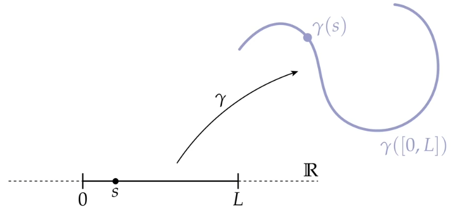
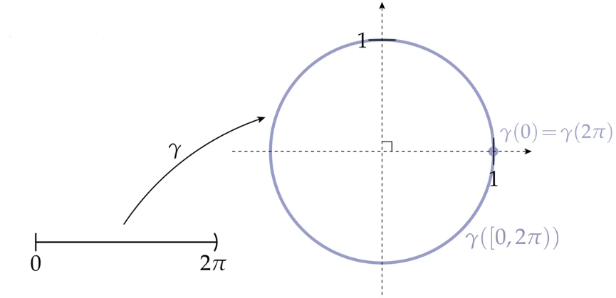
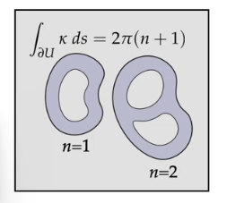
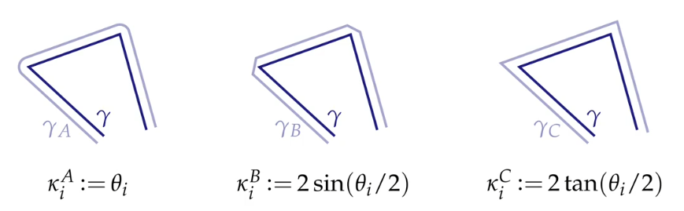
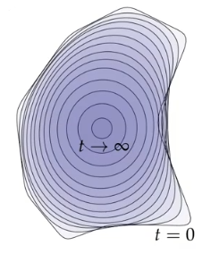

<head>
<script>
MathJax = {
  tex: {
    inlineMath: [['$', '$'], ['\\(', '\\)']],
    displayMath: [["$$", "$$"], ["\\[", "\\]"]],
  },
  svg: {
    fontCache: 'global'
  }
};
</script>

<script type="text/javascript" id="MathJax-script" async
  src="https://cdn.bootcdn.net/ajax/libs/mathjax/3.2.0/es5/tex-chtml.js">
</script>
</head>

# CS 15-458/858: Discrete Differential Geometry by Keenan Crane

# 离散微分几何 by Keenan Crane

> 本课程侧重于**三维几何处理**，同时提供传统微分几何的第一课。 我们的主要目标是展示如何从互补的计算和数学角度理解基本的几何概念(如曲率)。 这种双重视角丰富了二者的相互理解。在这个过程中，我们将重温微积分和线性代数中的重要概念，强调直观的、视觉化的理解，作为更传统形式化代数方法的补充。

> 课程主页：[原始主页](http://brickisland.net/DDGSpring2020/) 、 [带翻译课程 On Bilibili](https://www.bilibili.com/video/BV1Ae411x75n/?p=1&vd_source=b96a639b598f021856a4f2c94799ab28)

# 第一节 Overview

## 1. 微分几何基础

### 平面上的曲线

#### **参数化曲线**

在光滑的环境中， **参数化曲线** 指的是一个 映射\* 或 函数，它将一个实数直线中 区间 $[0,L]$ 的点转换到平面 $\mathbb{R}^2$ 的一系列点。

写作：

$$\gamma : [0,L] \to \mathbb{R}^2$$



\*：这里需要一些条件，如 _连续_ 、 _可微_ 、 _光滑_ 等

例如，我们可以将一个单位圆表示成参数化曲线，它将区间 $[0,2\pi )$ 映射到该单位圆上：

$$\gamma :[0,2\pi) \to \mathbb{R}^2 ; s \mapsto (\cos (s), \sin (s))$$



#### **离散的曲线**

离散的曲线是一个 _分段线性_ 的参数化曲线。简单来说，就是一系列 **顶点** 通过线段连接。

#### **曲线的切线**

曲线的切线指示了曲线在该点“看向”哪里。

我们通常使用 **切向量** 指代 **单位切向量** 。下面给出精确定义：切向量是将曲线的 一阶导\* 归一化所得的向量。

$$T(s) \coloneqq \frac{\frac{d}{ds} \gamma(s)}{|\frac{d}{ds} \gamma(s)|}$$

\* ：假设导数永远不为 $0$ 。也就是，曲线不会“停止”，是 **正则的** 。

如果曲线的导数刚好都有单位长度，那么我们说这条曲线是 **弧长参数化** 的，写作

$$T(s) \coloneqq \frac{d}{ds} \gamma(s)$$

例如，我们对上面所述的单位圆计算它的切向量：

首先，

$$\frac{d}{ds} \gamma(s) = (-\sin (s), \cos (s))$$

$$\left|\frac{d}{ds} \gamma(s)\right| = \sin ^2(s)+ \cos^2 (s) = 1$$

因此，求出切向量：

$$T = (-\sin (s), \cos (s))$$

#### **曲线的法线**

曲线的法线指的是曲线在某点处 _笔直向外_ 的向量。

我们通常使用 **法向量** 指代 **单位法向量** 。下面给出精确定义：切向量是将曲线切向量进行九十度 **逆时针** 旋转后得到的向量。

$$N(s) \coloneqq \mathcal{J}T(s)$$

例如，下面计算单位圆的法线：

$$T(s) = (-\sin (s), \cos (s))$$

$$N(s) = \mathcal{J}T(s) = (-\cos (s),-\sin (s))$$

#### **曲线的曲率**

曲线的曲率描述了曲线在某个点的弯曲程度。

下面给出精确定义：在弧长参数化曲线中，曲率是切向量的变化率\*。也就是 **曲线法向量** 和 **曲线切向量的一阶导（也就是曲线的二阶导）** 的 **内积**

$$
\begin{align*}
    \kappa (s) &\coloneqq \langle N(s), \frac{d}{ds}T(s) \rangle \\
    &\coloneqq \langle N(s), \frac{d^2}{ds^2}\gamma (s) \rangle
\end{align*}
$$

\* ：尖括号表示向量内积。

> 曲率是曲线在几何上的 **二阶导数** 。

我们使用曲线法向量作内积，而不是曲线二阶导的模。因为我们需要 **符号** 。如果曲线二阶导是正的，说明曲线在向 **左** 转。

#### 从连续到离散

我们已经知道了曲线的曲率计算公式：

$$\kappa = \langle \mathcal{J}\frac{d}{ds} \gamma,  \frac{d^2}{ds^2} \gamma \rangle$$

但我们一旦将其应用于离散线段，我们发现，端点处的曲率是 $\infty$ ，且其他点的曲率是 $0$ 。这显然不对。

我们该怎么定义离散情况下的曲率？

考虑下面的这个例子：我们将形状边界的曲线曲率进行积分。



对于一个有 $k$ 个孔的图形，当我们对曲率进行积分，我们会发现：

$$\int_{a}^{b} \kappa(s)ds = \int_{a}^{b} \frac{d}{ds} \varphi(s) ds =  \varphi(b)-\varphi(a)$$

这里 $\varphi$ 指的是从 $a$ 到 $b$ ，切向量的角度变化值。所以，图形每有一个孔，积分值就会增加一个常数 $2\pi$ 。因此，通过观察曲率积分值的变化情况，我们可以确定图形上有几个孔。

同时，我们希望我们离散的点 **逼近** 真实曲线的时候，曲率也应该尽可能的接近。

再者，我们可能希望定义的离散曲率能够易于计算。

> 下面是一个可行的计算方式：
>
> ```c++
> Complex Ta = gamma[i] - gamma[i-1];
> Complex Tb = gamma[i+1] - gamma[i];
> double kappa = (Tb*Ta.inv()).arg();
> ```

> 实际上，曲率有多种定义方式。包括：旋转角度的变化量、长度变化量、斯坦纳公式、内切圆等多种定义方法，在连续的情况下，他们都能计算出正确的曲率值。但是在离散情况下，他们计算出的曲率各不相同，且各有特点。在不同的情况下，选择不同的计算方式，记得灵活多变。



这让我们发现，对于离散的情况，我们更愿意考虑小段的 **积分** ，而不是离散的点值。

#### 曲率流

有些时候，我们想要 **平滑** 一条曲线。也就是，对于曲线中曲率过大的部分，减小它。

曲率流的一个简单版本是 **曲率缩短流** 。在这种情况下，曲线以与曲率成正比的速度向法线方向移动：

$$\frac{d}{ds} \gamma (s,t) = \kappa (s,t) N(s,t)$$



这样处理有几个好处，这些好处我们希望在离散情况也得以保留：

- 总曲率不会发生变化
- 质心不会改变
- 重新缩放后，曲率流不变

但对于离散情况，我们可能需要一些权衡。因为，根据上面的四种定义，我们发现他们都不能完全做到以上三点。

## 课程设置

我们将学习以下内容：

- 组合表面
- 外积分
  - 外代数（线性代数）
  - 微分形式（三维微积分）
  - 离散外演算
- 曲线（二/三维）
  - 光滑
  - 离散
- 表面
  - 光滑
  - 离散
- 曲率
- 拉普拉斯-贝尔特拉米算子
- 测地线
- 共形几何
- 同源性 & 上同源性
- ...
