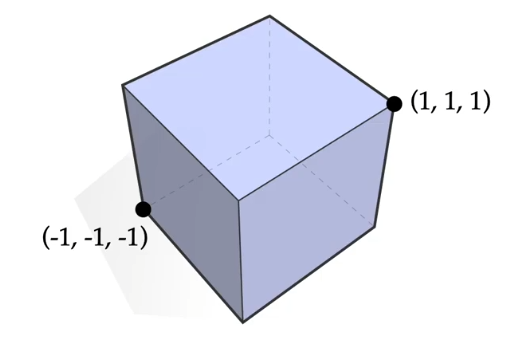

<head>

</head>

# Lecture 2a 网格 Meshes

## 本节课程

### 凸集 Convex Set

**定义** ：对于一个 $\mathbb{R}^n$ 的真子集 $S$ ，我们说它是 **凸的** 当且仅当 每对顶点 $p,q \in S$ ， $p,q$ 组成的线段也包含在集合 $S$ 中。

### 凸包 Convex Hull

**定义** ：对于一个 $\mathbb{R}^n$ 的真子集 $S$ ，它的 **凸包** ${\rm conv}(S)$ 是一个包含集合 $S$ 的最小 **凸集** 。或，所有包含 $S$ 的凸集的 **交** 。

**例：** $S \coloneqq \{(\pm 1, \pm 1 ,\pm 1)\} \subset \mathbb{R}^3$ 的凸包是什么？

**答：** 是一个立方体。

### 单纯形 Simplex

通俗地说，一个 **k-单纯形** 是一个点、线段、三角形、四面体、...。

要解释单纯形的定义，我们首先要回顾线性代数中的概念。

#### **线性无关** Linear Independence

**定义** ：对于一系列向量 $\mathbf{v}_1,\mathbf{v}_2,\dots \mathbf{v}_n,$ 它们是 **线性无关** 的当且仅当它们中的每一个向量都 **不能** 表示为其他向量的组合。也就是，找不到一系列的系数 $a_1,a_2,\dots a_n \in \mathbb{R}$ ，使 $\mathbf{v}_j = \sum_{i \neq j} a_i \mathbf{v}_i$ 。

#### **仿射独立** Affine Independence

**定义** ：对于一系列 **点** $\mathbf{p}_0,\mathbf{p}_1,\dots \mathbf{p}_n$ ，如果这些向量 $\mathbf{v}_i \coloneqq \mathbf{p}_i - \mathbf{p}_0$ 是线性无关的，那么称这些点 **仿射独立**

回到单纯形，我们给出定义：

**定义** ：**k-单纯形** 是 $k+1$ 个仿射独立的点 的 **凸包** 。我们将这些点称为 **顶点** 。

### 重心坐标

以 1-单纯形 为例，我们用重心坐标给出它的定义：1-单纯形 由两端点处组合的、权重之和为 $1$ 的所有重心坐标组成。即：

$$\mathbf{p}(t) \coloneqq (1-t)\mathbf{a} + t\mathbf{b}, t\in [0,1]$$

同理，在 k-单纯形 中，写作：

$$\sigma = \left\{ \sum_{i=0}^{k} t_i\mathbf{p}_i \middle | \sum_{i=0}^{k}t_i = 1, t_i \geq 0 \ \forall i \right\}$$

**重心坐标** 是 上式中的 $t_i$ 。

### 标准 k-单纯形

标准 k-单纯形 指 使用重心坐标组成的 k-单纯形。也叫 _概率单纯形_ 。

通俗地说，由欧几里得空间中的原点和各坐标轴上的 $\textbf{1}$ 点（即 $\textbf{e}_i = (0,\dots,1,\dots,0)$ ）构成的单纯形，称为标准单纯形。即：

$$\sigma = \left\{ (x_0,\dots ,x_n) \in \mathbb{R}^{n+1} \middle | \sum_{i=1}^{n}x_i = 1, x_i \geq 0 \ \forall i \right\}$$

### 单纯复形 Simplicial Complex

通俗地说，一个 **单纯复形** 是“一些单纯形”，但它有一些特性作为约束。

#### 单纯形的面

**定义** ：单纯形的面 $\sigma$ 指的是 该单纯形顶点的 **任意子集\*** 组成的单纯形。

如上图，子集可以是一个顶点，也可以是两个顶点组成的单纯形，也可以是它本身（真子集），空集也可以。

回到单纯复形，我们给出定义：

**定义** ：一个 （几何） **单纯复形** 是一组单纯形的集合，它们：

- 其中任意两个单纯形的交集是单纯形
- 其中单纯形的每个 **面** 也在单纯复形中

**例** ：如下图的 10 个顶点组成的单纯复形：

- 这个单纯复形包含的所有单纯形是：

  $\{6,7,9\},\{7,10,8\},$

  $\{2,3\},\{3,4\},\{4,5\},\{6,7\},\{7,9\},\{9,6\},\{7,8\},\{8,10\},\{10,7\}$

  $\{0\},\{1\},\{2\},\{3\},\{4\},\{5\},\{6\},\{7\},\{8\},\{9\},\{10\}$

### 抽象单纯复形

**定义** ：设 $S$ 是一些集合组成的集合。如果每个子集 $\sigma \in S$ ， $\sigma$ 的子集都包含在 $S$ 中，我们称 $S$ 是一个 **抽象单纯复形** 。而大小为 $k+1$ 的集合 $\sigma$ 成称为 **抽象单纯形** 。

也就是说，我们只关心它们如何 **连接** ，但不关心它们在 **几何上** 如何摆放。

例如，无向图 $G = (V,E)$ 是一个抽象单纯复形。

#### **持久同源性 Persistent Homology/持续同调**

持久同源性 广泛应用于 **拓扑数据分析（Topological Data Analysis）**。

在几何中，我们对每个点进行“扩展”，每个点为圆心伸展出一个圆，如果两个点的圆有交界，那么两点之间连一根线。圆的半径将不断增加。

我们追踪其中的两个性质：特征的 **产生** 和 **消亡** 。

我们发现，背离对角线的点说明了此特征能持续 **较长时间** 。也就是：这个特征可能是我们想要找的特征。

下面三个运算符是对一些单纯复形进行的操作的简写。

#### **闭包运算**

**定义** ：给定一个单纯形的集合， **闭包** 指 包含这些单纯形的 **最小** 的 **单纯复形** 。

如下图，一个 2-单纯形 和 一条边 组成的闭包是它们所有面的集合。

#### **星形运算符**

**定义** ：对一个单纯复形进行星形运算，指的是取在单纯复形中的、 **包含** 此单纯形的所有单纯形。

如上图，对一个顶点作星形运算后得到的是包含这个顶点的所有单纯形的并集。

#### **连接运算符**

**定义** ：连接运算符取该单纯复形的 **星形运算的闭包** 减 **闭包运算的星形** 剩下的内容。

如上图。它能取该顶点周围一圈的 **所有边** 和 **所有顶点** 。

#### 顶点、边、面

- 在 1-单纯复形 中，由于 1-单纯复形也是无向图，因此我们用 $G = (V,E)$ 表示。
- 在 2-单纯复形 中，由于 2-单纯复形是 **三角形网格** ，我们使用 $K=(V,E,F)$ 表示。

其中 $V$ 指顶点， $E$ 指边， $F$ 指面。此处的面指的不是单纯复形的面，而是单指三角形本身。

### 单纯复形的方向

- 在 1-单纯形 中，我们若需要表示方向（这对积分很有帮助），我们使用 $(a,b)$ 表示从 $a$ 到 $b$ 的方向。

- 在 2-单纯形 中，我们定义 **三元组** $(a,b,c)$ 为方向（顺时针或逆时针）。字母的循环移位不改变对方向的描述（如 $(a,b,c)$ 和 $(b,c,a)$ ）。

- 对于 k-单纯形，我们如何定义方向？

#### 相对方向

**定义** ：如果两个不同的单纯形的 **相交处** 有 **不同** 的方向，我们称它们有 **相对方向**。

### 流形

我们想要定义流形。首先我们知道，流形是几何中 *很好* 的一种形状。那么怎么定义 *很好* 呢？和之前我们说曲线类似，说到参数化曲线，我们喜欢 *弧长参数化曲线* ，因为它的速度恒定，且不会存在没有速度的点（也就是正则曲线）。我们不喜欢没有定义的东西。所以，在这里我们将“很好”定义为：在该几何体的局部都可以 **建立坐标系** 。也就是说，局部具有 $\mathbb{R}^n$ 的性质。

如上图，漏斗形状和星形的显然不是流形。

接下来给出精确定义。

**定义** ：如果一个 **单纯k-复形** 的 **连接运算** 看起来像\* 一个 **k-1维** 的球，那么我们称这个 单纯k-复形 为 **流形**。

\*：“看起来”，即 **同胚** (homeomorphic)。

那么，我们怎么确定一个单纯复形是流形呢？

- k=1 时，只需确定这个单纯复形中的单纯形是不是闭合的环。
- k=2 时，只需确定这个单纯复形中的顶点的 **连接运算** 后是不是闭合的环。
- k=3 时，只需确定这个单纯复形中的顶点的 **连接运算** 后是不是一个2-球体，也就是，通过欧拉公式 $V-E+F=2$ 。
- k=4 时，这个问题是一个NP完全问题。

### 三角流形网格

三角流形网格有几个特征：

- 每条边都被且只被两个三角形共享
  - 或者在边界上
- 每个顶点都包含在一个闭合的三角环形中
  - 或者在边界上，可以是三角扇形中

### 拓扑数据结构

首先，也是最简单的，我们可以通过 **邻接表** 存储一个三角流形网格是顶点：

这样，我们可以使用最少的存储空间存储一个流形。但是，无法很好的遍历边，而且给定一个顶点，你无法得知它的邻居。

其次，是 **关联矩阵** 。

关联矩阵包括 $E_0$ 和 $E_1$ ，它们互为转置。

