<head>
<script>
MathJax = {
  tex: {
    inlineMath: [['$', '$'], ['\\(', '\\)']],
    displayMath: [["$$", "$$"], ["\\[", "\\]"]],
  },
  svg: {
    fontCache: 'global'
  }
};
</script>
<script type="text/javascript" id="MathJax-script" async
  src="https://cdn.jsdelivr.net/npm/mathjax@3/es5/tex-svg.js">
</script>
</head>

# _Intersection-free Rigid Body Dynamics_ **无交刚体动力学**

ZACHARY FERGUSON，纽约大学

MINCHEN LI，加州大学洛杉矶分校,宾夕法尼亚大学

TESEO SCHNEIDER，纽约大学和维多利亚大学

FRANCISCA GIL-URETA，纽约大学

TIMOTHY LANGLOIS，Adobe 研究所

CHENFANFU JIANG，加州大学洛杉矶分校和宾夕法尼亚大学

DENIS ZORIN，纽约大学

DANNY M. KAUFMAN，Adobe 研究所

DANIELE PANOZZO，纽约大学


> _图 1. 扩展锁箱。针对 3D 打印设计的复杂锁定机构可以直接用我们的算法进行仿真。当“钥匙”转动时，中心螺旋被旋转，依次拉入五个锁定销。当所有的销子都收回时，底部就可以自由下落了。该算法的无交叉保证使设计的自动测试无需调整仿真参数。©Angus Deveson_

我们介绍了第一个具有接触和摩擦的刚体动力学隐式时间步进算法，该算法保证了在每个时间步长的无相交构型。

我们的算法明确地模拟了刚体在碰撞检测和响应中跟踪的弯曲轨迹。在碰撞检测方面，我们提出了一种保守的弯曲轨迹窄相位的碰撞检测算法；该算法将问题简化为一系列具有最小分离的线性的连续碰撞检测的查询。对于时间积分和接触响应，我们将最近提出的增量潜在接触框架扩展到了简化坐标和刚体动力学。

我们引入了刚体模拟的基准跑分，并说明了我们的方法虽然效率低于替代方法，但可以稳健地处理各种复杂场景，而这些场景无法用竞争方法模拟，从而不需要对每个场景进行参数调整。

## 1 介绍

在计算机图形学和机器人技术中，具有接触分辨率和摩擦的刚性物体的模拟无处不在。刚体模型不会变形。当材料变形效应不显著或可以安全地忽略时，仅配备旋转和平移自由度(DOF)是一种关键的简化方法，可以使模拟的 DOF 降低几个数量级。

理想的刚体模拟器应该具有场景描述、初始条件、以及一组(可能与时间相关的)边界条件，并随时间来整合系统。不幸的是，现有算法并非如此，它们需要大量的参数调优才能产生合理的结果(第 6 节)。

在这项工作中，我们以一个不同的角度重新审视这个问题：自动化和健壮性。我们提出了一种不需要每个场景调整参数的算法，它可以对具有复杂几何、接触和摩擦相互作用的大型场景进行时间步进。我们的算法是第一个保证模拟的所有轨迹(因此是在每个时间步长)没有穿透的刚体模拟算法。

我们的算法将最近提出的用于大变形动力学理论的 IPC 公式扩展到刚体动力学。我们依靠相同的核心思想：通过一组障碍函数对接触进行建模，并使用增量势公式对系统进行时间步进，同时确保在所有的中间计算阶段没有相交。这些思想被扩展到具有简化坐标的刚体动力学中，其中每个刚体都通过刚性变换参数化。我们的公式能够支持较大的时间步长，共维对象，以及在静止或滑动接触中具有数百个相互连接的刚体的复杂场景。我们将我们的解决方案与原始的 IPC 体积公式(使用具有高杨氏模量的材料来代理刚体)进行了比较，结果说明我们的方法正如预期，由于自由度较少且能够准确地模拟刚性运动，在大型场景中更有效。

作为我们算法的一部分，我们需要在一种特殊类型的弯曲轨迹上保守地检测碰撞，这种轨迹是通过在旋转向量表示的刚性运动中线性插值获得的。

针对刚体运动的三角形点和边缘碰撞检测查询，提出了第一个保守的宽相位和窄相位解。窄相位查询是基于一个简单有效的观察：问题可以化简成一个具有最小的分隔的序列的线性连续碰撞检测查询。对于宽相位，我们建议使用区间算法来计算可用于标准 BVH 数据结构的保守边包围盒。

由此产生的算法可以处理现有的刚体模拟器无法模拟的复杂场景，亦或是需要费力微调和手动调整仿真参数才能实现的复杂场景，从而为图形、机器人和制造领域的新应用打开了大门。为了定量和定性地比较我们的算法与竞品，我们引入了刚体模拟的基准，并将我们的结果与四种流行的刚体模拟器(Bullet，MuJoCo，Chrono，和 Houdini 的刚体动力学(RBD))进行比较。

为了促进未来的研究并使我们的结果可重复，我们在附加材料中附加了我们的算法的参考实现、基准和脚本，以方便复现论文中的所有结果。此材料将作为开源项目公开发布。

我们的主要贡献是：

- 刚体动力学的 IPC 公式
- 针对曲线轨迹的一个有效的，可证明保守的连续碰撞检测查询
- 刚体模拟的基准评估

## 2 相关工作

### 2.1 刚体模拟

追溯到欧拉时期，刚体模型是物理建模和仿真的基本基本要素[Marsden and Ratiu 2013]。

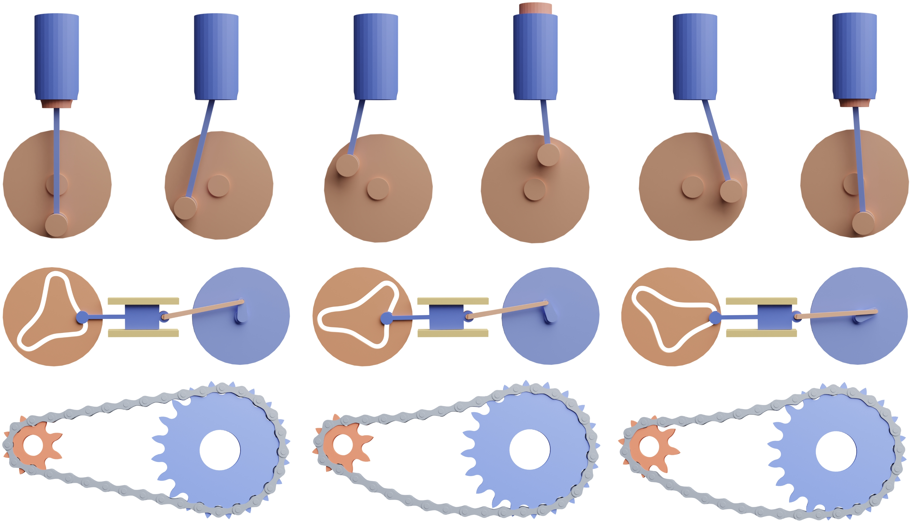

> _图 2. 结构系统。我们证明了我们的方法对各种机构具有紧密一致性接触的健壮性。上图:活塞附在旋转的圆盘上，静气缸用来约束活塞的运动。中间:一个具有复杂几何形状的车轮旋转平稳，但导致连接车轮上的间歇性运动。底部:一个自行车链连接到一个运动链轮。每个连接通过一个现实生活中的接头组成的滚轮，销，和两个平板来建模。©Okan(自行车链条)，Hampus Andersson(链轮)CC BY。_

虽然它提供了一个非常紧凑的身体动力学表示，但它也带来了独特的挑战。首先，追踪分段的刚性轨迹比追踪分段的线性轨迹更具挑战性。我们将在 2.2 节详细介绍这对集成碰撞检测和时间步进的影响。第二，因为刚体是无限刚性的，施加的力和接触响应在材料领域能够瞬间传递。这种敏感性长期以来一直挑战着用于模拟多体系统的时间步进方法和摩擦模型的稳定性、准确性和有效性[Stewart 2000]。

刚体接触模拟在力学、机器人和图形学中得到了广泛的研究。在图形学方面，从 Baraff 的开创性工作开始，刚体接触特别关注线性互补规划模型(LCP)。这里所采用的半隐式模型在速度水平上强制执行接触约束。这种线性化的约束强制会导致约束漂移和隧穿效应。反过来，这些瑕疵可以通过约束稳定方法，以牺牲物理精度为代价缓解一部分。LCP 及其相关的接触模型也可以等效地变分形式表达，并且可以适用于原始和对偶构造。

然而，由于这些方法依赖于速度级别的参数和线性化的接触约束，因此无法用于基于 IPC 的优化。在这里，为了将 IPC 扩展到刚性坐标系，我们直接基于位置和旋转构建了刚体的增量势能，而不是依赖于速度。

为了提高效率和速度，基于 LCP、近似、梯度下降和分解等方法，开发了广泛的刚体迭代方法。然而，速度的提高通常会带来额外的精度权衡。因此，这种固有的精度损失和对稳定性和鲁棒性的影响通常需要通过手动调整和大量的非物理约束稳定化来进行补偿。

我们工作的一个潜在好处是，我们的新 IPC 刚体公式可以轻松地与原始的 IPC 可变形体公式耦合。例如，Müller 等人引入了类似的联合公式，通过扩展基于位置的动力学模拟刚体，从而使软体和刚体能够轻松耦合。

在模拟刚体方面，也有着丰富的保证性方法研究历史。从 Moser 和 Veselov 的著名工作开始，时间积分方法专注于保留自由刚体的几何不变量。近期的补充工作专注于设计方法以保持几何不变量（能量和动量）以及刚体碰撞的期望特性。

为了维护无交错的刚体轨迹，Mirtich [2000, 1996]和 Snyder 等人构建了保守的显式时间步进方法。Mirtich 明确地向前推进刚体，并采用保守的推进方式到达接触时间，然后通过高效回滚来扩展无交错解决方案。Snyder 等人应用区间分析来检测物体之间的碰撞。关于我们的 CCD 方法的进一步讨论和比较详见第 2.2 节和附录 B。与显式时间步进方案相比，我们的方法是完全隐式的，可以同时进行大时间步长和所有碰撞的全局分析，而无需在模拟进行之前检测和解决每个碰撞。

### 2.2 碰撞检测

我们将概述限于弯曲轨迹的连续碰撞检测(CCD)算法，因为我们对刚性运动感兴趣，以及具有最小分离的线性轨迹的 CCD 算法，因为我们的算法需要解决这个子问题。我们参考的是 _Wang_ 等人关于无最小分离线性轨迹 CCD 方法的概述。

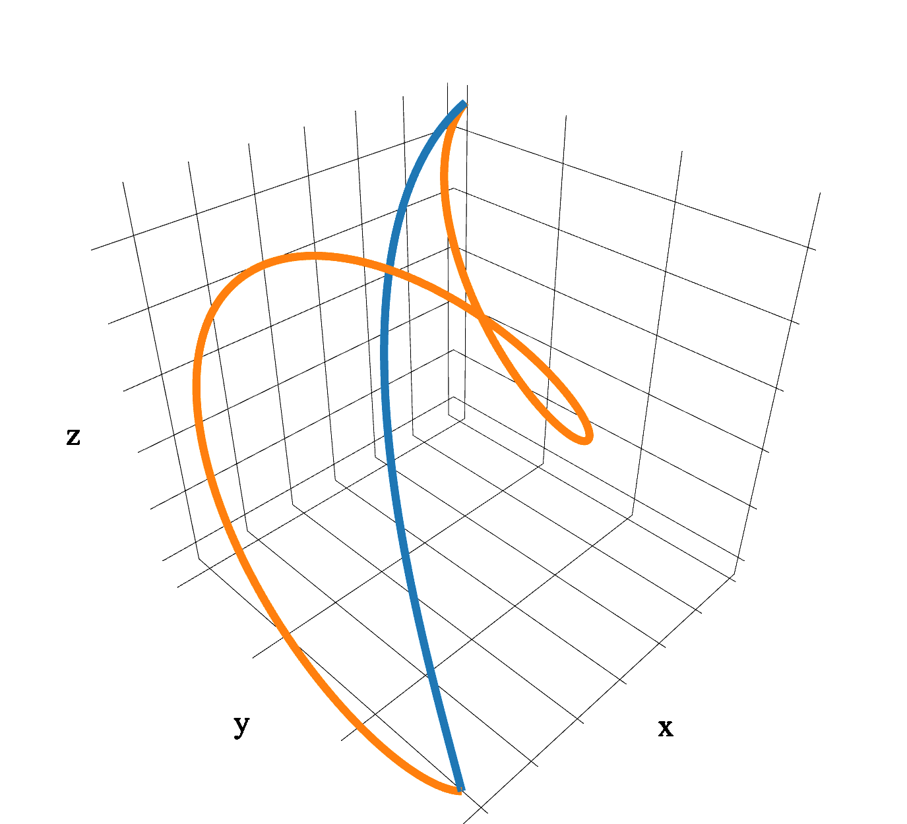

> 图 3. 对旋转矢量的轨迹进行插值与传统的螺旋运动有很大的不同。

**曲线。** 在图形学和机器人技术中，对曲线的 CCD 算法进行了广泛的研究。考虑的轨迹是旋转矩阵、螺旋运动和样条曲线的插值。我们在本文中不提及任何方法来处理考虑的插值旋转矢量获得的轨迹。

主要有两种方法:基于区间的非线性方程组求根法和保守推进法。

基于区间的根查找。最初的方法之一是在 [Snyder 1992; Snyder et al. 1993] 中引入的，他们提出使用基于区间的根查找器来保守地检测是否存在碰撞以及其时间。该方法具有鲁棒性但速度较慢，因为它严重依赖于区间算术。为了减少域中的维数并相应地提高性能，Redon 等人建议仅对问题的一部分使用类似的策略，并将 CCD 问题重写为单变量系统。

然而，这种方法在退化情况下会导致无限数量的根，从而严重降低某些查询的速度。用于通过插值四元数获得的轨迹的类似的公式，在[Canny 1986]中被引入。我们在附录 B 中提供了对这些方法的多元和单元公式的明确比较。

**保守推进法。** 最流行的方法簇是保守推进，它迭代地构建子步骤的保守凸代理 [Mirtich 2000, 1996]。

这些方法已被提出用于样条轨迹、具有恒定旋转和线性速度的轨迹、螺旋运动。不同的图元被使用，例如边界框或球体 [Schwarzer et al 2005]。虽然大多数方法只适用于凸图元，但也有非凸多面体的扩展。在 Zhang 等人的研究中，保守推进法被扩展到关节式物体，采用基于 Taylor 展开的新技术，即使对于长体链也能计算出紧密逼近。计算保守代理的有用工具是计算多面体之间距离的方法。在 [Zhang et al. 2007a,b] 中引入了用于刚体运动的专门方法，并在保守推进框架内使用这些方法来设计 CCD 算法。

不过，这些技术都不能直接处理我们在工作中考虑的通过插值旋转向量获得的轨迹。

**其他方法。** 除了上述分类之外，Waveren 还介绍了一种处理多面体特征之间旋转接触的独特方法。通过使用 plencker 坐标并考虑浮点舍入误差，Waveren 能够在实时应用中健壮地检测和响应碰撞。不幸的是，这种方法仅限于螺旋运动，并不能立即适用于我们当前的(旋转矢量的插值的)框架。

**数值精度问题。** Snyder 等人考虑了浮点舍入问题，因此在使用浮点实现时可以保证正确的结果。而其他方法在使用浮点运算实现时是非保守的。因为在我们的设置中，任何缺失的碰撞都很致命，因为它将打破我们的无互穿不变性，所以我们可以使用的唯一方法是[Snyder 1992; Snyder et al. 1993] ，用于原始的多元公式，或用于 [Redon et al. 2002a] 中提出的一维公式(并适用于旋转矢量插值轨迹)。我们将在 4.3 节中讨论这两种方法，并在附录 B 中提供与我们技术的比较。

**最小间距线性 CCD。** 最小间距线性 CCD 在两个图元处于用户指定的某个小距离之内的时候检测碰撞。在我们的工作中，我们将曲面 CCD 问题简化为一个最小间距的线性 CCD 序列。虽然可以使用上述任何一种方法，但我们选择[Wang et al. 2020] 的方法，因为它是使用浮点算法实现时唯一保证正确的方法，并且它在 GitHub 上也有公共实现。我们的曲线 CCD 算法还可以扩展到支持保守最小间距(第 5 节)，据我们所知，之前没有其他曲面 CCD 方法考虑过这一特征，这在制造应用中非常有用，可以确保满足间隙约束。

## 3 IPC 概述

我们简要概述了 [Li et al. 2020] 中介绍的增量势接触求解器，以使我们的论文独立。

[Li et al. 2020] 提出了一种新的方法来处理具有摩擦接触的大形变动力学，将单个时间步减少到无约束的非线性能量的最小化：

$$x^{t+1} = \argmin_{x} E_d(x,x^t,v^t)+B(x,\hat{d})+D(x,\hat{d}) \tag{1}$$

这里 $x^t$ 是节点位置的集合， $v^t$ 是对应的速度， $E_d(x,x^t,v^t)$ 是数值时间步进的增量势（Incremental Potential）， $D$ 是摩擦势， $B$ 是阻力的势。当几何图元超出用户定义的几何精度 $\hat{d}$ 时，后者消失，当两个对象接触时，后者发散。

**求解器和线性搜索 CCD。** IPC 需要一个没有自交的初始状态，并使用自定义投影牛顿求解器通过将方程(1)最小化到用户控制的精度来对系统进行时间步进。求解器在优化过程中保证了所有曲面基元对的轨迹都是无相交的。

保证性来自于使用保守的线性 CCD 查询显式地验证每条线搜索中的线性轨迹：如果 CCD 查询返回碰撞，则减少步长，直到可能的那一步。求解器要求能量为 $C^2$ 连续(如牛顿法需要计算二阶导数)，因此需要对能量的所有项进行仔细定义。

**屏障势函数和距离。** 设 $C$ 为包含曲面网格中所有非关联点三角形和所有非相邻边边对的集合。屏障势定义为：

$$B(x,\hat{d}) = \kappa \sum_{k \in C} b(d_k(x),\hat{d}) \tag{2}$$

其中 𝜅 为屏障势刚度， $𝑑_𝑘$ 为 $𝑘$ 对基元之间的软化无符号距离(关于基元对之间的软化距离 𝑑𝑘 的计算细节，我们参考 Li et al.[2020] 的介绍)， $𝑏$ 是一个对数屏障势函数，定义如下：

$$
b(d,\hat{d})=\left\{
\begin{aligned}
-(d-\hat{d}) \ln (\frac{d}{\hat{d}}) \  , \ 0<d<\hat{d} \\
0  \ \ \ \ \ \ \ \ \ \ \ \ \ \ \ \ \ \ \ \ \ \ \ \ \ \ \ \  , \ d ≥ \hat{d} \\
\end{aligned}
\right.
\tag{3}
$$

我们注意到，虽然 $C$ 包含许多数对，这些对相对于图元的数量是二次的，但由于屏障势的支撑集是局部的，大部分的数对将对方程(3)的贡献为零。

## 4 方法

**输入。** 我们算法的输入是期望的时间步长 $h$ ，计算距离精度目标 $\hat{d}$ 和一组 $𝑛$ 个的刚体。每个刚体 $i$ 都具有一组位于体-框架局部坐标 $\hat{X}_i$ 下的、轴向的组织顶点 $k_i$ 、一组三角形面 $\hat{F}_i$ 、一个质量 $m_i$ 和一个惯性系 $I_i$ 组成。对于每个符号，我们使用下标符 $i$ 来标识每个主体，没有下标的同一符号表示该数量的堆叠的向量或矩阵，它指向所有模拟对象的集合（例如， $\hat{X}_i$ 给出第 𝑖 个主体的坐标，而 $\hat{X}$ 是所有主体的堆叠坐标）。然后，每个刚体的位置由一个参数化给出，该参数化带有旋转向量 $\theta \in \mathbb{R}^3$ 和平移向量 $q_i \in \mathbb{R}^3$，它们一起将每个刚体从其局部框架映射到世界坐标:

$$\phi_i(\theta_i,q_i) = \mathcal{R}(\theta_i) \hat{X}_i + q_i \tag{4}$$

在这里，这里，函数 $\mathbb{R}^3 \times \mathbb{R}^3 \to \mathbb{R}^{3\times k_i}$ 用罗德里格斯旋转公式 $\mathcal{R}$ (见式(14)) 将第 𝑖 个体的第 𝑘 个顶点（从局部坐标）映射到世界坐标中（从旋转向量映射到旋转矩阵）。

我们初始化每个模拟，初始配置为所有物体的旋转值为 $\theta^0$ ，平移值为 $𝑞^0$ 。我们需要一个非互穿的起始构型，并且称任何无交集的构型都是有效的。

**输出。** 仿真输出是对刚体系统进行时间积分得到的最终有效构型 $(\theta^{t_{end}},q^{t_{end}})$ ，对应的从 $(\theta^{0},q^{0})$ 到 $(\theta^{t_{end}},q^{t_{end}})$ 的轨迹保证无交集。生成的轨迹在广义坐标下分段线性 $(\theta,q)$ ，在世界坐标下为曲线轨迹。

**概述。** 我们的方法遵循与 Li et al.[2020] 相同的高级思想(在上面第 3 节中进行了简要总结)。我们的第一步要求我们将刚体系统时间积分器表述为增量势(IP)——在以前并不能这样做。有了刚体的 IP，我们就可以按照 Li et al.[2020] 的方法，用屏障势和摩擦势（通过重新映射 $\phi$ 来计算）来增加它，分别解决接触力和摩擦力。下面，我们首先构造增量势公式（4.1 节），然后描述我们如何将线性搜索、约束集生成和牛顿型求解器应用于刚体时间步长问题。作为该方案的关键部分，在直线搜索过程中，我们必须处理一种特殊类型的曲线轨迹以进行连续碰撞检测。

为此，我们在 4.3 节中开发了一个保守的 CCD 查询。我们在第 6.1 节中对我们的刚体公式和 [Li et al. 2020] 的原始公式进行了广泛的比较。

### 4.1 刚体增量势

继 Li et al.[2020] 之后，我们构造了一个离散能量，其平稳点给出了无约束时间步进方法的组态更新。牛顿-欧拉刚体运动方程自然地在加速度水平上定义，然而，(由于参数化)它们不自然地集成到一个明显的变分公式，其极值器给出刚体时间步长的更新旋转。

然后，我们直接在旋转矩阵 $Q_i$ 上构建增量势公式，该旋转矩阵将刚体 $i$ 上的点从其局部框架映射到与世界坐标轴向的的框架中。在如何时间 $t$ ，有 $Q^t_i = \mathcal{R}(\theta_i^t)$ ，我们的第一步是，可以直接在旋转矩阵速度上定义角动能为 $\frac{1}{2}{\rm tr}(\dot{Q_i}J_i\dot{Q_i}^T)$ ，此处：

$$J_i = \frac{1}{2}{\rm diag}(-I_i^x+I_i^y+I_i^z,I_i^x-I_i^y+I_i^z,I_i^x+I_i^y-I_i^z)$$

是惯性矩阵， $I_i^x$ ， $I_i^y$ ， $I_i^z$ 是惯性系 $I_i$ 的分量。

有了惯性矩阵的定义，我们现在的目标是平面运动方程，这将让我们能为任意数值时间计算 $Q_i$ 上的积分，得到增量势。为此，我们只需应用具有正交性约束 $Q_i^TQ_i - Id = 0$ 的拉格朗日法，然后，我们可以直接应用标准形式，使用平坦坐标的受限时间积分器。通过我们的构造，我们导出了与隐式欧拉积分的刚体系统的增量势方程。对于我们的公式，约束的隐式欧拉时间步进器为：

$$Q_i^{t+1} = Q_i^{t}+h\dot{Q_i}^t-h^2\nabla V(Q_i^{t+1})J_i^{-1} +Q_i^{t+1}\Lambda J_i^{-1}+h^2[\tau_i]J_i^{-1} \tag{5}$$
$${Q_i^{t+1}}^T Q_i^{t+1}-Id = 0 \tag{6}$$
$$\dot{Q_i}^t = \frac{Q_i^{t}-Q_i^{t-1}}{h} \tag{7}$$

这里 $\Lambda$ 是我们约束的对称拉格朗日乘子矩阵， $\tau_i$ 是是在时间 $𝑡$ 上施加到物体上的任何外部力矩， $V$ 是在 $Q_i$ 上定义的任意势能。我们用符号 $[.]$ 表示斜对称(叉积)矩阵的构造。

接下来，为了创建隐式欧拉刚体增量势，我们可以将其转换为相应的变分形式:

$$\tilde{Q}^t_i = Q_i^t+h\dot{Q_i}^t+h^2[\tau_i]J_i^{-1}$$
$${Q_i^{t+1}} = \argmin_Q \frac{1}{2} {\rm tr}({Q_i}J_i{Q_i}^T)+{\rm tr}({Q_i}J_i{(\tilde{Q}^t_i)}^T) +h^2V(Q) \tag{8}$$
$${\rm s.t.} \ Q^TQ-Id = 0$$

然后，对于我们的整个刚体系统(假设不失一般性，现在没有势能)旋转坐标的隐式欧拉增量势是：

$$E_Q(Q) = \sum_{i=1}^n( \frac{1}{2} {\rm tr}({Q_i}J_i{Q_i}^T) - {\rm tr}({Q_i}J_i{(\tilde{Q}^t_i)}^T)) \tag{9}$$

对应于平动坐标(直接从标准隐式欧拉得出)，我们有

$$\tilde{q}_i^t = q^t+h\dot{q}_i^t+h^2(g+m^{-1}f_i)$$
$$E_q(q) = \sum_{i=1}^n( \frac{1}{2} m_iq_i^Tq_i - m_iq_i^T\tilde{q}_i^t) \tag{10}$$

其中，𝑔 是重力加速度，𝑓 是任何外力，在时刻 $t$ 作用于物体 $i$ 的质心，这样我们就可以将速度更新为：

$$\dot{Q_i}^t = \frac{1}{h} (Q^t-Q^{t-1}) \ {\rm and} \ \dot{q_i}^t = \frac{1}{h} (q^t-q^{t-1})$$

最后得到完整的隐式欧拉刚体增量势为：

$$E(Q,q) = E_Q(Q)+E_q(q)$$

现在它完全是用 𝑄 和 𝑞 来定义的，根据我们的策略，当我们希望应用刚体坐标时，可以直接应用于方程(1)中的 $E_𝑑$ 。这给了我们下面的约束优化问题来解决：

$$(𝑄^{𝑡+1}, 𝑞^{𝑡+1}) = \argmin_{Q,q} E(Q,q)+B(\phi (Q,q), \hat{d}) + D(\phi(Q,q)) \tag{11}$$
$${\rm s.t.} \ Q^TQ=Id \ ,\ i=\{1,...n\}, \tag{12}$$

其中约束是必要的，以确保最小化 $𝑄^{𝑡+1}$给出旋转矩阵。

**旋转矢量参数化。** 我们的目标仍然是使用无约束优化，以便将其应用于具有线性搜索过滤的牛顿型求解器，从而在保证的情况下能健壮地地最小化增量势。为了用旋转向量 $\theta_i$ 对旋转进行参数化，我们可以直接应用罗德里格斯旋转公式去除方程(12)中的等式约束。这最终可以让我们得到一个无约束的优化问题，从而得到刚体摩擦接触的增量势：

$$(\theta^{t+1},q^{t+1}) = \argmin_{\theta,q}E(\mathcal{R}(\theta),q)+B(\phi(\mathcal{R}(\theta)Q,q)) + D(\phi(\mathcal{R}(\theta),q))$$

接下来，我们将讨论它现在可以用滤波后的投影牛顿求解器来求解。

我们的旋转矢量参数化对于获得增量势的无约束最小化形式至关重要，因为它避免了额外的约束，并使我们能够使用无约束投影牛顿求解器解决优化问题。虽然存在最小化能量的替代方案，比如我们在 $SO(3)$ 空间中的增量势 [Owren and Welfert 2000]，但如何将我们的屏障集成到这些方法中并不明显，因为它们不提供过滤波后的线性搜索。

添加不同比例的旋转向量可能需要更多的更新次数来改变旋转轴。但是，如果每次求解都从最后一个时间步长开始热启动，即使在时间步长较大的场景中也不会出现这个问题。

我们将在附录 E 中详细讨论一个综合示例，并提供一个解决方案(如有需要)。

### 4.2 投影后的牛顿求解器

现在我们已经为刚体构建了一个无约束的屏障增量势，我们应用 Li et al.[2020] 中提出的牛顿型求解器，并进行了一些必要的修改，以解决刚体增量势公式特有的数值问题。

**罗德里格斯旋转公式及其导数。** 罗德里格斯旋转公式提供了一种从旋转向量计算旋转矩阵的方法。罗德里格斯的旋转公式通常写成：

$$\mathcal{R}(\theta) = Id + \sin(\parallel\theta\parallel) \left[\frac{\theta}{\parallel\theta\parallel}\right] + (1-\cos(\parallel\theta\parallel))\left[\frac{\theta}{\parallel\theta\parallel}\right]^2 \tag{13}$$

其中 $\mathcal{R(0)}$ 是 $Id$ 。为了数值稳定性（ $\theta$ 在 0 附近的区域），我们将 $\mathcal{R}$ 改写为：

$$\mathcal{R}(\theta) = Id + {\rm sinc}(\parallel\theta\parallel) [\theta] + 2{\rm sinc^2}(\frac{\parallel\theta\parallel}{2}) [\theta]^2  \tag{14}$$

其中：

$$
{\rm sinc}(x)=\left\{
\begin{aligned}
1  \ \ \ \ \  \ \ \ \ \ \ \ , \ \ \ \ \ x=0 \\
\frac{\sin x}{x}  \ \ \ \ \ , {\rm otherwise.}
\end{aligned}
\right.
\tag{3}
$$

注意，我们使用泰勒级数展开计算接近于零的值(见附录 a.1)。

由于 $\rm sinc$ 是 $C^\infty$ 连续，需要特别注意计算其梯度和黑塞矩阵以防止产生除零错。附录 A.2 给出了 $\rm sinc(∥\theta∥)$ 导数的完整推导。

此外，当使用区间算法计算 $\rm sinc(x)$ 时，使用区间除法的简单实现可能会导致远远超出 $\rm sinc(x)$ 范围的区间(由于除零错)。我们通过计算区间端点的实值(或考虑舍入误差的小区间)来利用接近零的单调域。我们将在附录 A.3 中进一步讨论这一策略。

**稳定性。** 由于我们从轴角矩阵到旋转矩阵的转换，黑塞矩阵 $H(E_Q(Q))$ 可能不是半正定的。与弹性动力情况不同的是，半正定的投影不是通过添加质量矩阵来平衡的，因此我们得到一个奇异矩阵。相反，我们首先应用未投影的黑塞矩阵（与原始 IPC 中的有限元公式相比花销更少），如果线性求解失败，或计算方向不是下降方向，我们通过添加一个由 $\xi$ 缩放的恒等式和求解来应用标准偏移。我们继续这个过程，将 $\xi$ 增加一倍，直到 $\xi>\xi_{max}=1𝑒12$ 或求解成功。在实践中，很少需要这个偏移量，并且我们在任何实验中也都从未达到 $\xi_{max}$ 过。

**屏障项的评价。** 集合 $C$ 包含所有可能的碰撞对。然而，由于屏障势函数的局部支撑集，不需要考虑距离大于 $\hat{d}$ 的屏障势对，因为它们对屏障势 $B$ 的贡献不大（方程(2)）。在 Li et al.[2020] 的理论中，使用空间哈希数据结构可以快速检测到距离 $\hat{d}$ 更近的几何图元对。而对于刚性的情况，我们可以利用物体的刚性来避免每次都为屏障势的计算构建哈希网格的操作。

我们明确地考虑一对刚体 $𝑎$ 和 $𝑏$ 的相对位置。在 $𝑏$ 参照系中， $𝑎$ 顶点的相对位置为：

$$s_{ba} = \mathcal{R}(\theta_b)^T( \mathcal{R}(\theta_a) \hat{X}_a +q_a-q_b) \tag{15}$$

因此，我们可以为每个刚体建立一个层次包围盒(BVH)，每个刚体的图元配备一个边界框，且仅在加载模型时计算这一次。然后，我们可以为 $a$ 中的每个图元构建一个边界框，将其扩大 $\hat{d}$ 的大小，使用 公式(15) 将其映射到 $𝑏$ 的参考系中，然后查询 $𝑏$ 的 BVH 以找到集合 $C$ 的候选对。为了确保检查是保守的，我们使用区间算法对公式(15)进行评估（注意，轴对齐的边界盒只是一个一维区间的三元组）。除此之外，我们还使用一个场景 BVH，其中包含每个物体的一个包围盒，以排除不包含潜在碰撞对的任何刚体对。

### 4.3 曲线的连续碰撞检测

为了确保在模拟过程中任何时刻都没有交叉，我们在每次线性搜索期间显式地检查碰撞。遵循线性 CCD 中常用的方法，我们分两个阶段进行：宽相位，快速识别可能接触的图元，以及窄相位，验证每个候选对。我们首先介绍了我们在这项工作中考虑的特殊类型的曲线轨迹，然后提出了一种利用物体的刚性优势的宽相位算法。

**曲线轨迹。** 在物体 $\hat{X}_i$ 中，图元（即顶点、边或三角形）顶点 $a_i$ 的轨迹沿着 $(\theta_i^0,q_i^0)$ 到 $(\theta_i^1,q_i^1)$ 进行映射，映射方式是：
$$\phi_{a_i}(t) = \mathcal{R}(\theta_i(t))a_i+q_i(t) \ ,t \in [0,1] \tag{16}$$

这里

$$\theta_i(t) = (1-t)\theta^0_t +t\theta_i^1  \ \ \  {\rm and} \ \ \ q_i(t) = (1-t)q^0_t +tq_i^1$$

注意，由于罗德里格斯旋转公式的存在，这里的 $\theta_i(t)$ 在 $t$ 处是非线性的。

**宽相位。** 为了减少计算成本，我们将 方程(15) 扩展到与时间相关的情况，表示单体参照系中的轨迹：

$$s_{ba} = \mathcal{R}(\theta_b(t))^T( \mathcal{R}(\theta_a(t)) \hat{X}_a +q_a(t)-q_b(t)) \tag{17}$$

我们建议使用区间算法来自动计算边界。也就是说，我们在区间 $[0,1]$ 上对 $𝑠_{𝑏𝑎}(𝑡)$ 求值，得到 $\hat{X}_a$ 中每个点的边界框，表示轨迹相对于 $𝑏$ 的保守估计。包围盒可以在标准空间加速数据结构中使用，在这种结构中，我们可以重用我们为评估屏障势而构建的相同的包围盒。

**窄相位的曲线 CCD。** 在确定可能发生碰撞的图元对之后，窄阶段的目标是找到一对图元（三角-点 或 边-边）相交的最早时间 $𝑡$ （若存在）。考虑点 $𝒑(𝑡)$ 的轨迹和三角形的三个顶点 $𝒑1(𝑡)$ ， $𝒑2(𝑡)$ ，$𝒑3(𝑡)$ 的轨迹。连续碰撞检测最直接的表述是显式地寻找以下非线性方程组

$$F_{vf}(t,\alpha,\beta) = 𝒑(t) - ((1-\alpha-\beta)𝒑_1(t)+\alpha𝒑_2(t)+\beta𝒑_3(t)) \tag{18}$$

在满足 $t,\alpha,\beta \in [0,1]$ ，且 $\alpha +\beta \leq 1$ 中的最小解。如果不存在根，则两个图元不相交。类似地，考虑两条顶点为 $𝒑_1$ ，$𝒑_2$ 和 $𝒑_3$ ，$𝒑_4$ 的边的轨迹：

$$F_{vf}(t,\alpha,\beta) = ((1-\alpha)𝒑_1(t)+\alpha𝒑_2(t)) - ((1-\beta)𝒑_3(t)+\beta𝒑_4(t)) \tag{19}$$

满足 $t,\alpha,\beta \in [0,1]$ 。

**基线解决方案。** 据我们所知，目前还没有专门针对我们的问题开发的算法，也就是针对 $\phi_{a_i}(𝑡)$ 的特定公式。然而，有两种方法也许可以接受。第一种是 Snyder[1992] 提出的通用区间寻根器，它可以直接用来求非线性方程组 (18)或(19) 的根。第二种是针对 Redon et al.[2002a] 提出的螺旋 CCD 问题的改进，该方法使用单变量公式来提高性能。不幸的是，在试验了这两种方法之后，我们得出结论，它们不能用于我们的目的。

前者的运行时间很长，因为区间计算昂贵，并且需要细分大量的域维度，而后者无法处理与单变量公式相关的退化情况（参见 [Wang et al 2020] ，对线性 CCD 单变量公式的内在局限性进行了更详细的解释）。我们在附录 B 中提供了我们的算法与两个基线的比较。

线性化误差。我们提出了一种基于以下思想的新算法：如果我们可以计算曲线轨迹与其分段线性近似之间的最大误差的上界 $𝑏$ ，那么我们可以使用最小间隔 $𝑏$ 的线性 CCD 来保守地检查碰撞。让我们考虑一个单顶点 $𝑎∈𝑋$ 的曲线轨迹 $\phi_{a_i}(𝑡)(16)$ 。曲线轨迹与线性近似之间的、随时间变化的距离为：

$$e_{a_i}(t) = \parallel\phi_{a_i}(𝑡) - ((1-t)𝒑^0 + t𝒑^1)\parallel \ , \ t \in [0,1] \tag{20}$$

这里 $𝒑^0 = \phi_{a_i}(0)$ ， $𝒑^1 = \phi_{a_i}(1)$ ,利用区间算法对区间 $[0,1]$ 上的 $e_{a_i}$ 进行求值，得到期望的界 $𝑏$ 。这种构造可以扩展到通过计算两个凸图元中的每个顶点的 $e_{a_i}$ 并取最大值，来找到两个凸图元之间所有点的距离界。给定一对图元和间隔 $𝑏$ ，我们使用 [Wang et al 2020] 提出的线性最小间隔 CCD 方法来保守检查交集。在算法 1 中使用这个思想根据误差界自适应地改进线性逼近。

**算法描述。** 该算法使用变量 $𝑡_0$ 记录保证无碰撞的最早时间（最初等于 0），每当线性 CCD 能够验证轨迹的一部分时，该时间就会增加（第 23 行）。该算法迭代细分线性近似，跟踪堆栈 $𝑡𝑠$ 中每个段的端点。在从堆栈中检索到一个片段后（第 5 行），我们计算两个物体之间的初始距离（第 6 行）和轨迹线性近似误差的上限（第 7 行）。如果边界大于初始距离（第 8 行），线性 CCD 将在线性近似效果较差时发现碰撞。因此，我们改进了线性近似。其中参数 $\delta \in (0,1)$ （第 8 行）使我们能够在 CCD 和改进之间权衡成本。接近 1 的值将导致最小的优化，但可能使线性 CCD 的查询变难，而较小的值将预先细化优化近似，使 CCD 查询更容易。我们通过实验发现，0.5 的值是一个很好的权衡（参见附录 C 中的参数研究）。为了限制线性 CCD 的成本并防止过度优化，我们在最大细分数量上设置了一个上限 $N_{max}$ （我们在实验中使用 1000）。然而，当 $𝑡_0 = 0$ 时，边界被禁用，因为我们需要有严格的正影响时间（ToI）才能在牛顿优化中取得进展，并且我们知道由于我们的屏障公式，总是存在一个非零的 $t$ 。如果间隔距离检查通过了，我们将应用线性 CCD（第 13 行），并且我们进一步改进线性 CCD，如果 $𝑡_0 = 0$ ，它将会返回 $\mathtt{ToI=0}$ ，因为如果出现这一情况，一定是由于 $𝑏$ 的近似值较差，因为一般情况 $𝑡$ 总是非零的。如果线性 CCD 发现一个碰撞，我们报告它并返回，否则我们继续考察堆栈中的下一个段。

如果到达轨迹的终点时没有发现碰撞，则算法终止并报告轨迹无碰撞。

对于最小分离的线阵 CCD，我们使用 [Wang et al 2020] 的方法，采用默认参数。

---

算法 1

```
𝑡0 ← 0
𝑡𝑠 ← {1}
𝑁 ← 1
while 𝑡𝑠 ≠ ∅ do
    𝑡1 ← top(𝑡𝑠)
    𝑑𝑡0 ← 𝑑 (𝑡0, 𝑎𝑖, 𝑏𝑗) {𝑑 is defined in [Li et al. 2020, (18)-(19)]}
    𝑏 ← 𝑒𝑎𝑖([𝑡0, 𝑡1]) + 𝑒𝑏𝑗([𝑡0, 𝑡1])
    if 𝑏 ≥ 𝛿𝑑𝑡0 and (𝑁 < 𝑁max or 𝑡0 = 0) then
        𝑡𝑠 ← 𝑡𝑠 ∪ {(𝑡1 + 𝑡0)/2}
        𝑁 ← 𝑁 + 1
        continue
    end if
    impact, toi ← lccd(𝜙𝑎𝑖(𝑡0), 𝜙𝑎𝑖(𝑡1), 𝜙𝑏𝑗(𝑡0), 𝜙𝑏𝑗(𝑡1), 𝑏)
    if 𝑡0 = 0 and toi = 0 then
        𝑡𝑠 ← 𝑡𝑠 ∪ {𝑡1/2}
        𝑁 ← 𝑁 + 1
        continue
    end if
    if impact then
        return true, 𝑡0 + toi(𝑡1 − 𝑡0)
    end if
    pop(𝑡𝑠)
    𝑡0 ← 𝑡1
end while
return false,∞
```

---

**共享最早影响时间。** 与 [Li et al. 2020] 的方法一样，我们使用给定步骤的最早影响时间来计算步长的上限。为了加快这一过程，我们遵循 Redon et al. [2002a] 的建议，在同一步骤中重用以前 CCD 查询中最早的影响时间。这减少了查询的数量，并通过将第 2 行替换为 $𝑡_𝑠←𝑡^{earliest}$ 来实现。

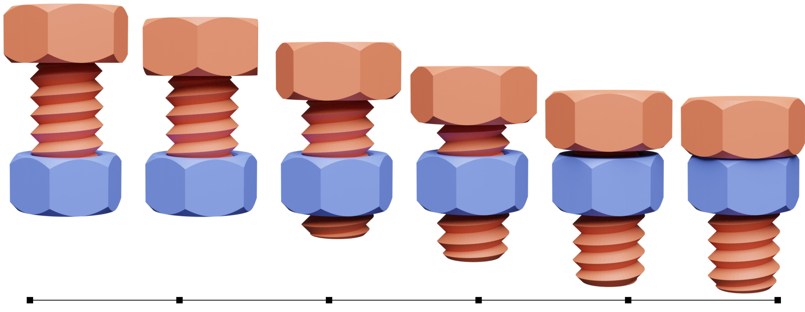

> 图 4。**螺栓。** 螺栓在重力作用下在静态螺母内旋转。在没有摩擦的情况下，螺栓能够迅速跟随螺纹并开始旋转。©YSoft be3D under CC BY-SA 3.0

**最小间隔。** 为了扩展我们的算法以保证最小间隔，我们对公式做了三个小的修改。首先，我们通过从图元对的距离中减去最小分离距离，将输入移到距离屏障势（式(2)）。其次，我们考虑进了添加的最小间隔，膨胀了宽相位中使用的所有边界框。最后，我们利用线性最小间隔 CCD 为最小间隔添加额外的偏移量（在第 13 行执行 $𝑏←𝑏+𝑑_{min}$ 之前）。

### 4.4 边界条件

运动的刚体以自己的速度运动，但对碰撞力没有反应。基于 [Li et al. 2020] 的方法，我们使用增广拉格朗日法（AL）来实现运动体的狄利克雷边界条件。对于每个运动刚体 $𝑘$ ，我们从下面两项构造增广拉格朗日：

$$E_{A,q}(q) = \frac{\kappa_{A,q}}{2} m_k \parallel q_k-\hat{q}_k^{t+1}\parallel ^2 -\sqrt{m_k} \lambda_{A,k}^T(q_k-\hat{q}_k^{t+1})$$

$$
E_{A,Q}(Q) = \frac{\kappa_{A,Q}}{2} {\rm tr}((Q_k-\hat{Q}_k^{t+1}) J_k(Q_k-\hat{Q}_k^{t+1})^T) -\sqrt{m_k} \lambda_{A,k}^T(q_k-\hat{q}_k^{t+1}) \\
 - {\rm tr}(\Lambda_{A,k}^T(Q_k-\hat{Q}_k^{t+1})J_k^{\frac{1}{2}})
$$

这里 $(\hat{q}_k^{t+1},\hat{Q}_k^{t+1})$ 是时间为 $𝑡+1$ 时的指定参数。

根据 [Li et al. 2020] 的算法，我们初始化拉格朗日乘子为 $\lambda_{A,𝑘}=0$ 和 $Λ_{A,𝑘}= 0$ ，惩罚刚度为 $𝜅{A,𝑞}=10^3$ 和 $𝜅{A,𝑄}=10^3$ 。然后将这些势能加到式(12)中。

然后会修改每个时间步长优化的收敛准则，以考虑运动体的运动。具体来说，我们计算：

$$\eta_q = 1-\sqrt{\frac{\sum_k \parallel \hat{q}_k^{t+1}-q_k\parallel^2}{\sum_k \parallel \hat{q}_k^{t+1}-q_k^t\parallel^2}}$$

以及

$$\eta_Q = 1-\sqrt{\frac{\sum_k \parallel \hat{Q}_k^{t+1}-Q_k\parallel^2_F}{\sum_k \parallel \hat{Q}_k^{t+1}-Q_k^t\parallel^2_F}}$$

并在满足优化平稳性准则时收敛于 $\eta_𝑞>0.999$ 和 $\eta_𝑄>0.999$ [Li et al . 2020]。

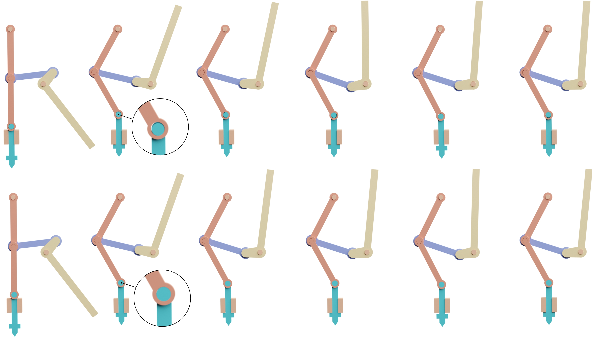

> 图 5。**打孔机。** 我们设计了两种不同的打孔机构：一种是松散接合的（上排），另一种是紧密接合的（下排）。通过施加力来提升冲头，我们使用完全刚性的自由度而不是关节体来模拟和测试接头的不同容差。

如果仅满足平稳性，则更新增广拉格朗日参数。为简洁起见，我们只描述 $\kappa_A$ 、 $𝑞$ 、 $\lambda_A$ 的更新方案，其他方案紧随其后。如果 $\eta_{A,q} < 0.99$ 且 $\kappa_A<10^8$ ，那么：

$$\kappa_{A,q} \leftarrow 2\kappa_{A,q}$$

否则，对于每个运动体 $𝑘$，有：

$$\lambda_{A,q} \leftarrow \lambda_{A,q} - \kappa_{A}\sqrt{m_k}(q_k^i-\hat{q}_k^{t+1})$$

此外，只要满足增广拉格朗日法的收敛准则，我们就固定所有规定好的自由度，并从式(12)中删除拉格朗日算法，以进行剩余的优化。这有助于消除目标函数中不必要的刚度 [Li et al . 2020] 。

## 5 结果

我们的算法是用 c++实现的，线性代数例程使用 Eigen [Guennebaud et al. 2010]，基本几何处理例程使用 libigl [Jacobson et al. 2018]，区间算术使用 filib [Lerch et al. 2006]。 我们在一个带有两个 AMD EPYC™7452 处理器的工作站上运行我们的实验。用于生成结果的参考实现附在提交文件中，并将作为开源项目发布。我们为论文中显示的每个模拟提供了视频，作为我们附加材料的一部分。

我们首先提出了我们的结果，并将与现有刚体模拟器的比较推迟到第 6 节和第 6.1 节的体积 IPC 公式。

**复杂几何的刚体机构。** 第一个例子是在重力作用下在螺母内旋转的螺栓。对于许多刚体模拟器来说，由于在扩展的弯曲区域上滑动接触紧密(图 4)，这是一个具有挑战性的场景（尽管其他刚体模拟器已经取得了成功 [Wang et al 2012; Xu et al . 2014] ）。

我们在图 2 中展示了一系列更复杂的机构，包括活塞、产生间歇运动的转轮和自行车链条。在所有情况下，我们都不对简化坐标使用任何约束。

请注意，我们的方法可靠地处理了接触，使我们能够对机制的变化进行实验，例如，通过在冲压机的孔中添加额外的公差(图 5)。请注意，为了捕获这种效果，明确的碰撞建模是必要的。

**制造仿真。** 我们的方法可以在实际制造之前用于设计和模拟复杂的机构。为了模拟这个用例，我们从 Maker 's Muse 购买了一个 3D 打印锁盒的 3D 模型，并直接在我们的模拟器中使用 STL 文件(图 1)。我们可以在模拟中研究机制，在虚拟环境中很容易修改设计并进行测试。

**共维刚体。** 我们的算法支持模拟共维体。我们在图 10 中展示了一个由二维共维刚性卡片组成的卡片屋。还支持一维共维对象，例如，可以用来有效地模拟大型链网(图 6 顶部)。作为压力测试，我们把一个很重的球放在链网的顶部。我们甚至可以模拟 0D 共维点云。作为演示，我们将一个点云球（带摩擦）滚向另一个由平面切片组成的球(图 6 底部)。

**高角速度。** 我们可以模拟以高角速度运动的物体，以捕获涉及刚体物体的、有趣的现实世界效果，例如一个滚动的硬币(图 7)，时间步长为 $10^{−4}$s。

**大量物体。** 我们的算法可以稳定地模拟大型刚体集合，如图 8 所示，一堆盒子被一个破坏球撞碎。我们在图 9 中展示了一个示例，其中通过卷起由 21 个单独的环链接组成的锁链来抬起一个沉重的锚。

**摩擦力。** 我们重复了 [Li et al. 2020] 中用于基准测试摩擦模型的拱形场景实验，将可变形但坚硬的块替换为刚性物体(图 11)。结果没啥区别(参见图 19)。

**用最小的间隔包装 3D 打印。** 我们的算法在大时间步长的稳定性和添加可控最小分离的可能性使其成为在 3D 打印机床内包装多个对象的理想选择。解决这个问题的一种常见方法是通过打印机间隙给物体充气，然后用桶来包装[Fogleman 2017]。

我们的算法可以作为 3D 打印包装的简单替代方案(图 14)：我们可以通过将一组对象放入盒子中并扩展我们的算法来计算其包装，以确保遵守打印机间隙。

这只是一个原型，需要更多的研究来评估这种方法在实际应用中的有效性，并将其与装箱进行比较，特别是因为 [Wang et al 2020] 的方法(以及我们的曲线 CCD)会在设置一个较大的最小间距下导致运行时间显著增加。

**可扩展性。** 我们的参考实现在以下算法阶段利用并行化：并行构建能量梯度和黑塞矩阵，并行评估屏障和 CCD 宽相位中的所有体对，并行执行窄相位 CCD 以计算最早的撞击时间。总的来说，这允许我们的算法利用现代多核处理器。我们通过模拟密集网格链接链来测试我们方法的弱扩展（即，随着线程数量的增加而增加场景的复杂性）和强扩展（即，随着线程数量的增加而保持场景不变）(图 15)。

刘易斯升降结构是一种有趣的机械装置，依靠静摩擦来提升重物(图 12)。而作为最后的摩擦实验，我们把一个盒子放在一个有四个不同摩擦系数的旋转圆盘上。当圆盘的转速增大时，在 $\mu \neq 1$ 的情况下，箱体失去接触，飞离转盘(图 13)。

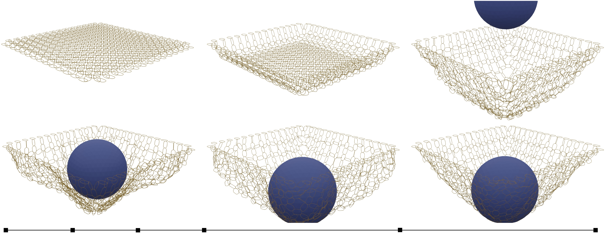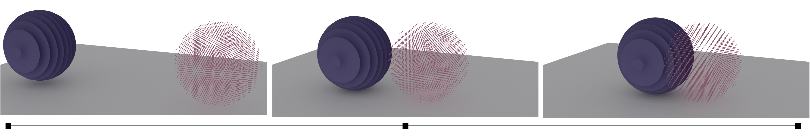

> 图 6。**共维度物体。** IPC 公式允许我们轻松模拟共维度对象。顶部：一个球掉在由一维共维边组成的链网上。底部：一个由不相连的共维平面组成的球和一个点云球互相滚动。接触时，几何图形被锁定，两个球摇摆着来回晃动，最后停止运动。

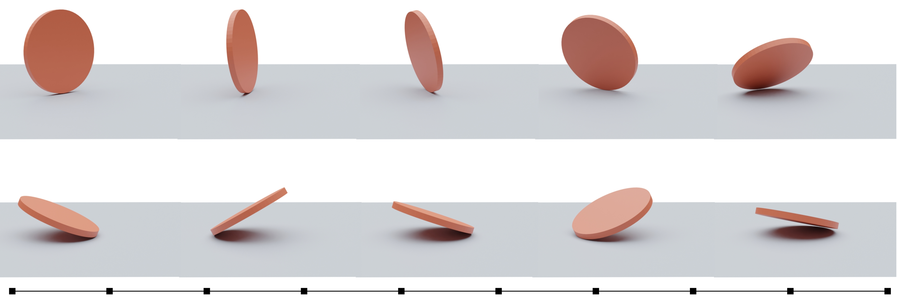

> 图 7。**滚动硬币。** 一枚硬币在具有摩擦力（ $\mu=0.2$ ）的表面上滚动。当硬币掉落时，只有一个点接触地面，但硬币仍然继续旋转。为了准确捕捉这些高速动态，我们使用了很小的时间步长 $ℎ=10^{−4}s$。

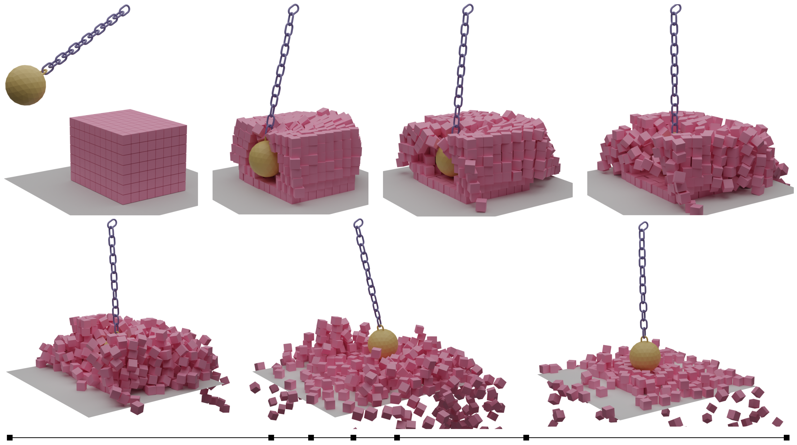

> 图 8。**破坏球。** 一堆共 560 个箱子被一个由一串锁链连接的破坏球击中。

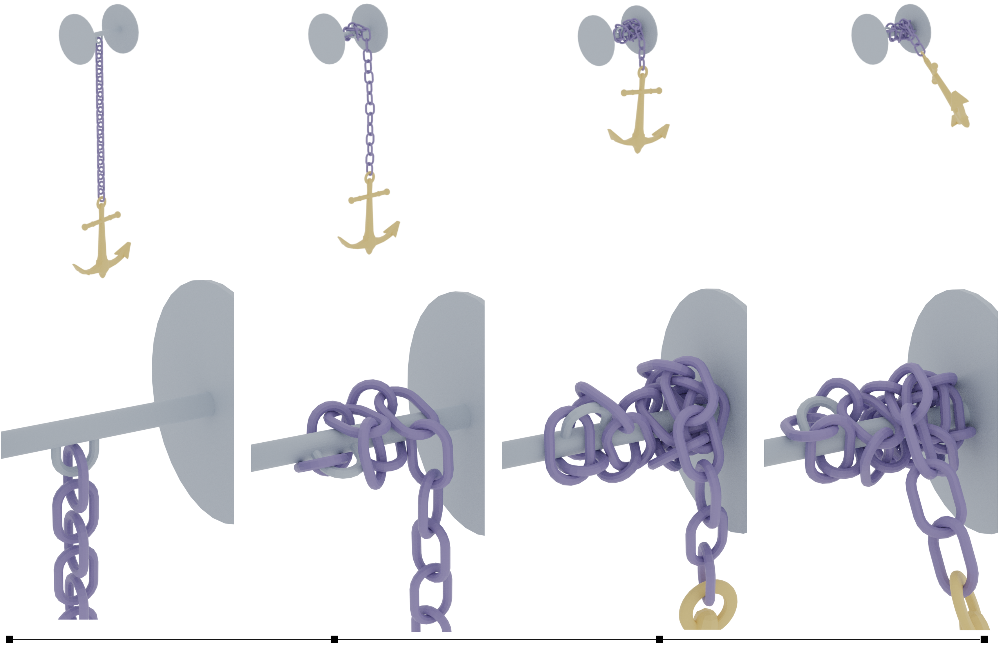

> 图 9。**锚。** 一个沉重的锚固定在一条链上，在重力作用下短暂下落，然后通过将链绕在轴上滚动来升起。可以看见自然的聚集和打结行为。©Animation Anchor Line (anchor) under TurboSquid 3D Model License。

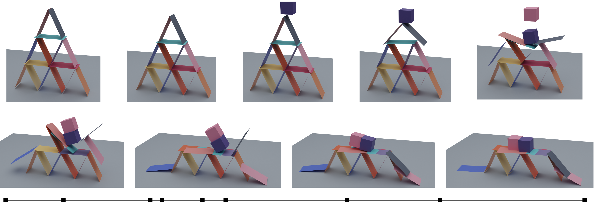

> 图 10。**多维纸牌屋。** 我们设计了 Kaufman et al. [2008] 的标准摩擦基准的协维变体，其中每个卡片仅由两个三角形组成。在被两个立方体撞击之前，卡牌被短暂地允许稳定地静止( $\mu≥0.9$ )。顶部两层坍塌后，但最后一层可以托住立方体，这表明我们有能力快速处理静态和动态摩擦之间的转换。

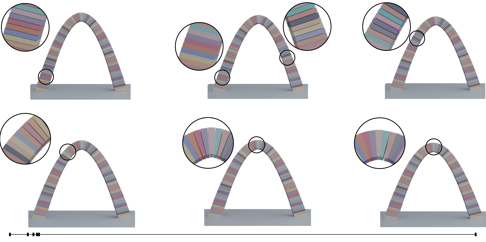

> 图 11。**拱。** 由 101 个刚性块组成的拱桥在重力作用下由于摩擦力处于平衡状态。

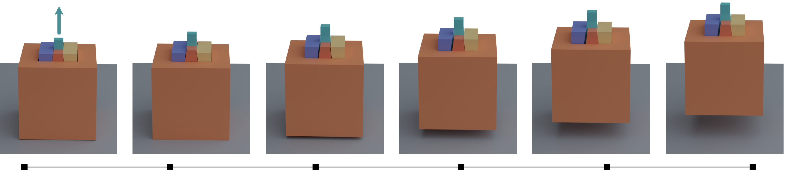

> 图 12。**刘易斯升降机构。** 利用摩擦和几何结构，刘易斯结构能够举起重物。一个金字塔形的碎片被放在楔形碎片之间。当中心块被拉起时，周围的块被压入外部块。中心以 0.5 m/s 的速度运动，其运动系数为: $\mu = 0.3$ ，能够举起 10 倍于其质量的物体。

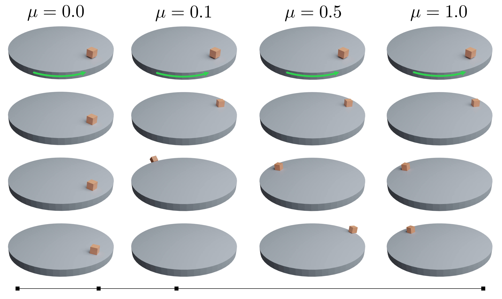

> 图 13。**转盘。** 一个块被扔在一个加速转台上，设置了四个不同的摩擦系数( $\mu = 0,0.1,0.5,1.0$ )。当 $\mu = 0$ 时，积木落在桌子上，慢慢漂移。当 $\mu = 0。1$ 时，积木很快被桌子接住并甩出。当 $\mu = 0.5$ 时，积木能够坚持更长时间，但最终会滑到边缘并掉下来。当 $\mu = 1$ 时，在整个模拟过程中，积木粘附在表上并保持相对位置不变。

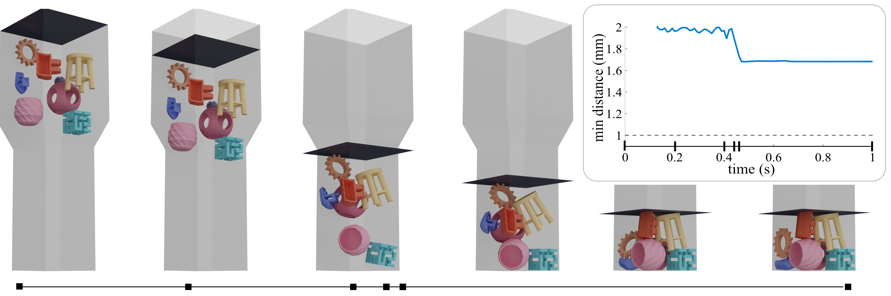

> 图 14。**三维包装。** 基于 Shapeway 的 PA11 材料的公差，我们将 8 个模型装入尺寸为 $290 × 290 × 600 mm$ 的 3D 打印机床中，最小间距为 1mm。插图展示了整个模拟过程中的最小距离，表明我们始终保持目标之间所需的最小距离。©tjhowse, blecheimer, katie Hultgren, Creative Tools, Dustin salings, Brad Pitcher, Andy Lesniak and Tony Buser CC BY。

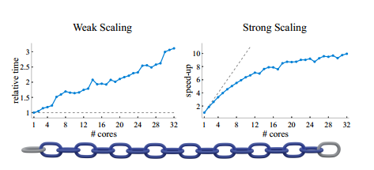

> 图 15。**可扩展性。** 我们在密集网格链条(底部)上测试弱(左)和强(右)可扩展性。对于弱扩展，我们设置空闲链接的数量等于线程的数量，并绘制运行时间除以单个链接时间的图。对于强扩展，我们使用 64 个链接的链条，并绘制单核时间内的加速图。在每种情况下，我们用灰色绘制理想值。虽然我们的方法从并行化中获得了很大的好处，但我们发现在 16 核之后的收益递减，并且在测试 64 核时几乎没有收益。

## 6 基准测试

我们对一些最流行的刚体模拟器（Bullet、MuJoCo、Chrono 和 Houdini 的 RBD）进行了广泛的基准测试比较，重点评估了这些方法在以下方面的能力：(1)保持稳定性，(2)避免穿透，(3)产生准确的动态效果。我们的基准测试包括由简单基本几何体组成的单元测试，如四面体和立方体（图 16），Erleben [2018] 提出的退化测试用例（图 17），以及我们的一些更复杂的大规模示例。总的来说，现有方法比我们的方法快几个数量级，但在简单场景下，根据参数不同会严重失效。此外，我们还表明，即使进行了广泛的参数调整，这些方法也无法模拟某些场景。所有测试过的模拟参数脚本将作为我们开源项目的一部分公开发布。

**Bullet。** 在 Bullet 中，用于模拟移动凹面几何体之间接触的主要方法是通过采用凸碰撞解决方案，利用凸分解代理来处理输入网格几何体。Bullet 通过 V-HACD [Mammou 2020] 提供了网格的近似凸分解的自动构建。通常使用手工制作的自定义分解代替，这可以提供更好的几何近似和更好的碰撞代理。在以下实验中，我们使用输入网格来表示凸几何体（所有单元测试和 Erleben 的测试），或者针对凹面几何体使用专家构建的手动分解。

Bullet 在单元测试和 Erleben [2018] 测试中表现良好，但在较大时间步长（0.01 s）下会产生穿透现象。Bullet 在时间步长不太大时表现最佳（默认值为 1/240 s，“几个参数是以此值为参考调整的”[Coumans and Bai 2019]）。我们发现 $ℎ=10^{−3}s$ 可以适用于大多数场景，但某些场景（例如五个立方体堆叠和尖刺）需要尽可能小的时间步长（ $10^{−4}s$ ）才能完全避免穿透。在我们更复杂的基准测试场景之一 —— 体积链网中，较大时间步长会产生交叉和约束漂移，最终导致隧穿效应。

较小的时间步长（0.001 s）有助于避免隧道效应，但仍会出现小的交叉。我们还测试了 Bullet 的实验性三角形网格之间的碰撞处理（无需凸分解代理），并发现在默认参数下，它在几乎所有单元测试和 Erleben [2018]测试中都失败了。我们观察到大量能量被注入到系统中，这是位置稳定的效果：一旦出现交叉，模拟器会快速拉动物体，产生大的速度。

此外，我们注意到 Bullet 成功地实现了在更大尺度下的示例中防止穿透。然而，在较小的场景中，即使在小时间步长下，我们看到严重的穿透。例如，我们在 $0.1×$ 缩放的链网场景上测试了 Bullet，并观察到即使 $ℎ=10^{−4}s$ ，也会出现严重的穿透和不稳定性。这可能与 Bullet 的设计有关，如 Bullet 文档所述，它调整为适用于更大尺寸的场景。有趣的是，我们还注意到 Bullet 模拟 $0.1×$ 缩放的链网示例比原始尺度慢了大约 8 倍，反映了 Bullet 控制与尺度相关的碰撞检测和激活距离的参数。

**MuJoCo。** MuJoCo 在几乎所有单元测试和 Erleben 的测试用例中都表现良好，没有严重的爆炸或穿透效果。

需要注意的是，对于该测试方法，我们不会将几乎所有 MuJoCo 结果中存在的小交叉报告为失败，因为这是 MuJoCo 中使用的接触解决方法的预期行为。对于 tet-corner 的用例，即使使用帧速率时间步长大小 $ℎ=0.01s$ ，MuJoCo 也可以成功模拟四面体下落到狭小空间中。然而，我们发现 MuJoCo 在所有大规模示例上都失败了，与时间步长大小无关。近一半的示例会崩溃程序，要么是因为检测到巨大速度或边界框（表明爆炸），要么是联系缓冲区已满，并且缓慢的渐进式内存重新分配没有起到作用。与 Bullet 相比，MuJoCo 通常在相同时间步长下快几倍。我们试图通过以下方式避免在 $4×4$ 链网示例中出现穿透：（1）从隐式欧拉积分器换成 RK4 积分器，（2）从牛顿求解器换成 PCG 求解器，（3）将求解器迭代次数从 100 增加到 1000。但这些变化都没有避免穿透。

**Chrono。** Chrono 提供了两种刚体接触的方法：平滑接触（SMC）和非平滑接触（NSC）。SMC 使用基于惩罚的公式，因此已知在大时间步长或速度下会出现交叉。NSC 使用补充基于方法，因此更加健壮。我们的基准测试重点在 NSC 模型上。Chrono 还提供了几种求解器和时间步进器方法。我们对 Barzilai-Borwein 求解器和投影隐式欧拉时间步进器进行了基准测试，因为我们发现它们对于各种场景都最为健壮，并且文档推荐它们用于“具有硬（NSC）接触和低穿透度的快速动态” [Tasora et al. 2016]。

与 Bullet 类似，Chrono 在单元测试和 Erleben 的测试用例中表现良好，但我们发现在大时间步长（ $ℎ=0.01s$ ）下存在明显的穿透，特别是锐利的特征和平行的边缘接触（例如五个立方体堆叠或平行边缘四面体）更容易出现穿透。总体而言，我们发现 Chrono 在较小的时间步长下很健壮，只有五个立方体堆叠需要设置比 $0.001s$ 更小的时间步长才能避免穿透。

然而，Chrono 在我们的一些更复杂的场景中遇到了困难。

例如，螺栓场景最初可以正常工作，但是在短时间内它们出现了相交，并且螺栓停止了移动。

使用不同的时间步长（ $ℎ=10^{−2}$ 、$10^{−3}$ 和 $10^{−4}s$）进行测试，我们得到相同的结果。为了使螺栓正常工作，我们测试了各种参数并发现调整场景的比例可以解决问题。当我们将场景缩小 10 倍时（因此改变整个物理系统），我们发现 Chrono 表现得非常好，并且能够在 $0.01s$ 的时间步长下模拟螺栓而不出现穿透。避免这种不直观的参数调整是防止交叉并产生合理结果的动机之一。

**Houdini RBD。** 由于 Houdini RBD（而不是绑定到 Bullet）比前两种方法更难编写脚本，因此我们仅对五个立方体、螺栓和破坏球三个场景进行了建模。对于五个立方体场景，模拟很快稳定下来，没有产生伪影，但是在几秒钟后无法保持静止接触，并且堆叠开始崩溃（即使使用小时间步长 $ℎ=10^{−4}s$ ）。相对于 Bullet 和 MuJoCo，Houdini 成功地模拟了螺栓场景，在实际物理尺寸（即小尺寸，因为所有单位都以米为单位）上没有爆炸。然而，即使将时间步长设置为 $ℎ=10^{−4}s$ ，螺栓仍会与螺母相交。最后，在破坏球场景中，Houdini 不支持由 2 个三角形组成的平面几何体来支撑大型立方体矩阵，因此我们使用内置地面平面使问题变得更容易。仍然像在五个立方体场景中一样，在静止之前（被破坏球击中之前）立方体矩阵就会崩溃。

**摩擦测试。** 我们将一个块放在 26.565° 的斜坡上进行不同摩擦模型的比较，该斜坡的摩擦系数的临界值为 0.5（图 18）。在我们的结果中，当 $\mu=0.5$ 时，块不会移动，并且在 $𝜇=0.49$ 时开始滑动。Bullet 能够紧密匹配预期的行为：当 $\mu≥0.505$ 时，块不会移动。MuJoCo 需要 $\mu=0.9$ 的值才能防止块滑动。Chrono 在临界值为 $\mu=0.5$ 时完全匹配预期结果。Houdini RBD 需要 $\mu=0.7$ 的值才能防止块滑动。

对于我们的拱形测试（图 11），Bullet 的凸碰撞处理能够达到稳定的平衡，但对于大时间步长（0.01s），块会相交。Bullet 的凹三角网格碰撞处理会出现大量“幽灵”力，导致即使在不同时间步长（ $10^{−2}$ 、 $10^{−3}$ 和 $10^{−4}s$）下，它也会崩溃。使用 MuJoCo、Chrono 和 Houdini 进行测试时，拱形无法支撑自己，因为底部块之间存在大量交叉（测试使用 $ℎ=10^{−2}$ 、$10^{−3}$ 和 $10^{−4}s$）。

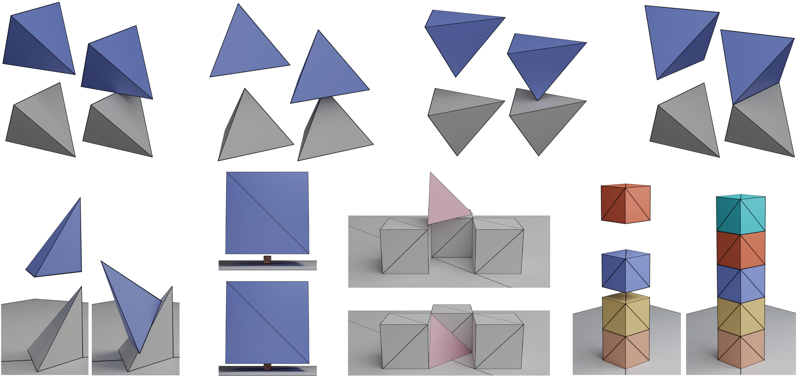

> 图 16。**单元测试。** 一组单元测试场景，用于对每种方法的准确性和鲁棒性进行基准测试。我们展示了使用我们的方法的初始配置和结果模拟。

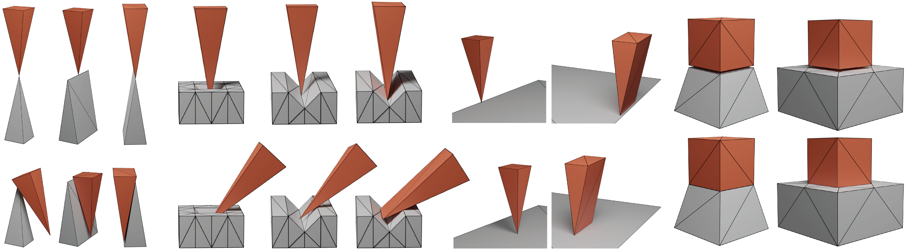

> 图 17。**Erleben 的退化测试用例。** 我们的方法可以很容易地处理 Erleben[2018] 提出的具有挑战性的退化情况。

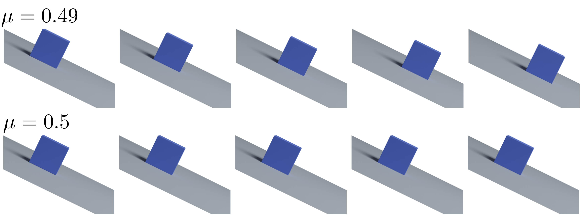

> 图 18。**高中物理摩擦测试。** 我们执行一个简单的高中物理测试，把一个块在斜面上的斜率为 $26.565◦$ 。当其值为 $\mu≥tan(26.565◦)≈0.5$ 时，摩擦力将抵消重力引起的加速度。我们准确地复制了这一点，表明在 $\mu≥0.49$ 时块滑动，而在 $\mu≥0.5$ 时块不滑动。

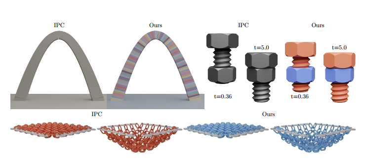

> 图 19。**IPC 的比较。** 比较原始的体积，可变形的 IPC 公式和我们的刚体公式的比较。（使用钢材的材料参数：杨氏模量 $E= 200 GPa$ ，泊松比 $\nu≥0.3$ ）©YSoft be3D(screw) CC BY-SA 3.0。

### 6.1 IPC

虽然 IPC 算法不是为刚体模拟而设计的，但它可以处理非常坚硬的材料，因此可以用它来近似刚体的动态系统。虽然用 IPC 模拟时，物体并不完全是刚性的，但主要优点是直接模拟了恢复效应(而我们在当前的刚体公式中没有考虑到它们)。

缺点是物体内部需要填充四面体，增加了求解时间，特别是对于复杂的几何形状。我们在图 19 中展示了三个具有代表性的场景:在拱门中，不需要插入任何内部顶点，由于线性 CCD 更便宜，IPC 实际上比刚性版本更快(慢两倍)。在螺栓和链网场景中，几何结构更为复杂，刚体公式的坐标集的简化使我们的算法更快(2.8 倍和 7.0 倍)。在所有场景中，这两种模式的整体动态都非常相似。我们在附录 D 中提供了对九个场景的更详细的比较。

## 一些限制和结束语

我们重新研究了刚体仿真问题，重点是鲁棒性和自动化。通过引入新的刚体动力学增量势公式和新的保守曲线 CCD 公式，我们设计了一个系统，可以可靠地模拟复杂场景，大时间步长，而无需调整参数。

**局限性。** 我们的方法有三个主要的局限性。(1) 算法的鲁棒性是以计算成本为代价的，我们的算法比其他刚体模拟器慢(2 到 3 个数量级)。(2) 目前的公式不能保存能量。(3)我们目前的公式没有提供对惩罚项的直接控制。

虽然(1)是一个内在的限制，可以通过更多的代码优化或使用 GPU 加速器来改善，(2)和(3)是非常有趣的未来工作方向。

**未来的工作。** 我们的工作为更广泛的几何形状和接触场景的鲁棒刚体模拟打开了大门。虽然我们的算法比竞争对手的方法慢，但我们的方法不需要参数调整来产生可行的结果，因此可以潜在地用于一次性生成机器人强化学习的模拟数据。在这种情况下，增加对铰接体的支持，增加对精确执行器的支持，并合并可变形体和刚体公式，以允许机器人与可变形物体交互，这将是很有趣的。对于图形应用程序，在几何精度不太重要的情况下，添加额外的碰撞图元（如球体、胶囊和盒子）来降低运行时是很有趣的。

**结束语。** 总而言之，我们相信我们的公式将促进一个新的健壮的刚体模拟家族的发展，同时能够支持图形，机器人和数字制造领域令人兴奋的模拟应用。

## 致谢

我们感谢 Erwin Coumans、Dan Negrut、Alessandro Tasora、Radu Serban、Simone Benatti 和 Xun Tan 在进行比较时提供的慷慨帮助。这项工作在一定程度上得到了纽约大学 IT 高性能计算资源、服务和工作人员专业知识的支持。本工作得到了美国国家科学基金会 CAREER 奖 1652515 和 IIS-1943199 的部分支持，美国国家科学基金会资助了 IIS-1320635、DMS1436591、DMS-1821334、OAC-1835712、OIA-1937043、CHS-1908767、CHS-1901091、CCF-1813624、ECCS-2023780、Adobe Research、nTopology 和 Advanced Micro Devices 公司的资助。
