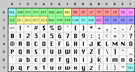
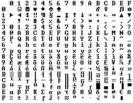
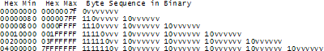

<head>
<script>
MathJax = {
  tex: {
    inlineMath: [['$', '$'], ['\\(', '\\)']],
    displayMath: [["$$", "$$"], ["\\[", "\\]"]],
  },
  svg: {
    fontCache: 'global'
  }
};
</script>
<script type="text/javascript" id="MathJax-script" async
  src="https://cdn.bootcdn.net/ajax/libs/mathjax/3.2.0/es5/tex-chtml-full.js">
</script>
</head>

# 每个软件开发人员都必须要了解的 Unicode 和 字符集 知识

## By ***Joel Spolsky***

你有没有看到过网页审查元素后，放在顶上的标签，里面写着 ```Content-Type``` ？或者，你看了它大半辈子都不知道它是甚么？

或者，你有没有收到过外国人的电子邮件，标题是一堆问号乱码？

我很沮丧地发现，好多软件开发人员并没有完全跟上字符集、编码、Unicode 等的脚步。几年前， [FogBUGZ](http://www.fogcreek.com/FogBUGZ) 的 beta测试人员想知道我们的程序是否可以处理日语传入的电子邮件。嗯？我们会收到日语电子邮件吗？但当我仔细看了看我们用来解析 MIME 电子邮件的商业 ActiveX 控件时，我们发现程序在处理字符集的时候犯了错误，所以我只能重写了一些代码，从而不让原程序瞎寄吧转编码。不仅如此，我查看另一个商用代码库时，它也有一个完全没法用的字符代码转换功能。我去找了该软件的开发人员，但软件开发人员也不会，觉得“寄了”。

最后，当我发现连网站开发工具 **PHP** 都完全不care字符编码问题，以至于我不能用它开发国际化的网页应用时，我实在是忍不了了。

所以我要宣布个事儿：现在已经3202年了，如果你还想当一个 2003 年的程序员，不知道字符、字符集、编码和 Unicode 的基础知识，被我逮到了可没你好果汁吃。 ~~哦！我的老天爷，我会拿我的鞋拔子狠狠的抽你的屁股，我发誓。~~

忘记说了，学会这些东西，<span style="font-size:150%"> **并不难** 。</span>

在本文中，我将介绍每个开发程序员应该知道的内容。“纯文本 = ASCII = 8位字符”的东西不仅是错的，而且错得离谱。如果现在还这样想，并用这样的思路编程，那你就像个头疼要砍头的医生。再加一句：请看完本文之后再写代码。

开始之前，我想说的是，如果你是那些了解国际化开发的少部分人，你会发现我的讨论很小儿科。但我想要的是所有看我文章的人都能弄懂我到底在讲什么，并且有能力带着这份知识编写代码。字符处理只是创建国际通用软件所需工作的一小部分，但我一次只能讲一节课，所以今天我讲字符集。

### 时间线

你可能认为我会在这里谈论像 **EBCDIC** 这样的非常古老的字符集。我不。**EBCDIC** 太古老了，和我们现在无关。我们不必回到那么久以前。

回到半古老的时代，当 Unix 刚被发明， K&R 正在编写 C语言 时，编码还是非常简单的。 **EBCDIC** 已经要退出历史舞台了。我们当时只关心英语字母。幸运的是，我们有一个叫做 **ASCII** 的代码，它能够使用 32 到 127 之间的数字来表示每个字符。空格符是  32 ，字母 “A” 是 65 ，等等。我们只需要花 7 位就可以存储它了。当时大多数计算机都使用 8 位字节，所以你不仅可以存储每个 ASCII 字符，你还有一大堆冗余的空间用来干坏事。低于 32 的编码字符叫 **控制字符** ，例如 7 可以让你的电脑发出蜂鸣声，12 可以让当前纸张页从打印机中飞出并输入新的纸张。




岁月静好，只因你是一个说英语的人。

因为一个字节有多达八位的空间，所以很多人开始想，“哇！我们可以将代码 128-255 留着自用。问题就来了：很多人同时都有这个想法，且 128-255 它们都有自己的用途。IBM-PC 有一些后来被称为 *OEM字符集* 的东西，它为欧洲语言提供了一些重音字符和一堆绘制表格的符号：横杠、竖条，T形杠等，可以使用这些线条画字符在屏幕上制作漂亮的表格和线条。有些 8086 处理器的古董机还能看得到这样的字符集。但是，人们从美国以外购买电脑时，就出现了好多好多不同的 OEM字符集 。这些字符集都用编码存在的那额外的128个位置来实现自己的功能。例如，在某些PC上，字符代码130将显示为 $\acute{e}$  ，但在以色列销售的计算机上，它是希伯来字母Gimel（ $ג$ ），因此如果一个美国人将简历发送到一个以色列人那， $\rm r\acute{e}sum\acute{e}$ 会变成 $\rm rגsumג$。在许多情况下，如俄语，对于如何处理那 128 个字符有很多不同的方法，因此，在俄罗斯人和俄罗斯人之间，甚至都无法可靠地交换俄语文档。




最终，这种 OEM的产物 被编入了 **ANSI标准** 。在 ANSI 标准中，编码 128 以下是统一的，这和 ASCII 编码一致，但是 ANSI 规定了很多不同的方法来处理 128 及以上的字符，由您居住的地方而决定。这些不同的系统称为 [**代码页 Code Pages**](https://learn.microsoft.com/zh-CN/windows/win32/intl/code-pages) 。例如，在以色列， DOS 使用名为 862 的代码页，而希腊用户使用 737 。它们的编码在128以下是一样的，但在128以上就不同了，不同国家的字母都存放在那里。 MS-DOS 的国家版本有几十个这样的代码页，处理从英语到冰岛语的所有内容，他们甚至有一些“多语言”代码页，可以在同一台计算机上进行世界语和加利西亚语！真不错！但是，除非你编写了一个自定义程序，使用位图图形显示不同的语言，否则在同一台计算机上同时显示希伯来语和希腊语是完全不可能的，因为希伯来语和希腊语需要不同的代码页，高位的编码都不一样。

与此同时，在亚洲，更疯狂的事情正在发生，考虑到亚洲语言需要显示成千上万个不同的字，8 位编码不管咋样都是不够的。那时候我们一般用 **DBCS（双字节字符集）** 解决这个问题，其中，一些字母只需一个字节存储，而很多字则需要两个字节。因为这个编码很混乱，程序员在使用 ```String``` 的时候就不能用  ```s++``` 和 ```s--``` 前后移动字符串指针了，而是得调用 Windows 的```AnsiNext``` 和 ```AnsiPrev``` 才能处理。

但与此同时，别人都不知道你使用了这样的编码。那时候网络不发达，大家也很少把电脑文件传来传去。大家都还是认为一个字节是一个字符，一个字符是 8 位。但是，互联网出现了，一切都乱套了。在这个时候，```Unicode``` 闪亮登场。

### Unicode

Unicode创造了一个字符集，其中包括地球上所有合理的书写系统，以及一些虚构的书写系统，如克林贡语(Klingon)。有些人误解了，认为 Unicode 只是一个16位的编码，每个字符需要 16 位，就会有 65 536 个可能的字符。这实际上是不正确的。

重要的是， Unicode 对字符的编码思想是和别的编码方法不一样的，你得理解 Unicode 的编码思想。

到目前为止，所学的知识告诉我们：假设一个字母映射到一些可以存储在磁盘或内存中的位，那会是：

$$\rm A \to 0100 \ 0001 $$

在 Unicode 中，一个字母映射到一个叫做 **码位(Code Point)** 的东西。这仍然只是一个理论概念。该码位如何在内存或磁盘上表示就是另外一回事了。

在Unicode编码中， $\rm A$ 的编码和 $\rm a$ 、 $\rm B$ 等不一样，但是 $A,\rm A,\mathbf{A}$ 这些的编码都是一个东西。这个观点很浅显，但是在某些语言中，仅仅弄清楚字母是什么就会引起争议。德语字母 $ß$ 是一个真正的字母还是一种花哨的写法？如果一个字母的形状在单词的末尾发生变化，那是另一个字母吗？希伯来语觉得是这样，但阿拉伯语并不这样认为。不管咋样，Unicode 联盟的聪明人在过去的十年左右的时间里一直在解决这个问题，伴随着大量高度政治化的辩论，现在他们已经解决了这个问题。

每个字母表中的每个字母都被Unicode联盟分配了一个数， 一个普通的Unicode字符这样写：`U+0639`。 这个数就叫做 **码位** 。 U+ 表示“Unicode”，且后面跟着的数字是十六进制的。 `U+0639` 是阿拉伯字母，它读作 $\rm Ain$ 。英文字母 $\rm A$ 是 `U+0041` 。您可以使用 Windows 2000/XP 上的 `charmap` 实用程序或访问 Unicode 网站找到它们。

Unicode可以定义的字母数量没有真正的限制，事实上它们已经超过了 65 536 个，所以并不是每个Unicode字母都可以真正压缩成两个字节的。但不管怎样，Unicode已经足够奇迹了。

现在假设我们又一个字符串：

$$\texttt{Hello}$$

在Unicode中，它对应5个码位： `U+0048`  `U+0065`  `U+006C`  `U+006C`  `U+006F`  。

这些码位有什么用？我们还没有说如何在内存中存储它或在电子邮件中表示它呢。

### 编码

 **编码** 这个时候该派上用场了。

Unicode 编码的最早想法是，它想创造使用两个字节表示所有符号的神话。所以 `Hello` 变成了：

$$\rm 00 \ 48 \ 00 \ 65 \ 00 \ 6C \ 00 \ 6C \ 00 \ 6F$$

等一等！为什么不能是：

$$\rm 40 \ 00 \ 65 \ 00 \ 6C \ 00 \ 6C \ 00 \ 6F \ 00$$

实际上可以。早期的Unicode创建者希望 大端或小端模式 **都能够** 存储他们的 Unicode 码位，这样每种CPU在大端和小端速度不一样的问题，也能很好的得以解决。但这样就已经有 *两种* 方法可以存储 Unicode 了。这不乱吗？因此，人们被迫想出了在每个Unicode字符串的开头存储 `FE FF` 的奇怪约定：这就叫 **Unicode 字节顺序标记** ，也就是众所周知的 Unicode with **BOM** 如果您要交换了存储方式，它看起来就会是 `FF FE` ，读取您的字符串的人才能知道，每一个字节读出来数据后，需要交换一次才是正确的数据。害，但一些 Unicode 字符串在开头并不会有这样的 **BOM** （字节顺序标记）。

到此为止，Unicode 似乎已经挺不错了，但美国的程序员开始抱怨：“看看这数据里辣么多 `0` ！” 正是因为他们是美国人，他们使用的英文文本很少有 `U+00FF` 以上的码位需要用。不仅如此，现在还存在的各种使用 ANSI 和 DBCS字符集的 该死的文档该由谁把他们转换来转换去？不能是我吧？！因为这个原因，Unicode 被放在冷板凳上了好多年，同时编码的情况更乱了。

因此，人们发明了 **UTF-8** 的辉煌概念。UTF-8 是另一个存储码位的编码系统。用于使用多个 8 位（一个字节）将 Unicode 码位存储在内存中。在 UTF-8 中， 0-127 的每个码位都存储在一个字节中。只有码位 128 及以上的字符使用 2或3 个字节存储，最大到 6 个字节。




这就带来一个很明显的好处，即英语文本在 UTF-8 中的数据编码看起来与在 ASCII 中的数据编码完全相同，因此美国人无法察觉任何区别。具体来说，`Hello` ，这个句子是 `U+0048 U+0065 U+006C U+006C U+006F` ，存储的时候会变成 `48 65 6C 6C 6F` ，与存储在 ASCII 和 ANSI 以及地球上的每个 OEM 字符集中的存储都 **完全相同** 。如果你很叛逆，想要使用重音字母或希腊字母或克林贡字母，你将不得不使用几个字节来存储单个代码点，但美国人永远不会注意到编码出了什么差错。（UTF-8 还具有一个很好的属性，也就是，在旧字符串编码中使用单个 `\0` 字节会终止字符串，但 UTF-8 中不会。

到目前为止，我已经告诉你了三种编码 Unicode 的方法：传统的存储两个字节方法称为 **UCS-2**（因为它有两个字节）或 **UTF-16** （因为它有16位），但在这种编码下，你需要弄清楚它是大端UCS-2还是小端UCS-2的存储方式。除了这个，就是现在的新 UTF-8 标准，如果你编写了一个带有英语文本的脑死亡程序，它可以直接按照 ASCII 的编码来进行工作，读取时不会出现任何问题。

实际上还有许多其他编码Unicode的方法。有一种叫做 *UTF-7* 的东西，它很像 UTF-8，但它的最高位将始终为零，因此，如果您必须通过一个严格的国家警察电子邮件系统传递 Unicode ，该系统认为 7 位的编码就足够了，它仍然可以毫发无损地传输过去。除此之外，还有 *UCS-4* ，它将每个码位存储在4个字节中，而且不管是甚么码位，都用四个字节存储。我的老天爷，京爷都不敢这么浪费。

同样的，由别的编码方式编码的内容，只要是英语字母部分，也可以通过 UTF-8 解码出来。但是，别的冷门字母就会出现一个问题：那些字母编码不一致，可能不会显示！如果 UTF-8 翻译出来的 Unicode 码位有问题，也就是在Unicode中根本找不到对应的字母，您就会得到一个小问号： $?$  或者是一个盒子状的字符。你现在看到的是哪个？ ->  �

有数百种传统编码，它编码的字母只能正确对应 Unicode 的某些码位，找不到的一律变成问号。一些流行的英语文本编码是 `Windows-1252` （西欧语言的 Windows 9x 标准）和 `ISO-8859-1` ，又名 `Latin-1` （也对任何西欧语言有用）。但是如果你要在这些编码中存储俄语或希伯来语字母，解码出来之后你就会得到一堆问号。与此相反，UTF-7、8、16 和 32 都能够正确存储任何代码点。

### 关于编码的最重要的一点

如果你完全忘记了我刚才解释的一切，请记住一个重要的事实。在不知道字符串使用什么编码的情况下拥有一个字符串数据是没有意义的。

**“纯文本“不用ASCII编码，ASCII编码的也不叫纯文本。**

如果你有一个字符串，不管是在内存中，在文件还是在电子邮件中，你必须知道它的编码是什么，否则你无法正确解释它或向用户显示它。

几乎每一个说着“我的网站看起来像胡言乱语”或”我只要加了音标她就无法阅读我的电子邮件”问题都归结为一个天真的程序员，他不懂编码，也就是他根本不管那些字符串是使用 UTF-8 还是 ASCII 或 ISO 8859-1(Latin 1) 或 Windows 1252 编码，因此它根本无法正常显示，解码之后，系统甚至搞不清楚这个字符串什么时候结束。码位高于 127 的可有一大堆字符呢，你不告诉我怎么解码，那就世事难料了。

那么，我们如何告诉别人字符串使用的编码的信息？嗯，其实有标准方法可以做到这一点。

对于电子邮件来说，您应该在表单的标题中包含一个字符串：

**Content-Type: text/plain; charset="UTF-8"**

对于网页，最初的想法是：Web服务器将返回类似的 Content-Type HTTP头，以及网页本身 - 编码信息并不是在HTML中，而是作为在HTML页面之前发送的响应标头之中。

这会导致问题。假设你有一个大型的Web服务器，里面有很多网站和数百个页面，由很多人用着许多不同的语言，这些不同的页面使用他们各自的 Microsoft FrontPage 软件编写，使用它们各自系统的编码。Web服务器本身又 **不知道** 每个文件是用什么编码编写的，因此它无法发送 Content-Type 标头，别人自然就不知道怎么解码这个网页了。

> 注： Microsoft FrontPage 是一款网页开发软件。

如果您可以使用某种特殊标记将HTML文件的内容类型直接放在HTML文件本身中，那就方便了。当然，那些处女座的人会不爽 …… 但是这样又出现了一个问题：在知道 HTML 文件的编码方式之前，怎么读取呢？！幸运的是，头文件用不到多么复杂的编码，一般的头文件都只用得到 32 到 127 之间的字符（基本上是各类半角符号和字母），因此在 HTML 页面上走到这一步还是很简单的。这样我们就可以使用如下的东西：

```html
<html>
<head>
<meta http-equiv="Content-Type" content="text/html; charset=utf-8">
```

这个 `meta` 标签必须在HTML `<head>` 部分的最前面，因为一旦Web浏览器看到此标记，它会停止解析页面，并重新使用您指定的编码再次解码。

那么，如果 Web 浏览器在 HTTP 标头或 `meta` 标签中找不到任何 Content-Type 字样，那又该如何是好？ *Internet Explorer* 实际上做了一些非常有趣的事情：它利用不同国家文字出现的频率来 **猜测** 使用了哪种语言和编码。因为各种旧的 8 位代码页倾向于将其国家字母放在 128 到 255 之间的不同范围内，并且因为每种人类语言都有不同的字母使用频率，所以这还酸有点效果。但它的效果可太好了，以至于天真的网页作者从来不知道他们需要一个 Content-Type 来指定编码，直到有一天，这些网页作者写的东西恰好不完全符合他们母语的字母频率分布，以至于 *Internet Explorer* 决定它是韩语并因此显示它。但实际上，这个网站的东西是保加利亚语，读者现在完全看不懂了。然后，如果他比较聪明，他就会使用 视图->编码 菜单，尝试一堆不同的编码，知道看得懂为止。可怜的是，大多数人都只能看着一堆乱码发呆，啥也干不了。

对于我公司发布的最新版本的网站管理软件 *CityDesk* ，我们决定在 UCS-2（双字节）Unicode 在内部完成所有操作，因为这是 Visual Basic，COM 和 Windows NT/2000/XP 用作其本机字符串的类型。在 `C++` 的代码中，我们只是将字符串声明为 `wchar_t` （宽字符）而不是 `char` ，并使用 `wcs` 函数而不是 `str`  函数（如 `wcscat` 和 `wcslen` 而不是 `strcat` 和 `strlen`）。要在 `C` 代码中创建 UCS-2 字符串字面量，您只需在它前面加上一个 L 就行了：如 `L"Hello"` 。

当 *CityDesk* 发布网页时，它会自动将其转换为UTF-8编码，多年来Web浏览器对这种编码支持的很好。我的所有 29 种语言版本的 Joel on Software 的编码方式都用的是这种，而且没人在查看它们时遇到任何乱码问题。

恭喜！你学完了，现在可以和滚回去编你的程了！